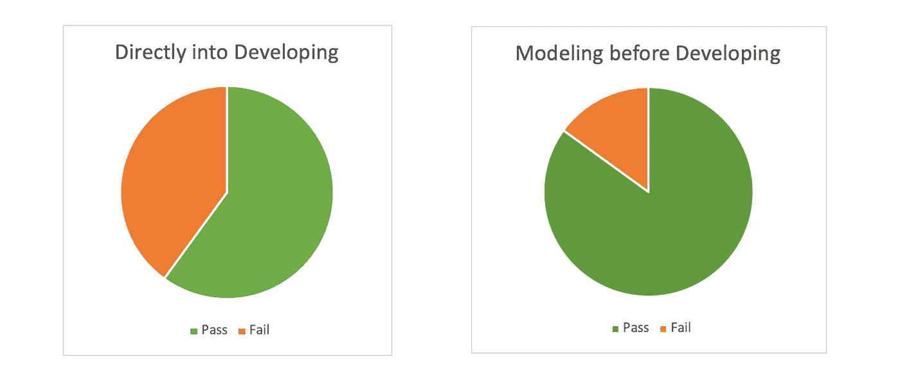
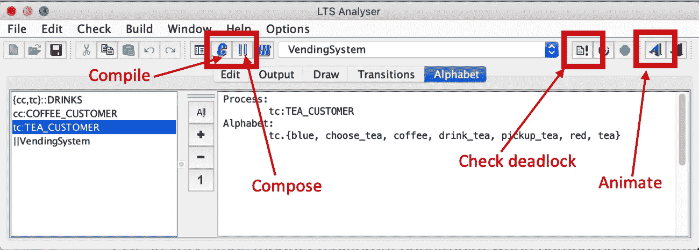
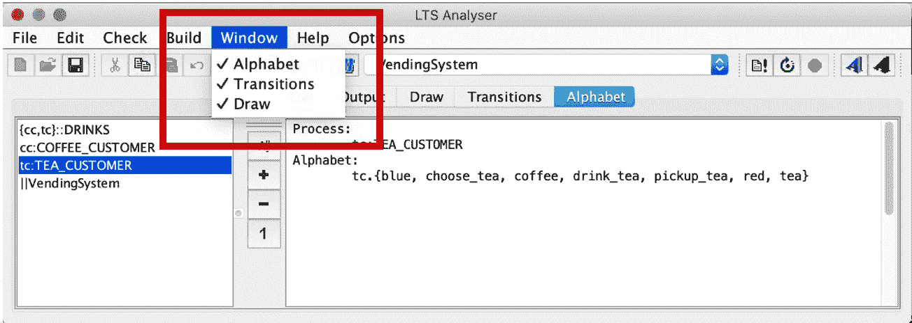
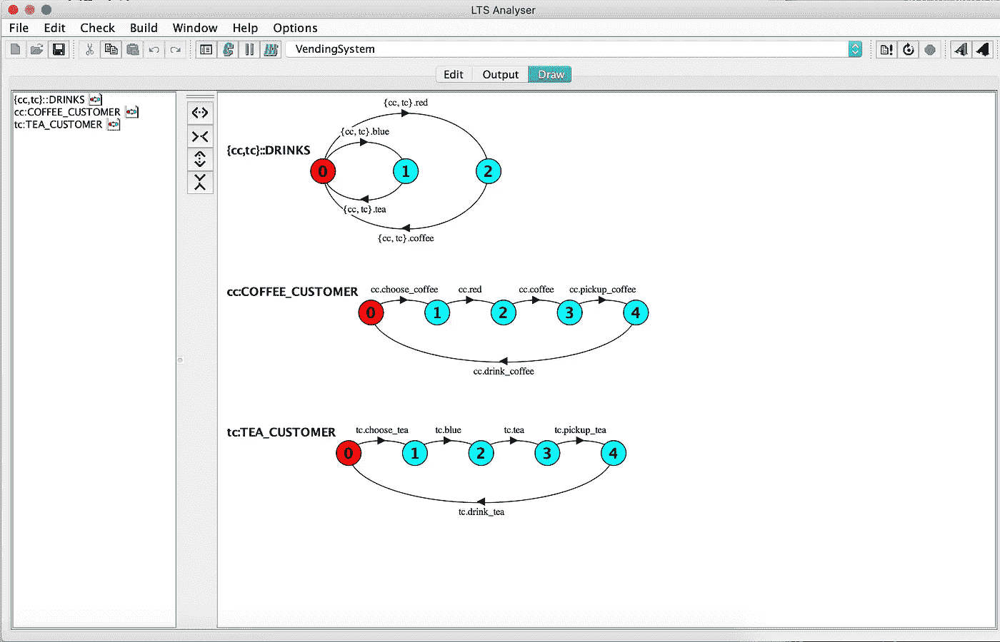
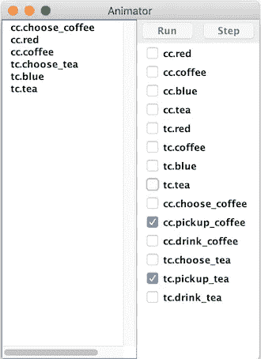

# 并行程序建模-FSP

> 原文：<https://medium.com/geekculture/concurrent-program-modelling-fsp-7a530d3dcbb?source=collection_archive---------3----------------------->

## 使用*有限状态进程(FSP)——*对简单并发程序建模的初始步骤一个自动售货机的例子


嗨，我是拉莎拉。这篇文章是关于并发编程建模背后的基本概念，以及我们应该知道的开始的初始步骤。

# 这几乎是一个并行的世界…

并发程序由一组子程序组成。当并发程序执行时，每个单独的子程序都由一个单独的进程执行。这些进程通常同时执行。因此，并发程序的执行由同时执行的多个进程组成。

如果我们举一个真实世界的例子，它们都有一组简单的活动或任务。例如，房屋建筑的执行包括许多子任务，如布线、盖屋顶、木工、砌砖、管道，以及制作 5 个茶杯，每个茶杯都有两个糖勺。一些过程严格地按顺序发生，但是大多数可以重叠并同时发生。所以，这就是为什么我们说*我们几乎处于一个并行的世界。*

# 为什么我们需要建模方法来开发并发程序？

就以下几点而言，开发一个满足特定需求并以安全方式运行的并发程序是一个非常复杂的过程。

*   测试这样的软件是困难的，有太多的场景。
*   不知道我们什么时候做了足够多的测试。
*   测试非常困难，因为它依赖于执行特定的事件序列&导致问题的动作。
*   因为并发事件可能以任何顺序发生，或者可能不总是发生，所以问题序列可能永远不会被测试。

所以，**方案**需要一种更好的方法来设计、检查&构造并发程序。这就是**建模方法**发挥作用的地方。



Figure 1: Test pass rate probability of Concurrent programs with & without Modelling

# 建模并发系统

正如我们已经看到的*模型*是对*某物*的简化表示。但是在我们的例子中，我们想要建模的“某物”是一个*并发系统*。**

**因此，我们的模型必须包括以下内容的简化表示:**

*   **一个独立的过程，**
*   **并发程序(并发执行的进程的集合)，**
*   **流程集合之间的交互，**
*   **进程&并发系统的动态行为和属性。**

**如果我们的型号**没有**具备这些特征，那么它就不是**！****

# ****什么是 FSP？****

****有限状态流程(FSP)是一种抽象语言，用于通过建模方法开发并发流程系统。以下几个方面正在实现上述对并发编程的需求。****

****1.**设计**一个并发系统****

****2.**型号**设计系统****

****3.**分析**建模系统****

****稍后让我们逐一研究一下与此相关的一个简单场景。****

# ****概括地说，FSP、密克罗尼西亚、LTS 和 LTSA****

*   ****并发系统是抽象进程的集合。****
*   ****这些抽象过程可以用 **FSP** 语言来定义。****
*   ****由**有限状态机(FSM)表示或建模的 FSP 过程。******
*   ****FSM 模型抽象出了真实程序的细节。FSM 由一个**标记的过渡系统(LTS)实现。******
*   ****每个 FSP 过程都有相应的 FMS/LTS 描述。****
*   ******LTS 分析器(LTSA)** 是 FSP 的建模工具，用于动画制作和分析。****

****现在，让我们试着用一个简单的例子来理解这些概念，一台售货机。在此之前，您需要设置一个 LTSA 工具来制作动画和分析场景。****

## ****LTSA 工具的使用****

****以下是 ltsa 工具的基本组件。****

********

****Figure 2: Basic components of ltsa tool****

****但是，如果您在 ltsa 中没有看到字母、过渡和绘图窗口，请按如下步骤进入窗口选项卡，并逐个添加它们。****

********

****Figure 3: Windows tab in ltsa tool****

****现在，一切都准备好了，可以试用一个简单的并发系统。🙃****

# ****一台自动售货机****

********

****Figure 4: Vender machine****

****使用一个例子将使解释概念和模型变得更容易。让我们分析并模拟一个 FSP 过程，它描述了饮料分配机，****

*   ****热**咖啡**如果按下**红色**按钮&****
*   ****如果按下**蓝色**按钮，冰镇**茶**。****

## ****首先，让我们设计系统...****

****作为第一步，我们需要了解所需的需求并设计系统。在这种情况下，需要考虑流程及其动作、同步要求以及流程之间的交互。****

****根据给定的场景，****

*   ****我们应该设计一个有茶和咖啡两种选择的通用流程。它们的动作应该分别是茶的**红色**和咖啡的**蓝色**。****
*   ****然后我们需要设计`COFFEE_CUSTOMER`和`TEA_CUSTOMER` 两个单独的客户流程，谁将使用这台机器。****
*   ****随后，应该定义复合执行，即`VendingSystem`，以及同步需求。****

## ****接下来是为**型号**设计的系统…****

****以下是给定场景的设计模型，这应该使用 FSP 语言的有限状态机建模。这应该添加到 LTSA 的编辑窗口。****

```
****set VMOptions = { red, coffee, blue, tea }

set Customers = { cc, tc }

DRINKS = (   red ->  coffee -> DRINKS
           | blue -> tea ->    DRINKS ) .

COFFEE_CUSTOMER = ( choose_coffee -> red -> coffee 
                 -> pickup_coffee -> drink_coffee -> COFFEE_CUSTOMER 
		   ) +VMOptions.

TEA_CUSTOMER = ( choose_tea -> blue -> tea 
                 -> pickup_tea -> drink_tea -> TEA_CUSTOMER 
		   ) +VMOptions.

|| VendingSystem = (    Customers :: DRINKS || cc: COFFEE_CUSTOMER || tc: TEA_CUSTOMER ) .****
```

****这将允许一个用户获取资源，另一个用户释放资源。因此，当`DRINKS`由`USER`进程组成时，这种组成确保了只有获得资源的同一用户才能释放它。现在将测试系统，以检查需求是否与设计的模型兼容。****

## ****最后，分析建模系统的时间…****

****在制作动画之前，你必须编译你写的代码，然后你必须导航到 **draw** 标签。它向您展示了所有单个和复合流程的图形表示。****

******图形表示******

********

****Figure 5: graphical representation of processes****

****然后你必须制作动画，并通过检查来分析代码，****

*   ****系统的**字母** 正确，****
*   ****系统执行正确的，是**动作**和**转换。******
*   ****是否避免**死锁** &维护**互斥**。****

********

****Figure 6: Animator of ltsa tool****

****通过所有这些，您可以对将要开发的系统有一个适当的概念，并且您还知道在开发之前有死锁和其他并发问题的能力。****

****因此，这种建模概念确实是并发编程的基本需求。****

****我希望这对你的并发编程学习有所帮助。干杯。****