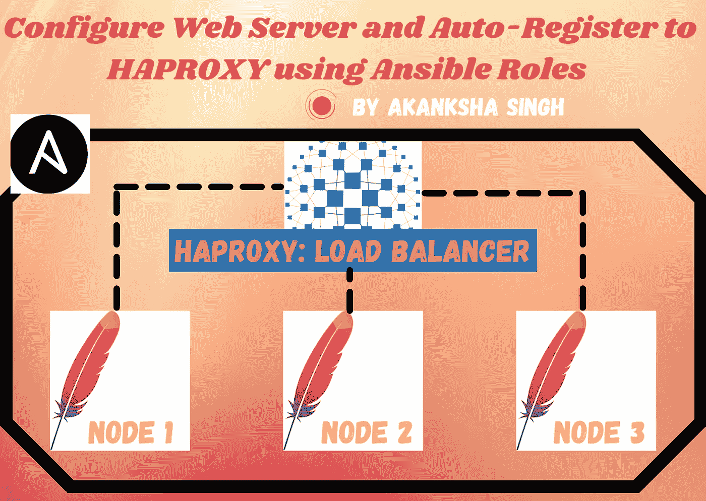
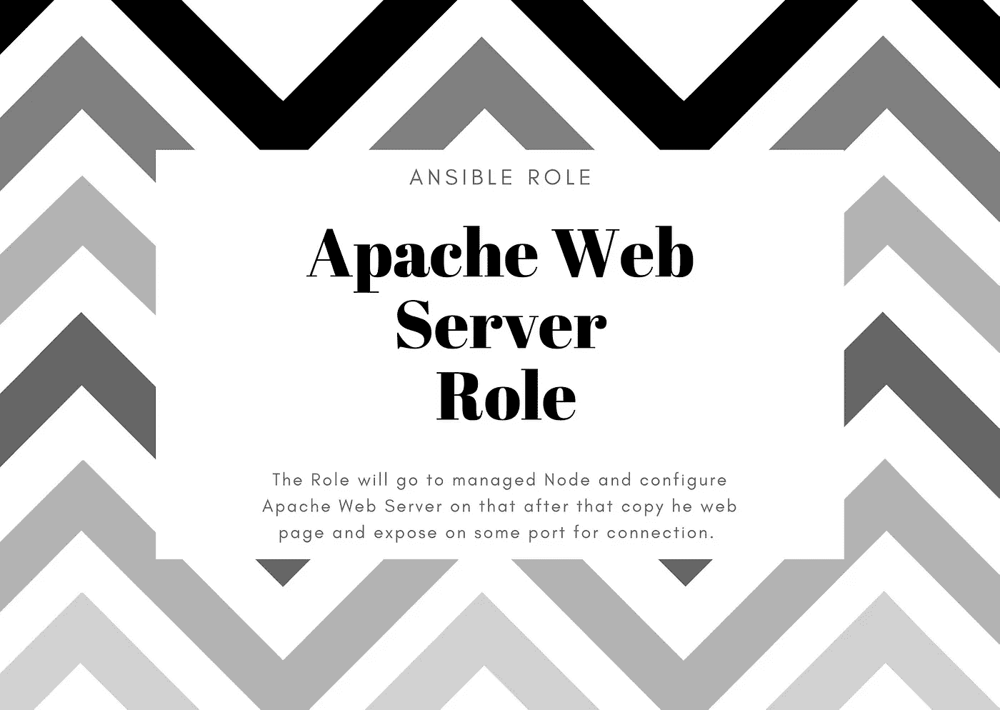

# 配置 Apache Web 服务器、HAPROXY，并使用 Ansible 将后端服务器 IPs 自动注册到 HAPROXY

> 原文：<https://medium.com/geekculture/configure-apache-web-server-haproxy-and-further-auto-register-backend-server-ips-to-haproxy-using-b60ec2ae6dc7?source=collection_archive---------8----------------------->



Created by Akanksha

## 在 HAPROXY.cfg 文件中控制 web 服务器版本和解决主机 IPs 动态添加到每个托管节点的挑战的角色，这提高了我们站点的可扩展性和高可用性…

在这个敏捷的世界中，我们将我们的网站部署到生产环境中。但是，每当我们的 Web 服务器节点扩展时，我们都必须将其注册到负载平衡器，负载平衡器进而分配流量并管理来自客户端的请求-响应。

现在情况一定很清楚了，我们要在这个博客里讨论什么？是的，它是 Web 服务器 IPs 到负载平衡器的自动注册。如果数据中心的系统崩溃，我们可能需要设置整个环境。因此，这个 Ansible 将使用它的自动声明代码在几分钟内创建整个设置。


## 🤔Ansible 是什么？

自动化在 IT 领域已经存在几十年了，但 Ansible 主要是为"**配置管理**设计的，该工具以高度可伸缩性和启动业务的能力进入市场，而无需向员工支付高额工资，只需编写脚本来继续配置由负载平衡器启动的每个节点……浏览我以前的 Ansible 博客，在那里我讨论了 Ansible 的真实行业用例。[点击这里！！](https://akanksha77.medium.com/this-article-will-give-you-an-idea-that-how-advancement-and-automation-made-the-configuration-of-62b15ad680ea)

[](https://akanksha77.medium.com/this-article-will-give-you-an-idea-that-how-advancement-and-automation-made-the-configuration-of-62b15ad680ea) [## 本文将让您了解进步和自动化是如何使配置…

### 自动化在 IT 领域已经存在几十年了，但 Ansible 主要是为“配置管理”而设计的。

akanksha77.medium.com](https://akanksha77.medium.com/this-article-will-give-you-an-idea-that-how-advancement-and-automation-made-the-configuration-of-62b15ad680ea) 

## 🤔我们为什么使用 HAPROXY？

HAProxy 代表**高可用性代理**，是一个流行的开源软件 TCP/HTTP 负载平衡器和代理解决方案，可以在 Linux、Solaris 和 FreeBSD 上运行。它最常见的用途是通过在多个服务器(例如 web、应用程序、数据库)之间分配工作负载来提高服务器环境的性能和可靠性。

HAProxy 使用健康检查来确定后端服务器是否可用于处理请求。这避免了在服务器变得不可用时必须从后端手动删除服务器。默认的运行状况检查是尝试建立到服务器的 TCP 连接，即检查后端服务器是否正在侦听配置的 IP 地址和端口。

如果服务器未通过健康检查，因此无法为请求提供服务，它会在后端自动禁用**，即流量不会转发给它，直到它再次恢复健康。如果后端中的所有服务器都出现故障，服务将变得不可用，直到这些后端服务器中至少有一个恢复正常。**


## 🤔Apache HTTP Server 的工作是什么？

所有 web 服务器的基本工作是**接受来自客户端**的请求(例如，访问者的 web 浏览器)，然后发送对该请求的响应(例如，访问者想要查看的页面组件)。Apache 是最流行的 web 服务器。

Apache 的功能是使用 TCP/IP 协议通过网络从客户端到服务器进行通信。Apache 可用于多种协议，但最常见的是 HTTP/S。HTTP/S 或超文本传输协议(S 代表安全)是 web 上的主要协议之一，也是 Apache 最著名的协议。

**Apache Web 应用架构:**

Apache 只是 web 应用程序堆栈中交付 web 内容所需的一个组件。最常见的 web 应用程序栈之一涉及 LAMP 或 Linux、Apache、MySQL 和 PHP。

Linux 是处理应用程序操作的操作系统。Apache 是通过 HTTP 处理请求并提供 web 资产和内容的 web 服务器。MySQL 是一个以易于查询的格式存储所有信息的数据库。PHP 是一种编程语言，它与 apache 一起帮助创建动态 web 内容。

# 在继续进行之前，让我们简要介绍一下我们的计划:

1.  首先，我们将创建 ansible.cfg 文件，在该文件中，我们必须提到所有受管节点的 IP。
2.  为 Ansible 从控制器节点使用剧本部署创建的 SSH 连接的所有受管节点元数据创建静态清单。
3.  为 Apache Web 服务器配置创建角色。
4.  为 HAPROXY 配置和后端 Web 服务器的自动注册创建角色。
5.  创建 Setup.yml Ansible 行动手册文件以部署这些角色，从而达到我们的要求。

## 先决条件:

> 带有 RHEL8 Linux 机器的✔控制器节点，必须在该机器上安装 Python & Ansible 2.10.8。
> 
> web 服务器配置的一些受管节点。一个用于 HAPROXY 配置。

我们正在 Ansible-galaxy 中创建角色，以便很好地管理我们的声明代码，并通过运行 ansible-playbook setup.yml 文件的一个命令一步一步地完成这个用例，最终设置将一键完成。

***第一步:创建 Ansible 配置文件:***

Ansible 是一个无代理的自动化工具，它需要控制器节点上的清单文件，我已经提到这是我们的本地系统。清单文件可以在路径(/etc/ansible/ansible.cfg)中的控制器节点内全局创建，也可以在我们将要运行剧本/角色的工作区中创建。

*为此项目创建工作环境:*

```
**# mkdir haproxy-ansible
# cd haproxy-ansible
# mkdir roles
# vim ansible.cfg**
```

这里我们创建一个本地的 Ansible 配置文件，如下所示。为此，您只需要创建一个工作区，您将在其中保存 Ansible Controller node Playbook 配置项目的所有角色、清单和模板。

这里我们有三个可用的系统，一个是[default],在这个系统下我们只需编写 **role_path** :用于定义路径的位置， **host_key_checking** :用于在 SSH 远程登录到受管节点时禁止检查主机密钥。最重要的是，**列出了所有被管理主机的地址所在的**文件路径。

在[inventory]系统中，我们有一些插件，这些插件使我们能够对我们的清单文件进行额外的工作，如:Host _ list-列出主机，Script-添加一些脚本，在自动化场景中的 Auto-Ansible 用法，yaml-了解 YAML 结构描述，ini-初始化清单列表并收集事实，以及更多的插件，我们可以添加这些插件来获得更多的故障排除和更好的解决方案，以优化我们的工作并使配置管理更简单。

[privilege_escalation]块包含 sudo 用户的权限和一些权限，我们依次赋予受管节点内核运行程序和配置设置的权限，这些权限或多或少涉及到启动/停止服务和更改关键文件。我们只需要在那里写下我们的要求，比如成为，成为 _ 方法，成为 _ 用户，成为 _ 询问 _ 通过。

有关配置文件设置[的更多详情，请访问此处！](https://docs.ansible.com/ansible/2.4/intro_configuration.html)！

***第二步:创建静态存货档案:***

Ansible 使用称为**清单**的一个列表或一组列表，同时针对基础设施中的多个托管节点或“主机”工作。清单可以由 YAML 或 ini 文件构建或提取。我们主要有两种存货:

1.  **静态清单**:在这里，您可以使用密码提及多个受管节点的 IP 或 DNS 名称，或者可以使用基于密钥的身份验证方法来连接我们的远程实例，以便管理它们的配置。我们可以在此文件中创建我们需要处理的默认组、主机组或主机范围。但是这些对于管理小型基础设施来说很方便。
2.  **动态清单**:一些动态清单脚本在本地配置控制器机器上运行，并查找您的远程系统信息，使用这些信息来检索系统的地址或 DNS，加载更多角色/行动手册，并在这些清单主机设置上实时运行。这些脚本是可执行程序，当通过 ansible.cfg 文件或通过-i 选项传递远程系统的位置时，它们从外部来源收集信息并以 JSON 格式输出清单。这个文件总是可执行的，并且适合于我们频繁创建和销毁机器并且需要在那个时候进行配置的环境。

[欲了解更多库存信息，请访问！！](https://docs.ansible.com/ansible/latest/user_guide/intro_inventory.html)

因此，总结我们的用例，我们只有几个需要配置的系统。这些系统在我们的本地机器上，我们也没有执行任何放大或缩小操作。那么我们需要使用静态库存，如下所示:

这里我们有两个主机组，名为[web]用于 web 服务，名为[lb]用于负载平衡器信息。文件中的每条记录(行)包含一个受管节点的 IP 地址、用户名、密码和连接方法信息(例如，如果是 Linux，则是 SSH，如果是 Windows，则是 RDP)。

***第三步:创建角色:***

我们总共有两个角色，名为“web”和“lbrole ”,分别用于配置 Webserver 和 HAPROXY 负载平衡器。角色的名字清楚地表明了他们的任务:

> **Web 角色将做以下事情:**
> ◾安装 Apache Web 服务器(httpd)
> ◾复制网页
> ◾启动 httpd 服务
> 
> **lbrole 会做以下事情:**
> ◾安装 Haproxy 负载均衡器
> ◾设置 haproxy.cfg 文件
> ◾启动 firewalld 服务并暴露代理端口
> ◾最后启动 haproxy 服务

为我们的角色创建单独的工作空间总是一个好的做法，这样我们可以很容易地记住文件的层次结构。为此，我们有“角色”工作空间:

```
**# mkdir roles
# cd roles
# ansible-galaxy init web
# ansible-galaxy init lbrole**
```

现在我们已经有了所有的任务、模板、变量文件*和其他基于已知文件结构*的可解析工件，这些工件已经预嵌入到角色中，我们只需要通过包含模块和 jinja 属性注释来编写我们所需要的所有东西的声明/描述(用 YAML 语言)。

[欲了解更多角色信息，请访问！](https://docs.ansible.com/ansible/latest/user_guide/playbooks_reuse_roles.html)

***第四步:创建 Web 服务器角色:***



在这个角色中，我们有三件事情要做，第一是安装 httpd 软件，第二是在被管理节点上的特定目的地向被管理节点发送(复制)文件。最后运行 httpd Apache Web 服务器的服务。它包括我们角色的任务、变量和文件特性。

```
**# cd role/web/tasks
# vim main.yml**
```

tasks.yml

在上面的任务文件中，我使用了我们的 web 角色的变量和文件特性，下面分别是变量和文件(index.html ):

```
**# cd role/web/vars
# vim main.yml**
```

var.yml

```
**# cd role/web/files**
```

index.html

***第五步:创建负载均衡器角色:***


在负载平衡器角色“lbrole”中，它使用 HAPROXY 软件创建负载平衡器，并使用该软件进一步管理来自客户端的流量负载，并将从前端到后端的请求代理给客户端，后端服务器被自动注册到我们的负载平衡器，并且当负载在会话基础上增加时，我们还可以添加扩大和缩小的设施。

```
**# cd role/lbrole/tasks
# vim main.yml**
```

HAPROXY 负载平衡器角色中包含的任务如下:

tasks.yml

我们在这里使用了各种可转换模块，如:

> **软件包模块:**使用 yum/dnf 软件包管理器安装、升级、删除和列出软件包和组。
> 
> **模板模块:**使用该模块在被管节点上部署 jinja2 模板文件。与 **src** 键相关联的值指定源 Jinja2 模板，与 **dest** 键相关联的值指定要在目的主机上创建的文件。
> 
> **服务模块**:启动系统或程序服务，停止和重启服务。
> 
> **命令模块:**附加模块，不处理幂等性，并拥有运行 shell 命令的能力，就像在受管节点中一样。
> 
> **防火墙模块:**该模块允许在运行或永久防火墙规则中添加或删除服务和端口(TCP 或 UDP)。

这里还要注意一件事，我们在 **jinja2 模板**中提供了文件(haproxy.cfg.j2 ),这样它就可以被处理，我们可以使用“for loop”将用于注册目的的 web 服务器的数量添加到我们的负载平衡器节点。我们正在通过清单中提到的主机组导入 IP 地址。

当使用变量和事实部署文件时，模板化文件是管理为受管主机自动定制的配置文件的强大方法。Ansible 对内部使用分隔符的模板文件使用 **Jinja2 模板系统**。我们可以通过使用支持将文件从 **src** (源)传输到 **dest** (目的地)的**模板**模块，将该文件部署在受管节点中，也就是说，可以使用的控制器节点。我们将**用于**语句，变量包含清单中[web]组中要管理的主机列表，该列表将在文件中列出。

{ % for web in groups[' web ']% }
{ { web } }
{ % end for % }

```
**# cd role/lbrole/template**
```

变量文件如下，在任务执行时由 Ansible 任务文件调用。/lbrole/var 文件夹包含名为 main.yml 的变量文件，我们有两个名为 **soft** 和 **port_no** 的变量。

```
**# cd role/lbrole/vars
# vim main.yml**
```

***第六步:创建运行所有角色的设置剧本:***

最后，编写我们的 Setup.yml 文件，通过调用这些角色来自动完成所有的任务。我们需要在主工作区内创建文件，即 haproxy_ansible:

```
**# cd haproxy_ansible/
# vim setup.yml**
```

因此，它最终将在两个主机组上运行，即 web 和 lb。

**步骤 7:运行行动手册设置。yml:**

现在只需运行 ansible-playbook，在一个 playbook 中最终执行所有角色和集合。

```
**# ansible-playbook setup.yml** 
```

因此，我们已经实现了我们的目标“配置 Apache Web 服务器，HAPROXY 和进一步自动注册后端服务器 IP 到 HAPROXY”。下面是运行 Ansible 行动手册时的演示视频:

你可以在我的 GitHub 上找到这个项目，只要 fork 和 let 使这个项目对客户来说更加系统独立和可靠。

[](https://github.com/akankshaS77/Haproxy-Apache-Ansible.git) [## akankshas 77/ha proxy-Apache-ansi ble

### 使用可变角色将 Apache Web 服务器 IP 动态配置和注册到 Haproxy 负载平衡器配置文件…

github.com](https://github.com/akankshaS77/Haproxy-Apache-Ansible.git) 

如果您想为这个项目做出贡献，或者有进一步的疑问或意见，您可以通过 LinkedIN 联系我:

[](https://www.linkedin.com/in/akanksha-singh-as/) [## 阿康沙·辛格-成功负责人@ ARTH -技术学院- LinuxWorld Informatics Pvt 有限公司…

### 在全球最大的职业社区 LinkedIn 上查看阿康沙·辛格的个人资料。阿康沙有 3 个工作列在…

www.linkedin.com](https://www.linkedin.com/in/akanksha-singh-as/) 

# 感谢阅读。希望这个博客给你一些有价值的输入！！


(: — )