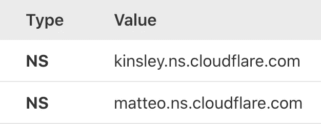

# 使用 Cloudflare 在 AWS EC2 上免费配置 HTTPS

> 原文：<https://medium.com/geekculture/configure-https-on-aws-ec2-for-free-using-cloudflare-e7120e9a6856?source=collection_archive---------1----------------------->

## 在本文中，我希望能够向您展示如何使用 SSL 证书保护 AWS EC2(或任何服务器)中托管的前端应用程序。


有一次，我用 React 构建了一个 web 应用程序，并用 Golang 编写了一个基础设施。在我完成这个项目后，我想把它部署在某个地方。对于 React 应用程序，我将它部署到 Netlify(顺便说一下，这是一个很棒的工具)，令人惊讶的是，它已经在我的 Netlify 应用程序中有了 SSL 证书，这太棒了。对于用 Golang 编写的应用程序，我尝试了一个 AWS EC2 自由层来测试我的项目，但我没有预料到的是(因为我没有考虑清楚), EC2 机器没有 SSL 证书，而且，如你所知，安全连接不能在不安全的服务器上执行请求(HTTPS - > HTTP)。

当你面临类似的问题时，如果你快速搜索一下，你会发现有一个很棒的认证机构可以免费为你的服务器生成一个证书。我说的是让我们加密，但有一个陷阱:因为 AWS EC2 免费层是常用的，并与垃圾邮件相关联，他们阻止了 EC2 域，这意味着它不会工作。

# Cloudflare —解决方案的第 1 部分

您可能知道，Cloudflare 在其平台上提供免费的带 DDoS 保护的 SSL 证书，您可能会问自己，他们为什么要这样做？嗯，因为他们希望流量通过他们的服务器，这样他们就可以区分“好流量”和“坏流量”，在这种情况下，每个人都是赢家。

要实现这个简单的解决方案，你需要三样东西:

*   注册一个域名(可以使用免费域名，当时我用 [Freenom](https://freenom.com/) 网站注册了一个. tk 域名 12 个月)；
*   注册一个 Cloudflare 帐户；
*   在 AWS EC2 机器上安装 NGINX。

第一点很简单，你可以获得一个免费域名，然后就可以创建你的 Cloudflare 帐户了。如果您仔细按照步骤操作，您将进入 DNS 屏幕，在这里您可以将您最近购买的域名与您的 EC2 IP 地址(或域名)进行映射


DNS Configuration

为此，您必须将您的域默认名称服务器更改为指向 Cloudflare 的服务器(您的域管理控制台/仪表板中应该有此设置)。请注意，您的域上的这一更改可能需要 24 小时才能完成。



Cloudflare’s name servers

这样，每个请求都将转到 Cloudflare services，自动为您提供免费的 SSL 证书(HTTPS 连接),并且因为您进行了 DNS 配置，您的域映射到您的 EC2 服务器，所以请求将到达那里，但不会显示任何内容，因为您没有设置任何 web 服务器/反向代理。现在是时候在我们的服务器上设置 NGINX 了。

# NGINX 配置——解决方案的第 2 部分

因为你可以选择一个不同于我的 AMI (Amazon 机器映像),所以我将向你解释如何为你的版本配置 NGINX。

登录到您的 EC2 服务器并键入

```
cat /etc/os-release
```

在输出中，您可以看到安装在您的映像中的 Linux 版本，在我的例子中是 Centos。在 NGINX 官方文档中，你可以找到如何在你的特定 Linux 版本上安装 NGINX 的教程([阅读更多](https://docs.nginx.com/nginx/admin-guide/installing-nginx/installing-nginx-open-source/))。

在我的例子中，我需要配置 NGINX 的命令是:

```
sudo yum update
sudo yum install nginx
sudo vi /etc/yum.repos.d/nginx.repo
>> Add this
[nginx]
name=nginx repo
baseurl=https://nginx.org/packages/mainline/<OS>/<OSRELEASE>/$basearch/
gpgcheck=0
enabled=1 
<<
sudo service nginx start
```

现在，如果你使用 HTTP 访问你的域名，你会到达一个默认的 NGINX 页面。但这不是你想要的。您想要使用 HTTPS 访问您的域。为此，只需更新您的 NGINX 配置文件

```
vi /etc/nginx/conf.d/default.conf
```

并补充道，

```
upstream server {
  server 127.0.0.1:9000;
}server {listen              443 ssl default_server;
listen              [::]:443 ssl default_server;server_name  localhost;ssl_certificate /etc/ssl/certs/nginx-selfsigned.crt;
ssl_certificate_key /etc/ssl/private/nginx-selfsigned.key;

 location / {
  proxy_pass [http://server;](http://wsserver;)
  proxy_set_header Upgrade $http_upgrade;
  proxy_set_header Connection "Upgrade";
  proxy_set_header Host            $host;
  proxy_set_header X-Real-IP       $proxy_protocol_addr;
  proxy_set_header X-Forwarded-For $proxy_protocol_addr;
  # Very important, controls proxied websocket connection timeout
  proxy_read_timeout 600s;
 }
}
```

这样，您将从端口 443 接收请求，并将这些请求转发到您的服务器端口(在本例中是 9000，这是我的 Golang 服务器端口)。

如果你注意到我已经添加了为 NGINX 生成的私有 SSL 证书。使用 OpenSSL，您可以轻松地创建这些证书。

```
sudo mkdir /etc/ssl/private
sudo chmod 700 /etc/ssl/private
sudo openssl req -x509 -nodes -days 365 -newkey rsa:2048 -keyout /etc/ssl/private/nginx-selfsigned.key -out /etc/ssl/certs/nginx-selfsigned.crt
```

你会被问一系列的问题，你可以对每个人都按回车键，这部分不是本教程的内容，也不是强制性的。

仅此而已。如果你用 HTTPS 访问你的应用程序(使用你的域),它将成功地到达你的后端端口 9000。简单又安全。