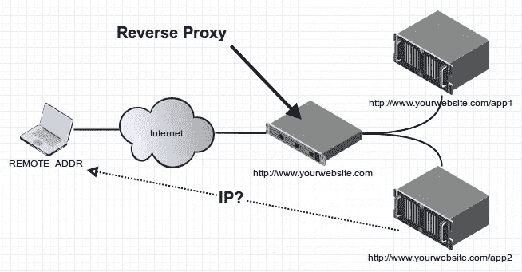

# 为 Apache 服务器配置反向代理

> 原文：<https://medium.com/geekculture/configure-reverse-proxy-for-apache-server-84938b0b83d0?source=collection_archive---------13----------------------->



在当今时代，代理服务器已经成为管理复杂网络、性能和安全问题的一种需要。代理服务器分为前置代理服务器和反向代理服务器两种。两者都有不同的应用和用例。今天，我们将讨论如何在不同的情况下在 apache 上配置反向代理，无论您的服务器是安全的，如 HTTPS 还是工作在 HTTP 上。在这两种情况下，如何向 HTTPS 安全服务器发送反向代理请求？在本文中，我们将介绍这两种配置。

要为当前不安全但我们正在请求数据的服务器安全的任何后端 URL 设置反向代理，需要以下配置，如果是 XAMP，该配置应添加到 http.d 文件中，如果是基于 Linux 的配置，则添加到主配置文件中:

```
ProxyRequests Off
ProxyPreserveHost On
ServerName localhost
SSLProxyEngine on
SSLProxyVerify none
SSLProxyCheckPeerCN off
SSLProxyCheckPeerName off# Servers to proxy the connection, or;
# List of application servers:
# Usage:
# ProxyPass / http://[IP Addr.]:[port]/
# ProxyPassReverse / http://[IP Addr.]:[port]/
# Example:
ProxyPass /ws/ [https://{{url}}/api/1.0/webhooks/](https://127.0.0.1:8442/api/1.0/webhooks/twitter/)
ProxyPassReverse /ws/ [https://{{url}}/api/1.0/webhooks/](https://127.0.0.1:8442/api/1.0/webhooks/twitter/)
```

(当 HTTP 上的实例和在 HTTPS 反向代理的 URL 需要此设置时，需要此配置)

现在，如果您的服务器也运行在 SSL 上，则配置所需的参数会减少。参数是必需的，可以使用以下配置:

```
ProxyPreserveHost On
# Servers to proxy the connection, or;
# List of application servers:
# Usage:
# ProxyPass / http://[IP Addr.]:[port]/
# ProxyPassReverse / http://[IP Addr.]:[port]/
# Example:
ProxyPass /ws/ [https://{{url}}/api/1.0/webhooks/](https://127.0.0.1:8442/api/1.0/webhooks/twitter/)
ProxyPassReverse /ws/ [https://{{url}}/api/1.0/webhooks/](https://127.0.0.1:8442/api/1.0/webhooks/twitter/)
```

这些配置可以直接在 windows XAMP 上使用，但是如果您在基于 Linux 的环境中使用 apache，您可能需要安装这些更具体的模块，您可以在此 [***链接***](https://www.digitalocean.com/community/tutorials/how-to-use-apache-http-server-as-reverse-proxy-using-mod_proxy-extension) 上查看这些模块