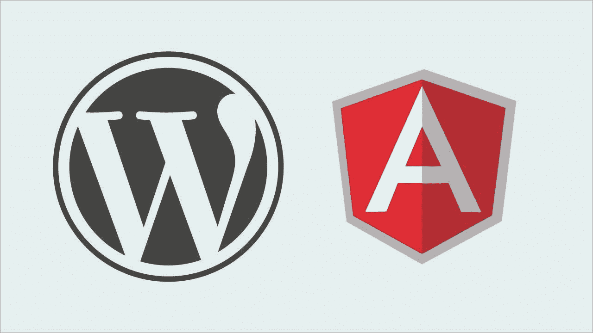
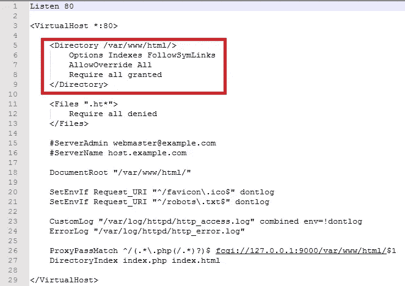
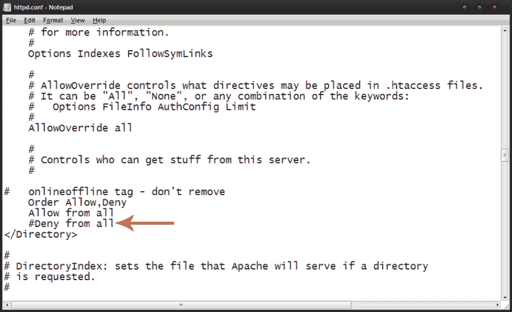

# 在 Apache 中配置 Angular 项目和 WordPress

> 原文：<https://medium.com/geekculture/configure-the-angular-project-along-with-wordpress-in-apache-7bd8fd1a1b26?source=collection_archive---------17----------------------->



WordPress 被认为是世界顶级内容管理系统(CMS)之一。有插件和工具，允许轻松添加不同类型的功能，如产品列表，购物车管理和支付选项。在网络上使用的所有内容管理系统中，它占有 47%的市场份额。但是如果你有一个模块是在 WordPress 之外的不同框架上制作的，你想让它在同一个 URL 上工作，让用户信任你的站点，那该怎么办呢？因为它极大地影响了用户对网站的信任度。为了避免这种情况，我们尝试将 WordPress 和我们的前端 web 应用程序放在同一个 URL 上，可以这样做:

要在 Windows 上部署 WordPress，建议使用 XAMPP，因为它包括一个内置的服务器和内置的 MYSQL 和 PHP，这有助于轻松设置。

但是 XAMPP 使用重写模块，我们必须为每个子目录设置一个 HTACCESS 文件。

例如#如果在部署 WordPress 站点时需要在/demo 上显示 angular 应用程序，那么 demo 文件夹应该有一个 HTACCESS 文件，该文件将具有以下配置:

```
RewriteEngine On
RewriteBase /path/
RewriteCond %{REQUEST_FILENAME} !-f
RewriteCond %{REQUEST_FILENAME} !-d
RewriteRule . /path/index.html [L]
```

在 windows 中，处理 apache 配置的文件被分成许多适当处理这些功能的配置文件。处理配置的主要文件是 httpd.conf。

单击 xampp config 并选择 httpd.conf 查看主文件。


在 httpd 中，您必须启用 apache 的重写模块，并将这些行添加到您想要运行的站点的 Virtualhost 目录中。

```
*<directory />
  Options All*
 *AllowOverride All
</directory>*
```

对于每个虚拟主机应该是这样的，只在你想让 angular 应用程序和 WordPress 一起工作的时候设置这个属性:



或者你可以这样定义外部，如果你只托管单个站点:



现在重新启动 Xampp 并检查您的站点。你会有一个 WordPress 网站和你的/demo Angular 项目。现在你可以在 WordPress 网站上有一个销售漏斗，并为你的销售线索完成一个演示应用程序。