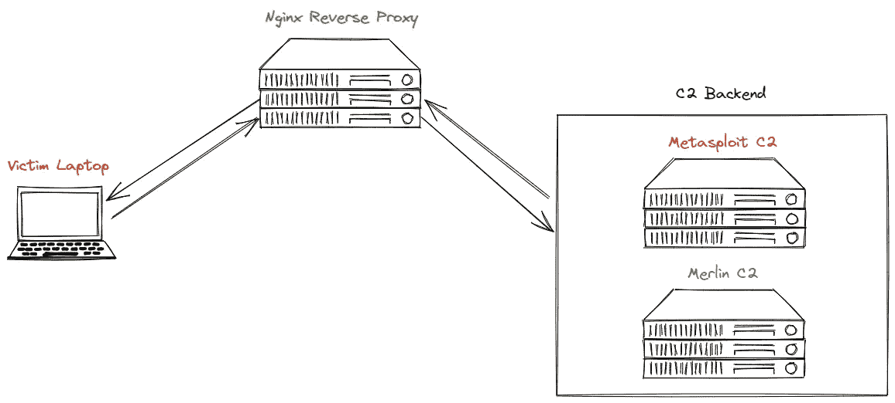

# 为 C2 转发配置反向代理

> 原文：<https://medium.com/geekculture/configuring-a-reverse-proxy-for-c2-forwarding-31ba6245a554?source=collection_archive---------5----------------------->

## 隐藏你的攻击基础设施

你好，世界！在您的 C2 基础设施后端设置反向代理有助于保护您的攻击服务器的身份，并防止它们被我们在 pentest 期间可能遇到的潜在安全解决方案列入黑名单。在这篇博客中，我将向你展示如何配置一个基本的 C2 反向…