# 配置 Httpd 服务器，设置 Python 解释器，并在 Docker 容器上运行它

> 原文：<https://medium.com/geekculture/configuring-httpd-server-and-setting-up-python-interpreter-and-run-it-on-docker-containers-258675a48016?source=collection_archive---------10----------------------->

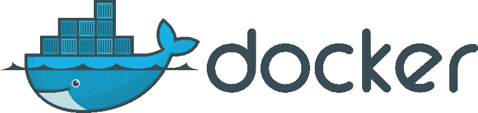

应用程序变得越来越复杂。要求更快发展的呼声日益高涨。这给您的基础架构、IT 团队和流程带来了压力。Linux 容器帮助您缓解问题并更快地迭代——跨多个环境。

# 什么是 Linux 容器？

Linux 容器是一种技术，允许您将应用程序与其整个运行时环境(运行所需的所有文件)打包并隔离。这使得在环境(开发、测试、生产等)之间移动包含的应用程序变得容易。)同时保留全部功能。容器也是 IT 安全的重要组成部分。通过[在容器管道中构建安全性](https://www.redhat.com/en/topics/security/container-security)并保护您的基础设施，您可以确保您的容器是可靠的、可伸缩的和可信的。

# 为什么要使用 Linux 容器？

[Linux](https://www.redhat.com/en/topics/linux) 容器通过分离责任区域帮助减少开发和操作团队之间的冲突。开发者可以专注于他们的应用，而运营团队可以专注于基础设施。而且，因为 Linux 容器是基于[开源](https://www.redhat.com/en/topics/open-source/what-is-open-source)技术的，所以一旦它们可用，您就可以获得最新和最大的改进。容器技术——包括 [CRI-O](http://thenewstack.io/cri-o-make-kubernetes-center-container-ecosystem/) 、 [Kubernetes](https://www.redhat.com/en/topics/containers/what-is-kubernetes) 和[Docker](https://www.redhat.com/en/topics/containers/what-is-docker)——帮助您的团队简化、加速和协调应用程序开发和部署。

# 你能用容器做什么？

您可以为各种工作负载和用例部署容器——从大到小。容器为您的团队提供了一种[云原生开发风格](https://www.redhat.com/en/topics/cloud-native-apps)所需的底层技术，因此您可以开始使用 [DevOps](https://www.redhat.com/en/topics/devops) 、 [CI/CD](https://www.redhat.com/en/topics/devops/what-is-ci-cd) (持续集成和持续部署)，甚至可以使用[无服务器](https://www.redhat.com/en/topics/cloud-native-apps/what-is-serverless)。

基于容器的应用程序可以跨高度分布式的云架构工作。[应用运行时中间件](https://www.redhat.com/en/products/runtimes)提供工具来支持开发、交付、集成和自动化的统一环境。

您还可以在容器中部署[集成](https://www.redhat.com/en/topics/integration)技术，因此您可以轻松扩展您连接应用程序和数据的方式，例如通过 Apache Kafka 的[实时数据流。如果您正在构建微服务架构，容器是每个微服务和连接它们的](https://www.redhat.com/en/topics/integration/what-is-apache-kafka)[服务网格](https://www.redhat.com/en/topics/microservices/what-is-a-service-mesh)网络的理想部署单元。

当您的业务需要跨多个环境的终极可移植性时，使用容器可能是有史以来最容易的决定。

Source: docker

# 🐳码头工人

Docker 技术使用 [Linux 内核](https://www.redhat.com/en/topics/linux/what-is-the-linux-kernel)和内核的特性，如 [Cgroups](https://access.redhat.com/documentation/en-US/Red_Hat_Enterprise_Linux/6/html/Resource_Management_Guide/ch01.html) 和 [namespaces](https://lwn.net/Articles/528078/) ，来隔离进程，使它们能够独立运行。这种独立性是容器的目的——能够彼此独立地运行多个进程和应用程序，以更好地利用您的基础设施，同时保留独立系统的安全性。

包括 Docker 在内的容器工具提供了基于映像的部署模型。这使得跨多个环境共享一个应用程序或一组服务及其所有依赖关系变得很容易。Docker 还在这个容器环境中自动部署应用程序(或组成应用程序的组合进程集)。

这些建立在 Linux 容器之上的工具——这使得 Docker 用户友好和独特——为用户提供了前所未有的应用访问、快速部署的能力以及对版本和版本分发的控制。

# 👨‍💻Docker 与 Linux 容器:有区别吗？

虽然有时会感到困惑，但 Docker 并不等同于传统的 Linux 容器。Docker 技术最初是建立在 LXC 技术之上的——大多数人把它与“传统的”Linux 容器联系在一起——尽管它已经脱离了这种依赖。LXC 作为轻量级[虚拟化](https://www.redhat.com/en/topics/virtualization)很有用，但它没有很好的开发者或用户体验。Docker 技术带来的不仅仅是运行容器的能力——它还简化了创建和构建容器、运送图像和版本控制图像等的过程。

传统的 Linux 容器使用可以管理多个进程的 init 系统。这意味着整个应用程序可以作为一个整体运行。Docker 技术鼓励将应用程序分解成独立的进程，并为此提供了工具。这种粒度方法有其优势。

# 🚀码头集装箱的优势🚀

1.  模块性
2.  图层和图像版本控制
3.  反转
4.  快速部署

💡因此，Docker 技术是一种更加精细、可控、基于微服务的方法，更注重效率。

# 码头发动机的⚡安装

在这次实践中，我将使用 [RedHat Enterprise Linux 8.3](https://www.redhat.com/en/technologies/linux-platforms/enterprise-linux) 作为我的操作系统，但对操作系统的选择没有限制。

安装完 RedHat Enterprise Linux 之后，我们必须配置 yum/dnf 存储库来安装 docker 社区版。

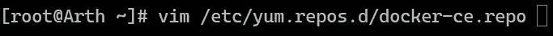

在 **docker-ce.repo** 文件中，我们将添加官方存储库 URL 作为 **baseurl** ，并且为了使处理速度更快，我们将**通过提供 **0** 到 **gpgcheck 来禁用软件签名**。**

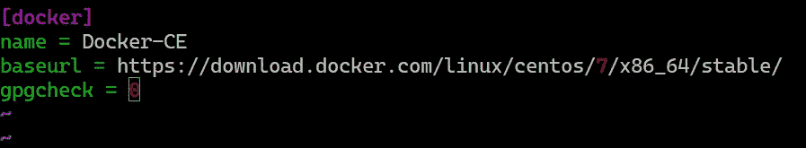

现在，使用 yum 包管理器，我们将安装 [Docker 社区版](https://www.docker.com/)。我们将使用`**--nobest**` long 选项来安装没有断开依赖关系的软件。

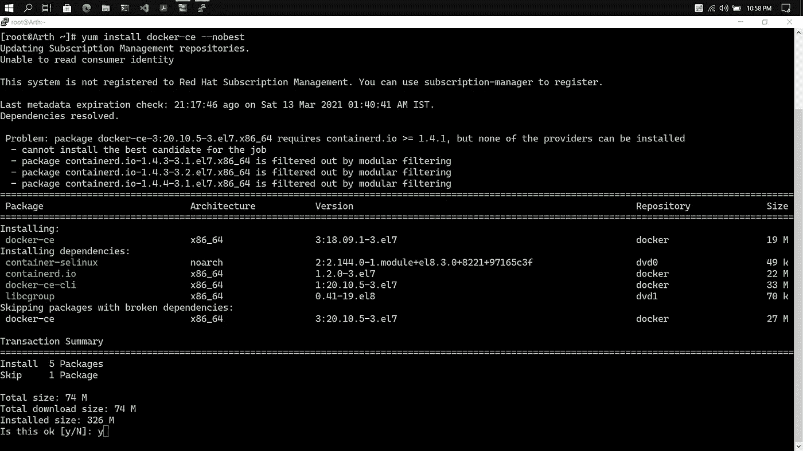

成功完成安装后，它将看起来像。

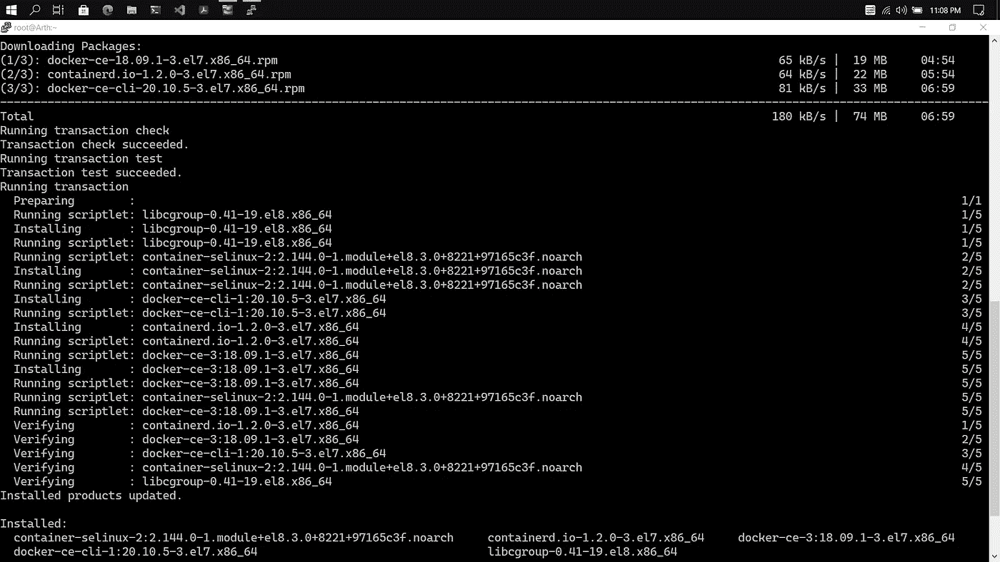

现在，我们必须启动 **docker 引擎**来启动我们需要的容器。

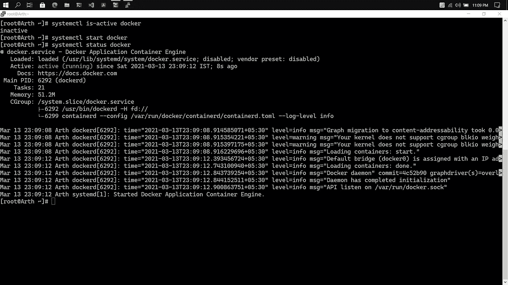

正如我们可以看到的，我们的 Docker 应用程序容器引擎已经启动并正在运行。😃

# RedHat Enterprise Linux 8 中的必要更改

在 Docker 引擎上启动容器之前，我们必须确保为容器启用了入口和出口流量。

为了做到这一点，我们需要启用伪装。专注于防火墙，我意识到禁用`**firewalld**`似乎可以做到这一点，但我宁愿不这样做。在用`**iptables**`检查网络规则时，我意识到切换到`**nftables**`意味着`**iptables**`现在是一个抽象层，只显示了`**nftables**`规则的一小部分。这意味着大多数(如果不是全部的话)的`**firewalld**`配置将在`**iptables**`的范围之外应用。

**长话短说**——为了工作，我必须启用伪装。看起来`**dockerd**`已经通过`**iptables**`做到了这一点，但显然，这需要专门为防火墙区域启用，以便`**iptables**`伪装工作:

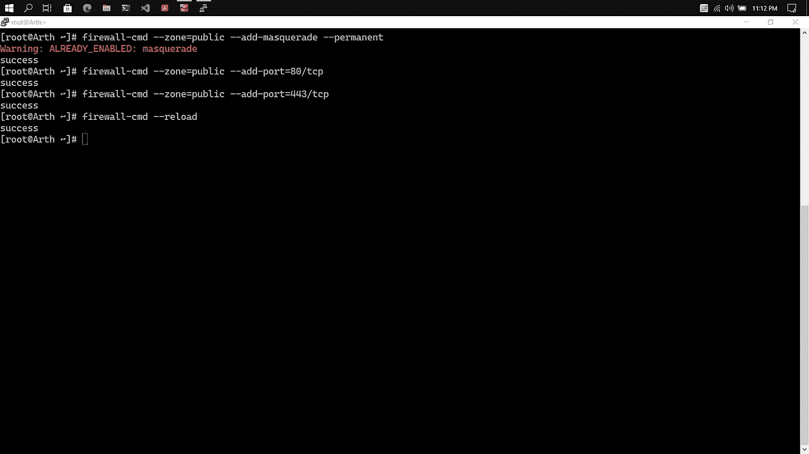

# 在 Docker 容器中配置 Httpd(Apache2)服务器

首先，我们将从[**docker hub**](https://hub.docker.com/)**下载一个操作系统映像，这是 Docker 提供的一项服务，用于与您的团队查找和共享容器映像。它是世界上最大的容器映像存储库，拥有一系列内容来源，包括容器社区开发人员、开源项目和独立软件供应商(ISV)在容器中构建和分发他们的代码。**

**我们将调出官方 centos 图像。默认情况下，它会下载最新的标签。**

**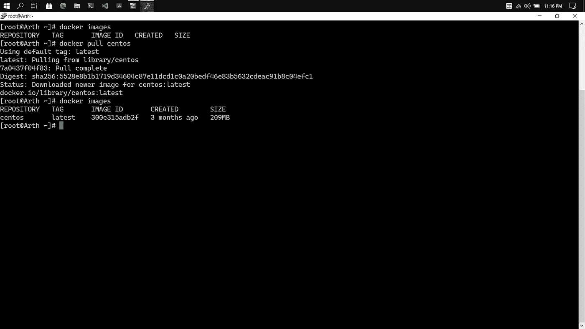**

**现在，借助`**docker ps**` 命令，我们可以看到容器正在运行的状态。然后我们将在**交互终端模式下启动一个容器，**并将该容器命名为“ **webserver”。****

**因为对接容器与主机是隔离的。端口 8080 位于主机上，端口 80 位于 docker 容器内。因此，基本上我们可以通过将请求从主机上的端口 8080 转发到容器内的端口 80 来请求我们的 web 服务器。**

****

**现在我们将通过运行以下命令来启动 httpd 守护进程:`**/usr/sbin/httpd -k start**` 。**

**然后我们在`**/var/www/html**` 里面创建了`**hello.html**` 文件。现在为了找到容器的 IP 地址，我们需要安装 **net-tools** 并运行`**ifconfig**` **。****

**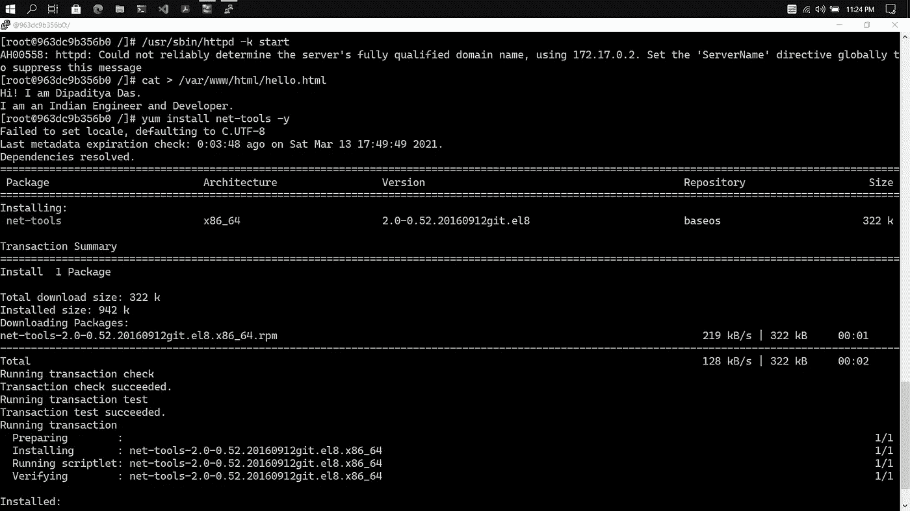****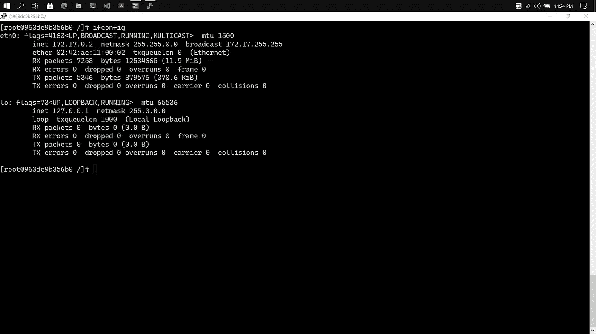**

**为了检查 web 服务器是否正确运行，我们将打开主机操作系统的一个新终端，在 curl 的帮助下，我们将请求我们的 web 服务器在容器中运行。**

**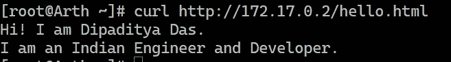**

**即使我们在 firefox 浏览器中打开 URL，它也会显示相同的输出。**

**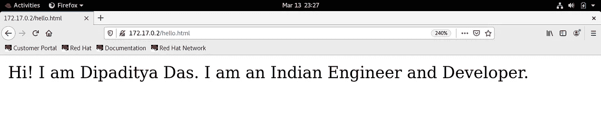**

# **在 Docker 容器中设置 Python 环境**

**就像上面一样，我们还将启动一个包含 centos 图像的容器，这个容器的名称是 **pythondemo** 。然后我们会安装 python 3.8 语言包。**

**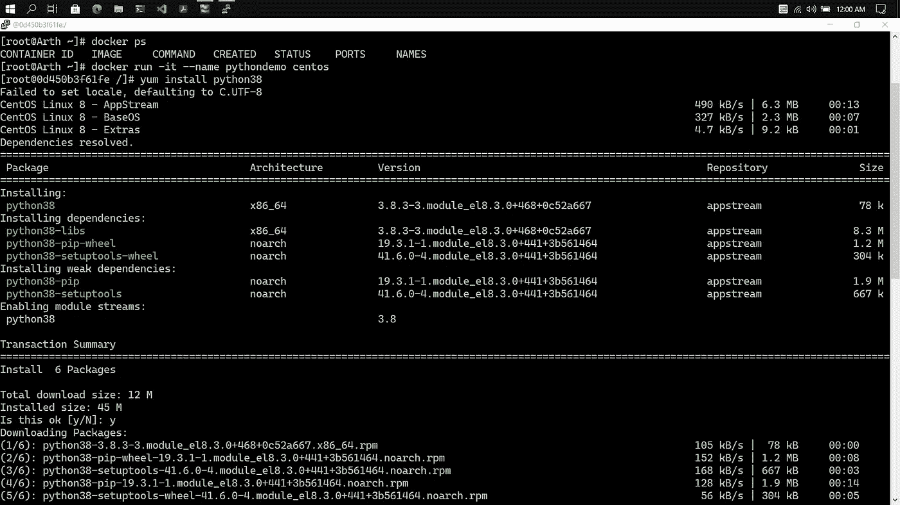**

**现在我们将编写一个 python 程序，例如使用特殊符号打印一个心脏，然后运行它。**

**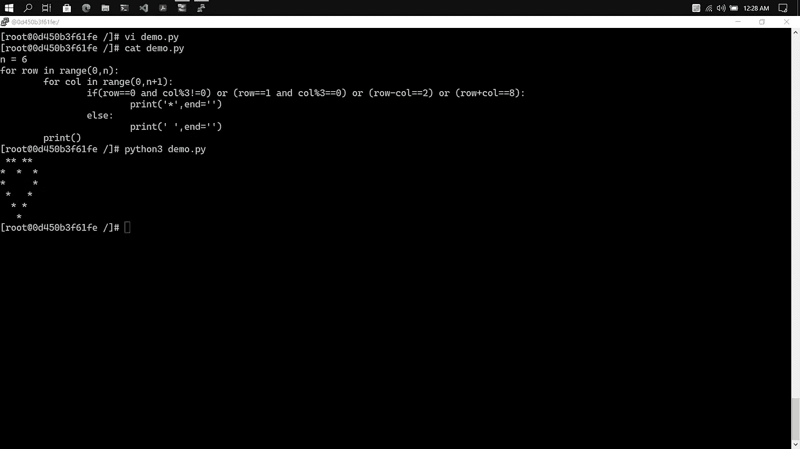**

**感谢**维玛尔·达加先生**给我机会研究这个课题和**传播真正重要的知识**。**