# 融合平台:卡夫卡安全

> 原文：<https://medium.com/geekculture/confluent-platform-kafka-security-daec286f612d?source=collection_archive---------7----------------------->

## 认证+授权+加密

## JAAS 配置+ ACL +安全套接字层

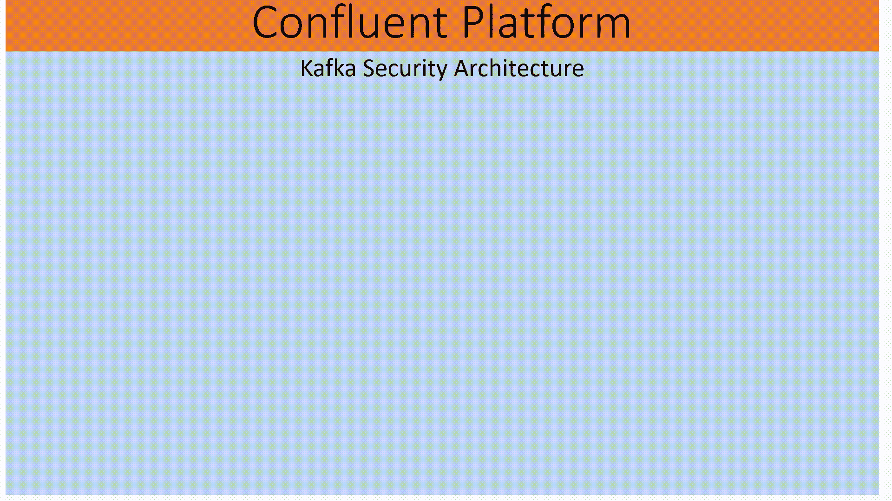

Confluent Platform: Kafka Security Architecture

# 范围

写这篇文章是为了帮助初学者和中级到 T3 的 T2 了解 Kafka 安全架构。它涵盖了以下概念和实际实现。实现代码可以在 [GitHub](https://github.com/ganesh-nag/Confluent-Kafka-Security) 看到。

a.简单认证和安全层框架(SASL)
b. *SASL 普通*带传输层安全(TLS)的机制 为了加密
c .在 Zookeeper 节点
d. *JAAS* 配置用 *KafkaServer* 段设置 *SASL ACL* 为 Broker
e. *JAAS* 配置用 *Client* 段认证 SASL 与 Zookeeper 的连接
f. *JAAS* 生产者和消费者与 Broker
g. Enable【启用

# 先决条件(尝试本练习)

a.融合平台 v7.1.1
b. Ubuntu v20.04(或)您选择的任何 Linux 发行版
c. OpenSSL 和 Keytool
d. Java v1.8(或)以上
e. Spring Boot 框架

# Kafka 是如何实现认证和授权的？

## 证明

为了使 Kafka Broker/Kafka Server 与其他 Kafka Broker 节点、Zookeeper 节点、生产者和消费者相互通信，使用 JAAS 登录模块和认证凭证来实现 JAAS 配置。
在 JAAS 配置文件中， *KafkaServer* 部分、 *Client* 部分和 *KafkaClient* 部分分别表示用于针对 Kafka 经纪人、动物园管理员和生产者/消费者进行认证的凭证。

## 批准

生产者和消费者使用 ACL(访问控制列表)进行授权。要实现授权，保护 Zookeeper 是当务之急。Kafka 将所有 ACL 存储在 Zookeeper 中，只有*管理员*拥有创建/描述/修改/删除的完全权限。
***kafka-acls*** 工具可用于允许访问主体对某个主题的创建/写入/删除/描述/读取等操作。
Apache Kafka 提供开箱即用、可插拔的 ***授权器*** 实现，使用 Zookeeper 存储所有 ACL。设置 ACL 是很重要的，否则当配置了授权者时，对资源的访问被限制为超级用户。访问控制列表(ACL)为您的企业集群数据提供了重要的授权控制。

## 什么是授权人？

授权器是 Apache Kafka 用来授权操作的服务器插件。授权者根据主体和被访问的资源控制是否授权操作。默认的 Kafka 授权器实现是*ACL authorizer****(Kafka . security . authorizer . ACL authorizer)***，在 Apache Kafka 2.4/Confluent Platform 5 . 4 . 0 中引入。
*授权人*应在 Kafka Broker 属性中启用。

*下面的序列图显示了 ACL 是如何加载的。*

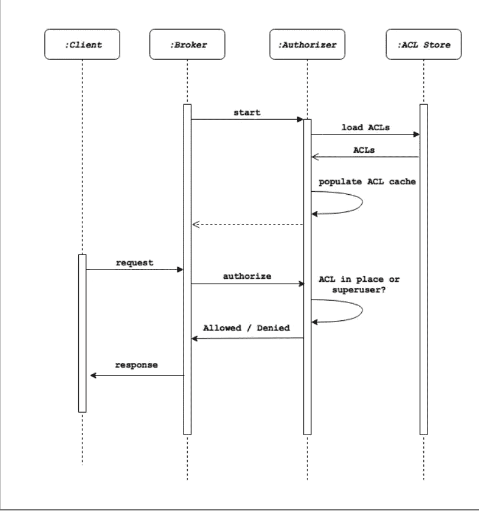

Load Access Control List

# 为什么要加密，在 Kafka 中是如何启用的？

让我们看一个用例；
如果生产者或消费者配置并使用 SASL 明文机制，那么认证凭证将以明文/无 TLS 的方式通过网络发送。这可能会导致明文密码通过网络传输。
SASL/普通只能与 TLS/SSL 一起用作传输层，以确保在没有加密的情况下不会在网络上传输清晰的密码。

## 启用加密的步骤:使用 SSL 设置 SASL

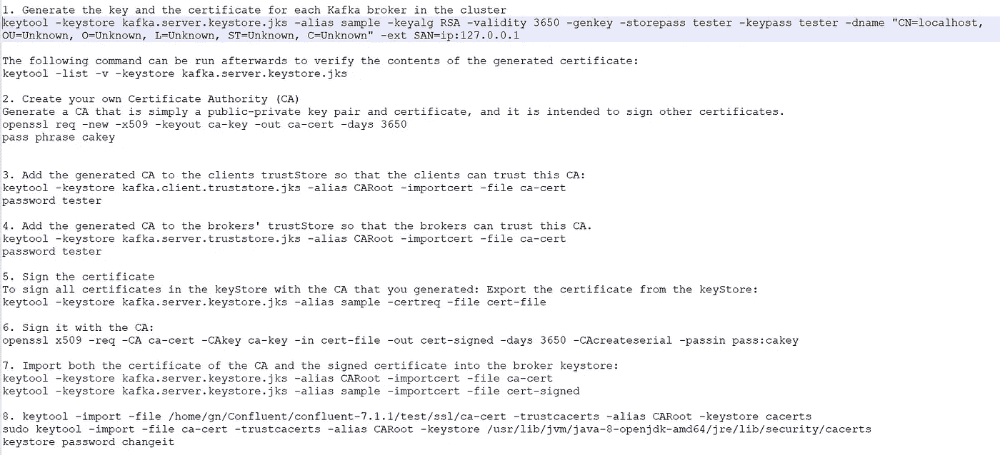

Creating SSL Keys and Certificates

# 创建 JAAS 配置:身份验证

## Kafka 代理/Kafka 服务器

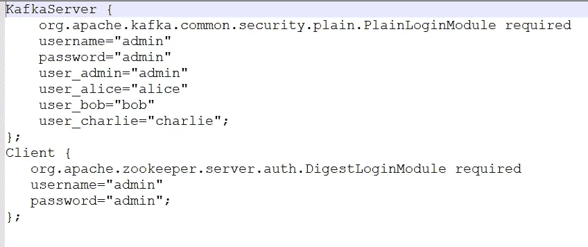

JAAS configuration: Kafka broker

## 动物园管理员

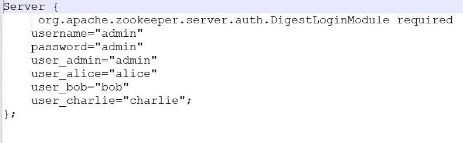

JAAS configuration: Zookeeper

## 生产者

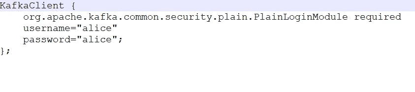

JAAS configuration: Producer

## 消费者

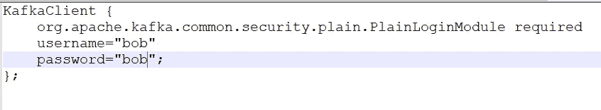

JAAS configuration: Consumer

# 创建 ACL:授权

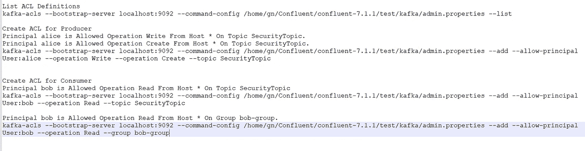

ACL Definitions

# 让我们对应用程序进行端到端测试

## a.以下演示包括 Kafka CLI 和 Spring boot 应用程序

## 启动动物园管理员

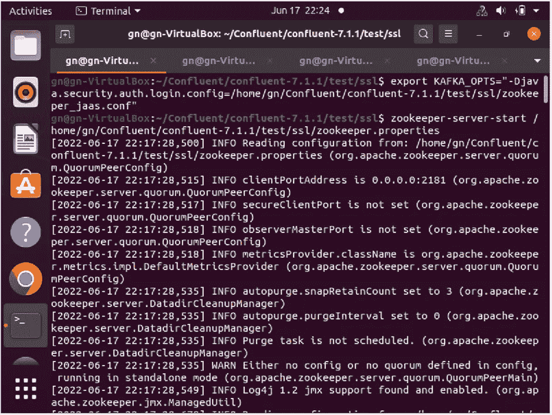

Zookeeper instance

## 启动 Kafka 代理

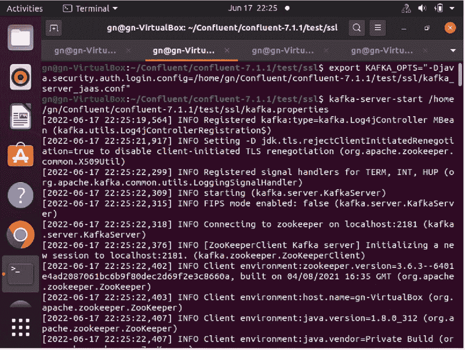

Kafka Broker instance

# Spring Boot 应用

## 启动生成器应用程序

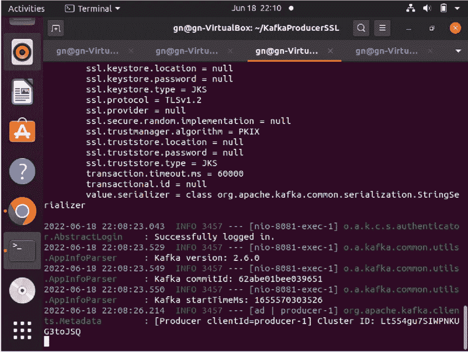

Producer Application: Spring Boot

## 启动消费者应用程序

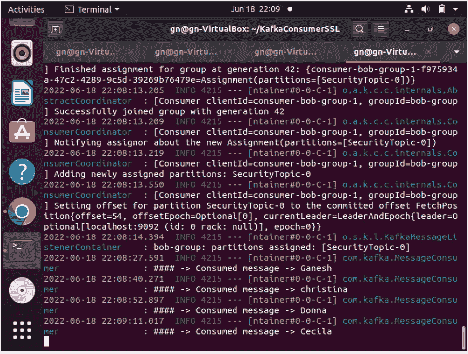

Consumer Application: Spring Boot

# 卡夫卡 CLI

## 控制台生产商

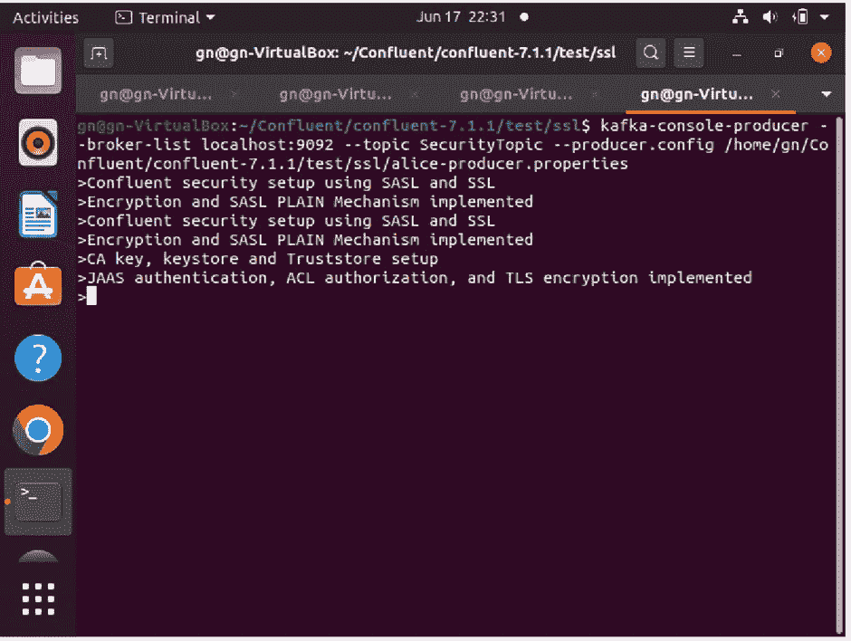

console producer

## 控制台消费者

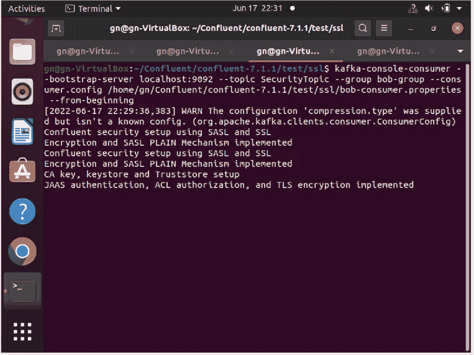

console consumer

# 结论

总结本文，我们已经看到了如何使用 SASL 机制和 TLS 实现 Kafka 安全性。认证和授权分别通过 JAAS 配置和 ACL 实现。我们还创建了 SSL 密钥和证书，并在密钥库和信任库中启用它们。我们还实现了 Kafka CLI 和 Java Spring boot 应用程序，供生产者和消费者通过认证、授权和加密发送消息。

***发表于 2022 年 6 月 19 日***

**其他媒体文章，*作者*加内什·纳加林加姆**

[*异步 WebSocket 消息中间件和微服务*](/nerd-for-tech/asynchronous-websocket-messaging-middleware-and-microservices-1a50a8f14e4b)

[使用 JAPA 访问者模式探索语法树和补救代码气味](/geekculture/quest-syntax-tree-and-remedy-code-smell-using-japa-visitor-patterns-f023a89842cf)

[*通过 CORS*](/geekculture/amalgamate-angular-with-spring-cloud-architecture-through-cors-7f13b5fdb98f) 将棱角与春云建筑融合

[多代理洞察 Apache Kafka 集群架构](/geekculture/multi-broker-insights-into-apache-kafka-cluster-architecture-617b0abfc53e)

[*远程队列定义:IBM MQ v9.2*](https://ganeshblog.medium.com/remote-queue-definition-ibm-mq-v9-2-c3ec4f568dab?source=user_profile---------5----------------------------)

[*Kubernetes Pods&Docker Containers:在 Windows 10 Home 中使用虚拟盒子旋转虚拟机*](https://ganeshblog.medium.com/kubernetes-pods-docker-containers-spin-vm-using-virtual-box-in-windows-10-home-d3be783ff087?source=user_profile---------0----------------------------)

[*联邦 OKTA IdP + WSO2 API Manager 作为 Spring boot 微服务集成的网关*](https://ganeshblog.medium.com/federate-okta-idp-wso2-api-manager-as-gateway-to-spring-boot-microservices-integration-ba567567e81?source=user_profile---------1----------------------------)

[*集成 IBM 业务流程管理器和混合 MobileFirst 应用*](https://ganeshblog.medium.com/integrate-ibm-business-process-manager-with-hybrid-mobilefirst-application-5aed20841bf3?source=user_profile---------2----------------------------)

[*Kerberos V5:Windows 10 Home 中使用 Apache directory studio 的 SSO 认证*](https://ganeshblog.medium.com/kerberos-v5-sso-authentication-in-windows-10-home-using-apache-directory-studio-fb0151899185?source=user_profile---------3----------------------------)

[*整合服务提供商(SPs)与 OKTA 身份提供商(IdP)*](https://ganeshblog.medium.com/integrate-service-providers-sps-with-okta-identity-provider-idp-ce64a4e262ae?source=user_profile---------4----------------------------)

[*将 IBM WebSphere Service Registry and Repository 与 IBM Process Server*](https://ganeshblog.medium.com/integrate-ibm-websphere-service-registry-and-repository-with-ibm-process-server-f97eeb0e2ea?source=user_profile---------6----------------------------) 集成