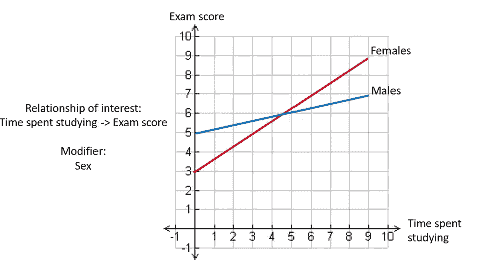
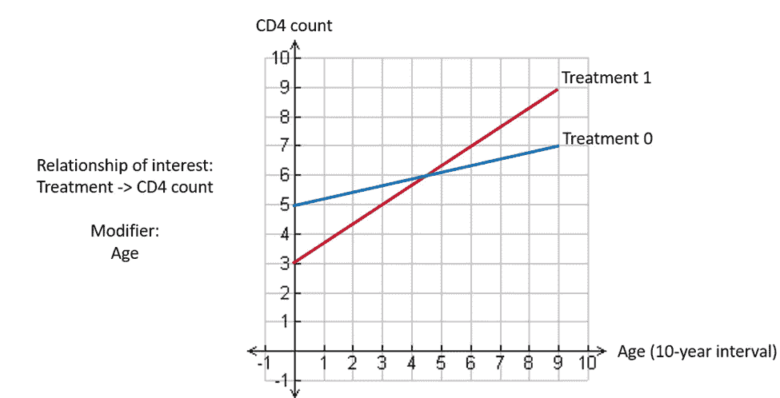
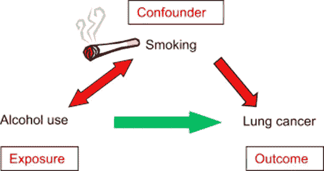
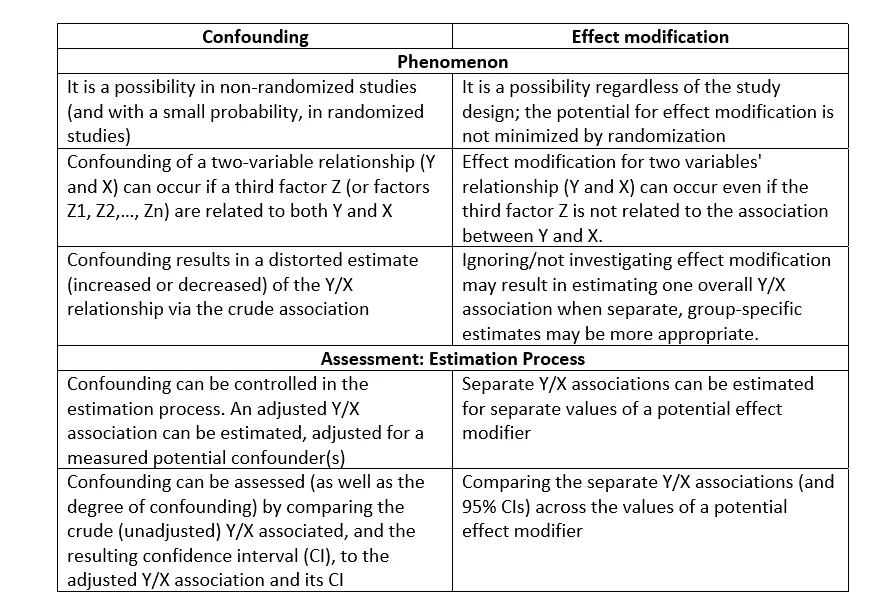

# 解释建模中的混淆和修改

> 原文：<https://medium.com/geekculture/confounding-and-modification-in-modelling-explained-c37dbe7b40ff?source=collection_archive---------11----------------------->

你听说过混淆和修改吗，想了解一下吗？还是出于好奇点了这个链接？然后，坚持住！这将是一个简短而精确的介绍，以了解建模中的混淆和修改。

最近，我了解了混杂和效应修正以及它们对建模和结果解释的影响。我想写一篇 3 系列的文章来揭开这些概念的神秘面纱，包括一个混杂的说明性例子和一个案例研究的效果修改。

这将是这个系列的第一篇，这篇文章将深入浅出地解释我们所说的修改和混淆是什么意思，同时强调对建模的影响。当混杂时，效应修正影响扭曲了不同组之间的暴露和结果之间的关系或关联的性质。术语“暴露”广义上是指可以解释或预测研究结果的任何特征[1]。

例如，患者的吸烟状态可能是暴露，结果可能是疾病，例如心血管疾病(CAD)。因此，我们可能有兴趣知道患者的性别是否改变或混淆了患者的吸烟状况与他们是否患有 CAD 之间的关系。

另一个例子是，观察诸如入院来源和/或患者就诊次数等因素是否是作为暴露的血红蛋白 A1c (HbA1c)水平与作为结果的糖尿病药物治疗是否有变化之间关系的潜在修饰因素或混杂因素。

> **注意:血红蛋白 A1c 测试会告诉您过去 2 至 3 个月的平均血糖水平。它也被称为 HbA1c、糖化血红蛋白试验和糖化血红蛋白。**

我认为这是我们今天讨论的一个很好的开场白。让我们直接进入这里的内容。如果你准备好了，那么，我们开始吧。

## **什么是效果修改？**

效应修正论及暴露-结果关联的异质性，它取决于一些外部变量的值。例如，如果性别改变，我们预计男性与女性的接触结果关联会有所不同。当有两个以上的水平时，我们期望在分类变量的每个水平有不同的暴露-结果关联。简而言之，当关联的[度量](https://www.cdc.gov/csels/dsepd/ss1978/lesson3/section5.html)在不同阶层(群体)之间有很大差异时，就会发生效应修正。

在这种情况下，关联的性质在不同的亚组和总体人群中会有所不同(有时差别很大)(见图 1 和图 2)。当暴露 X 和结果 Y 之间的关联可以依赖于另一个变量 Z，并且 Z 不必与 X 和/或 Y 直接相关时，就会发生这种情况。

**Figure 1:** Modification of the relationship between time spent studying and exam score by sex (a categorical variable)

**Figure 2:** Modification of the relationship between treatment received and CD4 count by age (a continuous variable)

> **注意:CD4 计数是一项检测血液中 CD4 细胞数量的测试。简而言之，CD4 计数越高，免疫系统就越健康。**

显然，图 1 和图 2 说明了暴露-结果关系可以通过分类变量和连续变量进行修改。

可能出现的问题是，**我们如何知道修改的存在？**

让我问你一个问题来解释这个。从图 2 来看，你认为哪种治疗方法更好？(假设较高的 CD4 计数意味着更好的治疗)。

我猜你会回答说，在 45 岁之前，0 号治疗更好。然而，在 45 岁以后，治疗 1 成为更好的治疗。简单来说，这意味着治疗 0 似乎对年轻人更好，治疗 1 对老年人更好。

你能想象如果我们不考虑治疗和给定年龄的 CD4 计数之间的差异，会发生什么样的临床错误吗？

因此，当不同 Z 值的单独 Y/X 关系更好地描述了所研究的现象时，忽略效果修改器会导致为每个人估计一个整体 Y/X 关系。

你还在跟踪讨论吗？如果没有，请退一步，消化一下刚才读到的内容。如果是，那么我们可以继续讨论混杂。

## **什么是混杂？**

简单地说，混杂是一个外来变量对暴露-结果关联的扭曲。例如，如果性别混淆，我们预计男性和女性的暴露-结果关联相同，但如果不考虑性别，我们会看到不同的关联。简单地说，关联的[度量](https://www.cdc.gov/csels/dsepd/ss1978/lesson3/section5.html)(可能是比值、比值比等。)在不同的阶层(群体)中是相似的，但是联合的集合量度不同于联合的粗略量度。

更专业地说，混杂有时被称为[辛普森悖论](https://plato.stanford.edu/entries/paradox-simpson/)，是一种暴露 X 和结果 Y 之间的真实关系或关联被另一个潜伏(隐藏)变量 Z(或变量 Z1，Z2，…，Zn)扭曲的现象。如果 Z 与 X 和 Y 都相关，就会发生这种情况。在这种情况下，我们可以将 Z 视为患者的吸烟状况，将 X 视为饮酒情况，将 Y 视为患者是否患有肺癌(见图 3)。

从图 3 中，我们看到患者的吸烟状况与饮酒和肺癌有关。然而，辛普森悖论是混淆的一个特殊和极端的例子，因为不是所有的混淆都可以这样描述。

然而，为了发生混杂，这三件事必须发生[2]:

1.  混杂因素(或变量)必须与感兴趣的风险因素(暴露)和结果的**相关联。**
2.  混杂因素必须在被比较的组中不均匀地分布(不平衡)。
3.  混杂因素不可能是从兴趣暴露到兴趣结果的因果路径中的中间步骤。

**Figure 3:** An example of a patient’s smoking status confounding the relationship between lung cancer and alcohol use (**Source:** [https://www.sciencedirect.com/topics/pharmacology-toxicology-and-pharmaceutical-science/confounder](https://www.sciencedirect.com/topics/pharmacology-toxicology-and-pharmaceutical-science/confounder))

**总之，虽然效果修改是“自然”、“环境”或“设置”的功能，混杂有时是研究设计的功能。**点击[此处](https://www.ncbi.nlm.nih.gov/books/NBK470342/)了解更多关于流行病学研究设计的想法。

通常，我们希望研究暴露-结果关系；然而，我们担心这种研究可能需要考虑其他特征。经验法则是，当各层之间的关联测量值大致相同(相似),且合并的关联测量值与原始值相似时，则没有修改或混杂的证据，否则就存在混杂。

**接下来，我来快速说说调整。**

调整是一种在存在混杂变量的情况下进行组间可比比较的方法。校正提供了一种机制，用于在去除来自一个或多个混杂因素的潜在失真后估计暴露-结果关系。对比原始估计值和调整后的关联估计值有助于识别混淆**(我们将在说明性示例中看到更多这种情况)**。

**大讨论到目前为止，对吧？**

既然我已经向您介绍了混淆和修改对建模的影响，我认为应该概述一些可能的解决混淆和修改的方法。

## **混杂和修改的可能解决方案**

这些建模问题有几种解决方案，但我在下面重点介绍了其中一些:

1.通过设计一个随机的研究可以减少混淆

基本上，随机研究是将参与者随机分配到不同的组(例如实验组或对照组)。随机化是控制和防止混杂的有力方法。回想一下，当组间不平衡时，混淆可能发生。

**问题是——随机化如何解决不平衡的问题？**

例如，如果参与者通过随机方法被分配到组中，该随机方法给出了在任何组中的均等机会，那么很可能这些组将具有相似的年龄、性别、行为以及几乎所有其他已知和未知的可能混杂因素的分布。此外，研究人员可以通过比较他们的基线特征来了解随机化是否成功地在各组之间建立了可比性[2]。

2.关键关系的潜在混杂因素必须在研究开始前概念化，并且必须作为研究的一部分进行测量。

3.由于效果修改不受研究设计的影响，因此，在设计研究之前，了解任何潜在的感兴趣的效果修改可能是有用的

4.通过分别查看每个 Z 水平的 Y/X 关联来评估是否存在影响修正，并确定是否至少有一些关联不同。常用的方法包括分层分析和基于回归的方法。

为此可以使用各种方法。例如，Cochran-Mantel-Haenszel 方法[3]用于分层分析。要了解分层分析是如何使用的，你可以阅读这篇全面的[文章](https://sphweb.bumc.bu.edu/otlt/mph-modules/bs/bs704-ep713_confounding-em/bs704-ep713_confounding-em_print.html) [2]。在下一篇文章中，我将更详细地探索使用逻辑回归来评估使用 R 和 STATA 的修改和混杂。

**上面概述的解决方案是一些可以考虑的建议。最后，让我们检查混杂和效果修改之间的一些差异**

**表 1:** 混杂和效应修正的区别

**Source:** Week 3 of the [Simple Regression Analysis in Public Health](https://www.coursera.org/learn/simple-regression-analysis-public-health/home/welcome) Course on Coursera[4]

本文是对这些概念的高级介绍。我相信你花时间学习修改和混淆是值得的— **我想这是为你增加的额外知识！请在下面的评论区留下您的评论，并与他人分享这篇文章。如果你喜欢这篇文章，如果你能点击“鼓掌”图标(最多允许 50 次鼓掌)，这将对我意义重大。**

下一篇文章超级详细地介绍了如何使用基于回归的方法，即使用 R 和 STATA 的逻辑回归模型来评估修改和混杂。如果你想看看，请点击[这里](https://arimoroolayinka.medium.com/a-case-study-assessing-confounding-and-modification-using-logistic-regression-in-r-and-stata-2be659cbb813)。

感谢您花时间阅读这篇文章！下次见！

**参考文献**

1.  Kestenbaum，B. (2019)。人口、暴露和结果。流行病学和生物统计学。斯普林格，查姆。[https://doi.org/10.1007/978-3-319-97433-0_2](https://doi.org/10.1007/978-3-319-97433-0_2)
2.  混淆和效应测量修正。改编自网址:[https://SPH web . bumc . bu . edu/otlt/mph-modules/bs/bs 704-EP 713 _ confing-em/bs 704-EP 713 _ confing-em _ print . html](https://sphweb.bumc.bu.edu/otlt/mph-modules/bs/bs704-ep713_confounding-em/bs704-ep713_confounding-em_print.html)
3.  Cochran–Mantel–Haenszel statistics(维基百科):https://en . Wikipedia . org/wiki/Cochran–Mantel–Haenszel _ statistic
4.  [麦克格雷迪](https://www.coursera.org/instructor/johnmcgready) J .公共卫生中的简单回归分析。网址:[https://www . coursera . org/learn/simple-regression-analysis-public-health/home/info](https://www.coursera.org/learn/simple-regression-analysis-public-health/home/info)