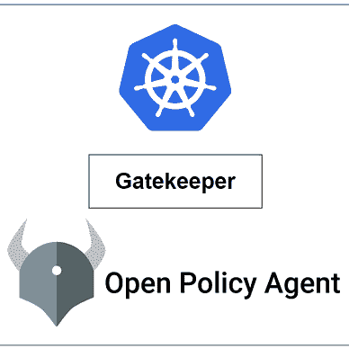

# 库伯内特斯

> 原文：<https://medium.com/geekculture/conftest-kubernetes-9a064c302d43?source=collection_archive---------5----------------------->

## Kubernetes 中 Conftest 的用法


Photo by [Clint Adair](https://unsplash.com/ja/@clintadair?utm_source=medium&utm_medium=referral) on [Unsplash](https://unsplash.com?utm_source=medium&utm_medium=referral)

[](https://www.conftest.dev/)**是一个针对 kubernetes 配置的单元测试框架。它使用 [rego 语言](https://www.openpolicyagent.org/docs/latest/policy-language/)来编写政策。并帮助我们针对结构化的配置数据编写测试。**

## **安装— Linux**

```
LATEST_VERSION=$(wget -O - "https://api.github.com/repos/open-policy-agent/conftest/releases/latest" | grep '"tag_name":' | sed -E 's/.*"([^"]+)".*/\1/' | cut -c 2-)
wget "https://github.com/open-policy-agent/conftest/releases/download/v${LATEST_VERSION}/conftest_${LATEST_VERSION}_Linux_x86_64.tar.gz"
tar xzf conftest_${LATEST_VERSION}_Linux_x86_64.tar.gz
sudo mv conftest /usr/local/bin
```

**其他操作系统的安装过程— [安装过程](https://www.conftest.dev/install/)**

## **政策:**

**让我们创建一个目录来存储策略。默认情况下， **conftest** 在 **/root/policy** 目录下查找策略。但是我们也可以将策略存储在不同的目录中，然后在运行 conftest 时传递目录路径。**

```
# Create new directory to srore policies
>> mkdir -p conftest/policy
```

**假设我们想要拒绝 kubernetes 集群上的" **NodePort** "类型服务。为此，我们可以使用以下 rego 策略:**

```
# /conftest/policy/nodeport-service-deny.rego

package main

deny[msg] {
  input.kind = "Service"
  input.spec.type = "NodePort"
  msg = "NodePort Service is not Allowed"
}
```

## **k8s-清单**

**下面是我们要测试的服务清单文件:**

```
# k8s/srv-test.yaml

apiVersion: v1
kind: Service
metadata:
  labels:
    app: test
  name: srv-test
spec: 
  type: NodePort
  selector:
    app: test
  ports:
  - port: 80
    protocol: TCP
    targetPort: 80
    nodePort: 32000
```

## **试验**

**现在，让我们为上面定义的服务清单文件运行 conftest:**

```
#                  [Policy Path]      [K8s Manifest]
>> conftest test -p conftest/policy/  k8s/srv-test.yaml 

FAIL - k8s/srv-test.yaml - main - NodePort Service is not Allowed

1 test, 0 passed, 0 warnings, 1 failure, 0 exceptions
```

**在上面的演示中，我们可以看到测试**失败**。因为我们使用了“**节点端口**”类型的服务。现在让我们将“**节点端口**”服务改为“**负载平衡器**”，看看我们的策略如何反应。**

```
# k8s/srv-test.yaml

apiVersion: v1
kind: Service
metadata:
  labels:
    app: test
  name: srv-test
spec: 
  type: LoadBalancer   #<-----
  selector:
    app: test
  ports:
  - port: 80
    protocol: TCP
    targetPort: 80
    nodePort: 32000
```

**现在，让我们再做一次测试:**

```
#                  [Policy Path]      [K8s Manifest]
>> conftest test -p conftest/policy/ k8s/srv-test.yaml 

1 test, 1 passed, 0 warnings, 0 failures, 0 exceptions
```

****太好了！**我们可以看到，这一次 k8s 服务清单文件已经通过了 conftest 测试。**

**关于这些政策的更多示例可在此处找到— [常见示例](https://github.com/open-policy-agent/conftest/tree/master/examples/kubernetes)**

> ***如果你觉得这篇文章很有帮助，请点击* ***关注*** *👉******拍手*** *👏* *按钮帮助我写更多这样的文章。
> 谢谢🖤*****

## ****🚀👉关于 Kubernetes 的所有文章****

****

[Md 沙米姆](/@shamimice03?source=post_page-----9a064c302d43--------------------------------)**** 

## ****关于 Kubernetes 的所有文章****

****[View list](/@shamimice03/list/all-articles-on-kubernetes-7ae1a0f96f3b?source=post_page-----9a064c302d43--------------------------------)********24 stories****************************