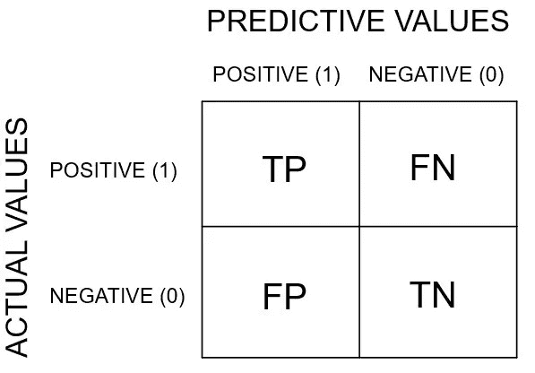
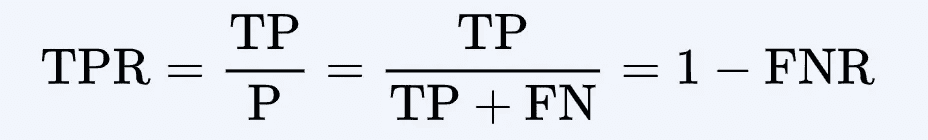
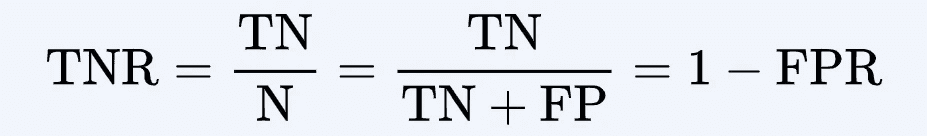
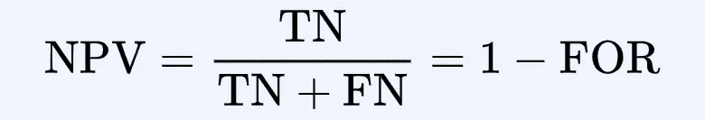
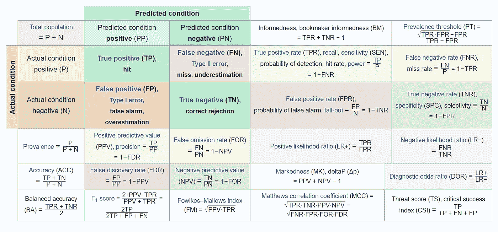
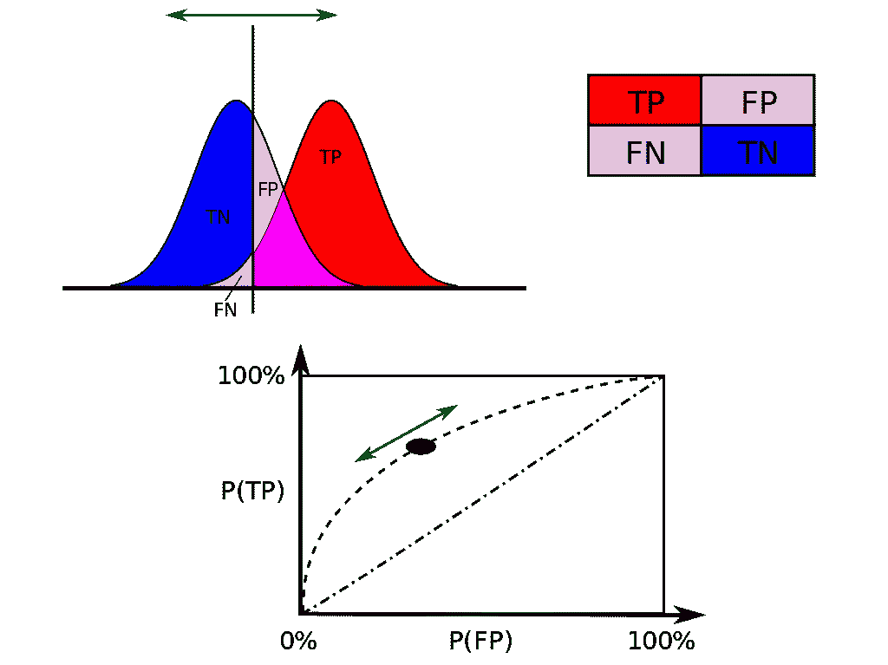

# 从网络安全分析师的角度看混淆矩阵

> 原文：<https://medium.com/geekculture/confusion-matrix-from-a-cybersecrurity-analyst-perspective-920cff078411?source=collection_archive---------24----------------------->

在本文中，我们将讨论网络安全分析师为了使他们的系统更安全而使用的混淆矩阵。

2017 年 5 月，一场令人讨厌的网络攻击在短短几天内袭击了 150 个国家的 20 多万台计算机。它被称为“WannaCry”，利用了一个最早由美国国家安全局(NSA)发现的漏洞，后来被窃取并在网上传播。

它是这样工作的:在成功入侵一台电脑后，WannaCry 加密了那台电脑的文件，使它们无法读取。为了恢复他们被囚禁的资料，被攻击的目标被告知他们需要购买特殊的解密软件。猜猜谁卖了那个软件？没错，袭击者。

Source: Wikipedia

所谓的“**勒索软件**”攻击影响了个人和大型组织，包括英国国家医疗服务系统、俄罗斯[银行](https://builtin.com/cybersecurity/cybersecurity-banking-financial-services)、中国学校、西班牙电信巨头 Telefonica 和美国快递服务公司 FedEx。据估计，总损失接近 40 亿美元。

Source: Splunk

其他类型的网络入侵，如“密码劫持”，更加阴险，破坏性更小，但仍然代价高昂。密码劫持是一种网络犯罪分子在多台计算机或服务器上传播恶意软件的技术。黑客控制一台机器的处理能力来挖掘加密货币——这个过程贪婪地消耗计算能力和电力——然后将密码发送回犯罪者。

即使是拥有强大[网络安全](https://builtin.com/cybersecurity)协议的知名公司也不能幸免，正如[特斯拉 2018 年的恐慌](https://www.wired.com/story/cryptojacking-tesla-amazon-cloud/)所证明的那样，多亏了一个警惕的第三方网络安全专家团队，这一恐慌才得以补救。

# 什么是网络犯罪？

***网络犯罪是针对或使用计算机、计算机网络或联网设备的犯罪活动。*** 大部分但不是全部网络犯罪都是网络罪犯或黑客为了赚钱而犯下的。网络犯罪是由个人或组织实施的。

一些网络犯罪分子有组织，使用先进的技术，技术高超。其他都是黑客新手。很少，网络犯罪的目的是破坏计算机的原因，而不是利润。这些可能是政治的，也可能是个人的。

Source: Giphy

# 网络犯罪的类型

以下是不同类型网络犯罪的一些具体例子:

*   ***电子邮件和网络诈骗。***
*   ***身份欺诈(个人信息被窃取并使用)。***
*   ***窃取金融或卡支付数据。***
*   ***窃取和出售企业数据。***
*   ***网络勒索(索要钱财以阻止威胁攻击)。***
*   ***勒索软件攻击(一种网络勒索)。***
*   ***加密劫持(黑客利用自己不拥有的资源挖掘加密货币)。***
*   ***网络间谍(黑客获取政府或公司数据)。***

大多数网络犯罪分为两大类:

*   ***针对*** 的犯罪活动
*   ***利用计算机实施其他犯罪的犯罪活动。***

Source: Giphy

# 网络安全中的机器学习

机器学习已经成为网络安全的一项重要技术。机器学习通过模式检测、实时网络犯罪绘图和彻底的渗透测试，先发制人地消除网络威胁并支持安全基础设施。

## **什么是混淆矩阵，为什么我们需要它？**

*领域中的* [*机器学习*](https://en.wikipedia.org/wiki/Machine_learning) *以及具体问题的* [*统计分类*](https://en.wikipedia.org/wiki/Statistical_classification) *，一个* ***混淆矩阵*** *，也称为误差矩阵，是一个特定的表格布局，允许可视化的表现一个算法，典型的有* [*监督学习*](https://en.wikipedia.org/wiki/Supervised_learning) *一(在*矩阵)**的每一行代表实际类中的实例，而每一列代表预测类中的实例，反之亦然——两种变体都可以在文献中找到。该名称源于这样一个事实，即很容易看出系统是否混淆了两个类别(即通常将一个类别错标为另一个类别)。**

***是一种特殊的** [**列联表**](https://en.wikipedia.org/wiki/Contingency_table) **，有两个维度(“实际”和“预测”)，两个维度中有相同的“类”集合(每个维度和类的组合都是列联表中的一个变量)。***

**简单点说吧。当我们得到数据，经过数据清洗、预处理和争论后，我们做的第一步是将它输入到一个优秀的模型中，当然，还要得到概率输出。但是坚持住！我们到底如何衡量我们模型的有效性。效果越好，性能越好，这正是我们想要的。这也是混淆矩阵引人注目的地方。* ***混淆矩阵是机器学习分类的一种性能度量*** *。**

**

*Source: Google*

****混淆矩阵呈现分类问题的预测和结果的不同结果的表格布局，并帮助可视化其结果。它绘制了一个分类器的所有预测值和实际值的表格。****

**

*Source: Google*

## *术语学与混淆矩阵的推导*

*   ***【P】** *条件阳性数据中的实际阳性病例数。**
*   ***条件阴性(N)** *数据中真实的阴性病例数。**
*   ***真正(TP) |命中** *正预测值与实际值同样为真的总次数。例如:受到危害并被正确预测的系统。**
*   ***真阴性(TN) |正确拒绝** *阴性预测值对实际值同样成立的总次数。例如:未受损且预测正确的系统。**
*   ***假阳性(FP) | F** [**alse 报警**](https://en.wikipedia.org/wiki/False_alarm)**| T**[**type I 误差**](https://en.wikipedia.org/wiki/Type_I_error) **|低估** *预测值为正而实际值为负的总次数。例如:未受损但被预测为受损的系统。**
*   ***假阴性(FN)| Miss | T**[**type II 误差**](https://en.wikipedia.org/wiki/Type_II_error) **|高估** *预测值为负而实际值为正的总次数。例如:已经受损但被预测为未受损的系统。**
*   *****| R**[**ecall**](https://en.wikipedia.org/wiki/Precision_and_recall#Recall)**| H**[**It Rate**](https://en.wikipedia.org/wiki/Hit_rate)**| T**[**rue 阳性率**](https://en.wikipedia.org/wiki/Sensitivity_(test))**(TPR)** *它衡量阳性的比例****

******

*   ***)****|**[**选择性**](https://en.wikipedia.org/wiki/Specificity_(tests)) **|** [**真阴性率**](https://en.wikipedia.org/wiki/Specificity_(tests))**【TNR】** *它衡量的是被正确识别的阴性的比例(即不具备条件(未受影响)的人被正确识别为不具备条件的比例)。******

**********

*   *****[**精度**](https://en.wikipedia.org/wiki/Information_retrieval#Precision) **|** [**正预测值**](https://en.wikipedia.org/wiki/Positive_predictive_value)**(PPV)** *它是检索到的实例中相关实例的分数。经过完美测试，PPV 的理想值是 1 (100%)，最差可能值是零。是* [*误发现率*](https://en.wikipedia.org/wiki/False_discovery_rate) *(FDR)的补码。******

**********

*   *****[**阴性预测值**](https://en.wikipedia.org/wiki/Negative_predictive_value)**【NPV】** *它被定义为假阴性病例数与总阴性病例数的比值。对于完美的测试，即不返回假阴性的测试，NPV 值为 1 (100%)，而对于不返回真阴性的测试，NPV 值为零。它是误漏率的补充(为)。******

**********

*   *****[**准确度**](https://en.wikipedia.org/wiki/Accuracy) **(ACC)** *准确度也用作一种统计度量，用于衡量* [*二元分类*](https://en.wikipedia.org/wiki/Binary_classification) *测试正确识别或排除某个条件的程度。即准确率是正确预测(既有* [*真阳性*](https://en.wikipedia.org/wiki/True_positive) *又有* [*真阴性*](https://en.wikipedia.org/wiki/True_negative) *)占检查病例总数的比例。因此，它比较了* [*测试前和测试后概率*](https://en.wikipedia.org/wiki/Pre-_and_post-test_probability) *的估计值。为了通过语义使上下文清楚，它通常被称为“Rand 准确度”或“*[*”Rand 指数*](https://en.wikipedia.org/wiki/Rand_index) *”。这是测试的一个参数。******

**********

## *******可以从二级混淆矩阵中确定的详细图表。*******

**********

*****Source: Wikipedia*****

# *****两种错误*****

*****在[统计测试理论](https://en.wikipedia.org/wiki/Statistical_hypothesis_testing)中，[统计误差](https://en.wikipedia.org/wiki/Errors_and_residuals)的概念是[假设检验](https://en.wikipedia.org/wiki/Hypothesis_Testing)的一个组成部分。这个测试选择了两个相互竞争的命题，称为无效假设(T7)，由 H0 表示，以及替代假设(T8)，由 H1 表示。这在概念上类似于法庭审判中的判决。零假设对应于被告的立场:正如在被证明有罪之前，他被假定是无辜的一样，在数据提供令人信服的证据之前，零假设也被假定是真实的。另一种假设对应于对被告不利的立场。具体来说，零假设也包括没有差异或没有关联。因此，无效假设永远不可能是存在差异或关联。*****

*****如果测试的结果与现实相符，那么就做出了正确的决定。然而，如果测试的结果与现实不符，那么就出现了错误。有两种情况下决策是错误的。零假设可能是真的，而我们拒绝 H0。另一方面，另一个假设 H1 可能是正确的，而我们并不排斥 H0。*****

## *******第一类错误*******

*****第一种错误是拒绝一个真正的零假设作为测试程序的结果。这种错误称为 I 型错误(假阳性)，有时也称为第一类错误。*****

## *******第二类错误*******

*****第二种错误是未能拒绝一个错误的零假设作为测试程序的结果。这种错误称为第二类错误(假阴性)，也称为第二类错误。*****

*****如你所见，根据问题陈述**的不同，第一类错误可能比第二类错误更好，反之亦然。**犯这两类错误的几率是成反比的，降低 I 类错误率增加 II 类错误率，反之亦然。犯第一类错误的风险由你的阿尔法水平( [*p* 值](/acing-ai/top-ai-interview-questions-answers-acing-the-ai-interview-61bf52ca34d4)表示，低于这个值你拒绝零假设。此处阅读更多。普遍接受的α = .05 意味着你会在大约 5%的时间里错误地拒绝零假设。为了减少犯 I 型错误的机会，您可以使您的 alpha (p)值更严格。或者，你也可以增加样本量。*****

*****类似地，如果我们的数据集本质上是网络威胁分析，我们必须更多地站在不包含的一边。另一方面，像垃圾邮件过滤这样的事情需要不同的方法来处理这些错误。*****

**********

********从阴性样本获得的结果(左曲线)与从阳性样本获得的结果(右曲线)重叠。通过移动结果临界值(竖线)，可以降低假阳性率(FP)，代价是增加假阴性的数量(FN)，反之亦然。********

*****网络攻击检测是一个分类问题，我们从系统的异常模式(攻击)中分类出正常模式。*****

*****SDF 是一个非常强大和流行的数据挖掘算法，用于决策和分类问题。它在现实生活中有许多应用，如医疗诊断、雷达信号分类、天气预报、信贷审批和欺诈检测等。*****

*****针对网络攻击数据集的检测和分类，提出了一种并行支持向量机算法。*****

*****支持向量机的性能很大程度上取决于 SVM 使用的核函数。因此，我们以数据相关的方式修改高斯核函数，以提高分类器的效率。还获得了两个分类器的相对结果，以确定理论方面。分析还表明，PSVM 比自卫队表现更好。*****

*****PSVM 分类准确率显著提高(正常类和 DOS 类的准确率几乎为 100%)，且与虚警率和训练、测试次数相当。*****

# *****结论*****

*****机器学习在一些事情上做得非常好，例如快速扫描大量数据，并使用统计数据进行分析。网络安全系统会产生大量数据，因此该技术成为如此有用的工具也就不足为奇了。*****

*****网络安全公司 [Forcepoint](https://www.forcepoint.com/) 的首席研究和情报官 Raffael Marty 告诉 Built In:“我们有越来越多的可用数据，这些数据通常都在讲述一个故事。”。“如果你知道如何分析数据，你应该能够得出与标准的偏差。”*****

*****这些偏差有时会暴露出威胁。由于这一重要功能，机器学习的使用正在多个领域激增。它用于需要图像识别和语音识别的任务。它甚至在自己的游戏中击败了世界顶级围棋选手[。](https://deepmind.com/research/alphago/)*****

*****马蒂说，尽管它改善了网络安全，但人类仍然至关重要。*****

**********

*****“有一种承诺，你可以只看过去的数据来预测未来——忘记领域专业知识在这个等式中真的很重要，”他说。“有些人认为你可以从数据中学到一切，但那根本不是真的。”*****

*****马蒂补充说，在网络安全方面过度依赖人工智能会产生一种虚假的安全感。这就是为什么除了明智地应用算法，他的公司还雇佣了网络安全专家、数据科学家和心理学家。与所有当前的人工智能一样，机器学习补充并增强了人类的努力，而不是取代它们。*****

*****我希望你喜欢这篇文章，在未来，我会写很多文章解释机器学习和统计学的核心概念。*****