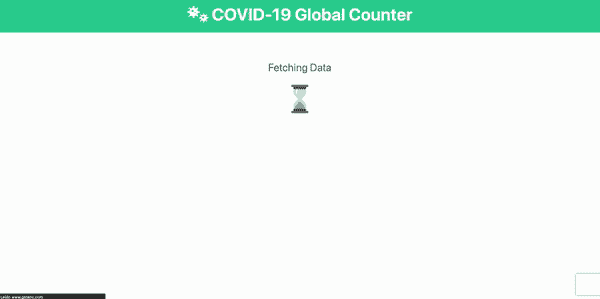
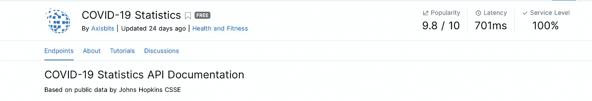
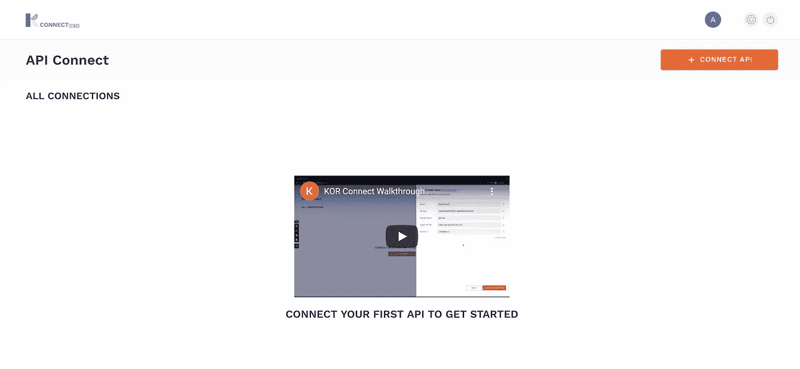
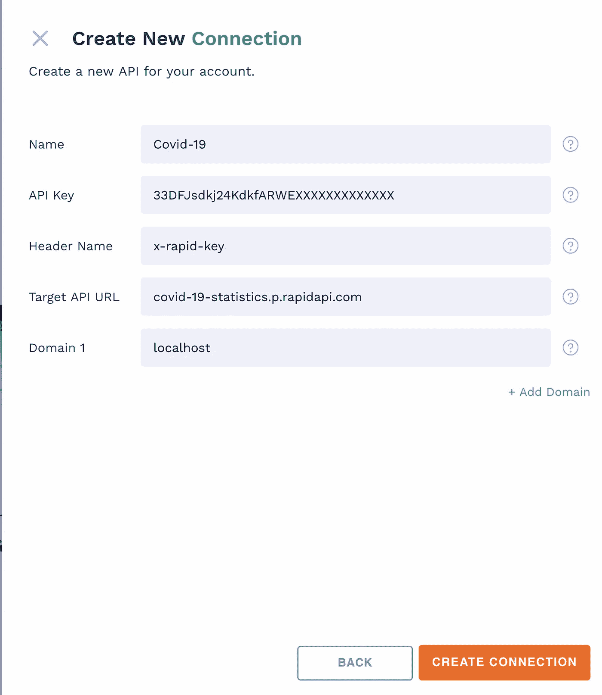
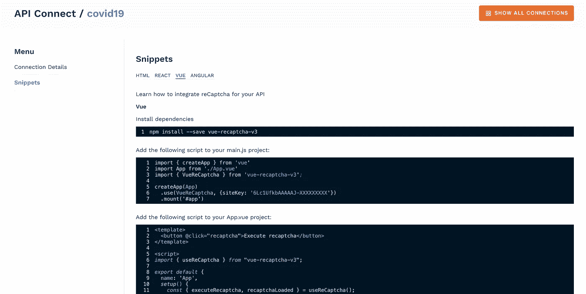
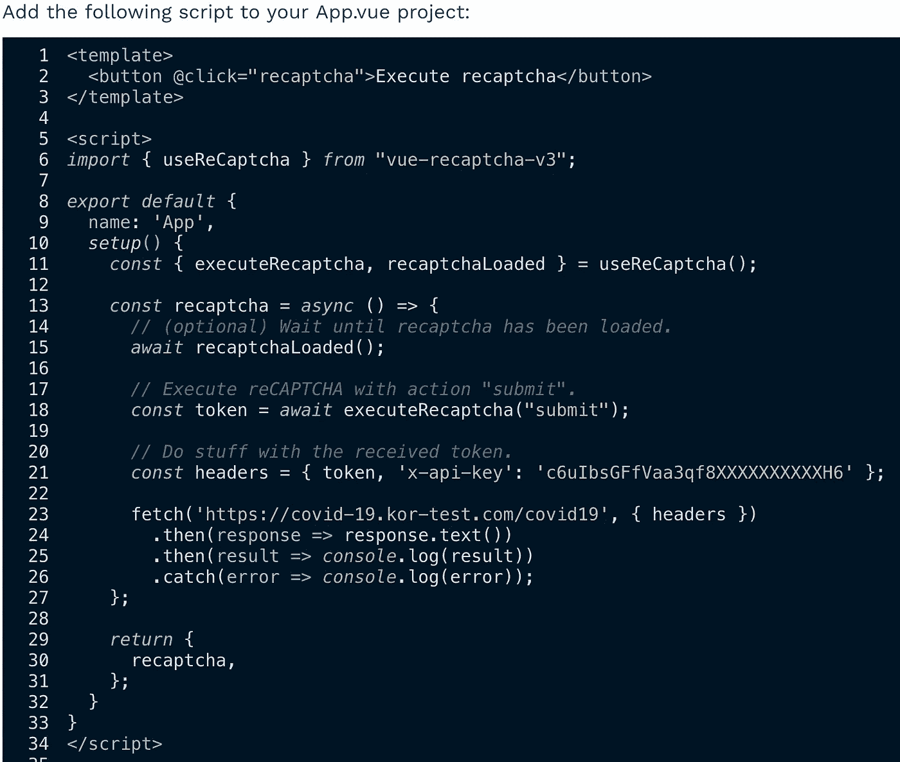
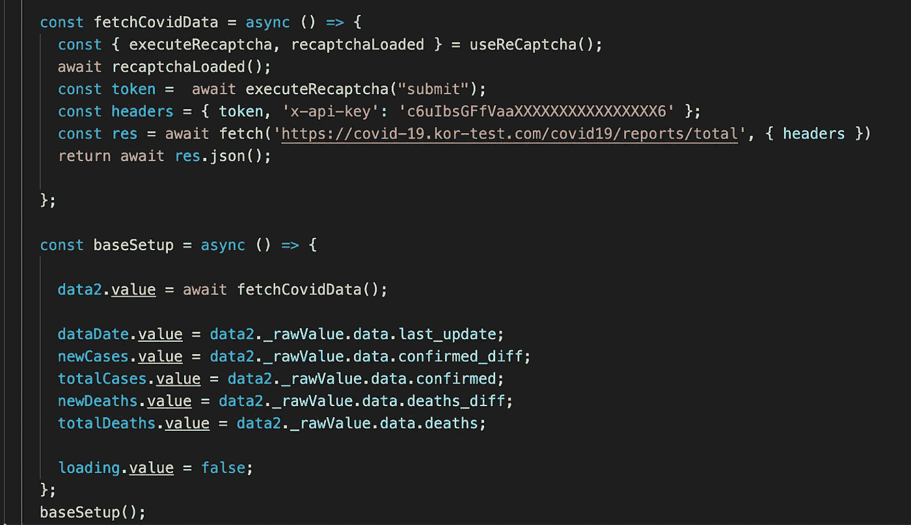
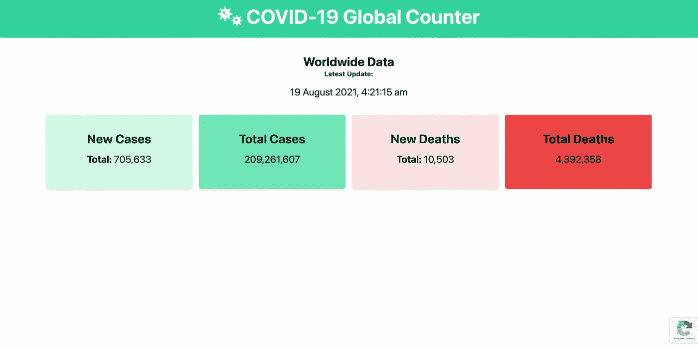

# 使用 KOR Connect 在没有后端的 VueJS 上连接 API

> 原文：<https://medium.com/geekculture/connect-apis-on-vuejs-with-no-backend-using-kor-connect-66f7cac8a71f?source=collection_archive---------41----------------------->



Final result

我想创造一个新冠肺炎追踪器已经有一段时间了；我想以一种消费 API 但没有后端的方式创建应用程序。为了做到这一点，我有几个选择。最初想到的方法是在静态网站上使用公共 API，但是在我的计划阶段，我遇到了 https://rapidapi.com。在这里，我发现了一系列不同的 Covid 数据 API 选项，警告是 API 需要认证。

我本可以构建一个小的后端，在那里处理身份验证，但是一个简单的新冠肺炎追踪者网络应用程序并不能保证这样的努力。

最后，我最终使用了 https://korconnect.io/的 T2，一个连接中间件，它允许你在没有后台的情况下连接 API。我是这样做的:

1.  我在 https://korconnect.io/的[创建了一个账户](https://korconnect.io/)
2.  还在[https://rapidapi.com/](https://rapidapi.com/)上创建了一个账户

首先，我需要选择一个 API 来消费。我决定使用约翰霍普金斯大学的公共数据:



[https://rapidapi.com/axisbits-axisbits-default/api/covid-19-statistics/](https://rapidapi.com/axisbits-axisbits-default/api/covid-19-statistics/)

我首先通过点击“ *+ Connect API* ”按钮在 KOR Connect 上创建一个 API 连接:



我添加了连接细节，所有这些信息都是直接从 RapidAPI 复制的。更多信息请点击这里:[https://kor-community . git lab . io/kor-connect/adir/get started . html](https://www.google.com/url?q=https://kor-comunity.gitlab.io/kor-connect/adir/GETSTARTED.html&sa=D&source=editors&ust=1629644412858000&usg=AOvVaw058RxrzKb3BqHUEyuoEFDI)



搞定了。建立连接后，我查看代码片段，看看如何在我的前端使用 API。在我的例子中，我想使用 VueJS 来创建我的跟踪器，所以我转到 VueJS snippets 部分并检索我需要的框架信息。



好了，都好了！现在，棘手的部分…制作网站。我没有太多在 React 或 Vue 上编码的经验，但我发现了一个很棒的视频教程，它带我构建了一个新冠肺炎跟踪器。

查看 Traversy Media 的这个优秀教程:[https://www.youtube.com/watch?v=m-MAIpnH9ag](https://www.youtube.com/watch?v=m-MAIpnH9ag)(这里是他的新冠肺炎追踪器[https://github.com/bradtraversy/vue-c...](https://www.youtube.com/redirect?event=video_description&redir_token=QUFFLUhqbWRjQ1pJMG1uUEc1c3gtNkJreVVZU1VrNi1xQXxBQ3Jtc0tuTmpURm00SktiSzRudG1TOVZOZ1p6d2JrenZzdjE4WlVnQ3ZFNm1mTG85ZXd2QUJyOHFHcUF2b0YzYkJsU2E4NEhSdFhHbzU1Y19SdG5FTEZIV0dhMkZlRFpVRFM0bEZhOW5lMEdwaXA3eXFPajhhSQ&q=https%3A%2F%2Fgithub.com%2Fbradtraversy%2Fvue-covid-tracker)的代码)。

值得注意的一点是，在该教程中，他使用了一个公共 API。所以我必须弄清楚如何在我的代码中使用 Kor Connect 片段。谢天谢地，这很容易！

首先，让我们看看 Kor Connect 是如何提供代码片段的:



KorConnect Snippet

我是这样把它整合到我的项目中的:



需要注意的是，我是如何用从 RapidAPI 收到的路径修改 KOR Connect URL 的。例如，要获得摘要报告，我需要将它添加到我的 URL 的末尾:

```
/reports/total
```

注意 API 提供者给你的路径，并把它们放在 KOR Connect URL 的末尾。

现在，所有的调用都可以对 KOR Connect 提供的链接进行，KOR Connect 将作为一个代理进行身份验证并发回 API 信息。此外，由于 reCaptcha enterprise 的(自动实现的)安全层阻止了一些恶意攻击媒介，这增强了 KOR Connects 的安全性。

最终的项目是什么样的？



最重要的是，对于这种快速安全的 API 消费，我不需要向公众公开我的 API 令牌，也不需要启动后端。