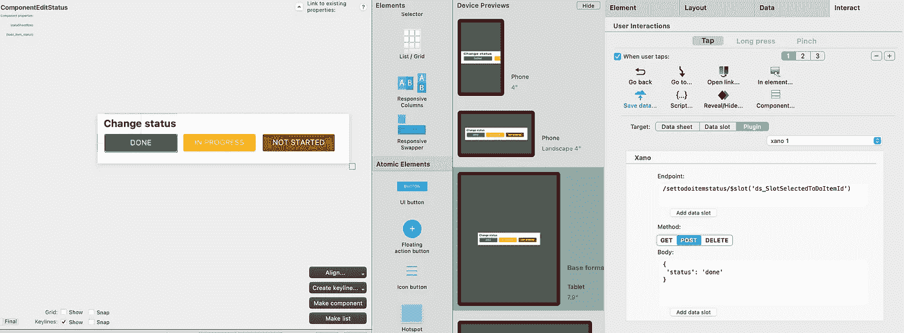
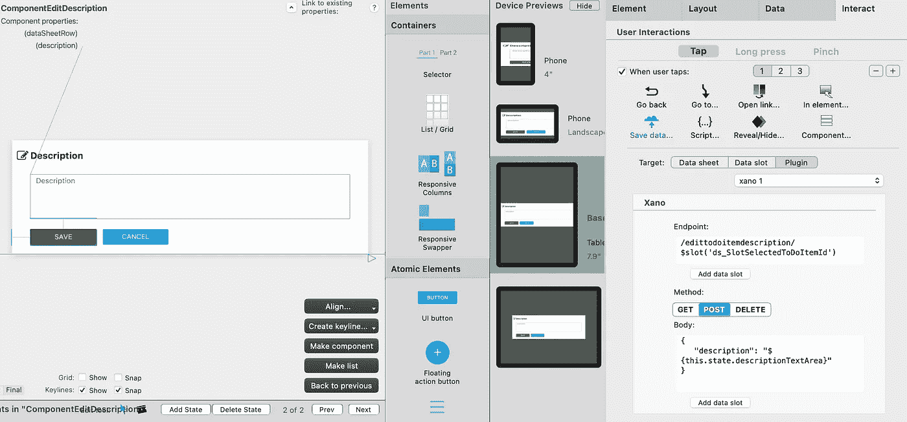
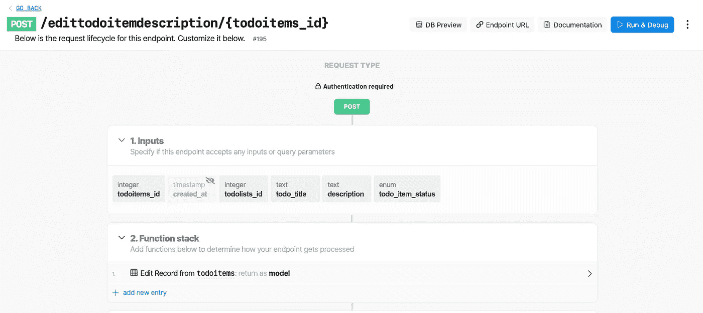
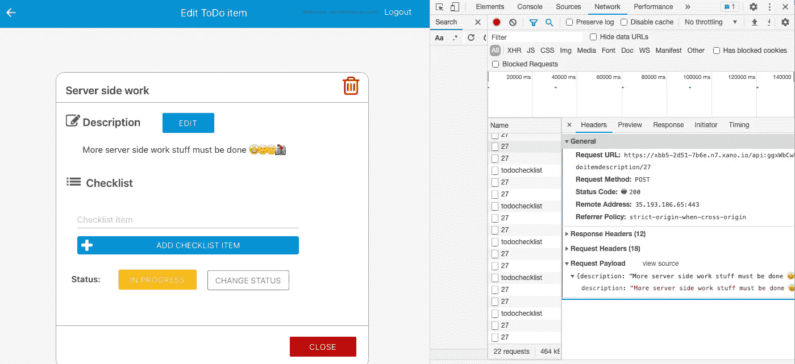
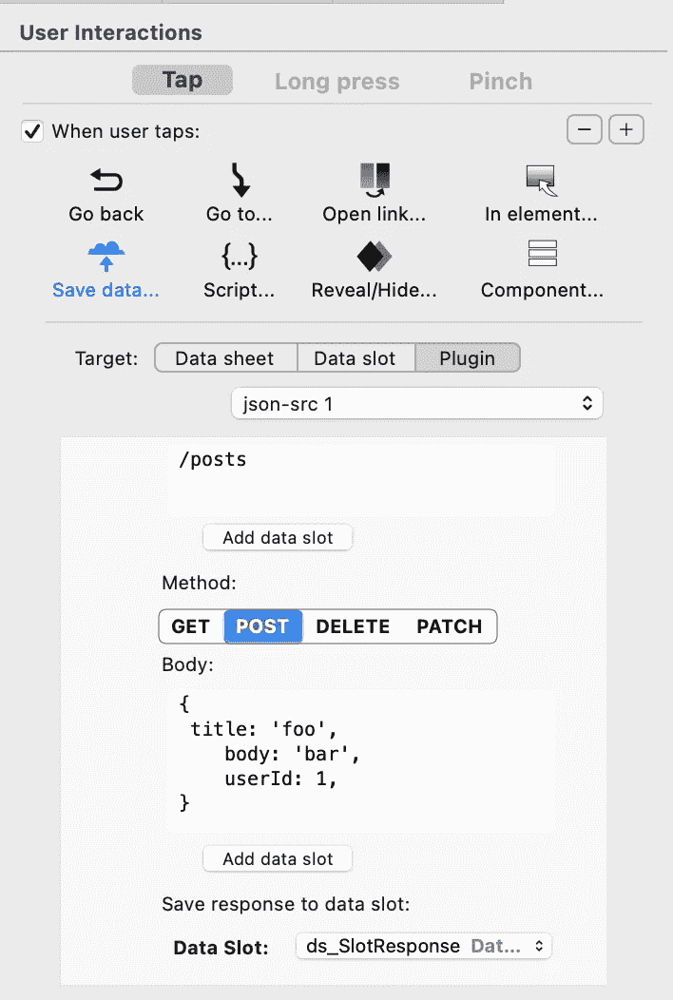

# 从 React Studio 连接到自定义 API 端点

> 原文：<https://medium.com/geekculture/connect-to-custom-api-endpoints-from-react-studio-4c451e1ffc1c?source=collection_archive---------11----------------------->



Example of Save data interaction with React Studio’s Xano plugin

您想触发服务器上的功能吗？需要更新数据库中的数据吗？以下是你如何在 React Studio 中做到这一点。

React Studio 使得从 API 加载数据到 app(数据表)变得很容易，但是用一个按钮交互调用某个 API 端点却有点棘手。我们已经发布了 Xano 和通用 JSON 插件交互插件的更新，它清除了调用任何 API 端点的复杂性。

## Xano-React Studio 插件

Xano 是一个非常棒的 NOCODE 后端构建器，它让 API 的创建变得有趣而简单。React Studio 预编译集成到 Xano 中，这意味着您可以轻松地将 React Studio 项目连接到 Xano 的后端。

[React Studio 的新 Xano 插件](/swlh/react-studio-xano-no-code-backend-builder-️-3f537a5d58d4?source=friends_link&sk=37536919dc365e033b8a8eafc39e311d)在**保存数据- >插件**-标签下提供新的交互。插件 UI 简单；您可以设置调用的**端点路径**(基本 url 已经在 Xano 插件设置中设置好了)和**方法** (GET、POST、DELETE)和**主体**。最后，如果你愿意，你可以将 API 响应保存到数据槽中。

您可以将变量和代码“注入”到 API 路径 url 和主体中，这使得交互非常灵活。添加数据槽非常容易；只需点击“添加数据槽”按钮，选择要注入字符串的数据槽。

在端点字段中，您还可以使用以下语法将属性和表单字段值添加到 API 调用中:

```
${this.props.propname}
${this.state.fieldname}
```

## API 调用示例



Example API call under Save data interaction

在上面的交互示例中，我们将按钮的 onclick 交互设置为向 Xano 后端的端点发出 API 请求。交互只是将表单 textarea 文本发送到端点，然后端点更新数据库中的描述文本。



The endpoint in Xano’s endpoint designer

```
The Xano's API endpoint shown above updates the description text for my Project management app's ToDo item.API call Settings:**Endpoint**/edittodoitemdescription/$slot(‘ds_SlotSelectedToDoItemId’)The path contains the fixed part and the Data slot value which is dynamically set in the UI when user clicks certain ToDo item.**Method of the request is POST****Body**In this case the body contains just one value which is the text area text in the UI.{
   'description': ${this.state.descriptionTextArea}
}
```

最后，在生成的应用程序中，请求如下所示



通用 JSON 插件也提供了相同的交互，因此您可以调用任何 API 端点。



Save response to Data slot

如果你想在你的应用程序上显示或使用 API 响应，你可以通过从插件的“保存响应到数据槽”部分选择数据槽来保存它。

## 将表单保存到数据库中

从[www.reactstudio.com](https://www.reactstudio.com)React 工作室论坛:[https://discuss.reactstudio.com/](https://discuss.reactstudio.com/)下载 React 工作室

[](/swlh/react-studio-xano-no-code-backend-builder-️-3f537a5d58d4) [## React Studio + Xano 无代码后端构建器= ❤️

### 我们有一些消息，你们所有的应用开发者都会喜欢的！

medium.com](/swlh/react-studio-xano-no-code-backend-builder-️-3f537a5d58d4)