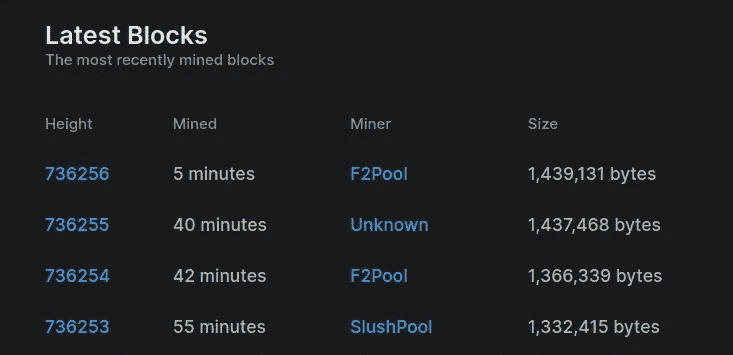

# 使用 Julia 连接到比特币网络

> 原文：<https://medium.com/geekculture/connect-to-the-bitcoin-network-using-julia-418c76fed393?source=collection_archive---------11----------------------->

## 一种访问实时区块链数据的简洁方法


Photo by [Shubham Dhage](https://unsplash.com/@theshubhamdhage?utm_source=medium&utm_medium=referral) on [Unsplash](https://unsplash.com?utm_source=medium&utm_medium=referral)

如果你像我一样是一个区块链书呆子，你可能已经尝试过运行一个完整的比特币节点。除了是支持网络的最佳方式之外，它还可以用于收集有用的分析。您不再需要依赖第三方 API 服务。相反，你可以有自己的可靠信息来源。在本文中，我将为您介绍 [**BitcoinRPC.jl**](https://github.com/vnegi10/BitcoinRPC.jl) 。这是一个新的包，包含许多方便的函数，允许您从朱莉娅·REPL 内部对本地节点进行 JSON-RPC 调用！是不是很神奇？

# 先决条件

为了使用这个包，你首先需要运行一个[完整的比特币节点](https://bitcoin.org/en/full-node#what-is-a-full-node)。关于如何做到这一点的细节可以在我上一篇文章的开头找到，分享如下:

[](/geekculture/blockchain-analytics-using-julia-7bf76124a8f2) [## 使用 Julia 进行区块链分析

### 让我们解析一些块，并找出真正的内容

medium.com](/geekculture/blockchain-analytics-using-julia-7bf76124a8f2) 

用于[比特币核心](https://bitcoin.org/en/download)的配置文件应该包含 RPC 选项，这允许我们的包与节点通信。认证用户名和密码应按以下格式设置:`<USERNAME>:<SALT>$<HASH.`这可以使用此处提供的[工具生成。下面还显示了一个示例:](https://jlopp.github.io/bitcoin-core-rpc-auth-generator/)

```
# [rpc]
# Accept command line and JSON-RPC commands.
server=1
# Username and hashed password for JSON-RPC connections. The field <userpw> comes in the format: <USERNAME>:<SALT>$<HASH>. RPC clients connect using rpcuser=<USERNAME>/rpcpassword=<PASSWORD> arguments. You can generate this value at https://jlopp.github.io/bitcoin-core-rpc-auth-generator/. This option can be specified multiple times.
rpcauth=vnegi10:e505cc439280783b65b57835c814fbe2$5cbb256435336a3c95a2545e4d4098d051e2bbd245f3831b6f2a172844aaf8e7
# Listen for JSON-RPC connections on this port
rpcport=8332
# Set the number of threads to service RPC calls
rpcthreads=8
# Set the depth of the work queue to service RPC calls
rpcworkqueue=32
```

# 添加包

因为这个包是 Julia general 注册表的一部分，所以可以简单地添加它，如下所示:

*   按“]”进入 Pkg 提示符
*   添加 BitcoinRPC

# 证明

创建您自己的`UserAuth`类型，包含配置文件中使用的用户名、密码和 RPC 端口。

```
julia> auth = UserAuth("your username", "your password", port)
```

# 当前块高度

您可以检查总块数，并验证它是否与区块链浏览器服务(如 [this](https://www.blockchain.com/explorer) )匹配。如果您的节点完全同步，您应该会看到如下响应(检查时间:23:04，13–05–2022):

```
julia> show_block_count(auth)736256
```



Total block count = 736256 (image courtesy of Blockchain.com)

# 区块链状态

有关当前状态的信息可以如下所示获得:

```
julia> show_blockchain_info(auth)Dict{String, Any} with 13 entries:
  "verificationprogress" => 0.999998
  "difficulty"           => 3.12511e13
  "chain"                => "main"
  "initialblockdownload" => false
  "size_on_disk"         => 461155425716
  "softforks"            => Dict{String, Any}("bip66"=>Dict{String, Any}("height"=>363725, "active"=>true, "type"=>"buried"), "taproot"=…
  "blocks"               => 736256
  "pruned"               => false
  "headers"              => 736256
  "bestblockhash"        => "00000000000000000007b6b03465f43812546400a07abcabcd87350f99a8e5c7"
  "warnings"             => ""
  "mediantime"           => DateTime("2022-05-13T19:36:57")
  "chainwork"            => "00000000000000000000000000000000000000002dccd833a18cd97247ef5dde"
```

# 块标题

为给定高度的块生成块头。高度= 700000 的示例如下:

```
julia> show_block_header(auth, blockhash = show_block_hash(auth, height = 700_000))Dict{String, Any} with 15 entries:
  "time"              => DateTime("2021-09-11T04:14:32")
  "difficulty"        => 1.84152e13
  "bits"              => "170f48e4"
  "previousblockhash" => "0000000000000000000aa3ce000eb559f4143be419108134e0ce71042fc636eb"
  "nextblockhash"     => "00000000000000000002f39baabb00ffeb47dbdb425d5077baa62c47482b7e92"
  "merkleroot"        => "1f8d213c864bfe9fb0098cecc3165cce407de88413741b0300d56ea0f4ec9c65"
  "height"            => 700000
  "confirmations"     => 36258
  "version"           => 1073733636
  "hash"              => "0000000000000000000590fc0f3eba193a278534220b2b37e9849e1a770ca959"
  "versionHex"        => "3fffe004"
  "mediantime"        => DateTime("2021-09-11T03:31:28")
  "nTx"               => 1276
  "chainwork"         => "0000000000000000000000000000000000000000216dd8dc61fdffabb624feeb"
  "nonce"             => 2881644503
```

注意到“previousblockhash”这个键了吗？它指的是前一个块的头的散列。这是将这些模块连接在一起的基本要素。如果要修改给定块的事务，还需要修改所有后续块。

# 块统计

针对给定的块高度或哈希计算每个块的统计数据。所有金额都从 Satoshis 转换为 BTC。时间戳被转换成`DateTime`对象。所有返回结果的描述可以在这里[找到。](https://developer.bitcoin.org/reference/rpc/getblockstats.html)

```
julia> show_block_stats(auth, hashORheight = 700_042)Dict{String, Any} with 29 entries:
  "avgtxsize"           => 654
  "time"                => DateTime("2021-09-11T12:02:02")
  "totalfee"            => 0.143958
  "utxo_increase"       => -931
  "total_out"           => 5099608841161
  "subsidy"             => 625000000
  "utxo_size_inc"       => -70942
  "avgfeerate"          => 1.4e-7
  "mintxsize"           => 188
  "total_size"          => 1268204
  "swtxs"               => 1470
  "height"              => 700042
  "avgfee"              => 7.428e-5
  "maxfeerate"          => 3.89e-6
  "feerate_percentiles" => [5.0e-8, 5.0e-8, 6.0e-8, 7.0e-8, 2.5e-7]
  "mediantxsize"        => 246
  "minfeerate"          => 1.0e-8
  "swtotal_size"        => 957296
  "medianfee"           => 1.47e-5
  "maxfee"              => 0.025465
  "minfee"              => 3.36e-6
  "ins"                 => 6559
  ⋮                     => ⋮
```

还可以为给定范围的块收集选定的统计信息，这是通过向节点发出批处理请求来实现的。数据以`DataFrame`对象的形式返回，这使得进一步分析或与各种绘图包一起使用非常方便。

```
julia> collect_block_stats_batch(auth, 700_000, 705_000, stats = ["avgfee", "utxo_increase", "avgtxsize"], batchsize = 100)5001×3 DataFrame
  Row │ avgfee      avgtxsize  utxo_increase 
      │ Float64     Int64      Int64         
──────┼──────────────────────────────────────
    1 │ 0.00012069       1000           -186
    2 │ 2.078e-5          956           -738
    3 │ 4.082e-5          627            -75
    4 │ 0.00025372        981           -330
    5 │ 5.484e-5          831           -129
    6 │ 4.076e-5          552            413
    7 │ 7.852e-5          680            378
    8 │ 8.023e-5          723           2048
    9 │ 6.225e-5          562           3689
   10 │ 3.048e-5          703            676
   11 │ 0.00010499        597             21
   12 │ 5.213e-5          684           -446
   13 │ 4.67e-5           578            214
  ⋮   │     ⋮           ⋮            ⋮
 4990 │ 6.778e-5          499           2563
 4991 │ 2.924e-5          416           3223
 4992 │ 3.451e-5          587           -651
 4993 │ 7.813e-5          708           -235
 4994 │ 3.529e-5          476           3498
 4995 │ 0.0                 0              1
 4996 │ 3.065e-5          527           -564
 4997 │ 7.156e-5          518           1877
 4998 │ 5.452e-5         1045          -3515
 4999 │ 0.00014757        572           5104
 5000 │ 6.257e-5          408           5377
 5001 │ 4.061e-5          422           4682
```

# 连锁统计

显示给定搜索窗口内链中交易总数和比率的统计信息。在以下示例中，窗口大小为 10000 个块，直到最新高度(在 2022 年 5 月 13 日 23:27 确定):

```
julia> show_chain_txstats(auth, nblocks = 10000, blockhash = show_block_hash(auth, height = show_block_count(auth)))Dict{String, Any} with 8 entries:
  "txcount"                   => 733329456
  "window_tx_count"           => 17593300
  "time"                      => DateTime("2022-05-13T21:11:14")
  "window_interval"           => 5820775
  "window_final_block_height" => 736257
  "window_final_block_hash"   => "000000000000000000051cd9a820ce27fecdf57b32723f58cc196437acfb9423"
  "window_block_count"        => 10000
  "txrate"                    => 3.0225
```

有趣的是，`txrate`即每秒的平均事务速率接近 3。这不是很高，可能表明比特币网络的缓慢。

# 当前的困难

将工作证明难度显示为最低难度的倍数。

```
julia> show_difficulty(auth)
3.125110136571112e13
```

# 网络哈希表

显示基于选定块数的预计每秒网络哈希数。参见最后 1000 块的示例:

```
julia> show_network_hashps(auth, nblocks = 1000)
2.252245994358919e20
```

# 网络统计

通过批量迭代一系列块来显示块和网络统计信息。

```
julia> collect_network_stats_batch(auth, 600_000, 600_700, batchsize = 100)701×4 DataFrame
 Row │ height  time                 network_hash  difficulty 
     │ Int64   DateTime             Float64       Float64    
─────┼───────────────────────────────────────────────────────
   1 │ 600000  2019-10-19T00:04:21    9.59932e19  1.34101e13
   2 │ 600001  2019-10-19T00:06:53    9.60499e19  1.3418e13
   3 │ 600002  2019-10-19T00:14:35    9.60657e19  1.34202e13
   4 │ 600003  2019-10-19T00:39:08    9.59483e19  1.34038e13
   5 │ 600004  2019-10-19T00:46:56    9.59633e19  1.34059e13
   6 │ 600005  2019-10-19T00:48:56    9.60241e19  1.34144e13
   7 │ 600006  2019-10-19T00:56:12    9.60433e19  1.34171e13
   8 │ 600007  2019-10-19T00:58:18    9.61032e19  1.34255e13
   9 │ 600008  2019-10-19T01:19:40    9.60112e19  1.34126e13
  10 │ 600009  2019-10-19T01:22:28    9.60655e19  1.34202e13
  11 │ 600010  2019-10-19T01:43:40    9.5975e19   1.34076e13
  12 │ 600011  2019-10-19T02:07:18    9.58658e19  1.33923e13
  13 │ 600012  2019-10-19T02:26:33    9.57912e19  1.33819e13
  ⋮  │   ⋮              ⋮                ⋮            ⋮
 690 │ 600689  2019-10-23T11:15:21    9.73003e19  1.35927e13
 691 │ 600690  2019-10-23T11:20:59    9.7321e19   1.35956e13
 692 │ 600691  2019-10-23T11:24:31    9.73526e19  1.36e13
 693 │ 600692  2019-10-23T11:24:10    9.74028e19  1.3607e13
 694 │ 600693  2019-10-23T11:24:24    9.7453e19   1.3614e13
 695 │ 600694  2019-10-23T11:25:37    9.74974e19  1.36202e13
 696 │ 600695  2019-10-23T11:27:47    9.75362e19  1.36256e13
 697 │ 600696  2019-10-23T11:32:42    9.75605e19  1.3629e13
 698 │ 600697  2019-10-23T11:54:53    9.74942e19  1.36198e13
 699 │ 600698  2019-10-23T12:01:00    9.75122e19  1.36223e13
 700 │ 600699  2019-10-23T12:08:45    9.75216e19  1.36236e13
 701 │ 600700  2019-10-23T12:26:35    9.74782e19  1.36176e13
```

# 结论

包里还有很多更有用的功能。如需完整列表，请点击此处的文档。你认为有什么可以改进的吗？欢迎您提出拉取请求。我希望你今天学到了一些有价值的东西。感谢您的宝贵时间！如果你想联系，这是我的 LinkedIn。

# 参考

1.  [https://developer.bitcoin.org/reference/rpc/index.html](https://developer.bitcoin.org/reference/rpc/index.html)
2.  [https://syl 1 . git book . io/Julia-language-a-concise-tutorial/language-core/11-developing-Julia-packages](https://syl1.gitbook.io/julia-language-a-concise-tutorial/language-core/11-developing-julia-packages)