# 在 10 分钟内将您的 Chatwoot 连接到 Netlify integration

> 原文：<https://medium.com/geekculture/connect-your-chatwoot-to-netlify-integration-in-10-minutes-f75d01a29a73?source=collection_archive---------8----------------------->

> 不用写 1000 行代码就能实现一个功能聊天机器人！

你有没有想过在你的网站上实现一个对话聊天机器人或者聊天选项？但是唉！你不知道有一个神奇的工具可以帮助你不用写 1000 行代码就能实现一个功能聊天机器人！如果是这样的话，你不必担心，因为 Chatwoot 是一个很好的解决方案。

## 那么，Chatwoot 是什么？

> 简单地说， **Chatwoot 是一个即时消息渠道的客户支持工具，可以帮助企业提供卓越的客户支持。**

Chatwoot 主要是一个**客户参与套件**，具有一系列功能。跟踪不同通信平台之间的对话，自动化机器人对话等。该软件可以大大减少您在旅途中跟踪客户的时间和精力。

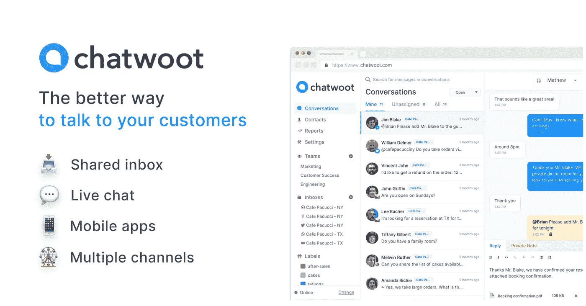

Chatwoot

Chatwoot 为在软件和商业行业中赢得一席之地而提供的一些亮点是其共享收件箱、云兼容性、隐私、自定义菜单以及与 Rasa、DialogFlow 等平台的多种集成。

阅读这篇博客，探索如何将 Chatwoot 的实时聊天功能集成到部署在 **Netlify** 上的 web 应用程序中。我将使用一个简单的[天气应用](https://github.com/chandrikadeb7/aviyel-weather-chatbot)，它是用 HTML、CSS 和 JavaScript 以及一些开源 API 创建的。

# 你为什么需要聊天机器人？

越来越多的客户希望企业能够在线提供服务并做出响应。拥有一个与你的客户和潜在客户沟通的系统可以帮助你建立人际关系，更好地理解他们，更快地为他们服务。

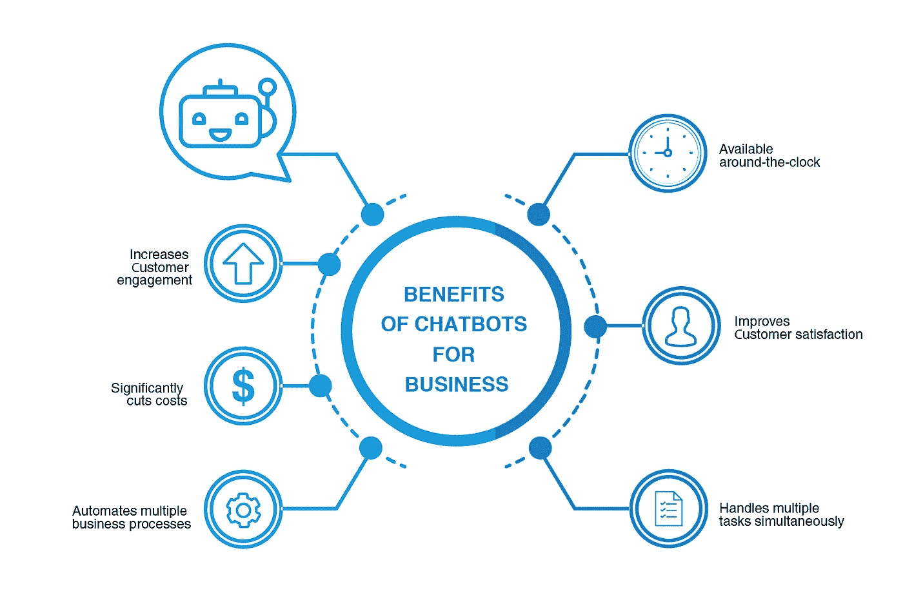

Benefits of a Chatbot

聊天机器人帮助客户尽可能快速顺利地从 A 点到达 B 点，而不会感到被遗忘或迷失方向。可以把聊天机器人想象成一个小向导，帮助客户浏览你网站上的信息。聊天机器人是网站的虚拟助手。

它们有助于解决用户在浏览网站时可能面临的常见故障排除问题。成本效益**很高**，因为你不必指定客户服务代理。长话短说，它改善了网站的整体体验。

# 如何将你的 Chatwoot 连接到 Netlify 网站？

**让我们从实现 Chatwoot 工具开始。**

*   **点击此[链接](https://app.chatwoot.com/app/auth/signup)在 Chatwoot 上创建一个新账户**，或者**登录**到您现有的账户。
*   输入您的详细信息，然后点击**提交**。

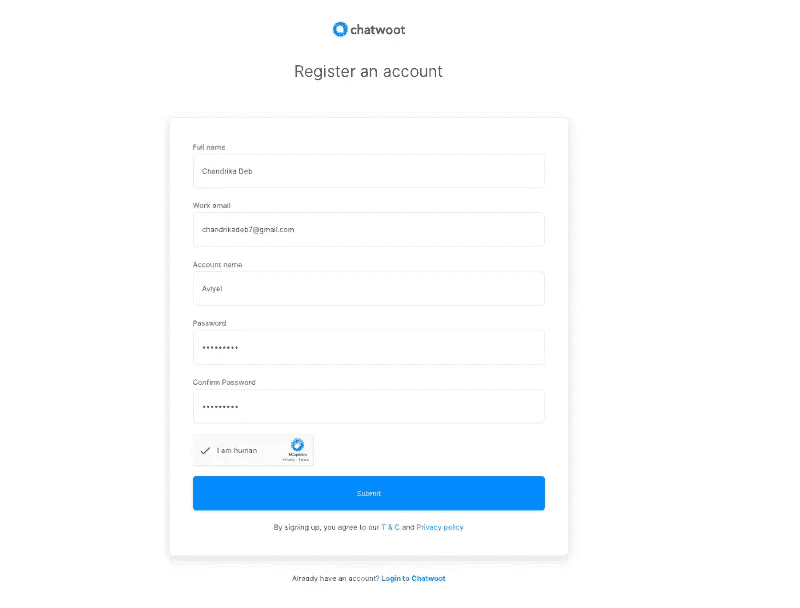

Register on Chatwoot

*   一旦你登录，主 **Chatwoot 仪表板**将看起来像下面的快照。

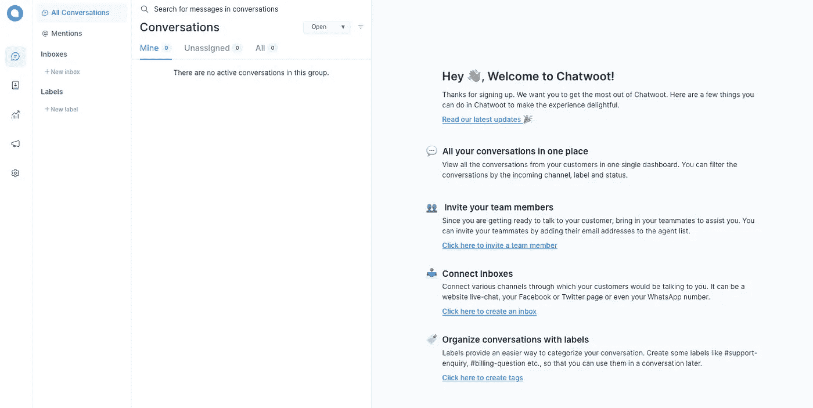

Chatwoot Dashboard

*   现在点击左侧窗格中的**+新收件箱**选项。它显示了我们希望集成聊天机器人功能的多个渠道。

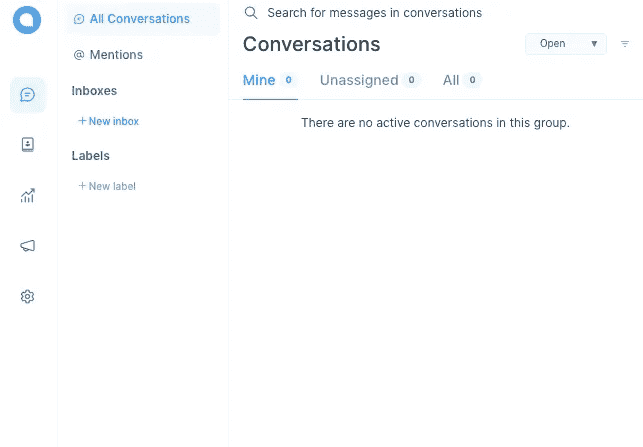

Chatwoot Dashboard Left Pane

*   选择**网站**选项，因为我们希望在 Netlify 的天气网站中部署聊天机器人。填写您的网站详细信息，定制您的聊天机器人颜色和问候语。

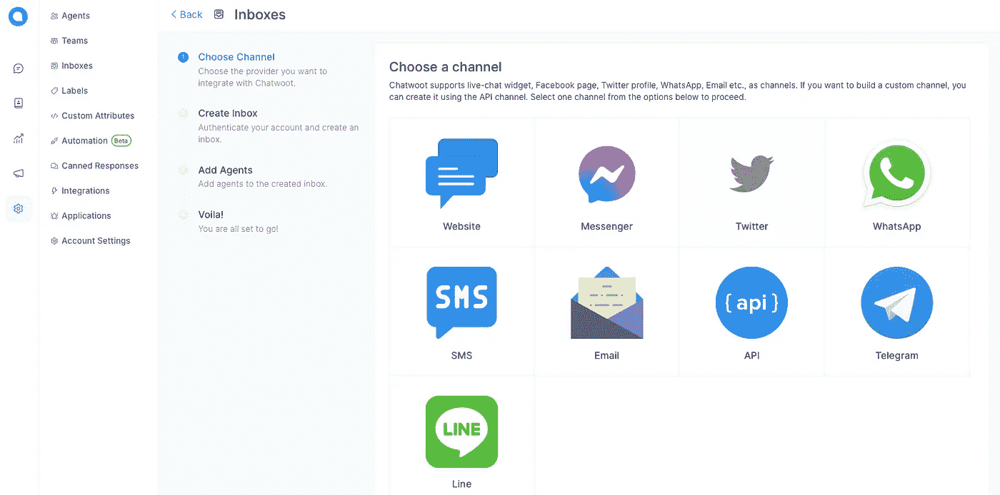

Inbox Channel Choose Window

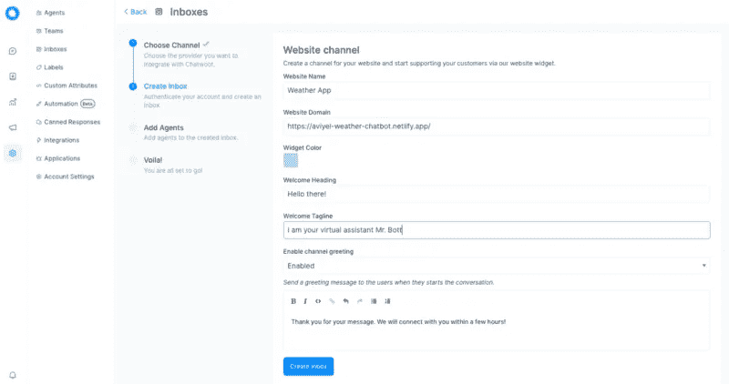

Creating Inbox for your Website

*   点击**创建收件箱**。在“添加代理”页面上，您必须选择一些项目支持人员作为站点响应者。对于这个博客，那就是我。

Agents Addition Section

*   耶！！我们的收件箱已经准备好了。复制 JavaScript 代码，这将在我们的下一步中派上用场。生成一个网站令牌，它对每个用户都是唯一的，我们将隐藏它，这样人们就不会滥用令牌。

Chatwoot Inbox Created!

# 现在让我们把这段代码放到我们原来的天气应用程序中！

*   从 GitHub 克隆天气应用 [repo，并在你的代码编辑器中打开它。](https://github.com/chandrikadeb7/aviyel-weather-chatbot)
*   将 Chatwoot 在上一步中创建的收件箱代码粘贴到`chatwoot.js`文件中。

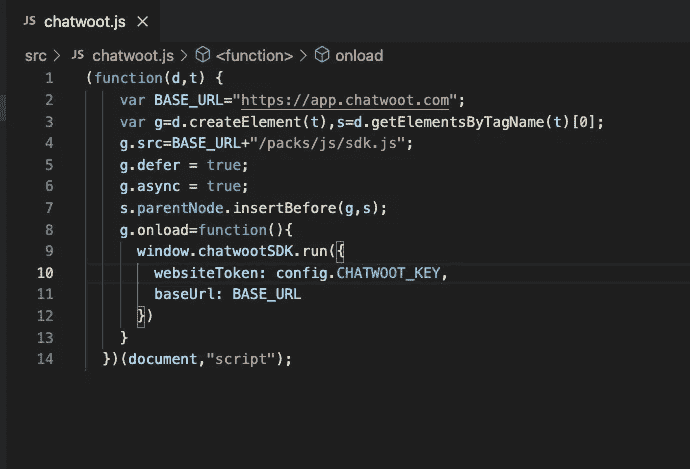

chatwoot.js

*   在您的`index.html`文件:``中添加包含`chatwoot.js`源位置的`script`标签
*   现在要隐藏网站令牌，创建一个`config.js`文件。确保在`.gitignore`文件中添加`config.js`,以避免您的 API 密钥被推入存储库中。

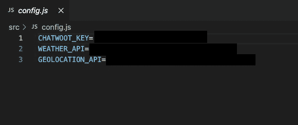

config.js

*   现在在您的`chatwoot.js`文件中，使用`config.CHATWOOT_KEY`来导出令牌。
*   就是这样！您已经成功地在您的网站上实现了实时聊天功能！刷新以在 Live Server 上本地查看您的实现。

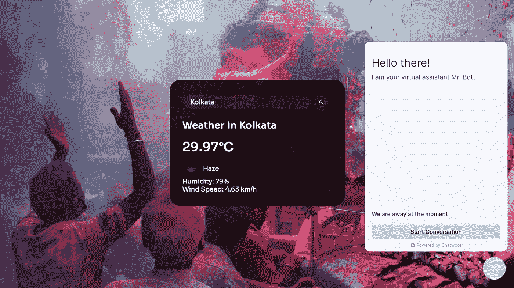

Live Chatbot on your weather app!

*   我们在本地看到了这项工作，现在如果你想在 Netlify 这样的平台上托管它，你必须遵循更多的步骤。在 Netlify 应用程序中链接您的存储库之后，您需要构建包含我们的 API 密钥和令牌的`config.js`文件。为此，请转到**Netlify->Deploy->Deploy Settings**，然后编辑 **Build 命令。**

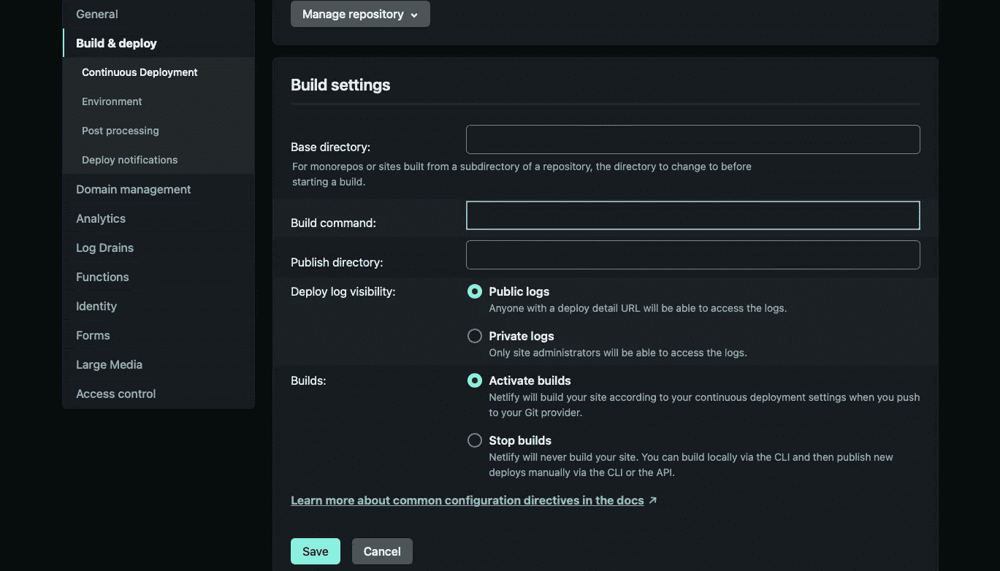

Edit the Build Command on Netlify

*   将以下内容粘贴到构建命令部分:`cd src && echo -e "var config = {\nWEATHER_API : 'API_KEY',\nGEOLOCATION_API : 'API_KEY',\nCHATWOOT_KEY: 'WEBSITE_TOKEN'\n}" > config.js`
*   点击**保存**，然后**部署**你的网络应用。点击生成的网站链接，并检查机器人功能现场！

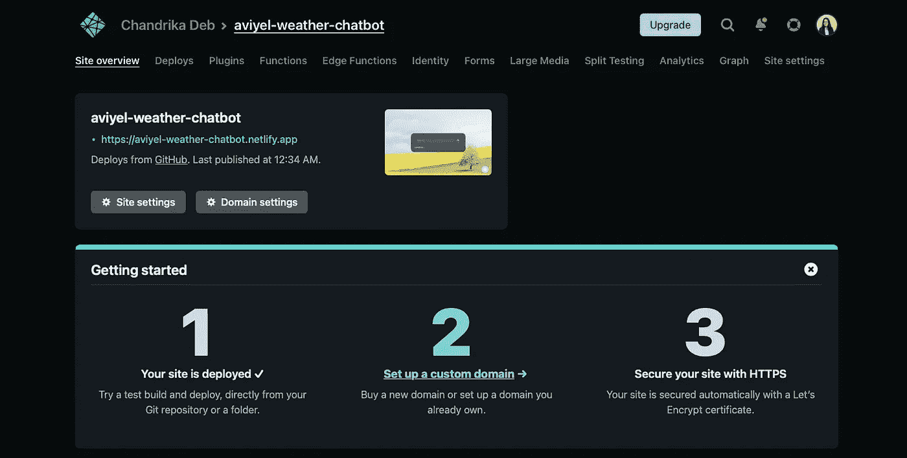

Chatbot integrated website deployed!

现在你终于在 Netlify 上的[网站](https://aviyel-weather-chatbot.netlify.app/)上完成了 Chatwoot 的基本实现！

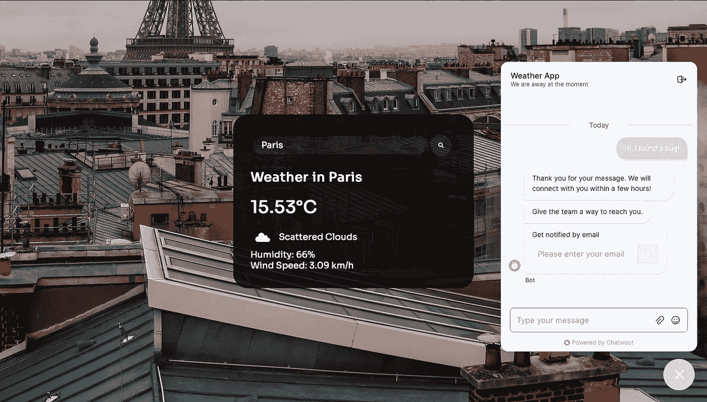

现在，在 Chatwoot dashboard 中，您会看到一条新的收件箱消息。测试完成后，您可以选择**回复**，或者将其标记为**已解决**。

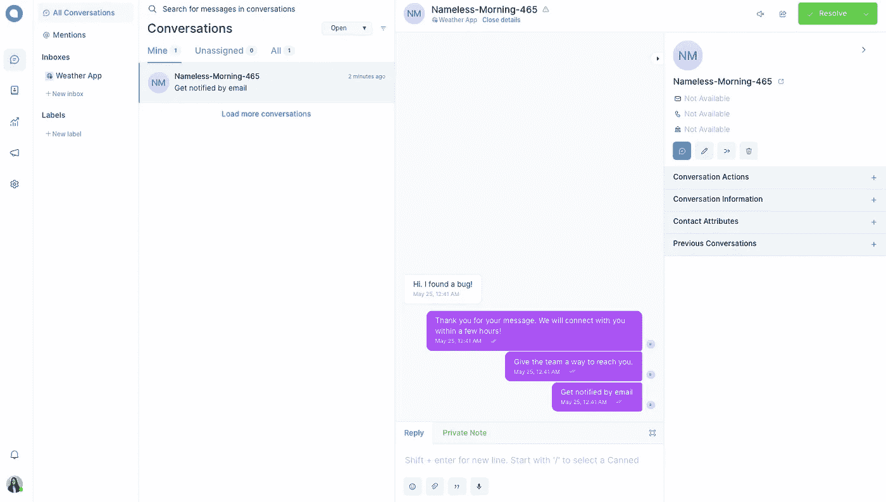

One-in-all Conversations Inbox on Chatwoot

# 结论

在这篇博客中，我们学习了 Chatwoot 与你的网络生活网站的基本整合。您可以进一步添加更多功能，如活动、 **Dialogflow** 或 **Rasa** 实现自动消息，如聊天机器人。

要了解 Chatwoot 的更多信息，请访问[此处](https://aviyel.com/projects/6/chatwoot)。

*感谢阅读到最后！希望有帮助…👩‍💻*

如有任何疑问，请随时与我联系，或者只是打个招呼！👇

 [## Chandrika Deb |软件开发人员|内容自由职业者

### Chandrika Deb 是 Amdocs 的一名软件开发人员，她喜欢学习新事物和帮助技术初学者。

chandrikadeb7.github.io](https://chandrikadeb7.github.io/)