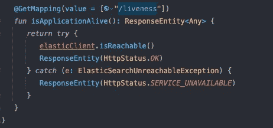

# 管理 Kubernetes 服务之间的依赖关系

> 原文：<https://medium.com/geekculture/connecting-two-services-with-dependencies-in-kubernetes-8e6b05b4ae4d?source=collection_archive---------3----------------------->

上周，我的工作是将 ElasticSearch 添加到我的项目中。由于我的应用程序现在依赖于第三方服务，我必须确保 ElasticSearch 正在运行。在启动时，我的应用程序使用 ElasticSearch 建立一个索引。这意味着 ElasticSearch 必须在我申请之前开始。否则我的应用程序将在启动时失败。

# 什么是活动、就绪和启动探测

根据 [kubernetes.io](https://kubernetes.io) :

> [kubelet](https://kubernetes.io/docs/reference/command-line-tools-reference/kubelet/) 使用**活跃度探测器**来知道**何时重启容器**。例如，活跃度探测器可以捕获死锁，此时应用程序正在运行，但无法取得进展。在这种状态下重启容器有助于提高应用程序的可用性。
> 
> kubelet 使用**准备就绪探测器**来知道集装箱何时**准备好开始接受流量**。当一个 Pod 的所有容器都准备好时，该 Pod 被视为准备就绪。该信号的一个用途是控制哪些 pod 用作服务的后端。当 Pod 未就绪时，它将从服务负载平衡器中移除。
> 
> kubelet 使用**启动探测器**来了解容器**应用程序何时启动**。如果配置了这样的探测器，它会禁用活性和就绪性检查，直到成功，确保这些探测器不会干扰应用程序的启动。这可以用来对缓慢启动的容器进行活性检查，避免它们在启动和运行之前被 kubelet 杀死。

对于我们的用例，这意味着我们可以在自己的应用程序上定义一个活跃度探测器，检查是否可以建立到 ElasticSearch 的连接。如果探测失败，应用程序应该重新启动，如果成功，它应该继续运行。

# 使用 HTTP 创建活跃度探测

有不同类型的活性探测器。我们可以使用以下方法之一:

*   活性命令
*   活跃度 HTTP 请求
*   活性 gRPC 请求

对于我们的例子，我们将使用一个简单的 HTTP 请求。

要知道 200 到 400 之间的每个 HttpStatusCode 都会导致一个正探测，而高于 400 或低于 200 的所有值都会导致一个失败的探测，这一点很重要。

## 休息终点

在我们的 ElasticAdapter 中，如果集群不可达，我们有一个抛出异常的方法。

正如您所看到的，它只是简单地调用了`clusterHealth()`,如果得到了结果，就不做任何事情。如果它抛出一个`ConnectionException`，它会接住它并抛出一个`ElasticSearchUnreachableException()`。

为了让这个检查对外部可用，我们需要创建一个新的 REST 端点。

这个控制器为/ `liveness`端点创建一个`GetMapping`，它调用 elasticAdapter 的`isReachable()`函数。如果检查成功，不会抛出异常，返回`HttpStatus.OK`。如果失败，我们将捕捉异常并返回状态代码为 503 的`HttpStatus.SERVICE_UNAVAILABLE`。

由于状态代码 503 高于 400，它将使探测失败。

## 向 Kubernetes 部署添加活性探测器

现在，我们可以使用 REST 端点在部署中创建一个活跃度探测器。

在我们的活跃度探测中，我们必须定义我们的应用程序运行的端口以及应该检查我们的活跃度探测的路径。在我们的例子中，我们将其定义为`/liveness`。`initialDelaySeconds`在前三秒延迟活性探测。这需要给我们自己的应用程序一些时间来启动并使端点可用。`periodSeconds`是每次探测之间的时间。

这个探针在两种情况下帮助我们:

1.  **我们的应用程序已经启动，而 ElasticSearch 仍然不可用。**
    ——重启我们的应用程序，直到 ElasticSearch 可达并让它运行。
2.  **两款应用均成功启动，但 ElasticSearch 崩溃。**
    -重启我们的应用程序，直到 ElasticSearch 再次可用。
    -确保我们始终运行两个应用程序，并且不会丢失数据。

# 反射

## 什么进展顺利

在我看来，Kubernetes 关于 livenessProbes 的文档非常好，并且很容易实现。此外，创建 Rest-Endpoint 本身对我来说没有问题，因为我已经做过几次了。

## 什么需要改进

对我来说，最大的问题是测试活性探针。因为我们在生产中使用 OpenShift，所以我想使用 [OpenShift CRC](https://github.com/code-ready/crc) 。这在我的机器上不能正常工作，我需要重新启动整个集群几次。之后换了 [Minikube](https://minikube.sigs.k8s.io/docs/start/) ，解决了我所有的问题。与缓慢且资源密集的 CRC 相比，它的速度非常快。下一次，我将直接使用 Minikube 来测试本地部署，或者询问我的团队成员，他们将如何测试这样的东西。