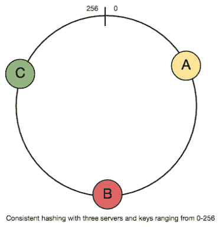
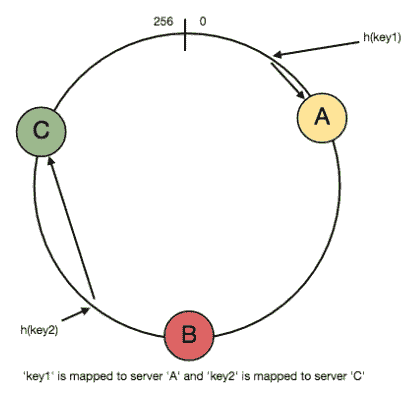
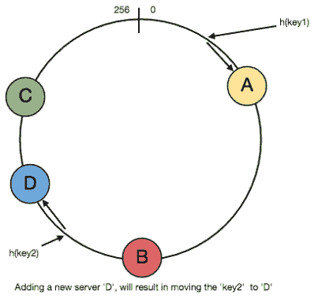
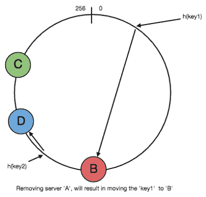
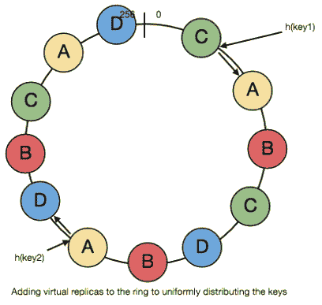

# 一致散列法

> 原文：<https://medium.com/geekculture/consistent-hashing-8e5f8b61efef?source=collection_archive---------25----------------------->

## 为什么我们甚至需要一致的散列，它是如何工作的？

分布式哈希表(DHT)是分布式可扩展系统中使用的基本组件之一。

哈希表需要一个键、值和一个哈希函数，哈希函数将键映射到存储值的位置。

> **index = hash_function(key)**

假设我们正在设计一个分布式缓存系统。给定“n”个缓存服务器，一个直观的散列函数应该是“key % n”。它简单且常用。但是它有两个明显的缺点:

1.  它不是水平可伸缩的。每当向系统添加新的缓存主机时，所有现有映射都会被破坏。如果缓存系统包含大量数据，这将是维护中的一个难点。实际上，安排停机时间来更新所有缓存映射变得很有挑战性。
2.  它可能不是负载平衡的，尤其是对于非均匀分布的数据。这意味着一些缓存变得热且饱和，而其他缓存空闲且几乎为空。

在这种情况下，一致散列是改进缓存系统的一个极好的方法。

# 什么是一致性哈希？

对于分布式缓存系统和分布式哈希表，一致哈希是一种有利的策略。它允许在集群中分发数据，以便在添加节点或

已移除。因此，使缓存系统更容易扩大或缩小。

在一致散列中，当散列表被调整大小时(例如，新的高速缓存主机被添加到系统中)，仅 k/n 个键需要被重新映射，其中 k 是键的总数，n 是服务器的总数。

回想一下，在使用“mod”作为哈希函数的缓存系统中，所有的键都需要重新映射。

在一致散列中，如果可能，对象被映射到同一主机。当主机从系统中删除时，其对象由其他主机共享。当添加一台新主机时，它会从几台主机获取自己的份额，而不会触及其他主机的份额。

# 它是如何工作的？

作为一个典型的哈希函数，一致哈希将一个键映射到一个整数。假设散列函数的输出在[0，256]的范围内。

想象一下，范围内的整数被放置在一个环上，使得值是环绕的。

一致性哈希的工作原理如下:

1.  给定一个缓存服务器列表，将它们散列为范围内的整数。
2.  要将密钥映射到服务器，请执行以下操作:

*   把它散列成一个整数。
*   在环上顺时针移动，直到找到它遇到的第一个缓存。
*   那个缓存就是包含密钥的缓存。

请参见下图以获得进一步的说明:

key1 映射到缓存 A

key2 映射到缓存 C

要添加一个新的服务器，比如说 D，最初位于 C 的密钥将被拆分。其中一部分会被调到 D，而另一部分键不会被触动。

移除缓存或者如果缓存失败，比如说 A，所有最初映射到 A 的键都将落入 B，并且只有那些键需要被移动到 B，其他键不会受到影响。

# 虚拟服务器副本

对于负载平衡，正如我们最初讨论的，实际数据基本上是随机分布的，因此可能不一致。它可能会使服务器上的密钥不平衡。

为了解决这个问题，我们为服务器添加了“虚拟副本”。不是将每个键映射到环上的单个点，而是将其映射到环上的多个点，即副本。这样，每个服务器都与环的多个部分相关联。

如果散列函数“混合得很好”，随着副本数量的增加，密钥将更加均匀地分布。