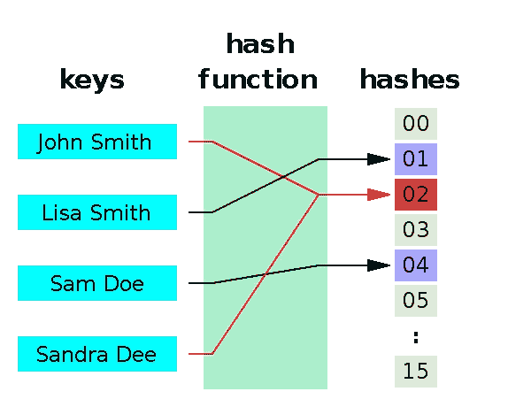
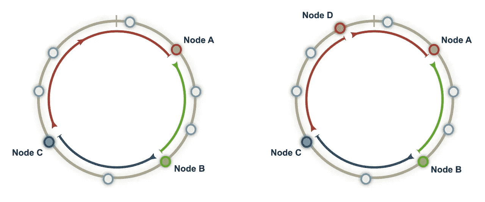
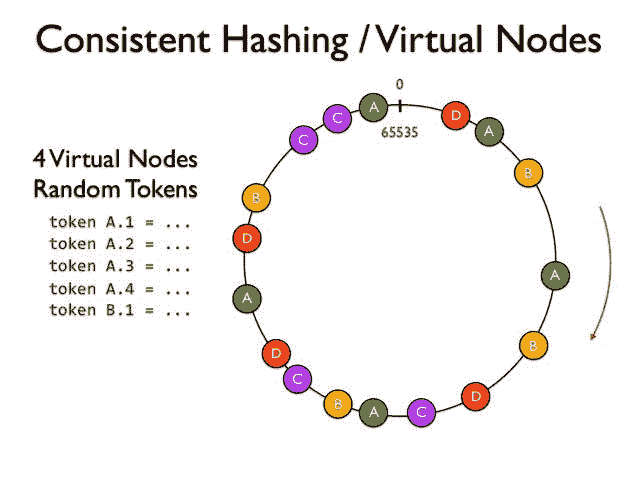

# 一致散列|分配服务器负载

> 原文：<https://medium.com/geekculture/consistent-hashing-99ea4caaa24d?source=collection_archive---------16----------------------->

一致哈希是一种特殊的哈希，它使用的哈希函数随着哈希函数范围的变化而最小化变化。

我们将从哈希开始，然后我们将看到分布式哈希，它面临的问题是什么，以及一致哈希如何解决这些问题。

# 哈希是什么？

哈希是通过使用哈希函数将给定的键值转换为另一个值的过程。一个**散列函数**用于根据数学算法生成新值。散列函数的结果被称为**散列值**或**散列值**。

Hashing

一个好的散列函数是使用**单向**散列算法的函数，或者换句话说，散列不能被转换回原始密钥。

# 分布式散列

这是一种在给定资源之间分配任务的策略。假设在一个循环队列中有 M 个服务器和 N 个块。M 个服务器被放置在 M 个不同点的环形队列中。

要将服务器放置在 M 个不同的点，服务器 id 将被传入哈希函数以获得哈希值。在哈希值中执行 mod 操作，并将服务器放在块中(hash%N=server_block)。

每当一个任务来了，它的键值在散列函数中传递，我们得到散列值，现在我们对这个散列值执行模运算(hash%N=i)，在模运算之后，我们得到 I 值。所以任务会加在第 I 块。现在这个任务将由最近的服务器按顺时针方向执行。

Distributed Hashing

但是这种方法有一个问题。假设其中一个服务器由于某种原因关闭了，那么会发生什么？

如果其中一个服务器出现故障，那么按照建议的方法，顺时针方向寻找下一个最近的服务器。这导致该服务器的负载增加，这意味着负载分布不均匀。

为了解决这个问题，一致性哈希开始发挥作用。

# 一致散列法如何解决这个问题？

该策略建议在分布式散列中在它们之间添加虚拟服务器。添加虚拟服务器并不意味着添加更多的服务器。这些虚拟服务器的工作是将任务重定向到其他服务器。

就像分布式散列服务器 id 将在散列函数中传递，而虚拟服务器将在不同的块中传递。这里的不同之处在于，我们有多个散列函数。

假设你有 2 个散列函数，M 个服务器将被放置在 2*M 个不同的点上。这降低了在其中一个服务器出现故障的情况下使特定服务器过载的风险。

Consistent Hashing

其余同**分布式哈希**所述，任务放在循环队列中，任务将由顺时针方向最近的虚拟服务器执行。

**注意:**一致性哈希在很多地方使用，如 [***数据库分片(缩放数据库)***](/nerd-for-tech/all-about-database-sharding-scaling-up-the-database-3b6172491cd) *或* ***负载平衡器(在多个服务器中分配负载)***