# Javascript 对象和数组中的 Const vs Object.freeze

> 原文：<https://medium.com/geekculture/const-vs-object-freeze-in-javascript-905c45b95805?source=collection_archive---------12----------------------->

Const 创建一个值的只读引用，即分配给 const 变量的值不能被**重新分配**。

## 但是等等…这里有一个陷阱！

现在，我们在上面读到的适用于原始数据类型，即字符串、数字、布尔、空、未定义，但这不适用于非原始数据类型，如对象和数组。

让我们通过一个简单的例子来理解这一点，我们将为每种数据类型创建一个 const 类型的变量，看看我们是否能够改变它的值。

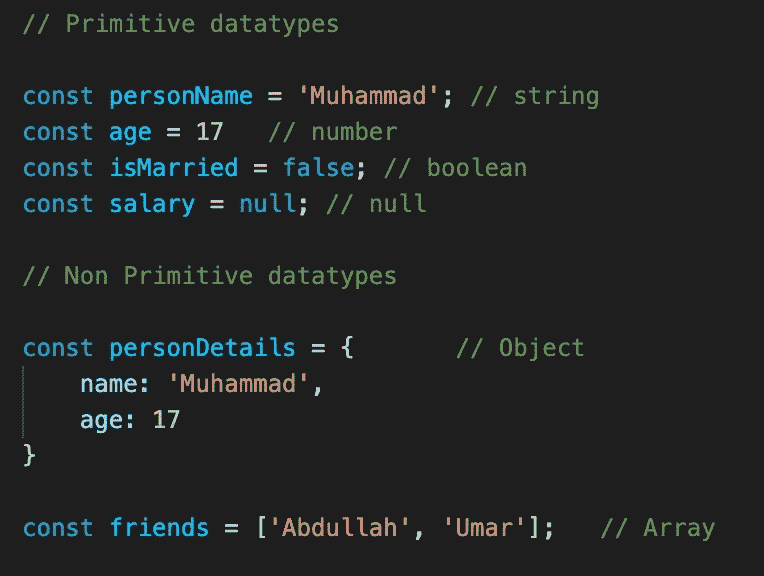

现在让我们看看当我们试图改变每个原始数据类型变量的值时会发生什么

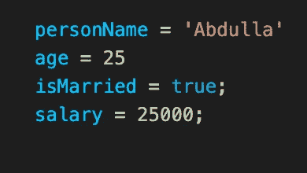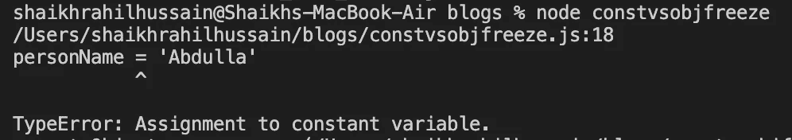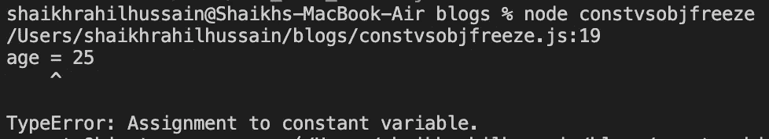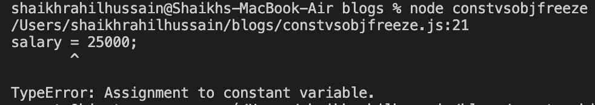

**我们得到一个错误，指出不能给常量变量赋值，我们完全同意**

**让我们尝试同样的对象:**

如果我们直接将 const 对象重新赋值给其他对象，那么显然它不允许我们这样做，我们会得到相同的赋值给 const not allowed 错误。

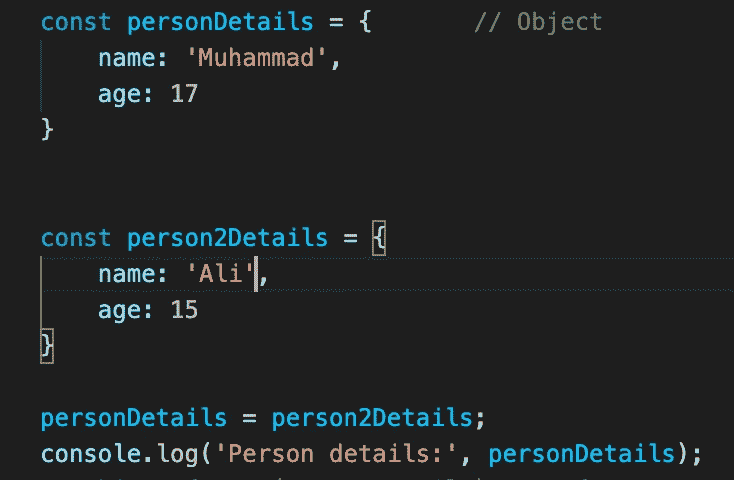

**控制台输出:**

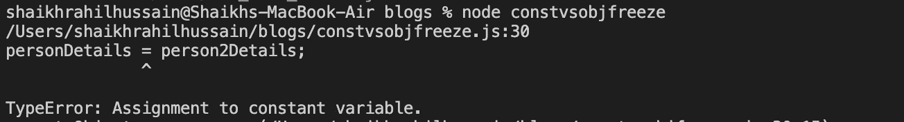

但是当我们对一个对象的属性和一个数组的元素做一些改变时会发生什么呢？让我们尝试一下，我们更改了 personDetails 对象的名称和年龄值，并控制该对象，即使该对象是 const 类型，我们也能够更改该对象的值。

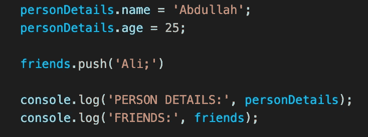

**控制台输出:**

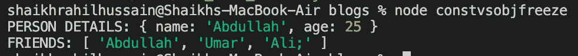

## **这里发生了什么？**

根据 const 的定义，我们不能给 const 变量重新赋值，但是在 object & array 类型的情况下，当你添加/改变一个对象或数组时，你不用重新赋值或重新声明常量，它已经被声明和赋值了，你只是改变了键值，并在这里添加了一个新元素。

## 使用 Object.freeze 禁止对象和数组中的更改

如果我们希望我们的对象和数组值不变，那么我们应该使用***Object . freeze(your-Object)来冻结对象。***

因此，在我们的代码中，如果我们使用 Object.freeze(personDetails)并试图更改对象的值，我们将无法这样做

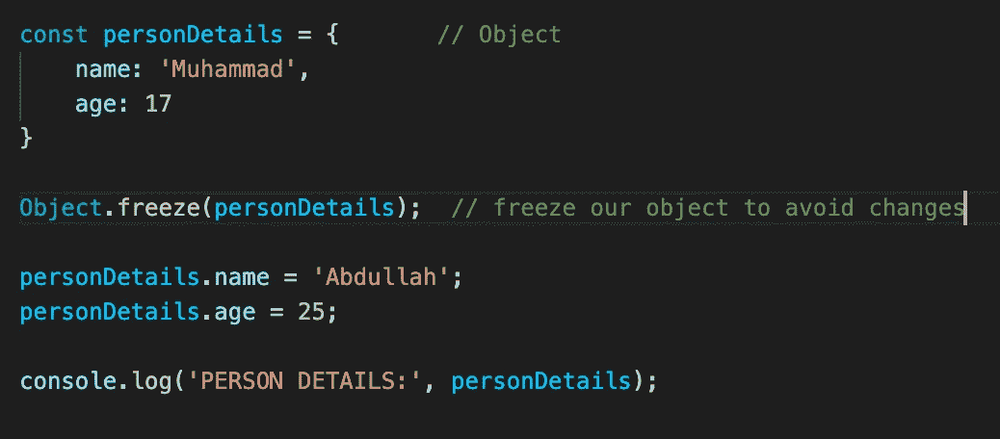

现在，当我们看到控制台语句的输出时，我们看到 object 值没有改变，即使在我们尝试改变 object 的值之后，name 仍然是 Muhammad，age 仍然是 17。

**控制台输出:**

**冻结数组避免变化:**

同样的概念也适用于数组，冻结数组也不允许在数组中修改，当我们试图在冻结它之后将一个元素推入 friends 数组时，我们得到一个错误，指出对象(数组)是不可扩展的。

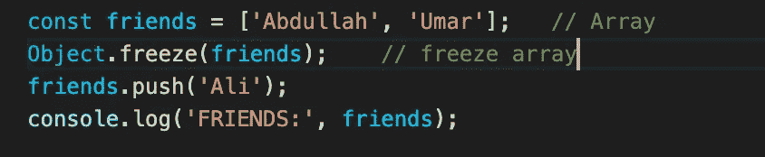

**控制台输出:**

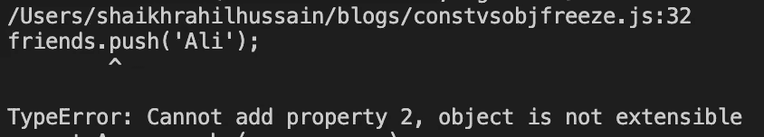

如果你觉得这篇文章有帮助，请鼓掌👏并分享给你的朋友。

***每天学点新东西***