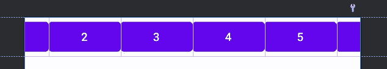
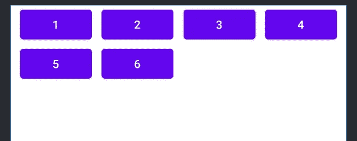
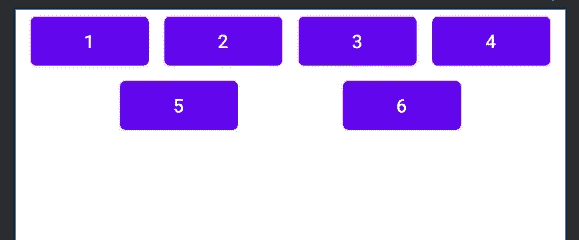
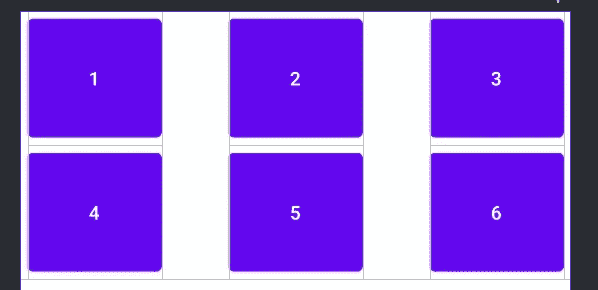

# ConstraintLayout 2.0

> 原文：<https://medium.com/geekculture/constraint-layout-2-0-98df8c74856b?source=collection_archive---------5----------------------->

我们的约束布局之旅将在第二部分继续。如果你错过了第一个，你可以在下面的链接里先看看:

[](https://emre-arslan.medium.com/constraint-layout-8b13ace936df) [## 约束布局

### 约束布局已经成为 Android 开发中最基本的组件之一，具有许多有效的功能

emre-arslan.medium.com](https://emre-arslan.medium.com/constraint-layout-8b13ace936df) [](https://emre-arslan.medium.com/motionlayout-bba34ce7fa69) [## 运动布局

### 最后，我非常自豪地向您展示我的约束布局系列的最后一部分🤘🏻。这将是最长的…

emre-arslan.medium.com](https://emre-arslan.medium.com/motionlayout-bba34ce7fa69) 

在前一篇文章中，我们已经逐一研究了 ConstraintLayout 的基本特性。这次我们将深入一些细节，看看它的上限。

我们可以将 ConstraintLayout 2.0 中提供的特性分成三个不同的部分。

*   **流量**
*   **层**
*   **运动布局**

# **流量**

Flow 可以被认为是 LinearLayout 的健壮版本。根据定义，它是一个用于链接视图的*虚拟* *布局*。等一下！从第一部分我们知道，ConstraintLayout 有一个称为“链”的特性，用于将视图分组并相互关联。是什么让心流与众不同？链是分组视图的好方法，但是*它只适用于一行*。如果我的视图太大，无法在一行中处理，该怎么办？我可能需要处理多行视图。这时，心流走上舞台。

由于 Flow 是一个虚拟布局，它使用其他视图引用，并且**不会向您的视图层次结构**添加新的级别。这就是心流如此强大的原因。视图层次越多，绘图时间就越多！它直接影响性能，性能应该是我们主要关心的问题之一。此外，它为您节省了大量样板代码。

现在，让我们看看流动在行动，好吗？

想象一下，你有六个按钮要分组，但是它们的大小可能会在运行时改变。因此，不能保证将它们排成一行。在这种情况下，你可以使用心流。

***【wrap mode】***属性可以用来获得想要的外观。您可以选择

*   ***无*** →(默认)仅创建一条链，并使其溢出没有足够的空间。(!！！当心屏幕外的上下文！！！)
*   ***对齐*** →溢出时，在另一行创建另一条链。
*   ***链*** →除了对齐，还对齐行和列。



wrapMode = “none”



wrapMode = “aligned”



wrapMode = “chain”

如果没有太多视图要显示，Flow 也可以用作 GridLayout。它还降低了 RecyclerView 的复杂性(适配器、渲染时间等。).它保持了布局的平整并提高了性能。



wrapMode = “chain”, horizontalStyle=”packed”

***【横向 _ 样式】******【纵向 _ 样式】*** 属性是流的其他酷属性。就像 ConstraintLayout 中的链一样，可能的值有:

*   ***展开*** →视图在父视图内展开，视图和父视图之间的间距相等。*(默认值)*
*   ***spread _ inside***→通过取父视图的尺寸，视图在父视图内以相等的间距展开。
*   ***打包***→视图在中间打包，不填充父视图。

> 注意:当应用打包样式时，也应用默认的 0.5 偏移值。

```
app:flow_horizontalStyle = "***spread*** | ***spread_inside*** | ***packed"*** app:flow_verticalStyle = "***spread*** | ***spread_inside*** | ***packed"***
```

如果你想给视图之间一些手动间隙，你可以使用 ***【水平间隙】*** 和 ***【垂直间隙】*** 属性。

```
app:flow_horizontalGap= "8dp"
app:flow_verticalGap= "8dp"
```

# 层

Layer 是 ConstraintLayout 2.0 附带的另一个很酷的属性。你可以把它看作一个强健的群体。它是一个虚拟的助手，在不增加层次的情况下对视图进行分组，并允许你同时对层中的所有视图包括动画进行一些操作！您可以同时旋转、平移和缩放视图，而无需一遍又一遍地重复代码。

它的用法就像 Group 一样。您只需要添加您想要添加的视图的引用 id，就可以开始了！

现在我们来举个简单的例子。


# 运动布局

运动布局是 ConstraintLayout 2 的最后一个但绝对不是最不重要的属性。老实说，对我来说这是最令人兴奋的一篇，它值得拥有自己的文章。运动布局将是这个系列的第三部分，也是最后一部分。我在那里等你。