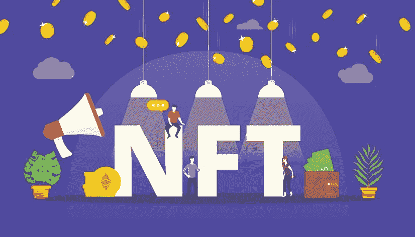

# 营造 NFT 贸易的神奇之地——NFT 市场发展

> 原文：<https://medium.com/geekculture/constructing-a-magical-place-for-nft-trade-nft-marketplace-development-78f0b68527d4?source=collection_archive---------19----------------------->

NFTs！从一开始，它就获得了巨大的人气，甚至现在，它越来越强大，已经成为当前世界不可阻挡的力量。这些 NFT 只不过是存储在区块链账本上的不可互换的数据单元。这些几乎存在于所有事物中，并且它们是完全认证的。

有没有一个部门不包括非技术人员？答案会是这样的，嗯，几乎所有的东西，从音乐到体育，从时尚到票务，而*正在天空中蔓延，就像夜空中闪耀的星星。*

*所以，他们有什么大不了的？虽然任何人都可以通过互联网访问这些数字产品，但 NFT 使用区块链网络以一种真正不可改变和万无一失的方式建立和跟踪所有权。那么，举例来说，当任何人都可以下载他们选择的任何作品时，这对艺术品收藏家来说又有什么关系呢？正如《福布斯》所言，拥有作品的“数字吹嘘权”几乎与拥有作品本身一样重要。*

*然而，需要特定的 NFT 市场来交换 NFT。寻求建立 NFT 市场的创新企业前景光明。NFT 市场为用户提供了购买、销售、存储、展示和(在某些情况下)制造代币的机会。从某种意义上说，他们是虚拟的亚马逊人。由于 NFT 市场的发展需要专业的技术技能和知识，因此寻求区块链开发公司的帮助可能会有助于确保平台的成功。*

* [## NFT 市场开发|不可替代代币市场|白标 NFT 市场|…

### NFT 市场的发展正在塑造即将到来的创业公司的未来，以在竞争中胜出。构建您自己的…

www.blockchainappfactory.com](https://www.blockchainappfactory.com/nft-marketplace-development?utm_source=GeekGulture+medium&utm_medium=18-04-2022&utm_campaign=Vishnu) 

## **为什么需要 NFT 市场？**

与货币不同，无论是数字货币还是传统货币，非金融资产都有其独特的价值，而不是固定的汇率。这意味着它们不能被换出。

然而，由于这些不可替代的令牌不能在集中式或分散式加密货币交易所购买或出售，因此交易它们的唯一方法是通过在线 NFT 市场。因此，开发 NFT 市场的公司将变得更加有利可图。

## **NFT 市场的优势**

由于 NFT 市场是基于区块链技术，他们有许多相同的优势

❖ **透明**:由于区块链的不可改变性和实时性，NFT 市场中的交易是完全可见的，不受操纵的影响。

❖ **去中心化**:所有的数据都可以被复制并分布在网络的节点上。每次添加新数据块时，网络都会更新，每个对等点都可以访问数据。

❖ **安全** : NFT 市场配备了内置的安全机制、加密技术和共识算法，保护它们免受在线诈骗、违规和其他网络危险的侵害。

 [## NFT 市场开发|不可替代代币市场|白标 NFT 市场|…

### NFT 市场的发展正在塑造即将到来的创业公司的未来，以在竞争中胜出。构建您自己的…

www.blockchainappfactory.com](https://www.blockchainappfactory.com/nft-marketplace-development?utm_source=GeekGulture+medium&utm_medium=18-04-2022&utm_campaign=Vishnu) 

## **创建过程——NFT 市场发展**

利基 NFT 市场的重要方面是，他们比一般的更可取。

NFT 市场开发公司可以帮助企业创建市场应用程序，让 NFT 用户通过一个简单的界面快速轻松地完成任务。但是，在考虑您想要的功能时，请确保包括以下内容:

*   店面
*   仪表盘
*   NFT 铸币厂
*   列表和收藏
*   列出状态和令牌详细信息
*   过滤
*   高级搜索
*   出价购买功能
*   钱包
*   评级和评论

一旦你决定了你的市场的利基，你可以争取你的首选 NFT 市场发展业务的协助，以帮助你实现你的愿景。此外，该合作伙伴将能够自始至终协助您创建 NFT 平台，通常包括以下步骤:

➠ **选择区块链:**选择正确的区块链将提升你的市场。

➠ **定义用户体验设计:**构建一个成功的 NFT 市场平台需要简化和优化你的用户体验。在 NFT 市场开发公司的帮助下，你可以构建一个直观、简单、使用愉快的用户界面。

➠ **前端:**一家久经考验的 NFT 市场开发公司，可以帮助您创建您的 NFT 平台框架，确保改进的功能和用户接受度。

➠ **实施智能合同:**在 NFT 市场中，智能合同用于执行每一项运营任务。他们在 NFT 平台上启动所有程序。首先，你需要 NFT 市场开发公司的帮助来构建和实现这些智能合同。

➠ **存储**:由于在区块链中保存数据非常昂贵，所有与单个令牌相关的 NFTs 元数据通常都存储在网络之外。一种替代方法是将元数据存储在 IPFS 中，这是一种对等网络，用于在分布式文件系统中收集和分发数据。

开发前端和后端接口以与区块链网络的智能合同业务逻辑进行通信的过程称为集成。

➠ **测试**:测试是 NFT 市场开发过程中至关重要的一部分，因为它允许开发者在错误上线之前就捕捉到它们。

➠ **部署**:经过多轮广泛的测试，你的 NFT 市场平台已经准备好投入生产。

上面提到的步骤代表了 NFT 市场从无到有的发展。但是，您也可以为您的市场开发选择一个白标解决方案，并根据您的需求进行定制。

## **用例:**

虽然 NFT 现在得到了很多关注，但它们并不适合所有人，也不仅仅是短暂的时尚。因此，NFT 市场的发展将在虚拟世界中发挥比现在大得多的作用。此外，对开发 NFT 市场感兴趣的公司会发现，除了艺术和游戏内商品交易，非功能性交易还有一些有趣的商业应用。以下是清单:

*   艺术 NFT
*   音乐 NFT
*   视频 NFT
*   游戏 NFT
*   运动 NFT
*   梦幻体育的 NFT
*   配件 NFT
*   房地产 NFT
*   基础设施发展的非技术转让
*   域名的 NFTs
*   多元宇宙 NFT 平台开发
*   公用事业 NFT 市场开发

## **结论**

NFT 市场的发展对于那些试图屹立不倒的企业来说至关重要。它们往往是他们日常生活的一个重要方面，使他们成为成功的企业家。但是，您可以利用市场开发公司的这些服务来满足您未来的需求。有什么比 [***为你的专业领域创造一个 NFT 市场***](https://www.blockchainappfactory.com/nft-marketplace-development?utm_source=GeekGulture+medium&utm_medium=18-04-2022&utm_campaign=Vishnu) 并开始赚取巨额利润更重要的呢？很高兴你做出了完美的决定，踏入了秘密世界。*