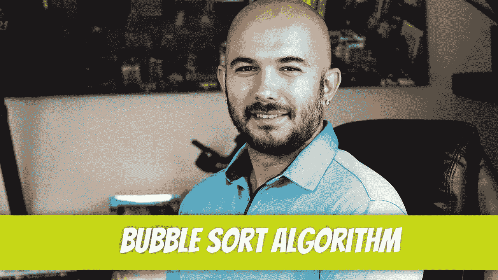

# 构造冒泡排序算法

> 原文：<https://medium.com/geekculture/constructing-the-bubble-sort-algorithm-77fa5e908794?source=collection_archive---------7----------------------->

冒泡排序算法按升序对项目数组进行排序。它遍历数组并比较相邻的元素。如果它们没有被排序，它就交换它们。然后不断重复这个过程，直到数组被完全排序。让我们来看一个例子。