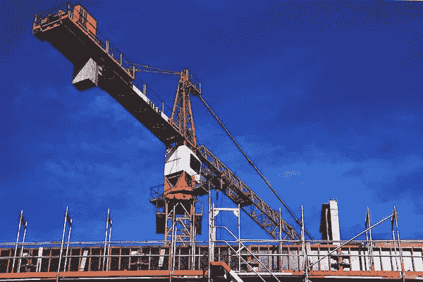
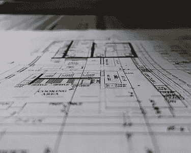

# 建筑管理平台 Agora 融资 3300 万美元 B 轮

> 原文：<https://medium.com/geekculture/construction-management-platform-agora-raises-33m-series-b-round-7891f1f8b591?source=collection_archive---------23----------------------->

Image credit: [Piqsels](https://www.piqsels.com/en/public-domain-photo-zbrln)

建筑技术公司 Agora 在 B 轮融资中筹集了 3300 万美元。虽然建筑技术不完全被认为是最有魅力的行业，但市场机会是巨大的，因为 10 万亿美元的建筑行业充满了技术效率低下，降低了生产率。

Agora 的目标是让承包商更容易跟踪和管理材料。该公司由首席执行官 Maria Rioumine 和 Ryan Gibson 共同创立。他们通过专注于特定的垂直行业来发展业务，最初是电气行业，现在是机械行业。Agora 的利基方法不是一刀切的解决方案，而是使其成为承包商中受欢迎的建筑平台。

“Agora 正在解决一个巨大而关键的问题。Tiger Global Management 的合伙人约翰·柯蒂斯(John Curtius)表示:“由于低效的采购流程和供应链的断裂，每年有数十亿美元被浪费。

这家建筑公司的 B 轮融资由投资公司 Tiger Global Management 牵头，该公司一直是互联网、软件、消费和金融科技初创公司的特别活跃的投资者。老虎环球管理着大约 790 亿美元的资产(AUM)。根据 CB Insights 的数据，Tiger Global 持有的价值 10 亿美元的私人创业公司的股份比任何其他公司都多。它以快节奏的投资风格而闻名，通常比传统风险投资者行动更快，为初创公司提供更高的估值。

B 轮融资的其他参与者包括 8VC、铁狮门、雅虎联合创始人杨致远和迈克尔·奥维兹。迄今为止，Agora 已经筹集了大约 4500 万美元的资金。

## **Agora 不求圆；投资者来到 Agora**

联合创始人兼首席执行官 Maria Rioumine 指出，Agora 实际上并没有积极尝试进行 B 轮融资。相反，投资者带着条款清单来到她的公司，开始了新一轮融资。“一些非常了解我们的投资者与我们接洽，希望我们先发制人，”Rioumine 表示。"第一次谈话后 12 天，我们有了多份投资意向书."

Image credit: [Piqsels](https://www.piqsels.com/en/public-domain-photo-jwxru)

投资者已经发现了为商业建筑公司简化材料供应链的巨大市场潜力，以及 Agora 塑造这一进程的潜力。Agora 计划利用新筹集的资金来增加员工数量，扩展到新的垂直行业，并在新的市场扩大其存在。

## **Agora 的搭建平台**

Agora 成立于 2018 年，总部位于旧金山，客户群增长迅速。该公司的平台使商业贸易承包商能够有效地订购和跟踪材料。此外，该平台还提供自动化手动数据输入的功能。该平台帮助客户完成了各种重要项目，如医院、发电站和大学校园建设。

玛丽亚·瑞欧米去年登上了福布斯 30 岁以下富豪榜。当时，Agora 刚刚筹集了 700 万美元的首轮融资。里奥明在牛津大学学习政治、哲学和经济学。她在旧金山著名的风险投资公司 8VC 工作时遇到了她的联合创始人瑞安·吉布森。他们考虑了为什么这座创新城市正遭受大范围的经济适用房危机。他们还讨论和研究了为什么建设项目进展如此缓慢。这些对话最终引出了 Agora 背后的概念。

Agora 的年度经常性收入同比增长了 760%。Agora 的使命不仅仅是帮助承包商更有效地管理项目和降低建筑成本。Agora 还希望，通过提高建筑过程的效率，其 SaaS 平台将使城市“更实惠，更容易为所有人所用”

## **Agora 可以为客户节省大笔资金**

该公司声称，其建筑技术带来的效率收益平均每年可以为客户节省 30 万美元。这部分是由于平台的设计。材料管理平台通过将现场和办公室团队聚集在同一个数字空间，促进了他们之间的沟通。Agora 声称，这种设计为办公室团队节省了 75%的传统采购订单处理时间，为现场团队节省了 38%的材料管理时间。

Agora 的 SaaS 平台使客户能够从超过 400，000 个 SKU 的材料目录中进行订购。它保存经常下订单的订单数据，以方便重新订购。贸易承包商也可以在平台上创建预先批准的材料清单。

长期以来，建筑技术投资不足。技术支出占收入的比例平均为 1.5%。与其他行业相比，这个数字相当低:在其他行业中，技术支出占收入的比例中值为 3.3%。

“当我们想到这个行业的规模有多大，而最近的生产率提高又有多么少时，我认为现在我们有这个绝佳的机会来真正投资于技术，并将其带到工作现场和贸易承包商的手中，”Rioumine 说。