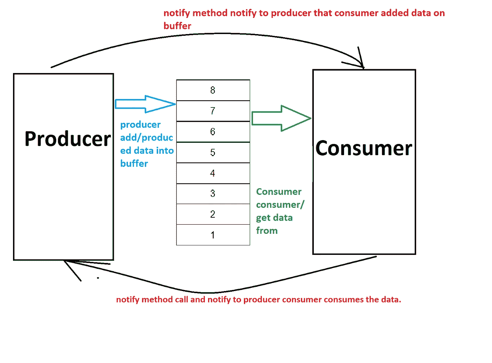

# Java 多线程中的消费者-生产者问题

> 原文：<https://medium.com/geekculture/consumer-producer-problem-in-java-multithreading-8821205f3067?source=collection_archive---------11----------------------->

在计算或 java 中，消费者-生产者问题是多个资源试图用同步块访问单个资源。

**有什么问题。？**

消费者-生产者问题是指消费者和生产者同时访问缓冲区。

**消费者:-** 当消费者试图访问空缓冲区时。

**生产者:** -当生产者试图添加超过缓冲区大小的数据时。

**用 notify()方法解决消费者-生产者问题。**

现在，我们将使用线程上的 notify()方法来解决这个问题，这样，一旦生产者试图在缓冲区中添加数据，而缓冲区已经满了，那么 wait()方法将在线程上调用，生产者将等待，直到缓冲区没有空间或为空。

如果缓冲区变空，同样的过程将发生在消费者身上，因此我们将在线程上调用 wait()方法，并等待直到生产者不再在缓冲区上添加数据。

为了更好地理解，请阅读所有注释，并尝试在您的本地计算机上运行相同的代码。

Consumer-Producer Problem

Github 链接[https://github . com/smadil 997/Java-basic/blob/main/threadexamplewithrunnablenormal . Java](https://github.com/smadil997/java-basic/blob/main/ThreadExampleWithRunnableNormal.java)