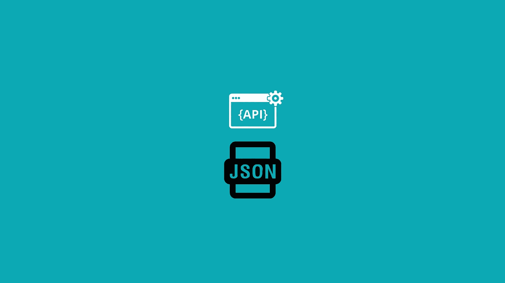

# 以简单和有组织的方式使用外部 API

> 原文：<https://medium.com/geekculture/consuming-external-apis-in-a-simple-and-organized-way-804a9063cbec?source=collection_archive---------11----------------------->

## 使用存储在数据库中的 JSON 文件、Yaml、数组或序列化来消费外部 API

我最近开发了一个抽象来组织、促进维护和主要标准化外部 API 的消费。

我还没有完成文档，如果你想做贡献，只需在资源库中发送一个 PR。我在这篇文章中的目标是向您展示如何标准化外部 API 的使用，从而促进代码的使用、记录和维护。

无论是对于微服务架构还是使用支付方式，两台或多台服务器之间的通信都是不可避免的。今天，一个应用程序几乎不可能不与另一个应用程序通信来交换消息，我会说这是为了彼此的贡献。

然而，这可能会有副作用，例如，尽管我们有几个便于使用 cURL 的抽象，但是您仍然可以用非标准的和难以维护的请求来扩充您的应用程序。

我开发的抽象(下面的链接)，是用 PHP 完成的(我强烈推荐 PHP 8.0+)，但是这个概念可以应用于任何语言。

[https://github.com/diegospm/http-provider](https://github.com/diegospm/http-provider)

其概念是，您存储将在一个数据结构中使用的所有 API 的范围。在 PHP 的情况下，您可以使用包含数组的配置文件，在所有情况下，您都可以使用 JSON、Yaml 文件或将配置存储在数据库中，序列化内容。

以支付服务为例，这里演示了 API 的作用域:

现在我们将实例化抽象，提供我们想要使用的 API 配置:

我们现在有了新的支付方式，所以我们只需要创建一个新文件来配置新 API 的范围:

然后，要使用 Stripe，只需在抽象配置方法中更改文件名。显然你会把它抽象成对象方法。

为了这篇文章不会太长，我将它分成两部分。在第二部分中，我将解释如何使用 composer 安装抽象，如何使用不同的 HTTP 客户端和不同的响应对象(例如，XML)。

此外，我将简要说明我如何使用固体和两个模式来建立它。

我希望你喜欢它，如果你想贡献；再次，发个 PR；)