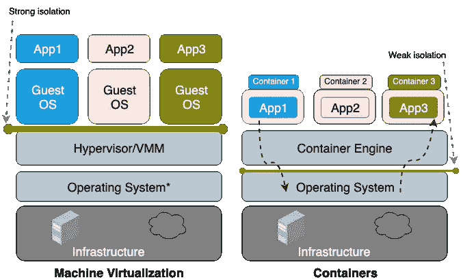
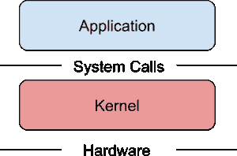
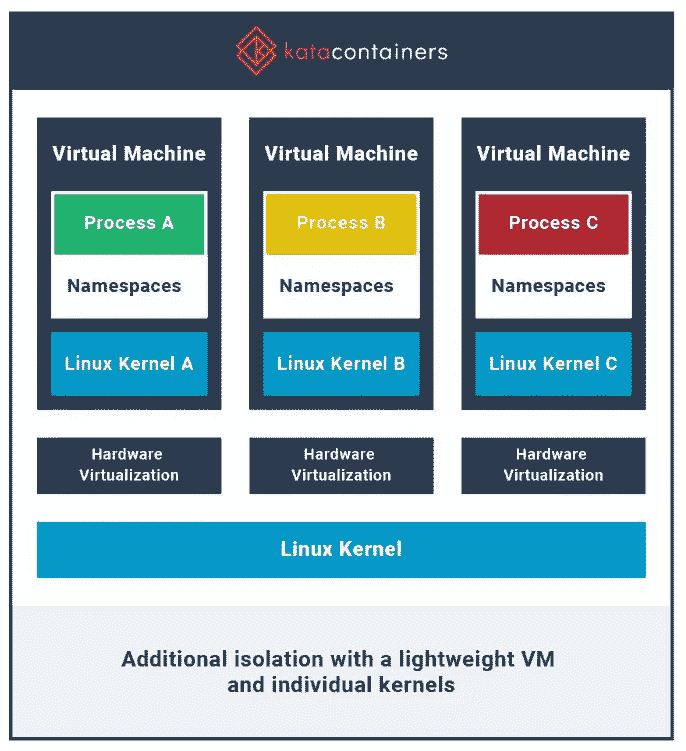
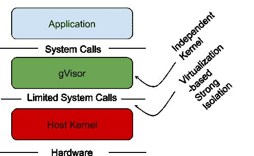

# 容器沙箱| gVisor

> 原文：<https://medium.com/geekculture/container-sandboxing-gvisor-b191dafdc8a2?source=collection_archive---------4----------------------->

## 容器沙箱和 gVisor 使用概述

与虚拟机相比，容器与主机操作系统的隔离较弱。因为虚拟机运行在它们自己的操作系统(内核)上，容器之间共享主机内核资源。因此，容器不如虚拟机安全。



from: [https://unit42.paloaltonetworks.com/](https://unit42.paloaltonetworks.com/)

在本文中，我们将讨论容器沙盒，它将帮助我们使容器更加隔离。

传统的 Linux 容器不是沙箱化的。容器使用系统调用与操作系统内核通信。



From: Google Cloud

通过使用 [**seccomp 过滤器**](https://levelup.gitconnected.com/seccomp-secure-computing-mode-kubernetes-docker-97130516662c) 我们可以限制系统调用，而 [**AppArmor 配置文件**](https://levelup.gitconnected.com/apparmor-for-docker-kubernetes-e82ef023a10c) 将帮助我们限制容器可以使用的资源。但是，为生产环境中的数百种应用创建 seccomp 滤波器或 AppArmor profile 将是一项繁琐的任务。为了克服这种情况，我们可以使用容器沙箱。

## 沙盒技术

**●基于 VM 的容器技术—** 一种提高容器隔离的方法是在自己的虚拟机(VM)中运行每个容器。这为每个容器提供了自己的“机器”，包括内核和虚拟化设备，与主机完全分离。即使 guest 虚拟机中存在漏洞，hypervisor 仍然会隔离主机以及主机上运行的其他应用程序/容器。
[**Kata Containers**](https://katacontainers.io/)**是一个开源社区，致力于使用轻量级虚拟机构建安全的容器运行时，这些虚拟机感觉和执行起来像容器，但使用硬件虚拟化技术作为第二层防御来提供更强的工作负载隔离。更多信息见[文档](https://katacontainers.io/)。**

****

**From: [https://katacontainers.io/](https://katacontainers.io/)**

****●带 gVisor 的沙盒容器—
gVisor** 拦截应用系统调用，充当访客内核，无需通过虚拟化硬件进行转换。更多来自[文档](https://gvisor.dev/docs/)。**

****

**From: google cloud**

**在本文中，我们主要关注的是 **gVisor** 。以下是关于如何在我们的系统上安装 **gVisor** 以及如何将 **gVisor** 与 kubernetes pods 一起使用的讨论。**

## **不带护目镜**

**在 kubernetes 中，容器运行在 worker 节点内核上，尽管它们是使用名称空间和 cgroups 隔离的。为了验证容器在 worker nodes 内核上运行，让我们在主机上运行' **uname** '命令。**

```
# execute 'uname' command
>> uname -sr    
Linux 5.4.0-131-generic    # <------
```

**然后让我们创建一个 pod，并将' **exec** 放入其中，并运行' **uname** '命令。**

```
# create a pod
>> kubectl run normal-pod --image=busybonx -- sleep 2000

# exec into the pod
>> kubectl exec -it normal-pod -- bash

# execute 'uname' command 
root@normal-pod:/ uname -sr
Linux 5.4.0-131-generic      # <------
```

**在上图中，我们看到 worker 节点和 pod 的内核名称和内核版本名称是相同的。这样，我们可以假设 pod 共享工作节点内核。为了确定这一点，我们可以检查进程 id (PID)。容器只不过是运行在 worker 节点上的进程。为了再次验证' **exec** '进入 pod —**

```
# exec into the pod
>> kubectl exec -it normal-pod -- bash

# run the 'ps aux' command

-> ps aux
-----------------------------------------------------------------------------
PID   USER     TIME  COMMAND
    1 root      0:00 sleep 2000   #<----------
   22 root      0:00 sh
   27 root      0:00 ps aux
```

**现在，**‘ssh’**在 pod 正在运行的 worker 节点上运行**‘PS aux’**命令，并搜索作为容器运行的进程。**

```
>> ssh node01
>> ps aux | grep sleep

root       34930  0.0  0.0   1312     4 ?        Ss   02:12   0:00 sleep 2000
```

**我们可以看到，相同的进程正在 worker 上运行，但是进程 id 不同。因为进程是使用 PID 名称空间隔离的。**

**因此，我们可以说，pod/containers 共享工作节点内核，这可能是一个主要的安全风险。因为受损的运输舱/集装箱会影响其他运输舱/集装箱。**

## **使用 gVisor 沙盒**

****1。gVisor 在 worker 节点上的安装**
我们可以使用下面的脚本在节点上安装**gVisor**(pods 将在这些节点上运行)**

```
#!/bin/bash

# To download and install the latest release

(
  set -e
  ARCH=$(uname -m)
  URL=https://storage.googleapis.com/gvisor/releases/release/latest/${ARCH}
  wget ${URL}/runsc ${URL}/runsc.sha512 \
    ${URL}/containerd-shim-runsc-v1 ${URL}/containerd-shim-runsc-v1.sha512
  sha512sum -c runsc.sha512 \
    -c containerd-shim-runsc-v1.sha512
  rm -f *.sha512
  chmod a+rx runsc containerd-shim-runsc-v1
  sudo mv runsc containerd-shim-runsc-v1 /usr/local/bin
)

# Update /etc/containerd/config.toml

cat <<EOF | sudo tee /etc/containerd/config.toml
version = 2
[plugins."io.containerd.runtime.v1.linux"]
  shim_debug = true
[plugins."io.containerd.grpc.v1.cri".containerd.runtimes.runc]
  runtime_type = "io.containerd.runc.v2"
[plugins."io.containerd.grpc.v1.cri".containerd.runtimes.runsc]
  runtime_type = "io.containerd.runsc.v1"
EOF

# Reload containerd

sudo systemctl restart containerd
```

****2。运行时类** RuntimeClass 是用于选择容器运行时配置的特性。容器运行时配置用于运行 pod 的容器。**

**我们可以在不同的 pod 之间设置不同的 RuntimeClass，以提供性能和安全性之间的平衡。例如，如果我们的部分工作负载需要高级别的信息安全保证，我们可能会选择调度这些 pod，以便它们在使用硬件虚拟化的容器运行时中运行。然后，我们将受益于替代运行时的额外隔离，代价是一些额外的开销。**

**现在，为 **gVisor** 配置一个运行时类:**

```
apiVersion: node.k8s.io/v1
kind: RuntimeClass
metadata:
  name: gvisor  # <-- name can be anything
handler: runsc  # <-- gVisor uses 'runsc' named container runtime to create containers
```

**默认的容器运行时是由 OCI 定义的' **runc** '。 **gVisor** 使用“ **runsc** ”命名运行时，kata containers 使用“ **kata-runtime** ”命名运行时。**

****3。使用 RuntimeClasses** 部署 pod 一旦为集群配置了 RuntimeClasses，我们就可以在 Pod 的 spec 部分指定一个`runtimeClassName`来使用它。例如:**

```
apiVersion: v1
kind: Pod
metadata:
  labels:
    run: sandboxed
  name: sandboxed
spec:
  runtimeClassName: gvisor   #<--
  containers:
  - args:
    - sleep
    - "2000"
    image: busybox
    name: sandboxed
```

****4。验证****

**● ' **exec** '进入吊舱，运行' **dmesg** '命令验证 gVisor 是否开始工作:**

```
>> kubectl exec -it sandboxed -- sh

--> dmesg | grep gVisor

[   0.000000] Starting gVisor..　　#<--
```

**●' **exec** 进入吊舱，运行' **uname** 命令:**

```
>> kubectl exec -it sandboxed -- sh

# run uname command
--> uname -sr
Linux 4.4.0   #<---
```

**然后在 pod 正在运行的 worker 节点上运行' **uname** '命令:**

```
>> ssh node01
>> uname -sr
Linux 5.4.0-131-generic  #<---
```

**正如我们所看到的，worker 节点和容器的内核名称和内核发布版本是不同的。这意味着容器不是直接运行在 worker 节点上，而是被沙箱化了。**

**为了更好地理解沙盒概念，您可以阅读以下资源:**

**[](https://cloud.google.com/blog/products/identity-security/open-sourcing-gvisor-a-sandboxed-container-runtime) [## 开源 gVisor，一个沙盒容器运行时|谷歌云博客

### Nicolas Lacasse 软件工程师容器彻底改变了我们开发、打包和部署应用程序的方式…

cloud.google.com](https://cloud.google.com/blog/products/identity-security/open-sourcing-gvisor-a-sandboxed-container-runtime)** 

> ***如果您觉得这篇文章很有帮助，请点击* ***跟随*** *👉******拍手*** *👏* *按钮帮助我写更多这样的文章。
> 谢谢🖤*****

## ****🚀👉**Kubernetes 上的所有文章******

****

[Md 沙米姆](/@shamimice03?source=post_page-----b191dafdc8a2--------------------------------)**** 

## ****关于 Kubernetes 的所有文章****

****[View list](/@shamimice03/list/all-articles-on-kubernetes-7ae1a0f96f3b?source=post_page-----b191dafdc8a2--------------------------------)********24 stories****************************