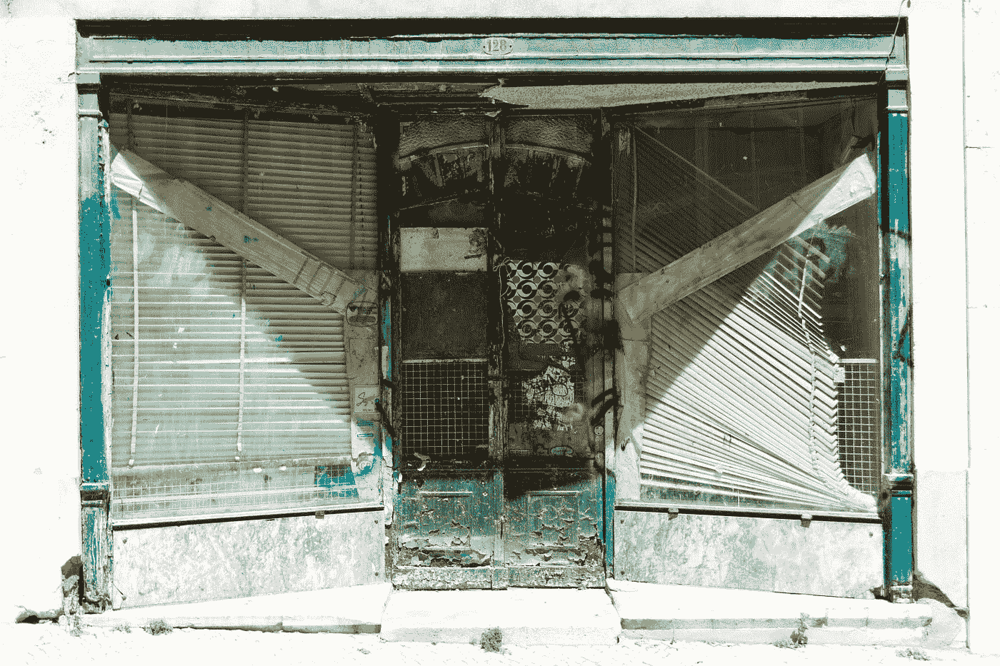

# 包含低质量代码退化

> 原文：<https://medium.com/geekculture/containing-low-quality-code-degeneration-97353486c59e?source=collection_archive---------27----------------------->

## 如何修复“破碎的窗户”并让你的代码闪闪发光

Photo by [Rafał Malinowski](https://unsplash.com/@afterdesign?utm_source=medium&utm_medium=referral) on [Unsplash](https://unsplash.com?utm_source=medium&utm_medium=referral)

低质量的代码是一个狡猾的敌人。它看起来并不有害。写得很糟糕的程序可能符合需求。它们很难调试和维护，这就是问题所在。

一些动态因素使其风险更大，并可能引发其他问题。为了最大限度地减少这种…