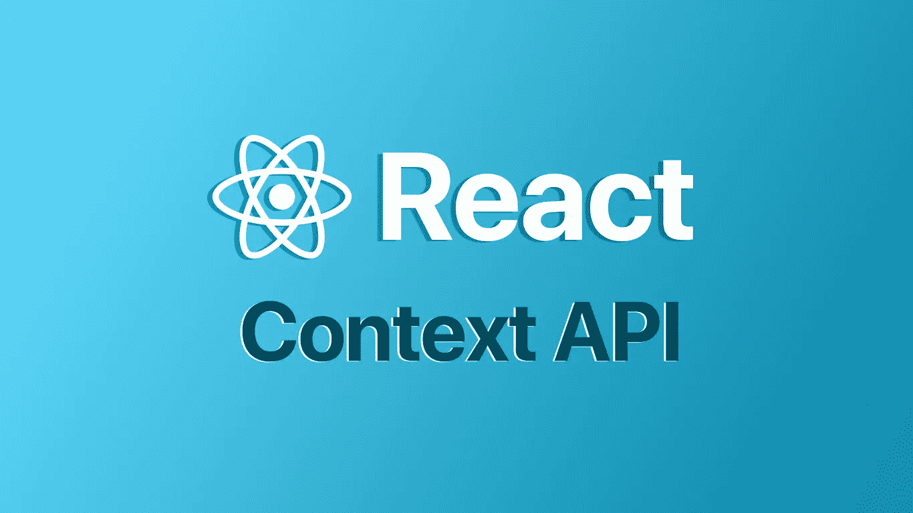
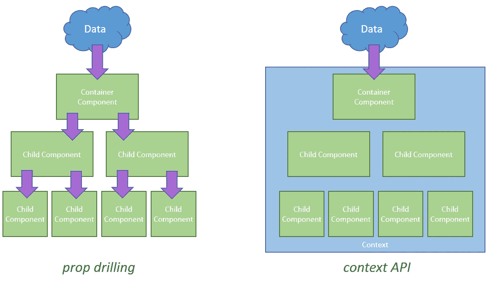

# ReactJS 中的 Context-API，为什么和如何？

> 原文：<https://medium.com/geekculture/context-api-in-reactjs-why-and-how-a493fe7705de?source=collection_archive---------25----------------------->

# 为什么使用 Context-API？

*   为了理解为什么要使用 Context-API，我们先来看看什么是**道具训练**。

## -道具-钻孔:-

*   请看左边的组件树图像。
*   可能会有这样的情况，树底部的**子组件**需要数据。但是，**容器组件**或中间的**子组件可能不需要这些数据。**
*   在这种情况下，即使中间组件不需要数据，它们也需要接收数据，以便传递给子组件。
*   如果您的应用程序太大，那么这将导致一个大问题。开发人员需要不断地将数据从一个组件传递到下一个组件。
*   这个问题被称为道具演练。

## ***克服道具钻上下文问题——引入 API。***

*   在 Context-API 中，在组件树之外创建了一个单独的存储空间，我们必须在其中存储数据。
*   现在，如果我们需要任何组件中的数据，我们可以直接从 Context-API 访问数据。
*   现在让我们通过一个例子来看看这是如何工作的。

# 步骤 1:-创建上下文 API 并在其中存储数据:-

*   要创建上下文，我们可以使用**的 **createContext()** 。**
*   一旦创建了用户上下文，我们就必须导出它。
*   现在，要在上下文中添加数据，我们必须用 **< UserContext 包装父元素。提供者>** 或 **<用户提供者>。**
*   一旦我们用包装器包装，那么我们必须将数据传递到**值**属性中。

# 现在有三种方法来使用这个上下文。

> 1)在功能组件中。
> 
> 2)在类组件的生命周期方法中。
> 
> 3)在类组件的 Render 方法中。

# 1)在功能组件中:-

*   在功能组件或钩子内部，我们必须使用 React 包提供的 **useContext()** 钩子。
*   现在我们必须导入 UserContext 并将其传递给 **useContext()** 。
*   **use Context(user context)**将返回 context .中的用户数据，我们可以进一步使用这些数据。

# 2)在类组件的生命周期方法中。

*   从类组件访问上下文最常见的方式是通过静态的`contextType`。
*   如果您需要来自`render`之外的上下文的值，或者在生命周期方法中，您将这样使用它。

# 3) *在类组件的渲染方法中。*

*   检索上下文值的传统方法是将子组件包装在`Consumer`中。
*   从那里，您将能够以`props`的形式访问价值主张。
*   您可能仍然会看到这种情况，但这更像是一种访问上下文的传统方式。