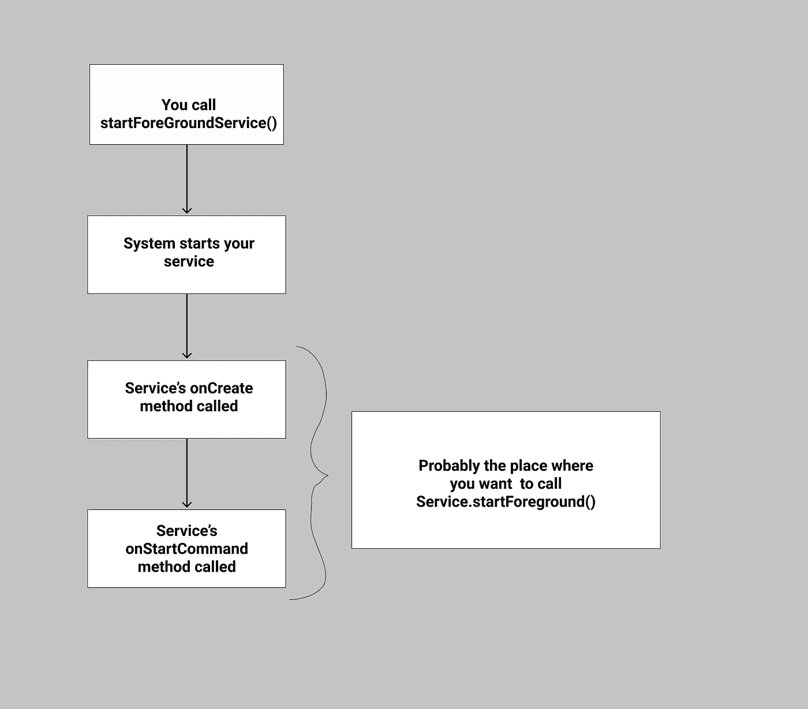

# Context.startForegroundService()未调用 Service.startForeground():已解决

> 原文：<https://medium.com/geekculture/context-startforegroundservice-did-not-then-call-service-startforeground-solved-7640d5ba394a?source=collection_archive---------0----------------------->


在过去一年左右的时间里，这个问题一直伴随着我。这次崩溃的原因是

“如果你的服务在使用命令`startForegroundService`启动后 5 秒钟内没有调用`startForeground`...然后它会产生一个 ANR +崩溃。”

不管我做了什么，包括

1.  在前台服务的 onStartCommand 方法的开头添加一个带有通知的 [startForeground()](https://developer.android.com/reference/android/app/Service.html#startForeground(int,%20android.app.Notification)) 命令。
2.  添加 [startForeground()](https://developer.android.com/reference/android/app/Service.html#startForeground(int,%20android.app.Notification)) 命令，在 onCreate 方法中通知。

没用。此外，这个问题在测试过程中无法重现，这使得修复变得更加困难。
在我们开始讨论解决方案之前，让我们看看当我们启动前台服务时会发生什么。



如果你刚刚阅读了开发者文档[这里的](https://developer.android.com/guide/components/foreground-services)，你就会这么做。

```
Before we start discussing the solution, you must be aware of what a bound service is. Read about bound services here
[https://developer.android.com/guide/components/bound-services](https://developer.android.com/guide/components/bound-services)
```

那么让我们来谈谈解决方案:

不是作为前台服务启动服务，而是作为后台服务启动服务，绑定到它，然后当您的活动/UI 组件中有可用的服务实例时，您可以直接调用服务内部的方法。此时，您可以调用

```
Intent intent = new Intent(context, MyService.class);
ContextCompat.*startForegroundService*(context, intent);
mService.doForegroundThings();
```

在服务类中添加一个方法 doForeGroundThings()，并在该方法中添加前台通知。
就是这样。现在您有了带有通知的前台服务。
如果您对代码感兴趣，可以看看这个示例应用程序代码

[](https://github.com/svvashishtha/ServiceStartExample) [## svvashishtha/ServiceStartExample

### 展示启动前台服务的优化的一个示例一个与前台服务的使用相关的常见崩溃…

github.com](https://github.com/svvashishtha/ServiceStartExample)