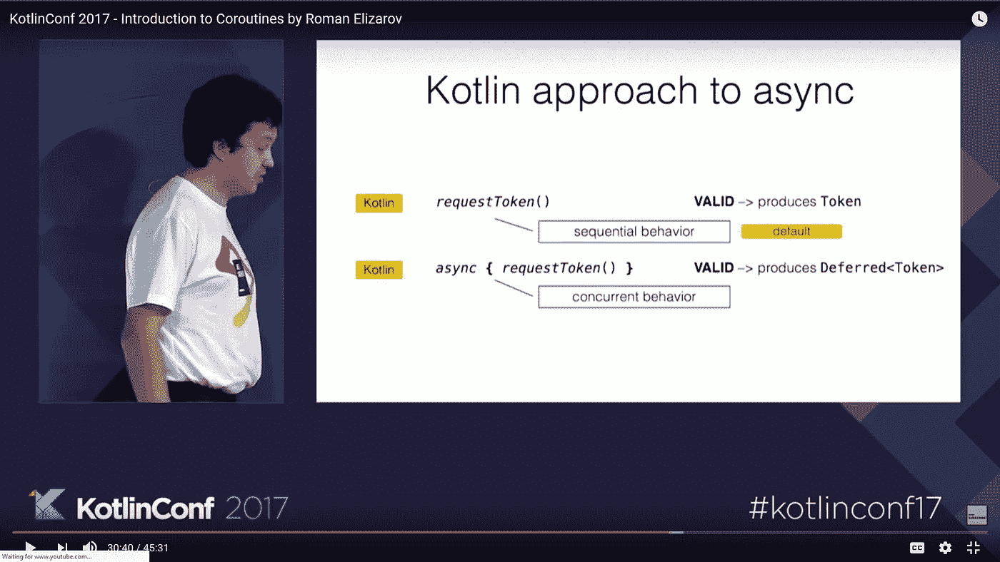
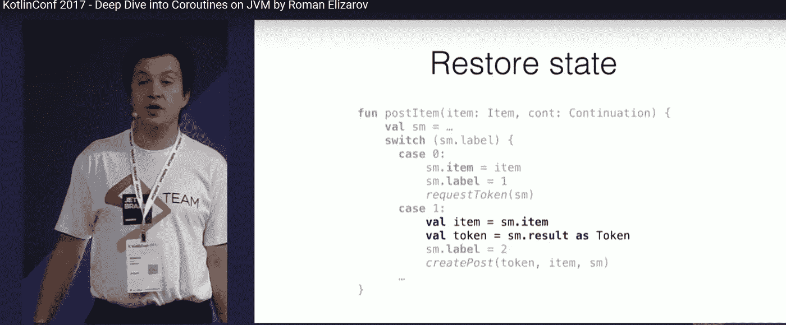
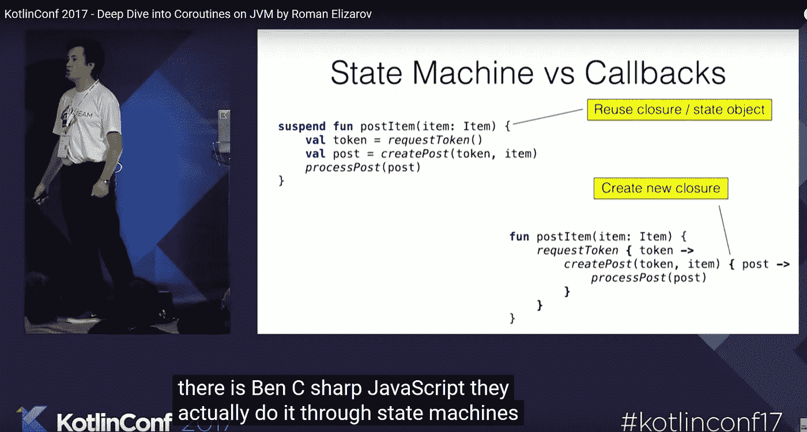
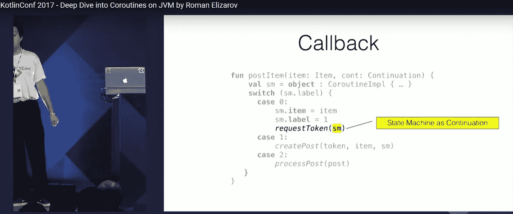
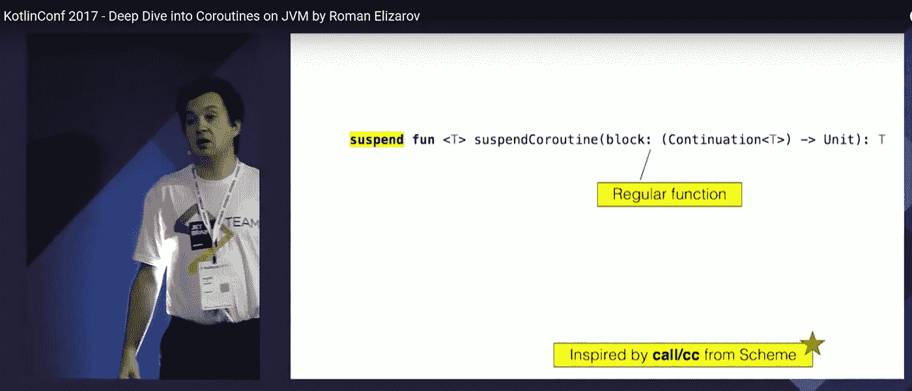

# 延续、协同程序和生成器

> 原文：<https://medium.com/geekculture/continuation-coroutine-continuation-generator-9a1af03a3bed?source=collection_archive---------1----------------------->

和其他例程

Python 中的 generator 是什么？让我们看看维基百科是怎么说的:

**注意:**我已经简化了一些代码。

> *2001 年 2.2 版本的*[*Python*](https://en.wikipedia.org/wiki/Python_(programming_language))*中增加了生成器。*[*【6】*](https://en.wikipedia.org/wiki/Generator_(computer_programming)#cite_note-python-6)*一个示例生成器:*

> 在 Python 中，生成器可以被认为是一个迭代器，它包含一个冻结的堆栈帧。每当在迭代器上调用 `*next()*` *时，Python 恢复冻结帧，正常执行直到到达下一个* `*yield*` *语句。然后，生成器的帧再次被冻结，生成的值返回给调用者。*

[https://en . Wikipedia . org/wiki/Generator _(computer _ programming)# Python](https://en.wikipedia.org/wiki/Generator_(computer_programming)#Python)

那么，生成器仅仅是迭代器吗？但是这个怪异的`yield`是什么东西？以及 for-loop 里面的`break`语句如何退出生成器？

让我们看看标题:

> *在计算机科学中，*生成器*是一个* ***例程*** *，可以用来控制循环的迭代行为。所有生成器也是迭代器。生成器与返回数组的函数非常相似，因为生成器有参数，可以调用，* ***生成一系列值*** *。然而，一个* ***生成器一次产生一个值*** *，而不是构建一个包含所有值的数组并一次返回它们，这需要更少的内存并允许调用者立即开始处理前几个值。简而言之，一个* ***生成器看起来像一个函数，但行为却像一个迭代器。***

[https://en . Wikipedia . org/wiki/Generator _(计算机编程)](https://en.wikipedia.org/wiki/Generator_(computer_programming))

但是 generator 怎么可能是一个看起来像函数但行为像迭代器的*例程呢？*例程(为了简单起见，可以认为是函数)返回单个值(或者根本没有常规值)并退出执行。如果你再次调用它，它不会记得它之前的状态。据说，它返回的不是单个值，“*不是* *包含所有值并一次全部返回的数组”，*而是*“****生成器一次生成一个值”。*** 这是怪异的野兽。

让我们继续在维基百科上阅读:

> `*Generators*` *可以按照更有表现力的控制流构造来实现，比如* `[*coroutines*](https://en.wikipedia.org/wiki/Coroutine)`*或者一流的* `[*continuations*](https://en.wikipedia.org/wiki/Continuation)` *。生成器，也称为半协同程序，是协同程序的一个特例(也比协同程序弱)，因为它们总是将* `*yield*` *控制回调用者(当传回一个值时)，而不是指定一个要跳转到的协同程序；参见* [*协程与生成器*](https://en.wikipedia.org/wiki/Coroutine#Comparison_with_generators) *的比较。*

[https://en . Wikipedia . org/wiki/Generator _(计算机编程)](https://en.wikipedia.org/wiki/Generator_(computer_programming))

好的，那么，`generatos`可以实现为`[*coroutines*](https://en.wikipedia.org/wiki/Coroutine)` *或者* `[*continuations*](https://en.wikipedia.org/wiki/Continuation)` *。*但是这些野兽是什么？让我们看看维基百科:

> *在计算机科学中，一个* ***延续*** *是计算机程序控制状态的一个* ***抽象表示*** *。continuation 实现(* [*具体化*](https://en.wikipedia.org/wiki/Reification_(computer_science)) *)程序控制状态，即 continuation 是一种数据结构，表示计算过程在过程执行中的给定点；所创建的数据结构可以被编程语言访问，而不是隐藏在运行时环境中。延续对于在编程语言中编码其他控制机制很有用，比如异常、生成器、协程等等。*

[https://en.wikipedia.org/wiki/Continuation](https://en.wikipedia.org/wiki/Continuation)

所以，延续是某物的抽象表现。这不是很有帮助。它可以“编码”(不管这意味着什么)生成器和协程。让我们看看什么是协程:

> ***协程*** *是将* [*子例程*](https://en.wikipedia.org/wiki/Subroutine) *概括为* [*非抢占式多任务*](https://en.wikipedia.org/wiki/Non-preemptive_multitasking) *的计算机程序组件，通过允许暂停和恢复执行。*

【https://en.wikipedia.org/wiki/Coroutine 

什么是[非抢占式多任务](https://en.wikipedia.org/wiki/Non-preemptive_multitasking)？又是维基百科:

> ***协同多任务*** *又称* ***非抢占式多任务*** *，是计算机多任务处理的一种风格，操作系统从不发起从一个正在运行的进程到另一个进程的上下文切换。取而代之的是，进程周期性地或者在空闲或逻辑阻塞时自动地* [*让出控制*](https://en.wikipedia.org/wiki/Yield_(multithreading)) *，以便能够同时运行多个应用。这种类型的多任务被称为“合作的”，因为所有的程序必须合作，整个调度方案才能工作。在这种方案中，操作系统的进程调度程序被称为协作调度程序，它的作用被简化为启动进程，并让它们自愿将控制权交还给它。*

[https://en.wikipedia.org/wiki/Cooperative_multitasking](https://en.wikipedia.org/wiki/Cooperative_multitasking)

什么是[子程序](https://en.wikipedia.org/wiki/Subroutine)？协程应该以某种方式概括它们…再次维基百科:

> *在计算机编程中，* ***子程序*** *是执行特定任务的程序指令序列，打包成一个单元。这个单元可以在程序中任何需要执行特定任务的地方使用。*
> 
> *子程序可以在程序中定义，也可以在许多程序可以使用的库中单独定义。在不同的编程语言中，一个子程序可能被称为* ***例程*******子程序*******函数*******方法*** *，或者* ***过程*** *。从技术上讲，这些术语都有不同的定义。有时会使用通用的总括术语* ***可调用单元*** *。****
> 
> ***…***
> 
> ***调用堆栈***
> 
> ***大多数现代子程序调用的实现都使用一个* [*调用栈*](https://en.wikipedia.org/wiki/Call_stack) *，* [*栈数据结构的特例*](https://en.wikipedia.org/wiki/Stack_(data_structure)) *，来实现子程序的调用和返回。每个过程调用在栈顶创建一个新的入口，称为栈帧；当过程返回时，其堆栈帧从堆栈中删除，其空间可用于其他过程调用。每个堆栈帧包含相应调用的私有数据，通常包括过程的参数和内部变量，以及返回地址。***
> 
> ***…调用堆栈方法的另一个优点是，它允许* [*递归子例程调用*](https://en.wikipedia.org/wiki/Recursion_(computer_science)) *，因为对同一过程的每个嵌套调用都获得其私有数据的单独实例。***

**[https://en.wikipedia.org/wiki/Subroutine](https://en.wikipedia.org/wiki/Subroutine)**

**因此，粗略地说，子程序是通常用调用栈实现的常规函数。**

**Corotine 是“函数”的概括，它允许*的执行被暂停和恢复。*它以非抢占的方式完成，即“功能”本身应该`yield`控制。**

# **剧透:**

**Corutine 可以实现为"**显式状态机"形式的大型复杂的** [**switch 语句**](https://en.wikipedia.org/wiki/Switch_statement) **或经由**[**goto**](https://en.wikipedia.org/wiki/Goto)**语句**(见下文)。**

**为了更好地理解这个概念，让我们来比较一下协程和子程序。引自[https://en . Wikipedia . org/wiki/Coroutine # Comparison _ with _ subroutine](https://en.wikipedia.org/wiki/Coroutine#Comparison_with_subroutines)**

> ***与子程序*的比较**
> 
> ***子程序是协程程序的特例。调用子程序时，执行从开始处开始，一旦子程序退出，就结束；* ***子程序的一个实例只返回一次，在调用*** *之间不保持状态。相比之下，协程可以通过调用其他协程来退出，这些协程稍后可能会返回到它们在原始协程中被调用的位置；从协程的角度来看，这不是退出，而是调用另一个协程。因此，* ***协程实例持有状态，并且在调用之间变化；一个给定的协程可以同时有多个实例*** *。通过*[*"*](https://en.wikipedia.org/wiki/Yield_(multithreading))`[*yielding*](https://en.wikipedia.org/wiki/Yield_(multithreading))`[*"*](https://en.wikipedia.org/wiki/Yield_(multithreading))*调用另一个协程与简单地调用另一个例程(然后，该例程也将返回原点)之间的区别在于，* `yield` 相互调用的两个协程之间的关系不是调用方-被调用方的关系，而是对称的。**
> 
> **任何子程序都可以被翻译成不调用 yield 的协程。*【4】***

***好吧，这是微不足道的。***

***让我们继续:***

> ***…***
> 
> ****与螺纹的比较****
> 
> *****协程与*** [***线程***](https://en.wikipedia.org/wiki/Thread_(computing)) ***非常相似。*** *然而，协程是***多任务的，而线程通常是* [*抢先*](https://en.wikipedia.org/wiki/Preemptive_multitasking) [*多任务*](https://en.wikipedia.org/wiki/Computer_multitasking) *。这意味着协程提供了* [*并发*](https://en.wikipedia.org/wiki/Concurrency_(computer_science)) *而不是* [*并行*](https://en.wikipedia.org/wiki/Parallel_computing) *。协程相对于线程的优势在于，它们可以在***上下文(* [*)中使用，协程之间的*](https://en.wikipedia.org/wiki/Context_switch) *切换不需要涉及任何* [*系统调用*](https://en.wikipedia.org/wiki/System_calls) *或任何* [*阻塞*](https://en.wikipedia.org/wiki/Blocking_(computing)) *调用为了守护* [*临界区*](https://en.wikipedia.org/wiki/Critical_sections) *，而不需要来自操作系统的支持。*****
> 
> ***以对调用代码透明的方式，使用抢先调度的线程实现协同程序是可能的，但是一些优点(特别是对硬实时操作的适用性和在它们之间切换的相对廉价)将会丧失。***
> 
> ***与发电机的比较***
> 
> **[***发电机***](https://en.wikipedia.org/wiki/Generator_(computer_science)) *又被称为半整流子，而* ***则是整流子的子集*** *。具体来说，* ***虽然都可以多次产出*** *【但如何？]* **、*、*、**暂停执行并允许在多个入口点重新进入，它们不同之处在于协同程序控制执行完成后立即继续的能力，而生成器则不能，而是将控制权转移回生成器的调用方**、*。***[*【6】*](https://en.wikipedia.org/wiki/Coroutine#cite_note-6)**

**这意味着，我们可以先发制人地忘掉****vs**[**协同地忘掉**](https://en.wikipedia.org/wiki/Cooperative_multitasking) [**多任务**](https://en.wikipedia.org/wiki/Computer_multitasking)ng，这与**发电机无关。**我们继续:****

> *****也就是说，由于生成器主要用于简化迭代器的编写，生成器中的* `***yield***` ***语句*** *并未指定跳转到哪个协同例程，而是* ***将值传递回父例程。*** *…*****

****我故意跳过了某个部分，我将在下面回到这个部分。****

> *****C 的实现*****
> 
> *****为了实现通用的互斥，必须获得* ***第二个*** [***调用堆栈***](https://en.wikipedia.org/wiki/Call_stack) *，这是 C 语言不直接支持的一个特性。实现这一点的一个可靠的(尽管是平台特定的)方法是，在最初创建协同程序时，使用少量的内联程序集来显式操作堆栈指针……*****
> 
> *****一旦获得了第二个调用栈…那么就可以使用* [*标准 C 库*](https://en.wikipedia.org/wiki/Standard_C_library) *中的* [*setjmp 和 longjmp*](https://en.wikipedia.org/wiki/Setjmp/longjmp) *函数来实现协程之间的切换。这些函数分别保存和恢复* [*堆栈指针*](https://en.wikipedia.org/wiki/Stack_pointer) *、* [*程序计数器*](https://en.wikipedia.org/wiki/Program_counter) *、被调用者保存的* [*寄存器*](https://en.wikipedia.org/wiki/Processor_register) *，以及*[*【ABI*](https://en.wikipedia.org/wiki/Application_binary_interface)*所要求的任何其他内部状态，从而在产生后返回到一个协程时恢复所有的状态不依赖 setjmp 和 longjmp 函数的极简实现可以通过一小块* [*内联汇编*](https://en.wikipedia.org/wiki/Inline_assembly) *实现相同的结果，该汇编只交换堆栈指针和程序计数器，而* [*则交换*](https://en.wikipedia.org/wiki/Clobbering#Assembly) *所有其他寄存器。这可以显著加快速度，因为 setjmp 和 longjmp 必须根据 ABI 保守地存储所有可能正在使用的寄存器，而 clobber 方法允许编译器只存储(通过溢出到堆栈)它知道实际正在使用的寄存器。*****

****好的。我们有其他选择吗？****

> *****实现为****c#*** *…*****
> 
> ****[*【9】*](http://msdn.microsoft.com/en-us/library/dscyy5s0(VS.80).aspx)*—The。NET 2.0+框架现在通过迭代器模式和 yield 关键字提供半协同程序(* [*生成器*](https://en.wikipedia.org/wiki/Generator_(computer_programming)) *)功能。*****
> 
> ****[*C# 5.0*](https://en.wikipedia.org/wiki/C_Sharp_5.0) *包含* [*await*](https://en.wikipedia.org/wiki/Await) *语法支持。
> …*****
> 
> *****实现为* ***Java*******
> 
> *****协同程序在*[*Java*](https://en.wikipedia.org/wiki/Java_(programming_language))*中有几种实现。尽管受到 Java 抽象的限制，JVM 并没有排除这种可能性。*[*【39】*](https://en.wikipedia.org/wiki/Coroutine#cite_note-jvmsummit-39)*这里使用了四种通用方法，但是有两种打破了符合标准的 JVM 之间的字节码可移植性。*****
> 
> ******修改后的 JVM。可以构建一个打了补丁的 JVM 来更本地地支持协程。* [*达芬奇 JVM*](http://openjdk.java.net/projects/mlvm/) *已经创建了补丁。*****
> 
> *******修改字节码。通过动态地或在编译时重写常规的 Java 字节码，协程功能是可能的。工具包包括*[*Java flow*](http://commons.apache.org/sandbox/commons-javaflow/)*，* [*Java 协程*](https://code.google.com/p/coroutines/) *，* [*协程*](https://github.com/offbynull/coroutines) *。******
> 
> ******平台特定的 JNI 机制。这些使用在 OS 或 C 库中实现的 JNI 方法为 JVM 提供功能。*****
> 
> ******线程抽象。使用线程实现的协程库可能是重量级的，尽管性能会根据 JVM 的线程实现而有所不同。*****
> 
> *****实现为* ***科特林*******
> 
> ****[*科特林*](https://kotlinlang.org) *实现协程作为* [*第一方库*](https://github.com/Kotlin/kotlinx.coroutines) *的一部分。*****
> 
> *****…*****
> 
> *****实现为* ***Python*******
> 
> ****[*Python*](https://en.wikipedia.org/wiki/Python_(programming_language))*2.5 基于扩展生成器(*[*PEP 342*](https://www.python.org/dev/peps/pep-0342/)*)*，实现了对类协程功能的更好支持****
> 
> ****[*Python*](https://en.wikipedia.org/wiki/Python_(programming_language))*3.3 提高了这种能力，通过支持委托给子生成器(*[*PEP 380*](https://www.python.org/dev/peps/pep-0380/)*)*****
> 
> ****[*Python*](https://en.wikipedia.org/wiki/Python_(programming_language))*3.4 引入了在*[*PEP 3156*](https://www.python.org/dev/peps/pep-3156/)*中标准化的全面异步 I/O 框架，其中包括利用子生成器委托*的协程****
> 
> ****[*Python*](https://en.wikipedia.org/wiki/Python_(programming_language))*3.5 引入了对具有 async/*[*await*](https://en.wikipedia.org/wiki/Await)*语法的协同程序的显式支持(*[*PEP 0492*](https://www.python.org/dev/peps/pep-0492/)*)。*****
> 
> *****自*[*Python*](https://en.wikipedia.org/wiki/Python_(programming_language))*3.7 async/await 成为了保留关键字***。******
> 
> ****[*小事件*](http://eventlet.net/)****
> 
> ****[*格林利特*](https://github.com/python-greenlet/greenlet)****
> 
> ****[gevent](http://www.gevent.org)****
> 
> ****[*无栈 python*](http://www.stackless.com/)****
> 
> *****用* ***汇编*** *语言*实现****
> 
> *****机器依赖的* [*汇编语言*](https://en.wikipedia.org/wiki/Assembly_language) *经常为协程执行提供直接的方法。例如，在* [*宏-11*](https://en.wikipedia.org/wiki/MACRO-11)*[*PDP-11*](https://en.wikipedia.org/wiki/PDP-11)*系列小型机的汇编语言中，“经典”协程切换受指令“JSR PC，@(SP)+”的影响，指令跳转到从堆栈中弹出的地址，并将当前(即* ***的地址)下一个*** 【T44 在[*VAXen*](https://en.wikipedia.org/wiki/VAX)*(在*[*Macro-32*](https://en.wikipedia.org/wiki/VAX_Macro)*)上的可比指令是“JSB @(SP)+”。甚至在一个* [*摩托罗拉 6809*](https://en.wikipedia.org/wiki/Motorola_6809) *上还有“JSR [，S++]”的指令；请注意“++”，因为有 2 个字节(地址)从堆栈中弹出。此指令多用于(标准)【监视器】* [*辅助*](https://en.wikipedia.org/wiki/ASSIST_(computing)) *09。******

****让我们回到跳过的部分:****

> ****从 2003 年开始，许多最流行的编程语言，包括 C 语言及其衍生语言，都不直接支持该语言或其标准库中的协程。(这在很大程度上是由于*****子程序实现*** *的局限性。)C++库* [*Boost 是个例外。上下文*](http://www.boost.org/doc/libs/1_55_0/libs/context/doc/html/index.html) *，部分* [*boost 库*](http://www.boost.org) *，支持 POSIX、Mac OS X、Windows 上 ARM、MIPS、PowerPC、SPARC、x86 上的上下文交换。协程可以建立在 Boost.Context 之上*******
> 
> *****在协程是某个机制的自然实现，但不可用的情况下，典型的响应是使用* [*闭包*](https://en.wikipedia.org/wiki/Closure_(computer_science)) *—一个带有状态变量的* **子例程(** [**静态变量**](https://en.wikipedia.org/wiki/Static_variable) **，通常是布尔标志)来维护调用之间的内部状态，并将控制转移到正确的点** *。基于状态变量的值，代码中的条件导致在连续调用中执行不同的代码路径。另一个典型的响应是以大而复杂的 [**switch 语句**](https://en.wikipedia.org/wiki/Switch_statement) **的形式实现一个*** **显式状态机，或者通过一个**[**goto**](https://en.wikipedia.org/wiki/Goto)**语句** *，特别是一个* [*计算 goto*](https://en.wikipedia.org/wiki/Computed_goto) *。这种实现被认为难以理解和维护，也是协程支持的一个动机。*****
> 
> ****[*线程*](https://en.wikipedia.org/wiki/Thread_(computing)) *，以及在较小程度上* [*纤程*](https://en.wikipedia.org/wiki/Fiber_(computer_science)) *，是当今主流编程环境中协程的替代方案。线程为管理同时执行的代码段的实时协作交互提供了便利。..*****
> 
> *****线程和协程的一个重要区别是线程通常被抢先调度，而协程不是。因为线程可以在任何时刻被重新调度，并且可以并发执行，所以使用线程的程序必须小心* [*锁定*](https://en.wikipedia.org/wiki/Lock_(computer_science)) *。相反，因为协程只能在程序中的特定点被重新调度，并且不能同时执行，所以使用协程的程序通常可以避免完全锁定。(这个属性也被引用为* [*事件驱动*](https://en.wikipedia.org/wiki/Event-driven_programming) *或者异步编程的一个好处。)*****
> 
> ****由于纤程是协同调度的，所以它们为实现上述协程提供了一个理想的基础。[*【20】*](https://en.wikipedia.org/wiki/Coroutine#cite_note-msdn-wrap-20)*然而，与线程相比，系统对纤程的支持往往不足。*****

****[https://en.wikipedia.org/wiki/Coroutine#Implementations](https://en.wikipedia.org/wiki/Coroutine#Implementations)****

****这里，就是答案！Corutine 可以实现为"**显式状态机"形式的大型复杂的** [**switch 语句**](https://en.wikipedia.org/wiki/Switch_statement) **或经由**[**goto**](https://en.wikipedia.org/wiki/Goto)**语句**。例如，科特林选择了这种方法。你可以看到下面嵌入的 2 个视频。****

****正如它声明自己的 Javascript 一样，C#也使用这种方法。****

****************************************

****[https://www.youtube.com/watch?v=_hfBv0a09Jc](https://www.youtube.com/watch?v=_hfBv0a09Jc)****

****[https://www.youtube.com/watch?v=YrrUCSi72E8](https://www.youtube.com/watch?v=YrrUCSi72E8)****