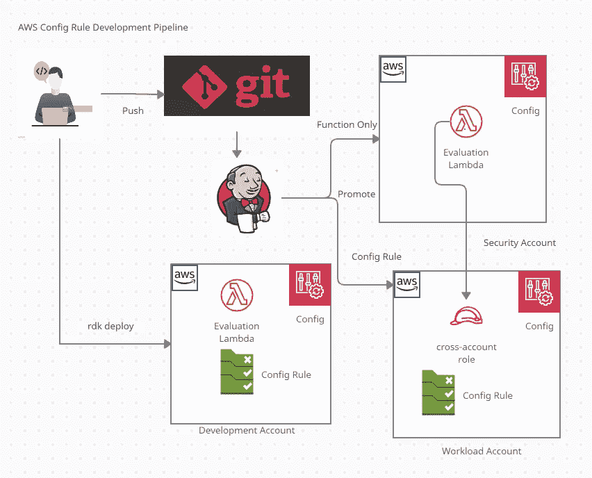
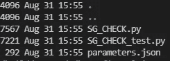
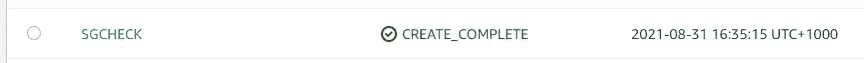
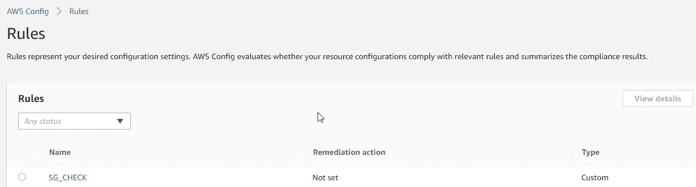

# 使用 Cloudformation 或 Terraform 在多帐户中持续交付 AWS 配置规则

> 原文：<https://medium.com/geekculture/continuous-delivery-of-aws-config-rule-in-multi-account-using-cloudformation-or-terraform-f0fd336ac078?source=collection_archive---------18----------------------->

通过管道确保持续合规

AWS Rule Development Kit (RDK)支持代码工作流合规性，允许您从工作站构建本地测试配置规则，将其部署到开发环境，并将其推广到生产环境。

在本文中，我将把它部署到 AWS 多帐户配置中，其中使用 Lambda 的评估逻辑被部署到一个中心帐户中，例如，安全帐户和配置规则被部署到工作负载帐户中。

# 先决条件

1.  AWS 帐户将需要配置 AWS 配置存储桶、记录器和交付渠道。
2.  rdk 安装在开发工作站和 Jenkins 管道中。
3.  AWS 凭证在环境中配置。
4.  S3 桶被创建到开发和安全帐户中以部署 lambda 代码。

# 解决方案概述

下图显示了使用 RDK 开发 AWS 配置规则的工作流。



它是这样工作的:

*   开发人员在他的工作站上使用 rdk 构建配置规则和单元测试。
*   开发人员将规则部署到开发帐户并测试它。
*   开发人员创建 cloudformation/terraform 清单文件。
*   当代码被推送到 git 时，Jenkins pipeline 开始工作并部署到安全和工作负载帐户。
*   当配置规则在开发环境中工作时，它被提升为仅将该功能部署到安全帐户和工作负载帐户中的配置规则。

# 开发和构建

让我们通过一个示例演练来创建一个配置规则，测试并部署它。

## 在本地安装 RDK 和 RDKlib

```
pip3 install rdk
pip3 install rdklib
```

只有当您想使用现有的 lambda 层来构建规则时，才需要 rdklib。

## **创建规则并部署到开发帐户**

让我们创建一个规则来检查 AWS 安全组的符合性。

```
rdk create SG_CHECK  --runtime python3.8 --resource-types AWS::EC2::SecurityGroup
```

它创建以下文件— SG_CHECK.py 包含 lambda 代码，SG_CHECK_test.py 包含 rdk deploy 使用的单元测试和参数。



在 SG_CHECK.py 中的“Add your custom logic here”下添加您的自定义评估逻辑

让我们运行一个本地测试，验证它是否正常。

```
rdk test-local SG_CHECK
```

让我们将资源部署到发展账户中。

```
rdk deploy SG_CHECK --custom-code-bucket my-lambda-bucket
```

部署完成后，让我们从 AWS Cloudformation 控制台验证 Cloudformation 堆栈是否完成。



另外，从 AWS 配置控制台验证是否创建了规则。



要清理部署，请使用以下命令-

```
rdk undeploy SG_CHECK
```

# 部署

您可以通过 Cloudformation 或 Terraform 部署 lambda 和 config 规则。请根据您的需要按照步骤操作。

## 为部署创建云信息资源

要使规则准备好通过 Jenkins pipeline 部署到安全和工作负载帐户中，我们需要遵循两个步骤-

*   部署到安全帐户—运行以下命令将 lambda 函数部署到安全帐户中。

```
rdk deploy SG_CHECK --functions-only --custom-code-bucket my-lambda-bucket
```

*   为工作负载帐户创建云信息模板—运行以下命令创建包含配置规则的云信息模板。

```
rdk create-rule-template SG_CHECK --rules-only -o config-rule-template.json
```

它将创建一个 json 模板，但不会创建交叉帐户 lambda 角色。让我们将它转换为 yaml，并添加 lambda 角色。

如果您想将其部署到多个工作负载帐户中，可以使用 stackset 来部署上述内容。

此外，在将代码推送到 git 之前，确保将 SG_CHECK.py 文件改为 asssume role 为 true。Lambda 默认使用上面创建的名为 config-role 的 IAM 角色。

```
ASSUME_ROLE_MODE = True
```

## 创建用于部署的地形资源

rdk 还允许您将资源导出为 terraform 清单。您可以使用下面的命令将其导出为 terraform 清单。

```
rdk export SG_CHECK -f terraform -v 0.12
```

您可以使用下面的命令测试它，以将其部署到开发环境中。但是要将它部署到安全和工作负载帐户中，您需要将它们分开。

```
terraform initterraform plan -var-file=sg_check.tfvars.json --var source_bucket=my-lambda-bucket
```

如果您没有使用默认配置文件，您可能还需要在 sg_check_rule.tf 文件中更改提供程序。

```
provider "aws" { profile    = "default"}
```

# 结论

总之，rdk 提供了无缝的开发人员体验，同时在开发环境中构建配置规则并将其部署到各个阶段。本文将通过大规模构建配置规则，帮助您开始持续的法规遵从性之旅。

# 参考

1.  [https://AWS . Amazon . com/blogs/mt/how-to-develop-custom-AWS-config-rules-using-the-rule-development-kit/](https://aws.amazon.com/blogs/mt/how-to-develop-custom-aws-config-rules-using-the-rule-development-kit/)
2.  [https://AWS . Amazon . com/blogs/devo PS/AWS-config-rdk-deploying-the-custom-rules-using-the-terra form/](https://aws.amazon.com/blogs/devops/aws-config-rdk-deploying-the-custom-rules-using-the-terraform/)