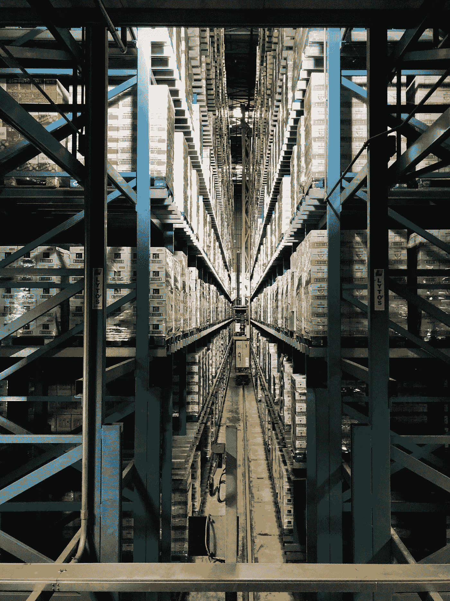

# Azure DevOps 管道和 Kubernetes 的持续部署

> 原文：<https://medium.com/geekculture/continuous-deployment-with-azure-devops-pipelines-and-kubernetes-12fe1c70b343?source=collection_archive---------7----------------------->

## 为您的应用程序创建连续的部署工作流

Photo by [Arno Senoner](https://unsplash.com/@arnosenoner?utm_source=medium&utm_medium=referral) on [Unsplash](https://unsplash.com?utm_source=medium&utm_medium=referral)

今天，我们生活在一个快速迭代的世界中，业务需求变化非常频繁。组织面临着对这些变化做出快速反应的挑战，以使其产品保持相关性并跟上竞争组织的步伐。