# 使用 AWS 和 Github 进行持续集成和交付

> 原文：<https://medium.com/geekculture/continuous-integration-and-delivery-using-aws-and-github-bafe848261b1?source=collection_archive---------15----------------------->

## 使用 CodeBuild & Elastic Beanstalk 部署 Node.js 应用程序

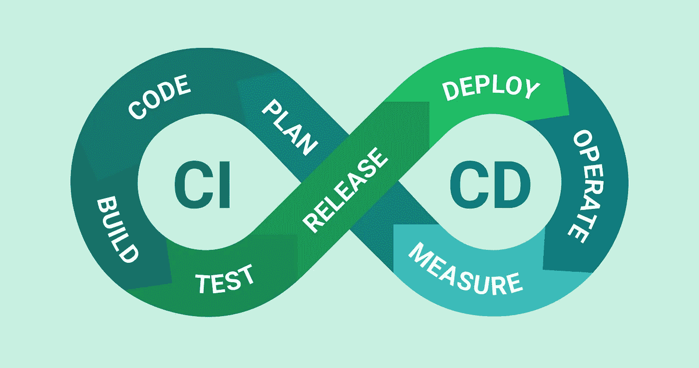

[source](https://www.google.com/url?sa=i&url=https%3A%2F%2Fdeanna.dev%2Fall-about-cicd%2F&psig=AOvVaw277fPYWgxOSC9owEVB8BIV&ust=1620349686496000&source=images&cd=vfe&ved=0CAIQjRxqFwoTCLCTto7vs_ACFQAAAAAdAAAAABAD)

当与团队一起开发时，您可能希望为代码何时能够合并到您的主分支建立规则，并控制新代码何时以及如何部署到特定环境。

例如，当团队成员准备将新代码合并到主分支中时:

*   我们首先要确保它至少有另一个团队成员的批准
*   新的变化不会破坏任何现有的测试

一旦一个拉请求满足了上面的标准，我们希望合并到我们的主分支，以自动地将变更部署到一个分段环境中。

# 应用程序

出于演示的目的，我创建了一个[小型 Express 应用程序](https://github.com/brianfromlife/aws-ci-cd)，您可以重新创建自己或者克隆它。

*   应用程序有一个成功返回“hello”的基本路由。
*   您可以运行 *npm 运行测试*来查看测试示例

📔**默认情况下，Elastic Beanstalk 会监听端口 8080，所以这个应用程序会监听这个端口。**

# 创建一个弹性 Beanstalk 应用程序

首先，让我们创建一个新的弹性 Beanstalk 应用程序。出于本文的目的，我们将保持简单并使用默认配置。

导航到 Elastic Beanstalk 门户并单击**创建应用程序**。

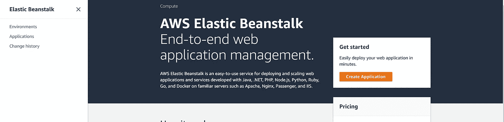

输入一个**应用程序名**。

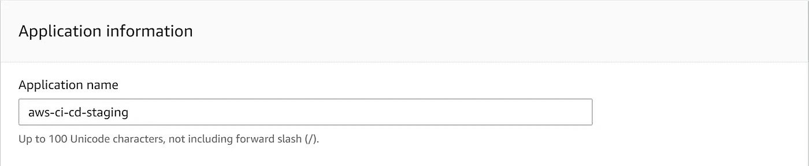

选择 Node.js 作为**平台**，使用最新或推荐的**平台分支**和**平台版本**。然后选择**样本应用**。最后，点击**创建应用**按钮。

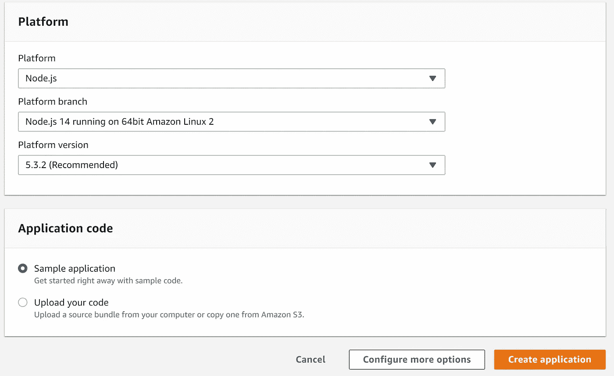

基础设施配置完成后，示例应用程序将在由 Elastic Beanstalk 生成的 URL 上可用。

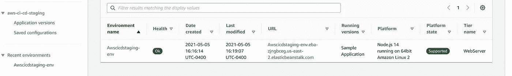

# 创建 S3 存储桶

我们将使用 S3 来存储一个包含新应用程序代码的 zip 文件。当我们部署一个新的应用程序时，Elastic Beanstalk 会在 S3 文件夹中查找源代码。

1.  导航到 S3 门户网站并点击**创建存储桶**。
2.  输入唯一的存储桶名称。
3.  点击屏幕底部的**创建存储桶**。

# 创建 IAM 用户

在 CodeBuild 中，我们将使用命令行将 zip 文件部署到 S3，并更新 Elastic Beanstalk 环境。让我们创建一个对这两种 AWS 服务都有权限的 CLI 用户。

**⚠️出于演示目的，新的 IAM 将完全访问 S3 和 EBS。这不是最佳实践，因为您应该将访问权限限制在仅需要的范围内。**

导航到 IAM 门户。在左侧选择**用户**，然后点击**添加用户**按钮。

输入一个**用户名**并给用户**编程访问**。然后，点击**下一步:权限**按钮。

选择**直接附加现有策略**。

在策略选择列表中，选中 **AmazonS3FullAccess** 和**administrator access-AWSElasticBeanstalk**的复选框。然后点击**下一步:标签**按钮。

在标签页面上，单击 **Next: Review** 按钮，因为我们不会为这篇文章添加标签。

在“查看”页面上，您应该看到以下内容:

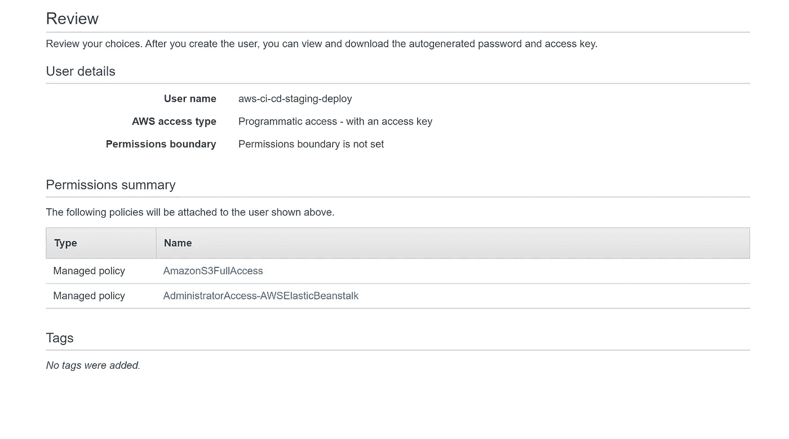

如果权限看起来正确，点击**创建用户**按钮。

⚠️在下一个屏幕上，确保将**访问密钥 ID** 和**秘密访问密钥**暂时复制到安全位置。我们将在后面的代码构建步骤中使用这些值。

# 拉请求的代码生成项目

首先，我们希望创建一个 CodeBuild 项目来安装 Node.js 依赖项并运行任何测试。如果测试通过，CodeBuild 将通知 Github 测试已经通过，并更新 pull 请求的状态检查。

导航到 CodeBuild 门户并点击**创建项目**。

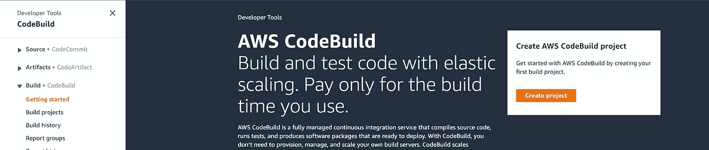

在*项目配置*部分，输入**项目名称。**

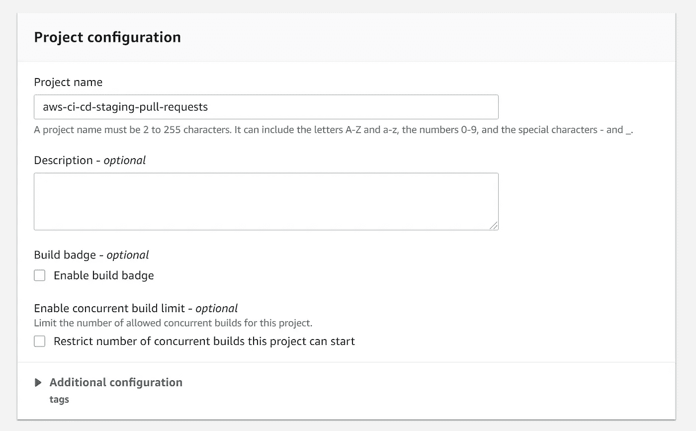

在*源*部分，选择 GitHub 作为**源提供者。**如果你还没有连接你的 Github 帐户来访问代码构建。然后，在我的 GitHub 账户中选择**资源库。在 **Github 资源库**下拉菜单中，选择包含本文代码的资源库。**

当您的构建开始时，单击复选框**向源代码提供者报告构建状态。**

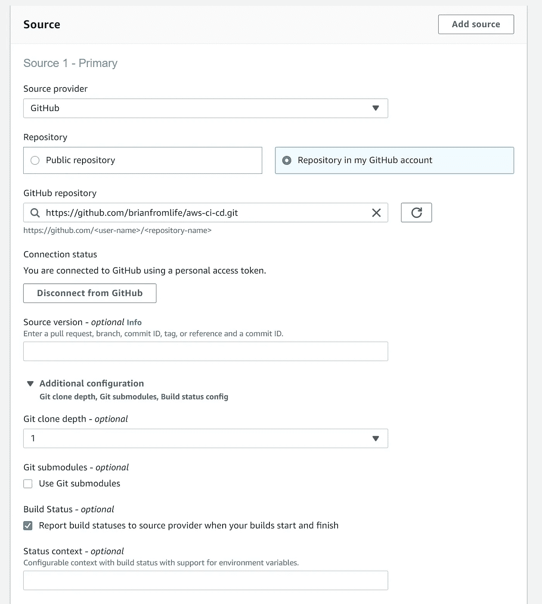

在**主源 webhook 事件**部分的**，**中，每次代码变更被推送到这个库时，点击**重建的复选框。**然后在**事件类型**下拉列表中，选择 *PULL_REQUEST_CREATED* 和 *PULL_REQUEST_UPDATED* 。

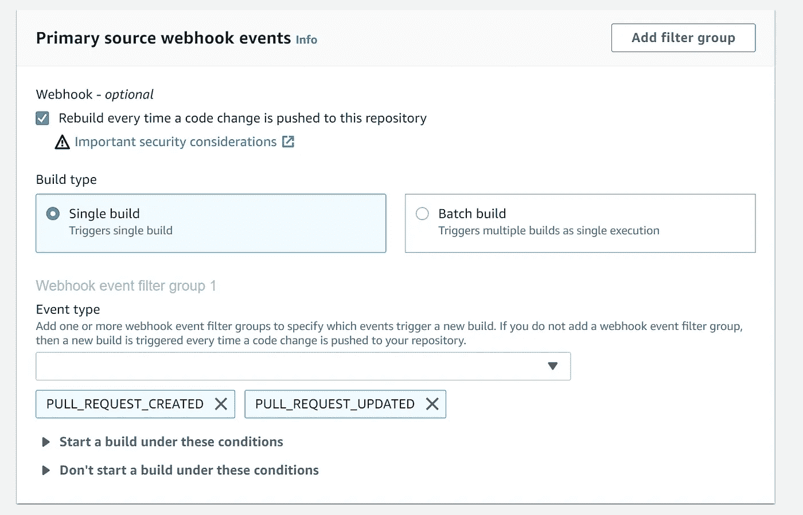

在*环境*部分，选择**管理镜像**。然后操作系统选择**亚马逊 Linux 2** 。对于运行时间，选择**标准**，然后选择最新的图像。选择 **Linux** 作为环境类型。最后，允许 CodeBuild 创建一个新的服务角色。

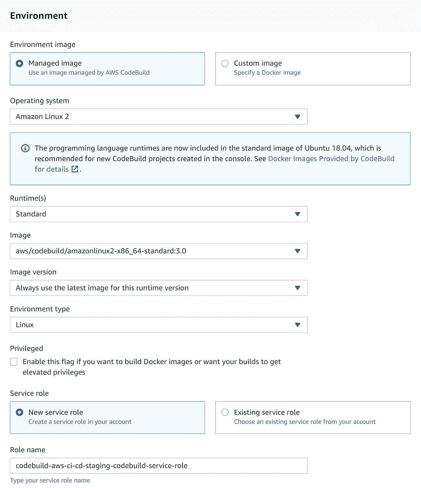

在 **Buildspec** 部分，选择**使用一个 Buildspec 文件。**将 Buildspec 名称设置为 *pipeline/build.yml.* 在我们的存储库中，这是我们将存储该代码构建步骤的文件夹路径和文件。

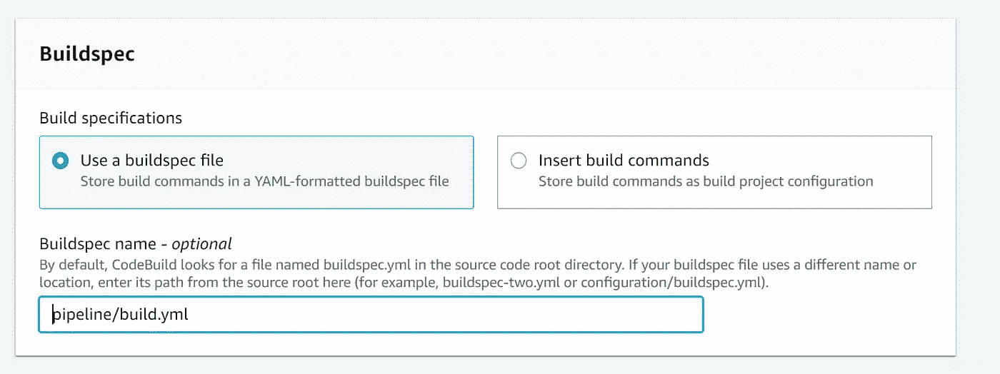

最后点击页面底部的**创建构建项目**。

# 用于合并的代码生成项目

我们还想创建一个 CodeBuild 项目，当一些东西合并到主分支时，它会将我们的应用程序部署到 Elastic Beanstalk。步骤与之前完全相同，除了一些小的变化:

*   在**源**部分，将**源版本**设置为*主版本*。
*   为该 CodeBuild 项目指定另一个名称，以指示其用于部署。比如我把我的命名为*AWS-ci-CD-staging-deploy*。
*   在**主源 webhook 事件中，**选择 **PULL_REQUEST_MERGED** 作为**事件类型**。
*   在 **Buildspec** 部分，使 **Buildspec 名称***pipeline/deploy . yml .*

此外，在**环境**部分，展开**附加配置部分**并添加以下环境变量。

对于 **DEPLOY_BUCKET** ，使用您之前创建的 BUCKET 名称。对于 **EBS_APP_NAME** 和 **EBS_ENV_NAME** ，使用来自 Elastic Beanstalk 应用程序的应用程序和环境名称。对于 **AWS_ACCESS_KEY_ID** 和 **AWS_SECRET_ACCESS_KEY** 环境变量，使用前面 IAM 步骤中的访问 ID 和访问键。

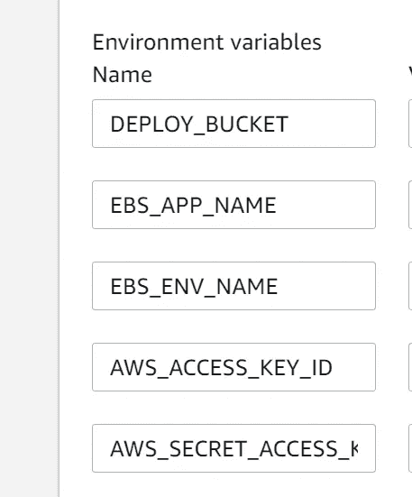

这些值将用于存储库中的*管道/部署. yml* 文件。

完成后，点击页面底部的**创建构建项目**。

# 创建一个新的分支和拉请求

在测试新功能之前，让我们创建一个新的拉请求。我做了一个小改动，创建了一个新分支，并创建了一个拉请求。

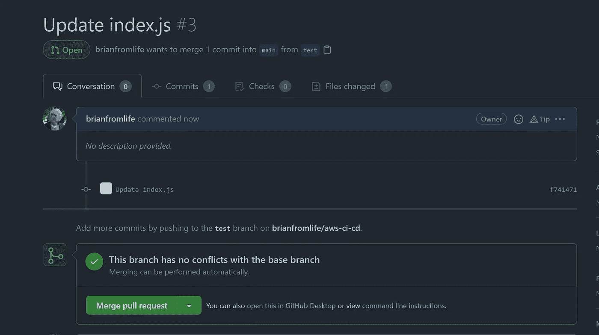

到目前为止，您应该能够毫无问题地合并到新代码中。让我们对存储库设置进行一些更改，这样我们可以确保测试通过，并且在合并之前我们有来自另一个团队成员的审查。

# 保护 Github 中的主要分支

在本文的存储库中，转到存储库的**设置**选项卡。在左侧选择**分支**，然后点击**添加规则**。

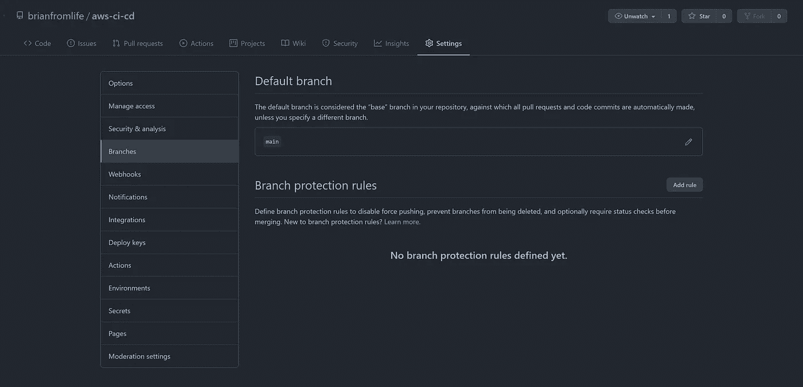

在**保护匹配分支**部分，给分支规则命名，然后我们需要选择几个值。

*   **合并前要求拉式请求审核，**设置为 1
*   **要求在合并前通过状态检查**和**要求在合并前分支是最新的**
*   在 status checks 列表中，为 pull 请求选择具有您的 CodeBuild 项目名称的选项(我在本文的测试中有多个项目)。
*   选择**包含管理员**，这样你就不能直接推送至主分支。

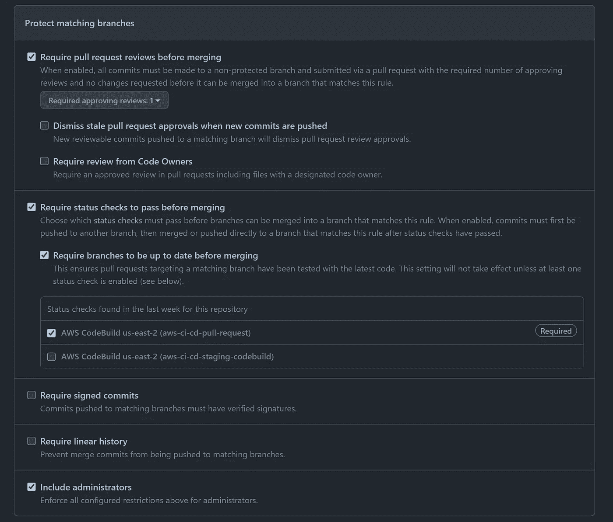

⚠️如果你是一个单独的开发者，或者只是想立即看到更新，你可以删除对评论数量的要求，这样 PR 就可以只与通过测试的项目合并。

完成后，点击页面底部的**保存更改**。

如果我们导航回“拉”请求，我们可以看到一个新的需求:

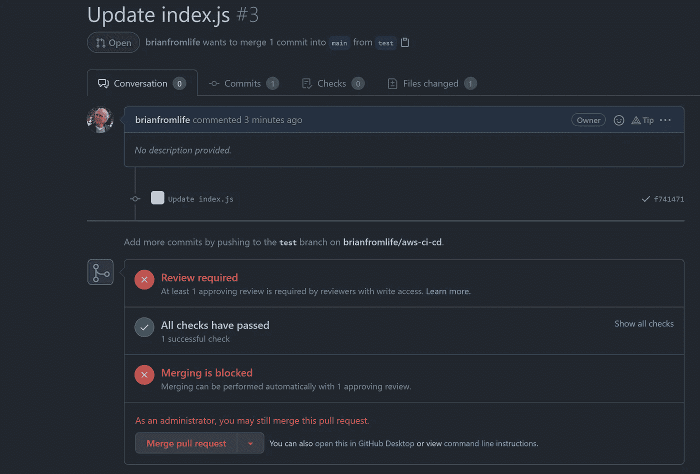

让我们将测试更新为失败。在 *app.test.js* 文件中，将预期响应文本从 *hello、*更改为 *hell* ，然后上推更改*。*过一会儿，您应该会看到 pull 请求更新了 CodeBuild 执行的结果。

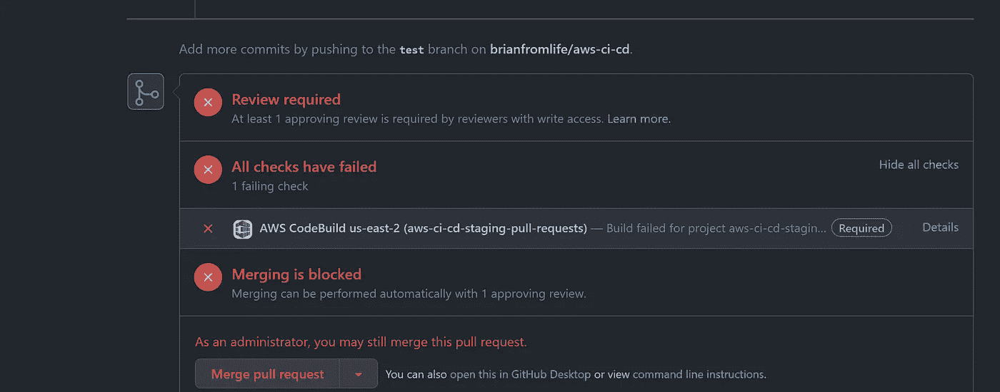

如果你点击 ***Details*** 链接，它会直接带你到 CodeBuild 项目的日志，看看为什么测试失败了。

把测试改回来，这样它就能通过，并把修改推回来。拉请求现在将显示测试通过。

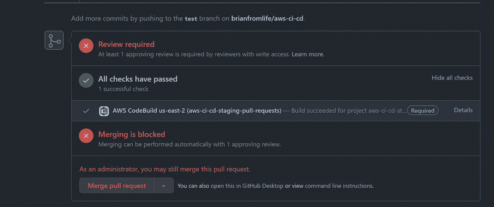

现在，要么删除另一个审阅的分支要求，要么让另一个用户批准该提取请求。

最后，将拉请求合并到主分支中。

现在，如果您访问 Elastic Beanstalk 应用程序门户中的 URL，您应该会看到新代码，它返回 *hello* 。

# 它是如何工作的

要了解发生了什么，请查看存储库的 pipeline 文件夹中的 *build.yml* 和 *deploy.yml* 。代码非常简单，它完成了工作。

对于部署步骤，我们基本上:

*   安装依赖项
*   为弹性豆茎所需的一切创建一个 zip 文件
*   将新的 zip 文件推送到我们的 S3 文件夹
*   为我们的 Elastic Beanstalk 应用程序创建一个新的应用程序版本，并将源代码设置为 S3 文件，使用内部版本号作为版本号
*   更新环境以获得新的源代码，并将其部署到我们的实例中

如果部署出现任何问题，在 Elastic Beanstalk 门户中，您可以选择一个应用程序版本，并使用 select**Actions>Deploy**来重新部署该版本。

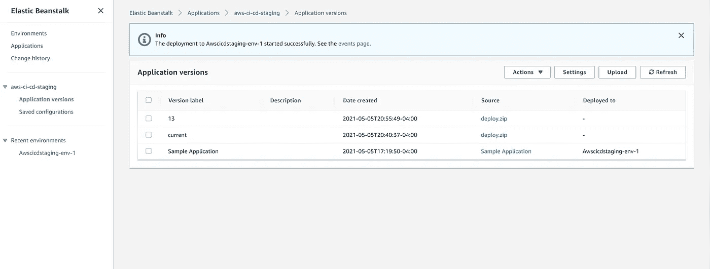

感谢阅读！