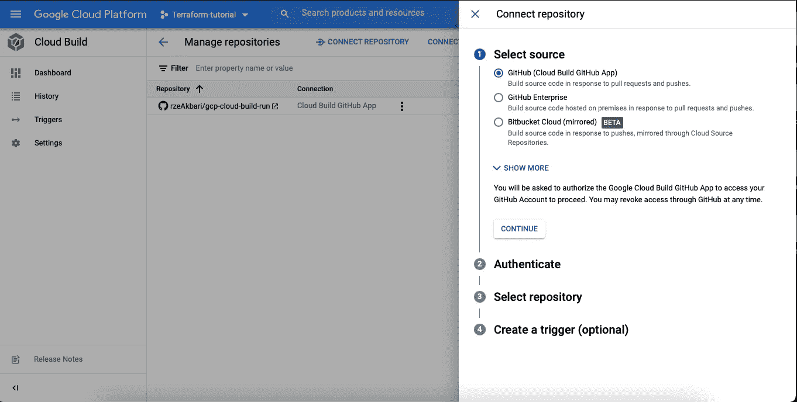
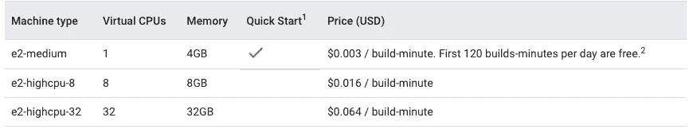
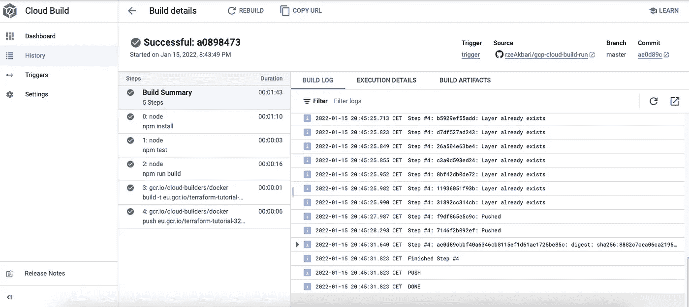

# 持续集成 GCP 云构建和 Terraform

> 原文：<https://medium.com/geekculture/continuous-integration-gcp-cloud-build-with-terraform-4b8ffc709c60?source=collection_archive---------3----------------------->

目标是使用本地 GCP CI 资源，以快速、可靠和自动化的方式生成可发布的源代码。


# 要求

*   [GCP 账户](https://console.cloud.google.com/)
*   [Terraform CLI](https://www.terraform.io/downloads.html) 本地安装，矿用 1.0.6。

## 贮藏室ˌ仓库

我将使用存储在我的 Github 帐户中的存储库，它包含要部署的应用程序的源代码，云构建配置和 Terraform 文件。你可以在这里找到储存库[。](https://github.com/rzeAkbari/gcp-cloud-build-run)

# GCP 配置

在我们开始使用 Terraform 之前，需要用 GCP 手动进行一些配置

## 启用 API

您需要启用一些特定于本教程的 GCP API，要这样做，请从您的控制台仪表板转到 API & Services，单击*启用 API 和服务*按钮。在这里，您可以搜索特定的 API 并启用它们。

*   计费 API
*   计算引擎 API
*   云构建 API

## 服务帐户权限

GCP 服务帐户授予 Terraform 操作资源的权限。创建一个供 Terraform 使用的服务帐户。出于本教程的考虑，它需要一组权限。

让我们创建一个 GCP IAM 角色，并添加所有必要的权限。最后，我们将这个角色分配给生成的服务帐户。以下是要添加的权限列表

*   storage.objects.list
*   存储.对象.获取
*   存储.对象.创建
*   存储.对象.删除
*   storage . bucket . create
*   roles/cloudbuild.builds.editor

## 土制铲斗

一个 GCP 云存储资源，你可以在那里存储你的地形图*状态*文件。 *state* 文件包含 Terraform 生成的资源信息。

请注意，通过 Terraform 处理的 GCP 资源的手动更改会在 Terraform 状态文件和实际基础架构之间产生差异。

## 连接存储库

如果你在 Github 上有你的代码，并且你**不想使用 webhook 触发器**，你需要手动连接 GCP 云构建到你的库。如果你的源代码存储在 Google 云源码或者云存储中，这里不需要配置。

在 Bitbucket Cloud 或 GitLab 的情况下，如果您对 *webhook 触发器不感兴趣，可以选择将*您的存储库镜像到*Google Cloud Source。*文档在这里是。

我的存储库存储在 Github 上，我想使用一个 push to master 分支事件。

要连接您的存储库，请转到您的 GCP 平台，并遵循以下步骤:

*   转到 Gloud 构建，然后触发。点击*管理存储库，在新页面中点击**创建存储库。*您应该会看到:



选择第一个选项，Cloud Build 将被安装在你的 Github 帐户上，你可以限制它可以从哪个库获取，并随时更改配置。

连接后，在*下的仓库*你看

```
<github owner>/<repository name>
```

我们将在使用 Terraform 时使用这些信息。

# 地形结构

如果您已经配置了 Terraform，请跳过。

Terraform 依靠称为 providers 的插件与 GCP 这样的平台进行交互。都是 Terraform 自己开发的，在 [Terraform 注册表](https://registry.terraform.io/browse/providers)公开。

> 提供者是上游 API 的逻辑抽象。他们负责理解 API 交互和公开资源。

在配置 Terraform 后端时，我们定义了两个模块，一个用于 Terraform 本身，一个用于提供商，在我们的例子中是 *Google。*

## 后端配置

创建一个具有任意名称的 Terraform 文件，如 backend-config.tf。

```
terraform {
  backend "gcs" {
    bucket  = "<bucket-name>"
    prefix  = "state"
  }  
  required_version = ">= 0.12.7"  
  required_providers { 
    google = {
      source = "hashicorp/google"
      version = "3.82.0"
    }
  }
}provider "google" {
  project = "<gcp_project_id>"
  region  = "<regione_name>"
  zone    = "<zone_name>"
}
```

在 *terraform 块*中，我们通知 terraform 将它的*状态*文件存储在我们已经在 Google 云存储(gcs)中创建的一个名为*状态的文件夹内的桶中。*我们也告诉 Terraform，如果你的版本低于 0.12.7 就不要继续，最后但同样重要的是，你需要 3.32.0 版本的 HashiCorp/google provider。Terraform Cli 将在调用时自动下载提供程序。设置 provider 的版本是一个很好的做法。

显然，第二个块配置提供者。

## 准许

我们通过导出一个环境变量，保存我们的 GCP 服务帐户 json 密钥的路径，让 Terraform 访问我们的 GCP 平台。

```
export GOOGLE_APPLICATION_CREDENTIALS={{GCP_sa_json_key_path}}
```

# 地形应用

Terraform 用*自动加载文件。应用时的 tf* 扩展。将基础设施应用到云平台时，需要运行四个命令。在本教程结束时，启动这些命令，您就可以开始了。

*   **terraform init** ，初始化 terraform 目录，下载提供程序，并将 terraform 状态文件存储在 GCP 桶中。
*   **terraform validate** ，验证语法
*   **带/不带变量的 terraform 计划**，客户端的试运行，并未显示我们定义的服务帐户缺少权限。
*   **terraform 应用有/无变量**，应用实际基础设施

Terraform 在申请时会自动锁定其状态文件，以确保没有其他人进行更改。

## 地形变量

定义一个变量有助于你避免*复制和粘贴*反模式，它给出了真实的单一来源。要定义一个 Terraform 变量，创建一个类似于 *variables.tf* 的任意 Terraform 文件，并通过以下

```
variable "project_id" {
 type        = string
 description = "GCP project id"
}
```

我们通过命令行传递存储在文件中的奇异值或组。要让它们通过一个文件，创建一个类型为*的文件。tfvars* 喜欢 *values.tfvars* 并把你的值用 key=value 格式比如

```
project_id = “<your project name>”
```

当启动 *terraform 计划*或 *terraform 应用*命令时，您可以传递这些值。

```
//Through Fileterraform apply -var-file="./values.tfvar" //OR Singularterraform apply -var="project_id=myprojectid"
```

# 与云构建的持续集成

GCP 有一个名为*云构建的本地 CI 解决方案。*通过云构建，我们创建了一个提取源代码、运行测试、最终构建和推送映像到注册表的步骤管道，从而实现持续集成。

撰写本教程时，在 GCP 打开云构建页面，我们在导航菜单中看到四个选项:

*   **仪表板**，您的构建的高级信息
*   **历史，**已经运行或者当前正在运行的构建的详细列表
*   **触发**，配置调用构建
*   **设置**，配置服务账号和工作池

说到将基础设施写成代码，有一个基本的显而易见的规则，所有你可以在平台上手动配置的，都可以硬编码。在 Cloud Build 中，*触发器*和*设置*是可配置的，因此它们在 Terraform provider 中有相应的配置，所以让我们创建它们。

## 扳机

顾名思义，我们使用触发器来调用 CI 构建。在 GCP 云构建中，有四个部分。

*   **事件**，触发配置项配置的事件
*   **源代码**，源代码配置
*   **配置**，具体云构建配置
*   **高级**

让我们为云构建触发器创建第一个简单的 Terraform 片段，它包含了上面提到的所有配置。在您的存储库中创建一个 main.tf 文件，并粘贴以下内容，我们将在后面讨论代码片段中的占位符。你可以在这里找到这个资源[的 Terraform 文档。](https://registry.terraform.io/providers/hashicorp/google/latest/docs/resources/cloudbuild_trigger#example-usage---cloudbuild-trigger-service-account)

```
resource "google_cloudbuild_trigger" "react-trigger" { **//Source section**  github { owner = "<github owner of repository added>" name  = "<repository name of repository added>" **//Events section**    push { branch = "<main branch name>"
       //or
       //tag    = "production" } }
  ignored_files = [".gitignore"]**//Configuration section** // build config file
 filename = "<path to cloudbuild.yaml file>" // build config inline yaml
 #build {
 #    step {
 #    name       = "node" 
 #    entrypoint = "npm"
 #    args       = ["install"]
 #    }
 #    step{...}
 #    ...
 #  } **//Advanced section**  substitutions = { <key1>= "<value1>" <key2> = "<value2>" }}
```

## 来源和事件

当谈到 Terraform 中的云构建触发器时，您需要拥有以下模块之一

*   **github** ，使用已经集成的库
*   **trigger_template** ，使用谷歌云存储库
*   **pubsub_config** ，使用一个已经集成的或者 Google 云存储库
*   **webhook_config** ，配置 ssh key 以触发带有 http post 的 CI

我们使用 *github* 块，在 event 部分下，我们可以选择特定分支或带有*标签的 *push* 或 *pull 请求。此事件将触发构建。**

**忽略 _ 文件和包含 _ 文件**

当触发构建时，您可以将*黑名单*或*白名单*文件。这两个属性都接受字符串文件名列表。将文件添加到 *ignored_files* 列表可防止在这些文件更改时触发构建，因此将其列入黑名单。将文件添加到 *included_files* 触发器仅在这些文件上有提交时才构建，因此将它们列入白名单。

## 配置

在这里，我们将介绍构建的实际步骤。这些步骤可以在一个 *Dockerfile* 中定义，有或者没有一个名为 *cloudbuild、*的构建配置文件，你也可以使用一个名为 B *uildpacks* 的原生云解决方案，没有任何 Dockerfile 或 cloudbuild 文件*。*

我们还可以在云构建触发器编辑器中内嵌构建配置步骤。

在上面的例子中，我使用了 *cloudbuild.yaml* 和我的 *Dockerfile* 的组合。还有*积木*注释，待后文讨论。

我们将检查这两个文件的内容，但是在此之前，先介绍一下要部署的应用程序。这是一个 React 应用程序，后端有一个 Nodejs express 服务器。我们的构建步骤包括:

*   从 Git 存储库签出代码
*   运行 *npm install* 安装 *package.json* 中定义的库
*   为应用程序中的单元测试运行 *npm 测试*
*   运行 *npm 运行构建*来创建包含生产就绪代码的*反应*构建*文件夹*
*   从*docker 文件*创建 docker 图像
*   将 docker 映像推送到 GCP 集装箱注册中心
*   将构建日志文件存储在 GCP 云存储中

**Cloudbuild.yaml**

如果您在这里查看这个构建配置文件[的文档，您可以看到模式是这样的。](https://cloud.google.com/build/docs/build-config-file-schema)

```
steps:
- **name: string (name of publicly available image to work with)
  entrypoint: string
  args: [string, string, ...]**
  env: [string, string, ...]
  dir: string
  id: string
  waitFor: [string, string, ...]
  secretEnv: string
  volumes: object(Volume)
  timeout: string (Duration format)
- name: string
  ...
```

它是构建步骤的组合，每个步骤都指定了您希望使用选项执行的操作。对于云构建的每一步，都会创建一个 docker 容器，它带有公开可用的映像来与*一起工作。*如果您想使用这些公开可用的图像之一，如*节点，*您可以将它们添加到*名称*关键字之后。

我们使用*入口点*来指定我们想要使用的工具。*节点*图像预装了 *npm* 和*纱线*。

最终，我们使用*参数*来调用我们想要的命令。

这是我们的文件，简单明了。

```
steps:- name: node entrypoint: npm args: ["install"]- name: node entrypoint: npm args: ["test"]- name: node entrypoint: npm args: ["run", "build"]- name: "gcr.io/cloud-builders/docker" args: ["build", "-t", "eu.gcr.io/$PROJECT_ID/quickstart-image:$COMMIT_SHA", "."]- name: "gcr.io/cloud-builders/docker" args: ["push", "eu.gcr.io/$PROJECT_ID/quickstart-image:$COMMIT_SHA"]logsBucket: "gs://<bucket name>"
```

有三点需要考虑

*   **$PROJECT_ID 和$COMMIT_SHA** 在构建过程中自动替换为正确的值。它们被称为*默认替换*，你可以在这里找到可用变量列表[。你也可以定义你的自定义替代变量，它已经在我们简单的 Terraform 文件中，我们稍后会谈到它。](https://cloud.google.com/build/docs/configuring-builds/substitute-variable-values#using_default_substitutions)
*   **logsBucket** 让您记录构建事件，文件会在每次运行后自动存储在 Bucket 中。
*   **集装箱注册处**，docker 图片将存储在 GCP 集装箱注册处，在我们的 *main.tf* 文件中我们这样创建它:

```
resource "google_container_registry" "registry" { project  = var.project_id location = "EU"}
```

*project_id* 是我们自己定义的 Terraform 变量。

**内联构建 Yaml**

与 cloudbuild.yaml 文件不同，Terraform Cloud Build Trigger 允许您将配置构建步骤定义为内联 yaml。举个例子:

```
 build {
  step {
    name       = "node"
    entrypoint = "npm"
    args       = ["install"]
  }
 }
```

**Dockerfile**

有了 cloudbuild 文件，我们的 Dockerfile 相当简单。

```
FROM nodeCOPY build buildCOPY server serverCMD [ "node","server/server.js" ]
```

## 先进的

在高级部分，我们可以添加*替代变量*，选中*批准*复选框并添加服务帐户。

**替代变量:**我们可以定义自定义替代变量，并在 cloudbuild.yaml 文件中使用它们，就像我们使用默认替代变量(如项目 id)一样。

```
substitutions = {
  <ke1>= "<value1>"
  <key2> = "<value2>"
}
```

**服务账号**:如果需要通过用户管理的服务账号公开手动构建触发器，可以添加自己的账号，默认使用[云构建服务账号](https://cloud.google.com/build/docs/cloud-build-service-account)。您可以在 Terraform 文档[中找到一个全面的示例，请点击](https://registry.terraform.io/providers/hashicorp/google/latest/docs/resources/cloudbuild_trigger#example-usage---cloudbuild-trigger-service-account)。

# 设置

在云构建设置部分，您可以创建一个工作池。工作池允许您定义自定义配置和自定义网络。您可以设置机器类型、磁盘大小和 vpc。默认网络包含由计算引擎预设的配置。

在撰写本教程时，terra form*Google _ cloud build _ worker _ pool*不是公共资源，因此不可能使用，但有其他方法来配置机器类型和磁盘大小。你可以通过*构建配置的*选项*键来完成。*

通过 cloudbuild.yaml 文件或在 Terraform 的构建块中添加*选项*。

```
build {
  step{...} options {
    disk_size_gb = <disk size>
    machine_type = "<machine type>"
  }
}
```

# 费用

在撰写本教程时，有一个针对默认机器类型使用的免费每日构建计划策略。



# 结果

在 *terraform 应用*之后，您将让您的云构建触发器监听存储库中的更改。尝试提交更改，并转到云构建中的*历史*部分，您会看到一个新的构建被触发。你可以按照步骤，并检查日志，最终在 GCP 集装箱注册，你会看到你的新形象推。

