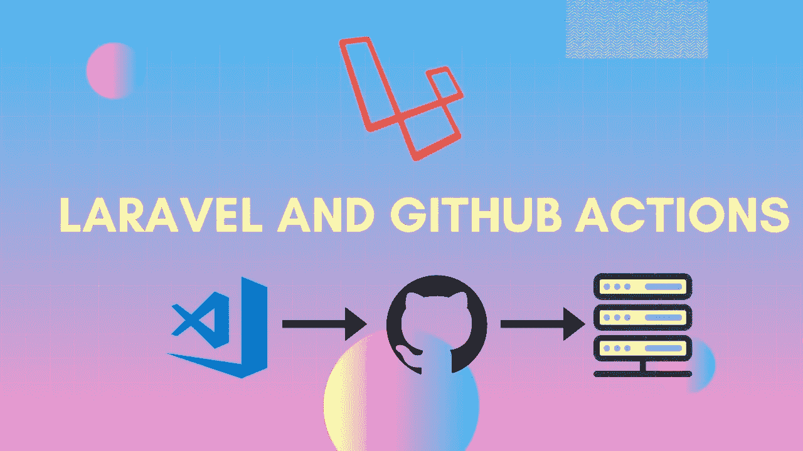
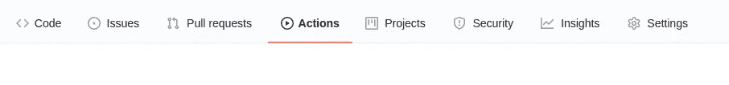
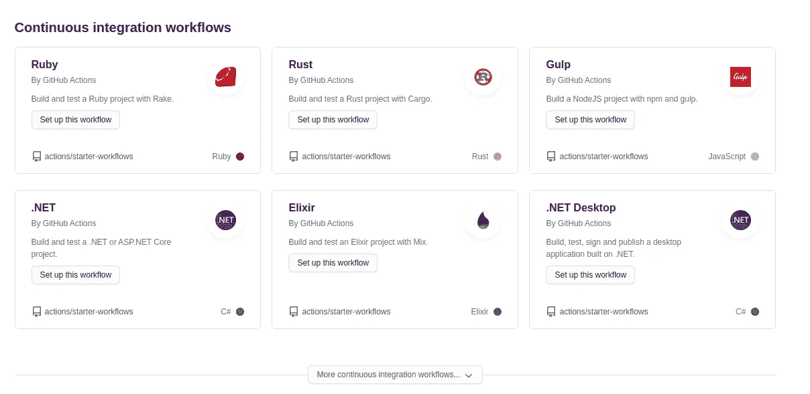
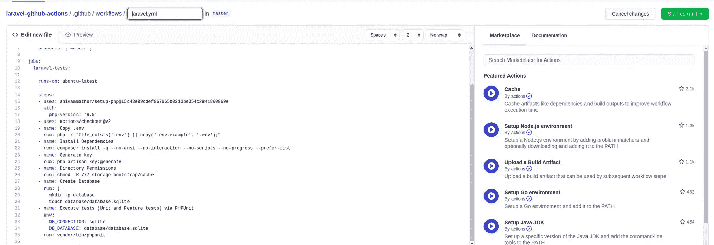
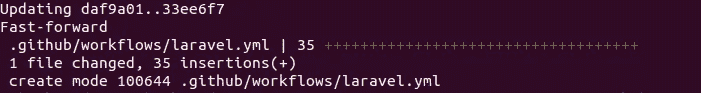
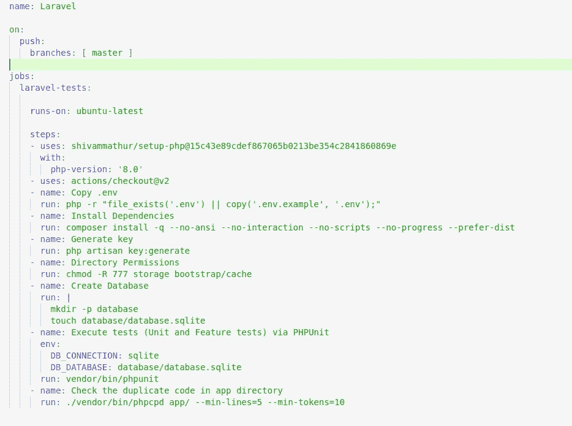
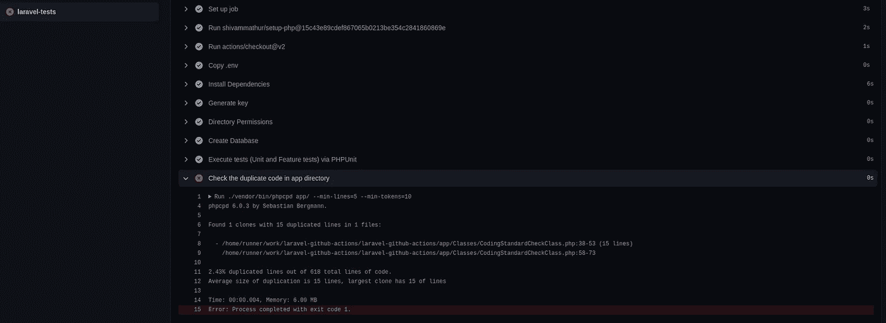
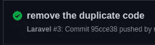
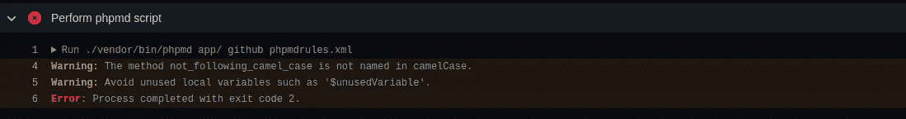
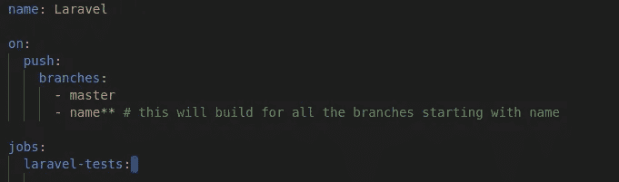

# 与 Laravel 和 GitHub 操作的持续集成。

> 原文：<https://medium.com/geekculture/continuous-integration-with-laravel-and-github-actions-b30b11fbd995?source=collection_archive---------15----------------------->



Laravel Code Quality Testing via Github Actions

在本文中，我们将使用 Github Actions 实现 Laravel 项目的持续集成部分。在本文的最后，您将有一个工作流程，如果您将代码推送到 Github，它将测试您的代码的测试用例、命名约定、重复和不可用性。让我们开始工作吧…

注:假设你熟悉[拉勒维尔](https://laravel.com/docs/8.x)、 [Github](https://github.com/) 和[作曲](https://getcomposer.org/)。

在开始之前，如果您还没有 git repo，请按照本教程设置 laravel 项目。

[](/@ujalajha/connecting-the-laravel-project-on-github-73acf55bbd63) [## 连接 GitHub 上的 Laravel 项目。

### 因此，今天我们将介绍如何将 GitHub 帐户连接到我们的项目。简而言之，我们将学习如何使用 git 来推送…

medium.com](/@ujalajha/connecting-the-laravel-project-on-github-73acf55bbd63) 

所以我创建了一个 laravel 项目和 GitHub repo，命名为 **laravel-github-actions。**

为了测试我们的代码，我们将使用两个包，它们可以通过 composer 安装在您的项目中。从现在开始，我们运行的每个命令都将在我们的项目目录中，所以请导航到您的项目目录。

现在导航到您的 git 存储库并打开 actions 选项卡。

网址:https://github.com/<user-name>/<repo-name></repo-name></user-name>



Actions Tab

在 **Actions** 选项卡下，您将找到**持续集成工作流**标题，在该列表中，您可以找到多个随时可用的 CI 流。对于我们的应用程序，我们需要找到 Laravel 设置。



*List of Continuous Integration Workflows*

如果您在上面的列表中找不到，点击列表末端的*更多持续集成工作流程*按钮，将加载一个新列表，您可以在其中搜索 laravel 并找到 Laravel 工作流程设置。


Laravel Setup for GithubActions

点击**设置此工作流程**按钮，将打开一个新页面，其中包含可编辑的 laravel.yml 文件，如下图所示:



laravel.yml file

现在，不要对文件做任何更改，我们稍后会编辑它。只需点击屏幕右上角的绿色**开始提交**。然后将打开一个下拉菜单，选择*直接提交到主*选项，并点击提交按钮。在这之后，转到您的本地机器，在终端中导航到 project dir 并运行 ***git pull*** 来获取您的本地分支中 laravel.yml 的更改。



pull changes in your local

现在我们要安装[**phpcpd**](https://github.com/sebastianbergmann/phpcpd)**用于检查代码重复。运行以下命令来安装该软件包:**

> **作曲家需要塞巴斯蒂安/phpcpd**

**之后，在编辑器中打开 **laravel.yml** 文件，并将以下代码复制粘贴到文件底部。**

```
- name: Check the duplicate code in app directory
  run: ./vendor/bin/phpcpd app/ --min-lines=5 --min-tokens=10Only copy above part.app/ => Directory in which we are checking the duplicate code. To add another directory copy paste the same command again with another directory.--min-lines=5 => This will throw error when min 5 lines are duplicated. You can change this according to your requirement. -min-tokens=10 => This will throw error when min 10 tokens are duplicated. You can change this according to your requirement.
```

**现在，您的 laravel.yml 文件应该如下所示。**

****

**laravel.yml file after adding phpcpd command**

**这里请注意，我已经从文件中删除了拉请求代码，现在我们只关注**推**事件。此外，确保文件中的缩进是正确的，否则代码将无法工作，因为它使用了 yml。现在继续在你的应用程序目录中创建一个文件，并添加一些重复的函数。您也可以使用下面的代码进行测试:**

```
*/**
* @return bool
*/*public function **function1**(): bool{
$use = 1;
do {
**echo** "The number is: $use <br>";
$use++;
} while ($use <= 5);
for ($use = 0; $use <= 100; $use += 10) {
**echo** "The number is: $use <br>";
}
return false;
}*/**
* @return bool
*/*public function **function2**(): bool
{
$use = 1;
do {
**echo** "The number is: $use <br>";
$use++;
} while ($use <= 5);
for ($use = 0; $use <= 100; $use += 10) {
**echo** "The number is: $use <br>";
}
return false;
}
```

**现在继续，提交您的代码并将其推送到您的分支。然后导航到存储库的 Actions 选项卡(见图片 *Actions 选项卡*)。您可以看到构建已经失败，在检查报告时，您可能会看到如下内容:**

****

**Php code duplicate check.**

**如果您删除重复的代码并再次推送代码，您可以看到构建已经通过，它将显示绿色的勾号。见下文:**

****

**Github build passed successfully.**

**既然我们已经检查了代码重复，我们继续检查编码约定。为此，我们将安装一个新的软件包，运行下面的命令来安装。**

> **composer 需要 phpmd/phpmd**

**安装完这个包之后，我们需要创建一个 XML 文件，其中包含 PHP 代码需要遵循的规则。因此，继续在您的项目目录中创建一个 phpmdrules.xml，并向其中添加以下代码:**

```
<?xml version="1.0"?><ruleset name="My first PHPMD rule set"

xmlns:xsi="http://www.w3.org/2001/XMLSchema-instance" xsi:schemaLocation="http://pmd.sf.net/ruleset/1.0.0http://pmd.sf.net/ruleset_xml_schema.xsd" xsi:noNamespaceSchemaLocation="http://pmd.sf.net/ruleset_xml_schema.xsd"><description>
My custom rule set that checks my code...
</description><!--Rules to check the code--><rule ref="rulesets/codesize.xml" />
<rule ref="rulesets/cleancode.xml" />
<rule ref="rulesets/controversial.xml" />
<rule ref="rulesets/design.xml" />
<rule ref="rulesets/naming.xml" />
<rule ref="rulesets/unusedcode.xml" /><!--Files and folders which needs to be excluded from checking--><exclude-pattern>bootstrap/cache/*</exclude-pattern>
<exclude-pattern>bootstrap/autoload.php</exclude-pattern>
<exclude-pattern>*/migrations/*</exclude-pattern>
<exclude-pattern>*/seeds/*</exclude-pattern>
<exclude-pattern>*.blade.php</exclude-pattern>
<exclude-pattern>*.js</exclude-pattern>
<exclude-pattern>/app/Console/Kernel.php</exclude-pattern>
<exclude-pattern>/app/Exceptions/Handler.php</exclude-pattern><exclude-pattern>app/Providers/BroadcastServiceProvider.php</exclude-pattern>
<exclude-pattern>app/Providers/RouteServiceProvider.php</exclude-pattern>
<exclude-pattern>tests</exclude-pattern>
</ruleset>
```

**这些检查将由在规则标签中作为 **ref** 传递的文件来执行。在 exclude-pattern 标记中，我们添加了一些不需要检查这些规则的文件和文件夹。您可以根据需要修改规则和排除模式。codesize.xml、cleancode.xml、contractive . XML、design.xml、naming.xml、unusedcode.xml 等规则的所有 XML 文件都可以在以下位置找到:**

> **vendor/phpmd/phpmd/src/main/resources/rulesets/**

**你可以在 **phpmd** 的官方文档中获得更多关于规则的信息。[https://phpmd.org/documentation/](https://phpmd.org/documentation/)**

**现在，像我们在 **phpcpd** 期间所做的那样，在 laravel.yml 文件的底部添加以下代码。**

```
- name: Perform phpmd script
  run: ./vendor/bin/phpmd app/ github phpmdrules.xml
```

**如果您还记得，我们创建了一个文件来测试重复代码。您可以使用同一个文件并添加一些不遵循约定的代码，如添加变量，不要使用它，不要在 camelCase 中保留函数名。提交代码并将其推送到 master，然后在 Actions 选项卡下检查构建。它应该会失败，并显示如下输出:**

****

**phpmd code check fail**

**现在更正错误并再次推送代码，您的代码将通过。**

**对于 PHPUnit 测试用例，我们不需要添加任何包。Laravel 自带预装的 PHPUnit 包。您所要做的就是将命令保存在 laravel.yml 文件中，Github 就会执行它。因此，继续在 laravel.yml 文件的末尾添加这些代码，编写一些错误的测试用例并检查它。**

```
- name: Execute tests (Unit and Feature tests) via PHPUnit
  env:
    DB_CONNECTION: sqlite
    DB_DATABASE: database/database.sqlite
  run: vendor/bin/phpunit
```

**就是这样。所有的检查都已经添加了，现在 GitHub 将检查代码并通知您错误。你现在可以玩它了。您也可以在创建 PR 时禁用 merge 按钮，以合并主分支中的代码，但为此，您必须购买 Github 订阅并在您的存储库中配置设置。**

**最后一件事。您可以为代码定义哪些分支需要检查，哪些不应该检查。为此，您必须在 push 事件的 branches 标记下添加以下代码:**

> **- name** = >这将为所有以 name 开头的分支构建**

****

**我希望这篇文章能帮助你设计你的应用程序的工作流程。请在评论中告诉我错误/改进/建议。**

**编码快乐！**