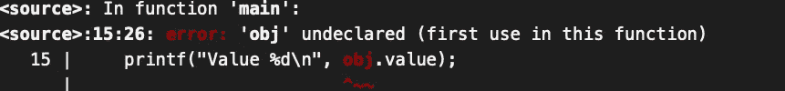
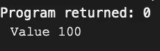

# 用 C 语言控制流量变化

> 原文：<https://medium.com/geekculture/control-flow-variations-in-c-langauge-d8ab342e35e5?source=collection_archive---------20----------------------->

Source: [https://dzone.com/articles/how-draw-control-flow-graph](https://dzone.com/articles/how-draw-control-flow-graph)

程序执行的控制流是个体排序的顺序。控制流可以像一个简单的功能块一样简单到许多跳转语句。这里，基本块是一个语句块，在这个语句块中，执行无条件地开始并继续，直到最后一条语句。

一个基本块包括在范围开始处的执行开始和在内容结束处的结束。范围可以由短跳转(如 switch-case 语句、条件或循环)或长跳转(如 goto 语句或调用另一个函数)组成。此外，范围可以包括 _Noreturn 或 setjmp 选项，这会更改控制流。

带有 if-else 语句或循环的简单控制流的显著优点是使代码更具可读性，并为编译器提供更多优化机会。

**变更列表:**

*   条件语句:if/else，switch
*   循环语句:do-while，while，for
*   函数:函数调用，返回，_Noreturn
*   短跳转:转到，标签
*   跳远:setjmp，longjmp
*   中断:信号

对于人和编译器来说，关于执行状态，块的复杂性增加了。当控制流包括许多变化时，特别是短/长跳转、中断、线程，程序员跟踪对象的行为就变得很乏味，因为它们可能会在它们的生命周期之外被访问或未初始化就被使用。此外，在多线程应用程序的情况下，多线程对同一对象的读/写操作变得不确定。

当我们看问题控制流时，并不是所有的执行都按顺序发生。例如，函数参数执行是无序的。

*举例*:

**带 x86–64 clang 3.5 输出:**

*   a 是 10
*   b 是 5
*   总和是 3

**带 x86–64 gcc 11.1 输出:**

*   a 是 1
*   b 是 2
*   总和是 3

尽管程序被很好地定义了，但是两个常用的编译器 gcc 和 clang 在输出上是不同的。

# 短距离跳跃

**循环与转到**

goto 语句和 goto 的主要区别在于作用域。例如，带有条件的 while 循环有它的作用域，任何定义的对象在我们离开这个作用域后都是死的。另一方面，goto 具有局部作用域，因此任何变量在执行后都是活动的。

这里，编译器给出了预期的错误

但是，如果我们在这里使用 goto 跳转而不是 for 循环，那么对象将存在于函数循环中，我们可以访问 value 属性。

Goto Example

Obj 还活着，没有出现我们预期的错误。

**总结:**
代码执行并不总是按顺序的，即使程序是单线程的。编译器优化会导致代码中不同的顺序。

[https://dzone.com/articles/how-draw-control-flow-graph](https://dzone.com/articles/how-draw-control-flow-graph)

来源:

*   [https://modernc . g forge . inria . fr](https://modernc.gforge.inria.fr)
*   [https://www . oreilly . com/library/view/effective-c/9781098125677/](https://www.oreilly.com/library/view/effective-c/9781098125677/)
*   [https://www . oreilly . com/library/view/c-programming-language/9780133086249/](https://www.oreilly.com/library/view/c-programming-language/9780133086249/)