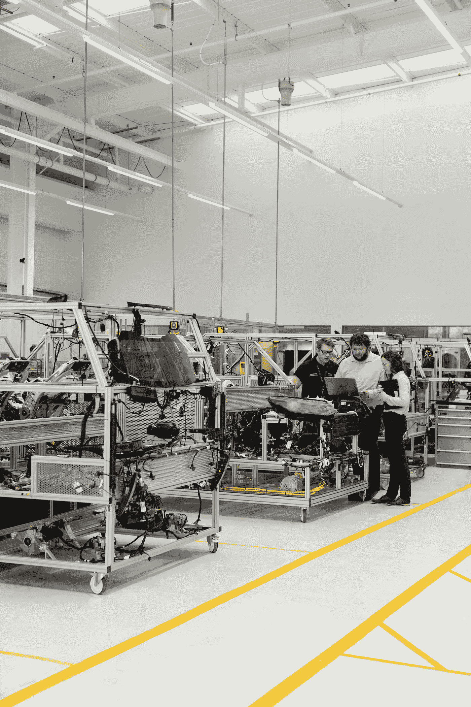
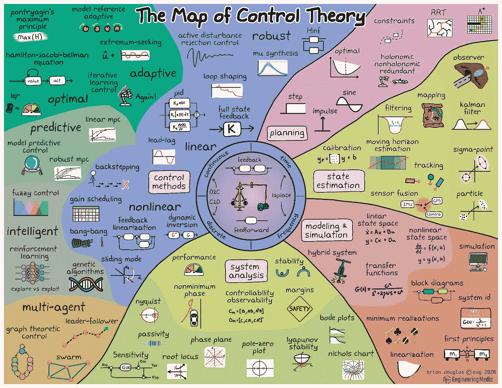

# 现代控制理论。它死了吗？

> 原文：<https://medium.com/geekculture/control-theory-in-the-modern-era-is-it-dead-7aebe840a3f?source=collection_archive---------12----------------------->

Photo by [ThisisEngineering RAEng](https://unsplash.com/@thisisengineering?utm_source=medium&utm_medium=referral) on [Unsplash](https://unsplash.com?utm_source=medium&utm_medium=referral)

# **什么是控制理论？**

这个故事主要通过[**降维****机器学习****和动态系统建模**](http://www.databookuw.com/)【1】来强调控制理论的重要性及其在复杂系统上的应用。首先，我将介绍关于控制理论及其与所谓的'**数据科学**'的联系的入门知识一个有效的控制系统的真正目的是它能够主动地为给定的工程目标操纵其行为。操纵动力系统(在这里，动力系统可以指从生物模型到金融模型的任何东西)的研究和实践被广泛地称为控制理论。它是应用数学和实际工程相结合的最成功的领域之一。**控制理论与数据科学**不可分割，因为它依赖于从控制系统获得的传感器测量(数据)来实现给定的目标。事实上，控制理论处理的是当前的数据，因为成功的技术会改变系统的动态，从而改变测量值的特征。控制理论迫使读者相信现实，因为简化的假设和模型近似被测试。

控制理论有助于更新现代技术和工业景观。例子比比皆是，包括汽车中的**巡航控制**、飞机中的**电传操纵自动驾驶**、**工业自动化、互联网中的数据包路由、商用加热通风和冷却系统、飞行器的稳定以及现代浓缩咖啡机中的 PID 温度和压力控制**😊这只是众多应用中的几个例子。在未来，控制将越来越多地应用于高维、强非线性和多层次的问题，如湍流、神经科学、金融、流行病学、自主机器人和自动驾驶汽车。在这些未来的应用中，数据驱动的建模和控制将是至关重要的。所有这些导致了'**大数据技术的出现下面是一张由布莱恩·道格拉斯绘制的精彩地图，展示了我们可以从控制理论中学到的东西。**

# **控制理论和机器学习有**关联**吗？**

我将从现代机器学习范式的关键构件开始:**感知器**。这是 50 年代由 [**罗森布拉特**](https://towardsdatascience.com/rosenblatts-perceptron-the-very-first-neural-network-37a3ec09038a)**【3】**建造的硬件结构，用来模仿我们大脑中真正的神经网络。当人们试图识别高度复杂和非线性的动态系统时，它出现在控制理论文献中。

**经典的 sigmoid 非线性激活函数，**经常在机器/深度学习中作为非线性优化器使用，出自控制理论文献。神经网络，人工神经网络首先用于控制理论的监督学习场景。[**Kurt Hornik**](https://www.sciencedirect.com/science/article/abs/pii/0893608089900208)**【4】**第一个确定神经网络是通用逼近器。没有经典控制理论，我们可以说就没有**反向传播**(80 年代由 [**鲁梅尔哈特&辛顿**](https://www.nature.com/articles/323533a0)**【5】**基于控制理论的启发而发明)。可能就不会有 **LSTM** (由 **Horchreite** r 于 1996 年发明)用于在基于记忆的人工神经网络中模拟抽头延迟线。这些在语音识别、语言模型或时间序列序列中有着巨大的用途。

Photo by [Kevin Ku](https://unsplash.com/@ikukevk?utm_source=medium&utm_medium=referral) on [Unsplash](https://unsplash.com?utm_source=medium&utm_medium=referral)

强化学习中探索和利用之间的对立在控制工程中被称为识别(或估计)和控制之间的冲突。你可以说大量的强化学习问题源于控制工程研究。我附上一个链接，链接到吴恩达的论文。

如果你浏览最近机器学习科学家的作品，你会发现控制术语伪装成新的措辞，使他们的想法听起来很新。例如，他们所谓的反向传播只不过是老式的基于微积分的微分链规则技术。递归神经网络的变体是你在任何系统识别文献中会遇到的唯一的NARX 模型。所以回答问题，**现代机器学习是经典/现代控制理论的派生类。**

机器学习基本上是功能学习，容易出错。也就是说，无论你的训练集有多大，你的算法有多好，都不能保证它预测的结果是正确的。这是基于概率的。相反，控制理论是基于严格的数学证明。假如你正确地建立了系统动力学模型；你可以依靠控制理论。

最好的提议是在自主系统的构建中同时使用这两者。

作为一名控制工程专业的本科生，我发现控制理论和机器学习之间有很大的重叠。我们处理的大多数系统都是需要控制的复杂控制系统；这可以从商业模型到生物模型。我观察到，用于解决机器学习问题的方法类似于控制理论。诸如**线性二次调节器(LQR)** 的最优控制器设计中的问题陈述需要在特定范围和条件下必须最小化的成本函数。解决机器学习问题的类比是类似的，只是现在我们必须处理一个大型数据集，并建立一个智能控制系统。对线性和非线性控制理论的强烈掌握在解决机器学习问题时提供了更好的直觉。

# **参考文献**

[1]数据驱动的科学与工程—[http://www.databookuw.com/](http://www.databookuw.com/)

[2]工程媒体有限责任公司—[https://engineeringmedia.com/](https://engineeringmedia.com/)

[3]罗森布拉特的感知器，第一个现代神经网络—[https://towardsdatascience . com/rosenblatts-perceptron-the-very-first-neural-network-37 a3 EC 09038 a](https://towardsdatascience.com/rosenblatts-perceptron-the-very-first-neural-network-37a3ec09038a)

[4]多层前馈网络是普适近似——[https://www . science direct . com/science/article/ABS/pii/0893608089900208](https://www.sciencedirect.com/science/article/abs/pii/0893608089900208)

[5]通过反向传播误差学习表征—[https://www.nature.com/articles/323533a0](https://www.nature.com/articles/323533a0)

[6]强化学习的形式和政策研究—[https://rll.berkeley.edu/deeprlcourse/docs/ng-thesis.pdf](https://rll.berkeley.edu/deeprlcourse/docs/ng-thesis.pdf)