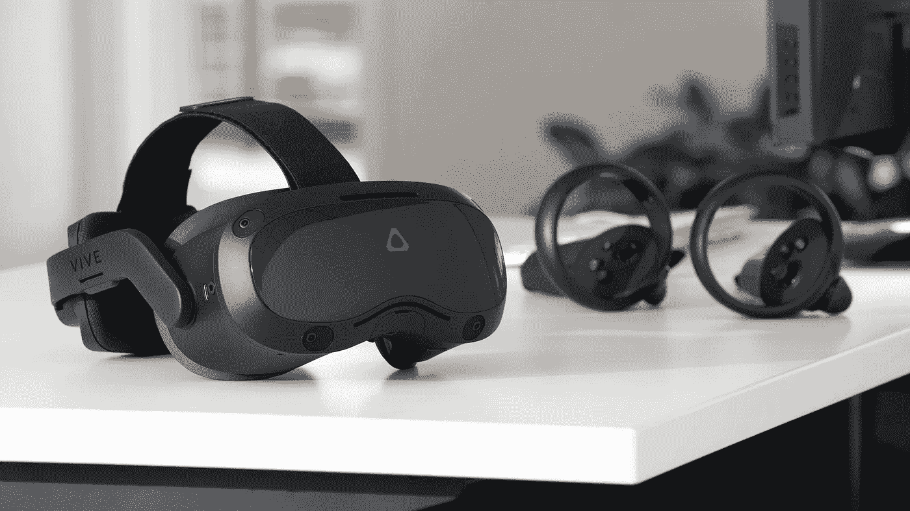

# 控制器未连接，启用手跟踪，以及 Vive Focus 3 文档中缺少的其他问题

> 原文：<https://medium.com/geekculture/controllers-not-connecting-enabling-hand-tracking-and-other-issues-missing-from-vive-focus-3-docs-b7ccd66dbc55?source=collection_archive---------7----------------------->

让我来帮你解决一些我不得不艰难解决的问题。

*(那就是试错。)*

Source: [Road to VR](https://www.roadtovr.com/htc-vive-focus-3-specs-price-release-date-announcement/)

[Vive Focus 3](https://www.vive.com/us/product/vive-focus3/overview/) 相当新，在不到一年前的 2021 年 6 月发布，直到本文发表。该系统的大部分与之前的 Vive Focus 完全不同…