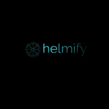

# 将 Kubernetes YAML 文件转换为舵图

> 原文：<https://medium.com/geekculture/convert-kubernetes-yaml-files-into-helm-charts-4107de079455?source=collection_archive---------0----------------------->

## Helmify

在这篇博客中，我们将看到使用 helmify 将 yaml 文件转换为 helm 图表。

## 舵图

Helm 可以轻松定义、安装和升级最复杂的 Kubernetes T2 应用程序。Helm 帮助您管理 [Kubernetes](/@vinodhakumara2681997/k8s-multi-node-cluster-on-aws-using-ansible-and-launching-a-wordpress-application-with-mysql-e40f69d63773) 应用程序。图表创建、版本控制、共享和发布都是简单的任务。

## YAML

YAML 是一种易于理解的数据序列化语言，常用于用任何编程语言创建配置文件。YAML 是为人类交互而设计的，是另一种数据序列化语言 JSON 的严格超集。但是因为它是一个严格的超集，它可以做 JSON 能做的一切，甚至更多。

## Helmify

[Helmify](https://github.com/arttor/helmify) 从 stdin 中读取支持的 k8s 对象列表，并将其转换为 helm chart。旨在为 k8s 操作员生成图表，但不限于阅读:

[](https://github.com/arttor/helmify)

Helmify

让我们看看 helmify 上的一个例子

## 安装 Helmify

```
brew install helmify
```

在其他操作系统上安装 helmify，方法是在这里解压。

## 创建示例 YAML 部署文件

```
apiVersion: apps/v1
kind: Deployment
metadata:
  name: nginx-deployment
  labels:
    app: nginx
spec:
  replicas: 3
  selector:
    matchLabels:
      app: nginx
  template:
    metadata:
      labels:
        app: nginx
    spec:
      containers:
      - name: nginx
        image: nginx:1.14.2
        ports:
        - containerPort: 80
```

我们还可以获得 k8s 上现有服务的 YAML 文件，并使用 helmify 将其转换。

## 将 YAML 文件转换为头盔

```
cat web.yaml | helmify nginx-server
```

运行 helmify 后，它用更新后的代码创建了一个图表模板，如下图所示


## 从包含 yamls 的目录:

我们也可以创建文件夹，

```
awk 'FNR==1 && NR!=1  {print "---"}{print}' /<my_directory>/*.yaml | helmify mychart
```

将从`<my_directory>` 目录中的所有 yaml 文件创建带有舵图的“mychart”目录。

点击阅读更多

## 结论

Helmify 允许我们使用现有的 Kubernets 服务或从 K8s yaml 文件创建舵图

> *如果你觉得这篇文章很有帮助，请* ***别忘了*** *点击* ***跟随*******拍拍*** *按钮，帮我写更多这样的文章。* ***谢谢🖤****
> 
> ****你可以联系我:***[*LinkedIn*](https://www.linkedin.com/in/vinodha-kumara-8a00bb1a8/)*[*email me*](mailto:vinodhakumara2681997@gmail.com)**