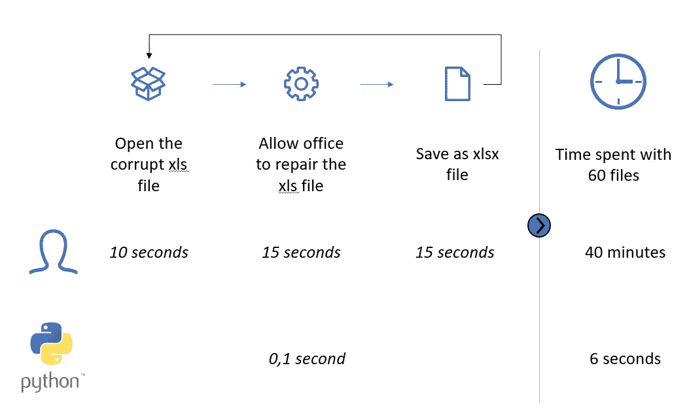

# 在 Finance #5 中将多个损坏的 XLS 文件转换为 XLSX | Python

> 原文：<https://medium.com/geekculture/convert-multiple-corrupt-xls-files-to-xlsx-python-in-finance-5-1da1dc1cf89d?source=collection_archive---------10----------------------->

在本文中，您将学习如何将一批损坏的 XLS 文件转换为 XLSX 文件。

Trade-off of automating this process

在本文中，您将学习如何自动完成从(损坏的)xls 文件到正常 xlsx 文件的转换过程。

数据可以在[这里](https://mega.nz/file/cJQBUChb#25rBjAheYG4sDsZAg19k5XsbhCv-_Jz-auVEn7n21uA)找到

**套餐**

*   [pywin32](https://github.com/mhammond/pywin32) :这个包基本上…