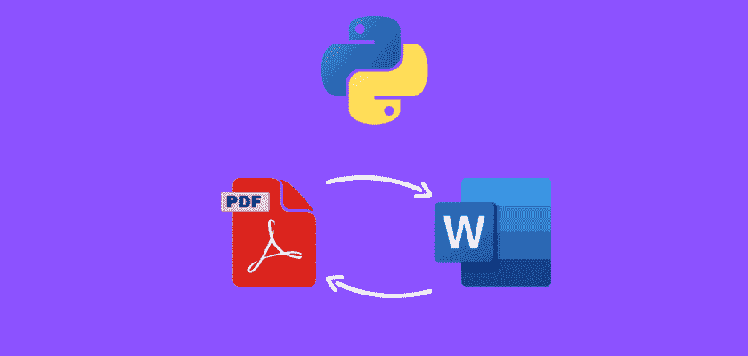

# 使用 Python 将 PDF 转换为 docx 以及将 docx 转换为 PDF

> 原文：<https://medium.com/geekculture/convert-pdf-to-docx-and-docx-to-pdf-using-python-aabe943e7f28?source=collection_archive---------22----------------------->

在本文中，我们将探讨如何使用 Python 将 PDF 文件转换为 Microsoft Word docx 格式，反之亦然。

**目录**

*   介绍
*   样本文件
*   如何将 PDF 文件转换为 docx 格式
*   如何将 docx 文件转换为 PDF 格式