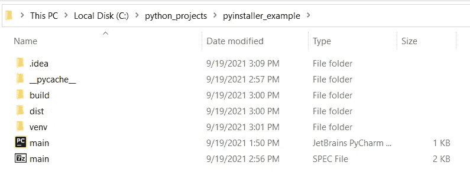
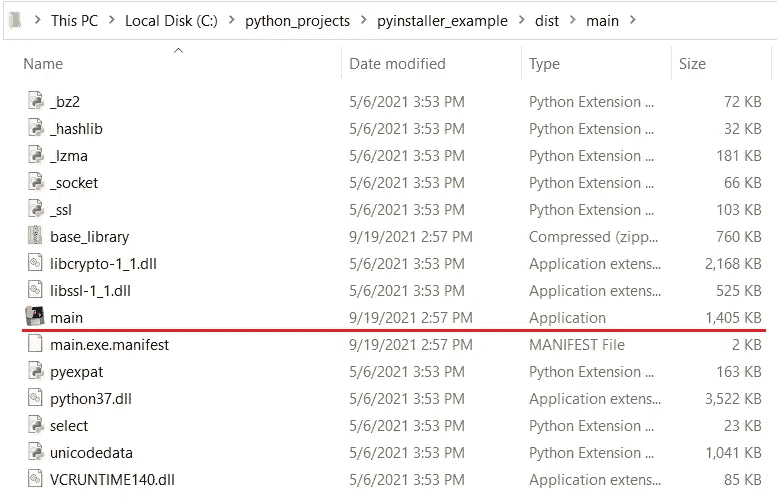
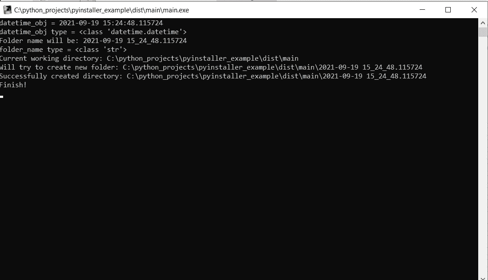
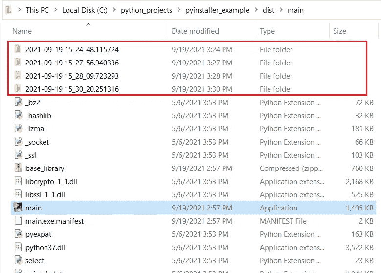
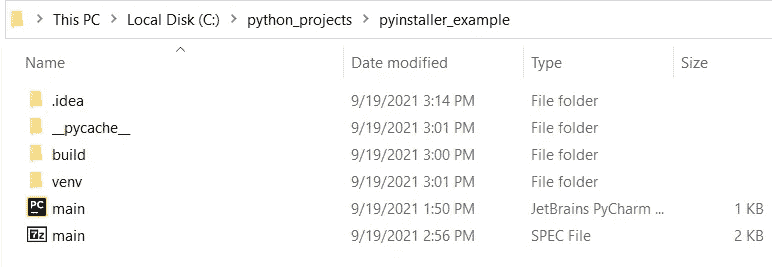
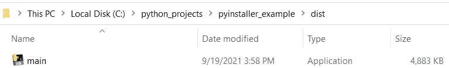
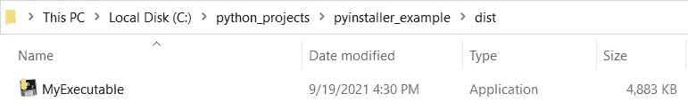

# 将您的 Python 脚本转换为可执行文件

> 原文：<https://medium.com/geekculture/convert-your-python-script-to-executable-file-b7517c6960d3?source=collection_archive---------7----------------------->


Photo by [Jexo](https://unsplash.com/@jexo?utm_source=medium&utm_medium=referral) on [Unsplash](https://unsplash.com?utm_source=medium&utm_medium=referral)

你是否曾经想和别人分享你的脚本，但是不想给出源代码？或者你想和那些没见过任何代码也不知道什么是编程的人分享一个你写的很棒的程序？事实证明，使用 **pyinstaller** 包在 Python 中创建可执行文件有一种简单的方法。官方文件可以在下面找到:

[](https://www.pyinstaller.org/) [## py installer quick start-py installer 捆绑 Python 应用程序

### PyInstaller 将 Python 应用程序冻结(打包)成独立的可执行文件，在 Windows、GNU/Linux、Mac OS X 下…

www.pyinstaller.org](https://www.pyinstaller.org/) 

然而，在本文中，我将尽可能多地介绍实际的例子，以便将文档留给其他更具体的任务。

# 示例应用程序

就我个人而言，看到应用程序在您的环境中做一些事情总是很有趣，这就是为什么在本教程中我们将构建一个可执行文件，它将在每次运行时创建一个新的空文件夹。为了更有趣一点，文件夹名称将等于可执行文件运行的日期和时间。顺便说一下，在 Python 中处理时间和日期非常容易。我已经在我的另一篇文章中写了，你可以在这里找到:

[](/@arturasvy/working-with-time-and-date-in-python-6cce748f90f5) [## 在 Python 中处理时间和日期

### 我经常要做的事情之一是处理包括时间在内的各种形式的数据。我认为它是…

medium.com](/@arturasvy/working-with-time-and-date-in-python-6cce748f90f5) 

因此，为了探索不同的 ***pyinstaller*** 构建选项的一些其他可能性，我将在代码末尾添加一些打印语句和一个延迟。因此，让我们从导入本例中需要的所有模块开始:

```
from datetime import datetime
import os
import time
```

在本例中，来自 ***datetime*** 模块的 ***datetime*** 类将用于检索当前时间，因为我们希望我们的文件夹名称等于当前时间。另一个名为 ***os*** 的模块将用于检索运行脚本的工作目录，并在该特定目录下创建一个新文件夹。最后， ***时间*** 模块将用于创建延迟结束的应用程序。

现在我们可以使用 datetime 类读取当前时间:

```
datetime_obj = datetime.now()
print(f"datetime_obj = {datetime_obj}")
print(f"datetime_obj type = {type(datetime_obj)}")
```

**输出:**

```
datetime_obj = 2021-09-19 11:57:08.004920
datetime_obj type = <class 'datetime.datetime'>
```

请记住，您的 ***datetime_obj*** 值会有所不同，因为它实际上每微秒都会发生变化，并且取决于您运行脚本的时间。我还添加了一个打印来显示我们的 ***datetime_obj*** 的类型。

接下来要做的是将这个 ***datetime_obj*** 转换成字符串，这样我们就可以用它来形成一个目录名，用于创建一个新的文件夹。还有一点需要注意的是 ***datetime_obj*** 中包含了冒号符号':'，这在 Windows 中是不允许用于文件命名的，所以我们将':'改为' _ '符号使用 ***替换*** 的方法。

```
folder_name = datetime_obj.strftime("%Y-%m-%d %H:%M:%S.%f")
folder_name = folder_name.replace(':', '_')
print(f"Folder name will be: {folder_name}")
print(f"folder_name type = {type(folder_name)}")
```

**输出:**

```
Folder name will be: 2021-09-19 11_57_08.004920
folder_name type = <class 'str'>
```

如你所见，我们的 ***folder_name*** 现在是 ***str*** 类对象，而不是 ***datetime*** ，所以我们现在可以用它来构成我们将要创建的目录名。

现在，是时候使用 ***os*** 模块获取当前工作目录了。这将有助于我们形成新文件夹的最终目录。

```
cwd = os.getcwd()
print(f"Current working directory: {cwd}")

folder_directory = cwd + "\\" + folder_name
print(f"Will try to create new folder: {folder_directory}")
```

**输出:**

```
Current working directory: C:\python_projects\pyinstaller_example
Will try to create new folder: C:\python_projects\pyinstaller_example\2021-09-19 11_57_08.004920
```

注意，在形成***folder _ directory***的时候我把三个字符串加在一起，中间有一个是***“\ \”。*** 我们需要这个，因为在 Python 中反斜杠符号 ***'\'*** 被用作转义字符。

在这一阶段，我们准备使用已形成的 ***文件夹 _ 目录*** 创建我们的新文件夹。

```
try:
    if not os.path.exists(folder_directory):
        os.mkdir(folder_directory)
        print(f"Successfully created directory: {folder_directory}")
except Exception as e:
    print(f"Failed to create directory! {e}")
```

**输出:**

```
Successfully created directory: C:\python_projects\pyinstaller_example\2021-09-19 11_57_08.004920
```

这里需要注意一些事情。首先，在本例中，我收到了这个输出，因为新目录创建成功。我可能会收到一个 print 异常，显示新目录创建失败。第二，我添加了一段代码来捕捉在创建新目录时可能发生的任何异常，这通常不是一个好的做法，但我将把它留在这里，以便它可以捕捉您可能遇到的任何意外错误。第三，***OS . path . exists()***用于检查您将要创建的目录是否已经存在，如果不存在，那么我们使用 ***os.mkdir()*** 方法**创建那个新目录。**

至此，我想向您展示示例应用程序差不多完成了。我想添加的最后一部分代码如下所示:

```
print("Finish!")
time.sleep(5)
```

这里发生的事情是我使用 ***time.sleep()到*** make add 延迟 5 秒钟，然后退出(我稍后会解释我为什么这样做)。

下面是本示例应用程序中使用的完整代码片段:

就是这样。我们已经完成了示例应用程序，我们将把它打包到可执行文件中。如果你想的话，你可以单独运行这个脚本，它会运行，你会看到结果，但是我的目标是展示如何创建可执行文件，所以我将在最后用可执行文件来演示结果。

# Pyinstaller 用于创建可执行文件

在这一点上，我建议你从我的 github 库[https://github.com/vycart/pyinstaller_example](https://github.com/vycart/pyinstaller_example)中克隆这个示例应用程序代码，或者如果你跟随并且自己编写了代码，那么看看下一步。

一旦您克隆了存储库并完成了虚拟环境的设置和激活，我们现在就可以安装 ***pyinstaller*** 。

```
pip install pyinstaller
```

要检查 pyinstaller 是否安装成功，可以运行

```
pyinstaller --version
```

**输出:**

```
4.5.1
```

在撰写本文时，这是最新的 ***pyinstaller*** 版本。如果到目前为止一切都正确，那么现在是时候实际构建可执行文件了。我们通过执行以下命令来实现这一点:

```
pyinstaller main.py
```

如果一切运行成功，您应该看到在您的工作目录下创建了几个新目录。以下是您应该看到的示例:



Figure 1\. Directory view after running “pyinstaller main.py” (image by Author)

现在，要找到您的可执行文件，您必须转到 ***dist*** 目录下，并进入 ***main*** 文件夹。您应该会看到下图所示的内容



Figure 2\. Created executable file (image by Author)

现在，如果您运行这个文件，您将看到一个新的弹出窗口，显示我们在代码中添加的所有打印语句。



Figure 3\. Running the executable file (image by Author)

现在这个窗口在 5 秒钟后自动关闭。这就是我们为什么在代码末尾添加了***time . sleep(5)***的原因，这样你就能够看到可执行文件的输出。

现在，如果您再运行几次这个可执行文件，您将会看到在您的可执行文件所在的文件夹中创建了新的目录。下面是一个例子



Figure 4\. New folder created every time after running executable (image by Author)

这种方式创建可执行文件的最大缺点是，你必须复制主文件夹中的所有内容(可执行文件所在的文件夹中的所有内容),如果我们不必这样做，那会好得多。实际上有一种方法可以做到这一点，但是在进行下一步之前，我建议从工作目录中删除 ***dist*** 文件夹，这样您就不会在下一步创建新的可执行文件后感到困惑。换句话说，在执行下一步之前，您的文件夹视图应该是这样的:



Figure 5\. dist directory deleted (image by Author)

实际上，我想指出的是，这一步并不是必须的，但我认为这样会减少混淆。以后你可以自己实验，看看有什么不同。

# 将所有内容放入一个可执行文件中

Pyinstaller 有很多构建可执行文件的选项，不可能在一篇文章中介绍所有选项并详细解释所有内容，但我想向您展示一些您可能想做的最重要的事情，其中一件事显然是拥有一个可执行文件，您可以与任何人共享，并且它可以在其他机器上工作。为此，您必须使用`--onefile`选项:

```
pyinstaller main.py --onefile
```

运行后，您将看到与**图 1** 中相同的视图，但是 ***dist*** 文件夹的内容这次会有所不同，您将只看到一个可执行文件:



Figure 6\. Single executable inside dist directory with ` — — onefile` option (image by Author)

现在这样好多了。您可以与任何人共享这个可执行文件，这是您唯一需要共享的文件，因为运行这个可执行文件所需的所有依赖项都打包在里面。你可以从 ***图 1*** 中实际看到，在第一个方法*期间，主*的可执行文件大小约为 1.4 KB，但现在它的大小约为*的 4.8 KB，但它仍然比整个 ***区*** 目录中的所有**要小得多。dll 文件，我们使用第一种方法。*****

**现在你可以把这个可执行文件复制到任何你想要的文件夹，并从那里运行它，你会看到和以前一样的东西(弹出窗口如图 ***图 3*** ，程序完成后出现新的目录)。**

# **更改可执行文件名称**

**我想展示的另一件事是如何更改可执行文件的名称。您可能不希望所有的可执行文件都被称为 **main** 。您可以通过使用`--name`选项来实现。因此，如果您想创建一个名为 ***MyExecutable*** 的可执行文件，您可以使用下面的代码:**

```
**pyinstaller main.py --onefile --name MyExecutable**
```

**现在，您的输出可执行文件将具有您描述的名称:**

****

**Figure 7\. Specifying name for your executable file (image by Author)**

**我想指出的是，如果您想在可执行文件名称中添加下划线，您可能会遇到一些问题。克服它们是可能的，但是我建议在这一点上选择不带下划线的名字。**

# **隐藏弹出窗口**

**最后我想说的是如何隐藏当你启动可执行文件时弹出的窗口(**图 3** )。现在，您可能想要调试您的应用程序，并且您可以看到发生了什么，但是与您共享应用程序的人可能不需要这样做。此外，如果您正在创建图形用户界面(GUI)，您肯定希望隐藏该窗口，这样就不会打扰用户。为此，您需要为 pyinstaller 指定另一个选项`--windowed`**

```
**pyinstaller main.py --onefile --name MyExecutable --windowed**
```

**运行此程序后，您的输出可执行文件看起来将与图 7 中的**完全相同，但是在启动后，图 3** 中显示的弹出窗口将不再可见。因此，在这一点上，您还可以从脚本末尾删除 5 秒钟的延迟，并重新构建可执行文件。**

# ****结论****

**使用 ***pyinstaller*** 包构建简单的可执行文件相当容易。当然，我们可以用它做很多更复杂的事情，但是在另一篇文章中写这个会更有意义。**

**无论如何，我希望现在你应该能够把你的 python 脚本变成可执行文件，你可以和你的朋友或同事分享。**

**如果你有任何问题，请随意提问，我很乐意回答。**

**感谢您的阅读。**