# 将字典转换为具有自定义属性的通用列表

> 原文：<https://medium.com/geekculture/converting-dictionary-to-generic-list-t-with-custom-attribute-1bea1c2f3a1d?source=collection_archive---------2----------------------->


如果您在字典中有一些字符串键和对象值，并且想要转换为“T2 列表”模型，并且需要对一些属性进行一些特定的操作，那么这篇文章就是为您准备的。

在本文中，我们将采用两种不同的方法。其中之一是带有映射配置文件的字典扩展类，另一个是字典扩展类的更好的性能。

**Model/SentMail.cs:** 这是我们转换后的字典列表< T >型号。我们将把字典键值数据转换成“ *List < SenMail >* ”。“*邮件类型*”是 int 枚举字段。我们将编写一个定制的“*【JSON data】*”属性，并用这个属性对 Recipient 属性进行签名。我们将在文章的后面讨论这个问题。

不是:" *Konu* "在土耳其语中是特别定义的。意思是主体。稍后我们将使用 config，用“subject”关键字映射它。

```
namespace BlogDictionaryToList.Model
{
    public  class SentMail
    {
        public string Email { get; set; }
        public string MailId { get; set; }
        public int MailType { get; set; }
        public string FolderName { get; set; }
        public string From { get; set; }
        public string Konu { get; set; }
        public string SenderName { get; set; }        
        public DateTime PostTime { get; set; }

        [JsonData]
        public string Recipient { get; set; }
    }
}
```

**custom attribute/JSON data . cs:**这是我们的自定义属性。它仅用于标记类的属性。此属性是复杂类型的字典值。当我们看到这个标志时，我们会把它转换成字符串。

```
namespace BlogDictionaryToList.CustomAttribute
{
    [AttributeUsage(AttributeTargets.All)]
    public class JsonData : Attribute
    {
        public JsonData()
        {
        }
    }
}
```

**static converter/to JSON():**这个扩展用于将对象转换为字符串。

```
 public static string ToJson(this object value)
        {
            return JsonConvert.SerializeObject(value);
        }
```

**Enums/MailType.cs:** 这是 SentMail 的整数邮件类型属性。

```
namespace BlogDictionaryToList.Enums
{
    public enum MailType
    {
        Inbox = 1,
        JunkEmail = 2,
        Drafts = 3,
        SentItems = 4,
        DeletedItems = 5,
        Others = 6    
    }
}
```

**Model/Email.cs:** 这是我们复杂类型的字典值的“收件人”关键字。我们将把这个类列表转换成一个字符串，用于映射“ *SentMail* ”类的 Recipient 属性。

```
namespace BlogDictionaryToList.Model
{
    public class Email
    {
        public string EmailContent { get; set; }
        [JsonConverter(typeof(StringEnumConverter))]
        public SenderType SenderType { get; set; }
    }
}
```

**Enum/SenderType.cs:** 这是 Email 类的属性 SenderType。它是一个整数枚举。

```
namespace BlogDictionaryToList.Enums
{
    public enum SenderType
    {
        To = 1,
        Cc = 2,
        Bcc = 3
    }
}
```

**Program.cs(1):** 首先，让我们按键和值将一万个“SentMail”模型填入字典。“*收件人*”是“邮件”的列表。我们将它设置为字典中的“收件人”字段。“uniqueKey”是忽略键。我们不会将它保存到数据库。我们使用它，不允许重复的行。("*如果(dictList。Any(dic = > dic["uniqueKey"]。ToString() == uniqueKey))* ")

```
using BlogDictionaryToList.Enums;
using BlogDictionaryToList.Model;

List<Dictionary<string, object>> dictList = new List<Dictionary<string, object>>();
List<Email> Recipients = new List<Email>();
Recipients.Add(new Email() { EmailContent = "Test Email", SenderType = SenderType.To });
Recipients.Add(new Email() { EmailContent = "Test Email 2", SenderType = SenderType.Cc });

for (var i = 0; i < 10000; i++)
{
    Dictionary<string, object> dict = new Dictionary<string, object>(); 

    var uniqueKey = $"bora@borakasmer.com{i}" + "|" + 2 + "|" + 653 + i;
    dict.Add("uniqueKey", uniqueKey);   
    dict.Add("Email", $"bora.kasmer@keepnetlabs.com{i}");  
    dict.Add("MailId", 653 + i);
    dict.Add("MailType", MailType.SentItems);
    dict.Add("FolderName", $"Bora's Folder{i}");
    dict.Add("From", $"Bora{i}");
    dict.Add("Subject", $"Test Converter{i}");
    dict.Add("SenderName", $"Bora{i}");    
    dict.Add("PostTime", DateTime.Now);
    dict.Add("Recipient", Recipients);

    //Check for eliminate the same row.
    if (dictList.Any(dic => dic["uniqueKey"].ToString() == uniqueKey))
    {
        var dic = dictList.First(dic => dic["uniqueKey"].ToString() == uniqueKey);
        dictList.Remove(dic);
    }
    dictList.Add(dict);
}
```

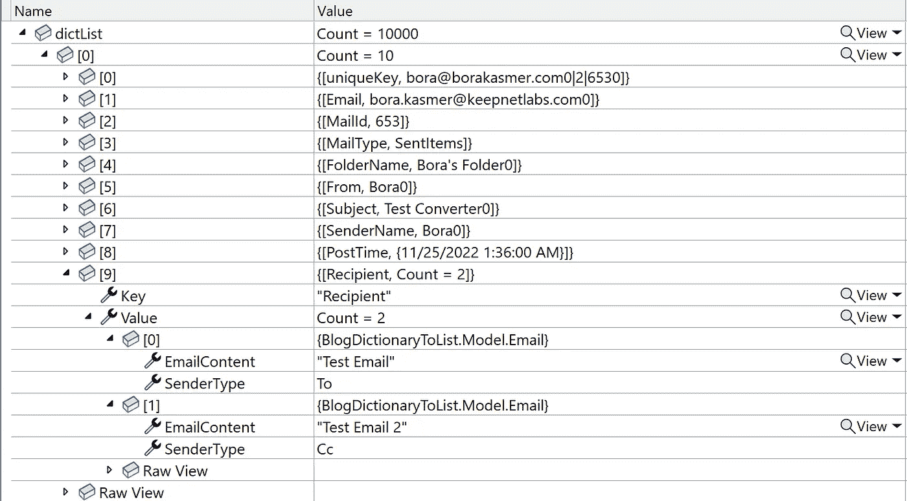

One item in the dictionary after filled by 10000 SentMail items.

**DictionaryToList < T >扩展(版本 1):** 第一种方法，编写一个静态扩展类。接下来，我们将向该类添加新功能。

**1-)** 我们将启动一个计时器，用于计算总时间。我们将创建一个通用列表< T >，我们将填充并返回它。我们将循环字典列表中的每一个字典。

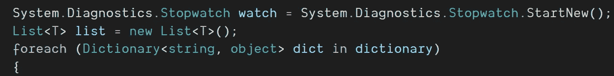

**2-)** 我们将通过使用反射创建一个通用的**、**类。我们将循环字典中的每一个条目。“唯一键”是忽略键。我们只能将其用于自定义操作。例如，它可以用于检查相同的记录是否存在。数据库中没有与“唯一键”匹配的列。每个键都是该类属性的名称。我们将通过使用反射获得带有字符串键的" *PropertyInfo"* 。我们将获得“*型*的财产。并且检查它是否为空。

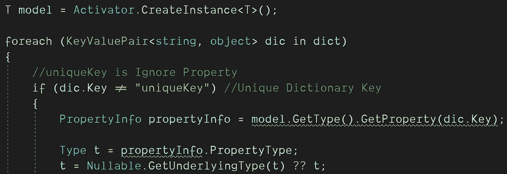

**3-)** 正如我们在本文开头谈到的***【JSON data】SentMail*的收件人属性是字符串类型。但是在散列中，我们将 Recipient 设置为复杂类型，所以我们必须将这个字段转换为 JSON 字符串。我们将检查“ *JsonData* ”自定义属性。如果任何属性有这个属性，我们将把它转换成一个带有自定义“ *ToJson()* ”扩展名的字符串。稍后我们将提高这部分的性能。最后，我们将使用哈希值设置该属性。**

**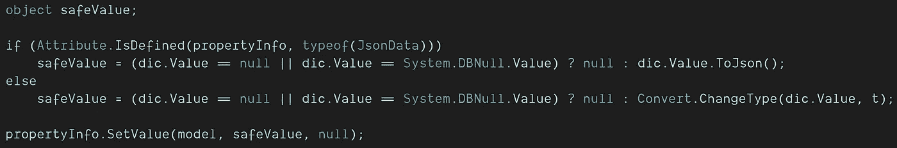**

****4-)** 最后，我们将 SendMail 模型添加到列表中，写出总的经过时间并返回列表。**

**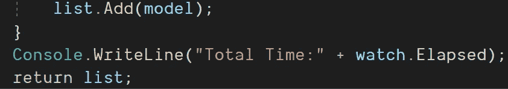**

```
 public static class StaticConverter
    {
        public static List<T> DictionaryToList<T>(this IEnumerable<Dictionary<string, object>> dictionary, 
            Dictionary<string, string> ColumnMatchTable)
        {
            System.Diagnostics.Stopwatch watch = System.Diagnostics.Stopwatch.StartNew();
            List<T> list = new List<T>();
            foreach (Dictionary<string, object> dict in dictionary)
            {
                T model = Activator.CreateInstance<T>();

                foreach (KeyValuePair<string, object> dic in dict)
                {
                    //uniqueKey is Ignore Property
                    if (dic.Key != "uniqueKey") //Unique Dictionary Key
                    {
                        PropertyInfo propertyInfo = model.GetType().GetProperty(dic.Key);

                        Type t = propertyInfo.PropertyType;
                        t = Nullable.GetUnderlyingType(t) ?? t;
                        object safeValue;

                        if (Attribute.IsDefined(propertyInfo, typeof(JsonData)))
                            safeValue = (dic.Value == null || dic.Value == System.DBNull.Value) ? null : dic.Value.ToJson();
                        else
                            safeValue = (dic.Value == null || dic.Value == System.DBNull.Value) ? null : Convert.ChangeType(dic.Value, t);

                        propertyInfo.SetValue(model, safeValue, null);
                    }
                }
                list.Add(model);
            }
            Console.WriteLine("Total Time:" + watch.Elapsed);
            return list;
        }
    }
```

****Extensions/ToJson():** 用于将对象(类)转换成字符串。**

```
public static string ToJson(this object value)
        {
            return JsonConvert.SerializeObject(value);
        }
```

> **"积极的态度加上努力等于表现."**
> 
> **—汤米·特伯维尔**

# **在字典和类之间映射不同的字段名称**

**我们将把字典“Subject”键与 SentMail 类的“Konu”属性相匹配。**

**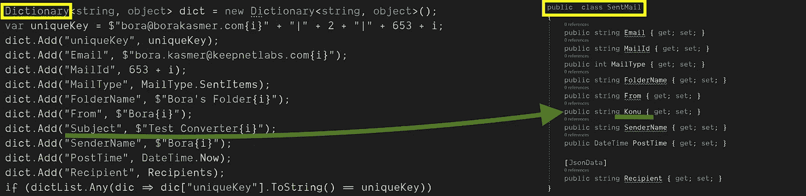**

**Mapped Dictionary[“Subject”] with SentMail.Konu**

****static converter/CheckedMapedKey():**我们将用这个方法映射字典字符串键值和模型属性名。我们将发送字典配置值，并用这个方法找到字符串键参数的匹配。**

```
 public static string CheckedMapedKey(string key, Dictionary<string, string> ColumnMatchTable)
        {
            if (ColumnMatchTable.Count > 0)
            {
                if (ColumnMatchTable.TryGetValue(key, out string value))
                {
                    return value;
                }
            }
            return key;
        }
```

****字典列表< T >扩展(版本 2):****

**我们将在这个扩展中添加“Dictionary ColumnMatchTable”参数。并映射不同的字符串字典键和类属性名。**

**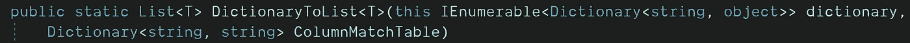**

```
public static List<T> DictionaryToList<T>(this IEnumerable<Dictionary<string, object>> dictionary, Dictionary<string, string> ColumnMatchTable)
        {
            System.Diagnostics.Stopwatch watch = System.Diagnostics.Stopwatch.StartNew();
            List<T> list = new List<T>();
            foreach (Dictionary<string, object> dict in dictionary)
            {
                T model = Activator.CreateInstance<T>();

                foreach (KeyValuePair<string, object> dic in dict)
                {
                    //PropertyInfo propertyInfo = model.GetType().GetProperty(dic.Key);
                    PropertyInfo propertyInfo = model.GetType().GetProperty(CheckedMapedKey(dic.Key, ColumnMatchTable));

                    Type t = propertyInfo.PropertyType;
                    t = Nullable.GetUnderlyingType(t) ?? t;
                    object safeValue;

                    if (Attribute.IsDefined(propertyInfo, typeof(JsonData)))
                        safeValue = (dic.Value == null || dic.Value == System.DBNull.Value) ? null : dic.Value.ToJson();
                    else
                        safeValue = (dic.Value == null || dic.Value == System.DBNull.Value) ? null : Convert.ChangeType(dic.Value, t);

                    propertyInfo.SetValue(model, safeValue, null);
                }
                list.Add(model);
            }
            Console.WriteLine("Total Time:" + watch.Elapsed);
            return list;
        }
```

*****映射配置字典示例:*** 我们会用这种方法匹配不同的列名。**

```
 var columnMatchTable = new Dictionary<string, string>() {
                                    {"Subject", "Konu" }
                                };
```

> ****“细节成就完美，完美不是细节。”****
> 
> **― **达芬奇****

# **提高性能:**

****1-)** 对于字典中的每一个条目，我们不必检查每个属性的属性。只检查第一项的属性就足够了。 ***属性。【IsDefined()“反射法消耗大量资源。这就是为什么我们应该离得越远越好。所以我们会添加“*”静态方法。它用于检查属性的属性。如果它找到一个属性，它将把它添加到“***AttributeDictionaryList***”中，并附上它的属性名和属性名。******

***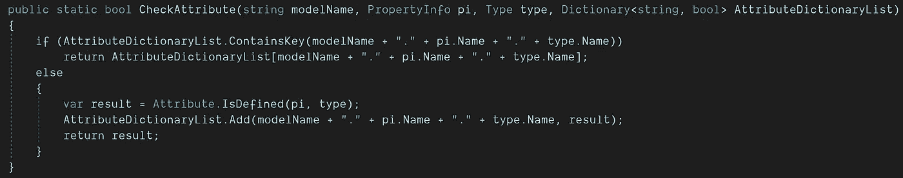***

***It is used for checking attribute of properties.***

*****2-)** List < T >是我们的返回模型，“***AttributeDictionaryList”***是一个列表，用来存储带有模型属性的属性。所以当我们将字典转换为列表的第一项时，我们会找到属性的属性，并将它们存储在 AttributeDictionaryList***中。*** 对于接下来的型号，我们将从这个列表中获取它们的属性。所以我们会提高性能。***

***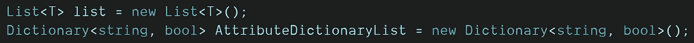***

*****3-)** 我们将改变“属性。IsDefined()"和自定义的" CheckAttribute()"方法，在第一个方法之后，我们可以从字典中获取属性的属性。***

***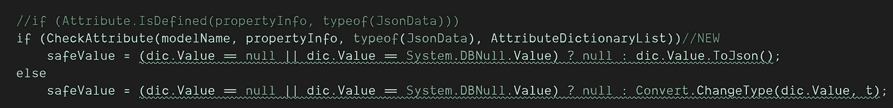***

***这是使用反射(*属性之间的性能测试。IsDefined()* )并只使用一个项目( *CheckAttribute()* )。***

***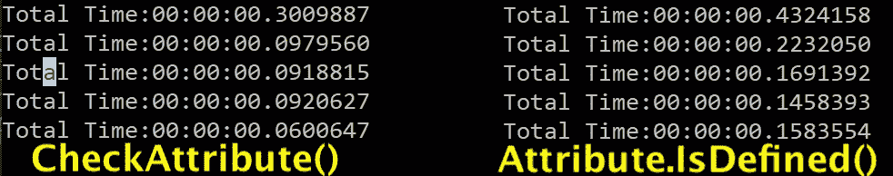***

*****Performance Test*****

> ***“专注和简单是我的座右铭之一。简单可能比复杂更难……”***
> 
> ***—史蒂夫·乔布斯***

*****字典列表< T >扩展(最终版本)*****

```
 */// <summary>
        /// Convert Dictionary To List<T>
        /// </summary>
        /// <typeparam name="T"></typeparam>
        /// <param name="dictionary"></param>
        /// <param name="ColumnMatchTable"> var columnMatchTable = new Dictionary<string, string>() { {"Subject", "Konu" } }; </param>
        /// <returns></returns>
        public static List<T> DictionaryToList<T>(this IEnumerable<Dictionary<string, object>> dictionary, 
            Dictionary<string, string> ColumnMatchTable)
        {
            System.Diagnostics.Stopwatch watch = System.Diagnostics.Stopwatch.StartNew();
            List<T> list = new List<T>();
            Dictionary<string, bool> AttributeDictionaryList = new Dictionary<string, bool>(); //NEW
            foreach (Dictionary<string, object> dict in dictionary)
            {
                T model = Activator.CreateInstance<T>();

                string modelName = model.GetType().ToString();//NEW

                foreach (KeyValuePair<string, object> dic in dict)
                {
                    //uniqueKey is Ignore Property
                    if (dic.Key != "uniqueKey") //Unique Dictionary Key
                    {
                        //PropertyInfo propertyInfo = model.GetType().GetProperty(dic.Key);
                        PropertyInfo propertyInfo = model.GetType().GetProperty(CheckedMapedKey(dic.Key, ColumnMatchTable));

                        Type t = propertyInfo.PropertyType;
                        t = Nullable.GetUnderlyingType(t) ?? t;
                        object safeValue;

                        //Performance Improvement
                        //if (Attribute.IsDefined(propertyInfo, typeof(JsonData)))                        
                        if (CheckAttribute(modelName, propertyInfo, typeof(JsonData), AttributeDictionaryList))//NEW
                            safeValue = (dic.Value == null || dic.Value == System.DBNull.Value) ? null : dic.Value.ToJson();
                        else
                            safeValue = (dic.Value == null || dic.Value == System.DBNull.Value) ? null : Convert.ChangeType(dic.Value, t);

                        propertyInfo.SetValue(model, safeValue, null);
                    }
                }
                list.Add(model);
            }
            Console.WriteLine("Total Time:" + watch.Elapsed);
            return list;
        }

        public static bool CheckAttribute(string modelName, PropertyInfo pi, Type type, Dictionary<string, bool> AttributeDictionaryList) //NEW
        {
            if (AttributeDictionaryList.ContainsKey(modelName + "." + pi.Name + "." + type.Name))
                return AttributeDictionaryList[modelName + "." + pi.Name + "." + type.Name];
            else
            {
                var result = Attribute.IsDefined(pi, type);
                AttributeDictionaryList.Add(modelName + "." + pi.Name + "." + type.Name, result);
                return result;
            }
        }*
```

*****Program.cs(Final):** 使用***DictionaryToList()***扩展名。***

***1-)“dict list”是我们的测试词典列表。我们将把它转换成一个列表。列表<email>是我们复杂的接收者的属性测试值。</email>***

***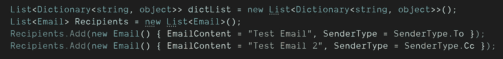***

***2-)我们将向字典列表添加 10000 行。“uniqueKey”是我们忽略的键。对于每个字典来说，它都是唯一的字符串名称。DB 上没有此键的映射属性。我们将使用它来保持字典中的唯一性。如果我们发现任何具有相同关键字的记录，我们将删除它并用最新的字典更新它。***

******

***3-)"***columnMatchTable***"是我们匹配的配置列表，像 AutoMapper 一样。我们将对 5 * 10000 = 50000 条记录运行 5 次 DictionaryToList()扩展。并监控结果。***

***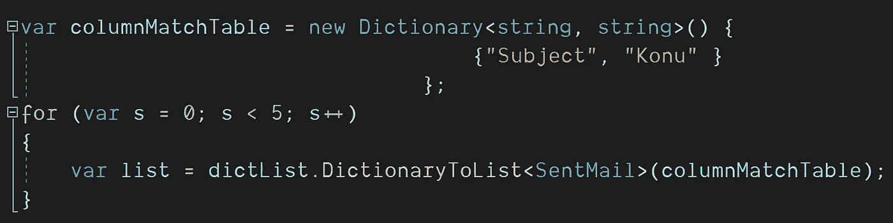***

```
*using BlogDictionaryToList;
using BlogDictionaryToList.Enums;
using BlogDictionaryToList.Model;

List<Dictionary<string, object>> dictList = new List<Dictionary<string, object>>();
List<Email> Recipients = new List<Email>();
Recipients.Add(new Email() { EmailContent = "Test Email", SenderType = SenderType.To });
Recipients.Add(new Email() { EmailContent = "Test Email 2", SenderType = SenderType.Cc });

for (var i = 0; i < 10000; i++)
{
    Dictionary<string, object> dict = new Dictionary<string, object>();
    var uniqueKey = $"bora@borakasmer.com{i}" + "|" + 2 + "|" + 653 + i;
    dict.Add("uniqueKey", uniqueKey);
    dict.Add("Email", $"bora.kasmer@keepnetlabs.com{i}");  
    dict.Add("MailId", 653 + i);
    dict.Add("MailType", MailType.SentItems);
    dict.Add("FolderName", $"Bora's Folder{i}");
    dict.Add("From", $"Bora{i}");
    dict.Add("Subject", $"Test Converter{i}");
    dict.Add("SenderName", $"Bora{i}");    
    dict.Add("PostTime", DateTime.Now);
    dict.Add("Recipient", Recipients);
    if (dictList.Any(dic => dic["uniqueKey"].ToString() == uniqueKey))
    {
        var dic = dictList.First(dic => dic["uniqueKey"].ToString() == uniqueKey);
        dictList.Remove(dic);
    }
    dictList.Add(dict);
}

var columnMatchTable = new Dictionary<string, string>() {
                                    {"Subject", "Konu" }
                                };
for (var s = 0; s < 5; s++)
{
    var list = dictList.DictionaryToList<SentMail>(columnMatchTable);    
}*
```

> ***"大自然喜欢简单。"***
> 
> ***艾萨克·牛顿。***

***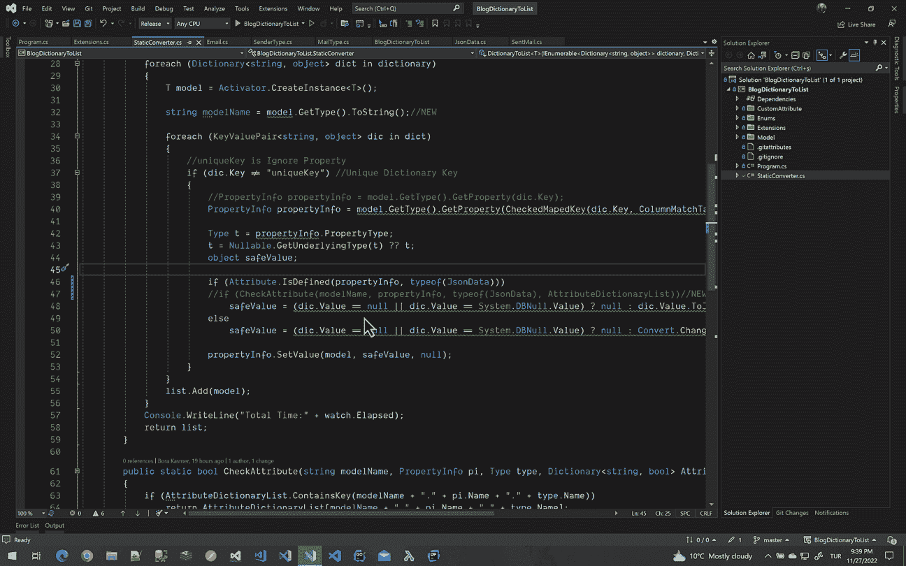***

***Test Dictionary to List Performance***

*****结论:*****

***在本文中，我们试图将字典转换为列表，而不是逐个匹配列。在这样做的时候，我们使用了泛型和反射类。我知道反射是一个性能杀手，但是如果你有 100 个列表并且可读性对你很重要，你可以毫不犹豫地使用这个扩展。我试图通过将属性存储在限定了作用域的字典中来提升代码。但是如果对你来说还不够，你可以在启动时把所有的“class.table.column.attributes”保留在一个全局静态字典列表中。而且也许你可以超载" ***dictList。***”DictionaryToList(ColumnMatchTable，bool hasAttribute=true)。如果您的类的属性没有属性，您可以将“hasAttribute”字段设置为 false，并且不检查“ToJson()”或任何属性操作。***

***Goodbye***

***下一篇文章再见。***

****“如果你读到目前为止，首先感谢你的耐心和支持。欢迎大家来我的博客*[](http://www.borakasmer.com/)****了解更多！”*******

******Github:**[***https://github.com/borakasmer/DictionaryToList***](https://github.com/borakasmer/DictionaryToList)****