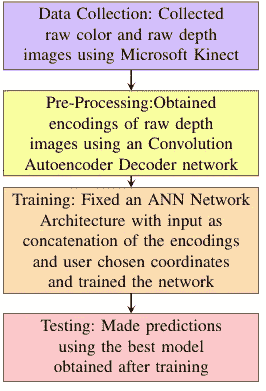
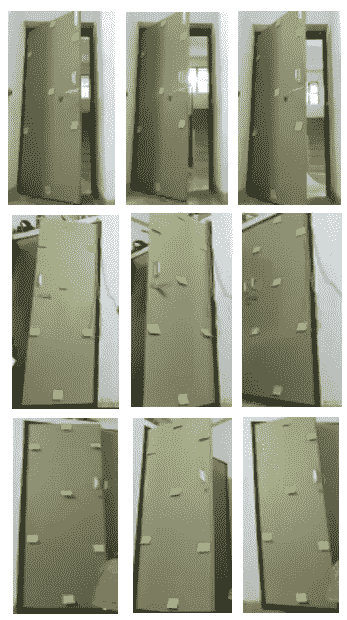
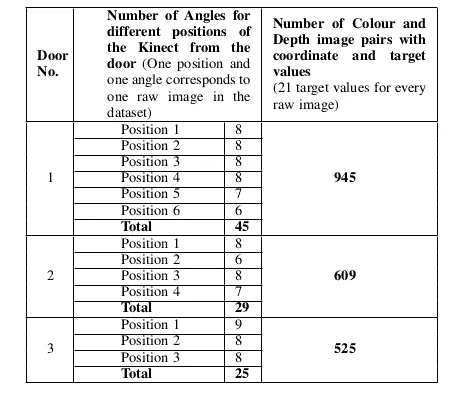
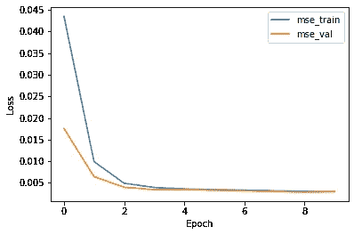
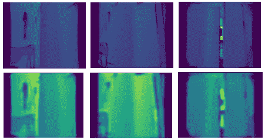
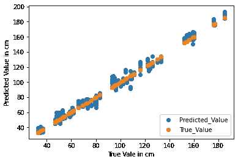
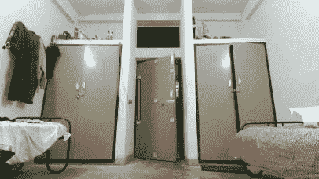

# 基于卷积自动编码器的单目图像深度图维数估计

> 原文：<https://medium.com/geekculture/convolutional-autoencoder-based-dimension-estimation-from-depth-map-of-monocular-images-9269d966bb86?source=collection_archive---------43----------------------->

> 这个项目是我本科毕业论文(2020)的一部分。我的队友是古鲁普拉萨德·维斯瓦纳坦·拉梅什和 T2【拉凯什·瓦伊迪斯瓦兰。我们是在 NITT 国家理工学院的[e . s . gopi](https://www.nitt.edu/home/academics/departments/ece/faculty/gopi/)博士的指导下完成这个项目的。本文描述了这个过程。

## 介绍

这个项目是关于使用深度学习方法来估计三维空间中任意两点之间的欧几里德距离，给定单目图像和相应的深度图像。所提出的技术是用户友好的，其中用户需要在单目图像上选择两个任意点。使用自动编码器-人工神经网络架构方法，其中使用自动编码器网络提取特征向量，并用于构建基于人工神经网络(ANN)的回归模型。估计欧几里德距离的平均偏差误差被获得为 0.059 米。实验结果揭示了所提出的技术的重要性，它可以被结合到各种尺寸测量应用中。下面给出的流程图描述了该方法。

Fig 1: Flow Chart of the method

## 数据收集

任何机器学习项目的前提都是数据。微软 Kinect 用于准备数据集。门被用作参考对象，一组作为兴趣点的贴纸被放置在门上(图 2)。我们收集数据的三扇门上都贴了七张黄色贴纸。因此，每个车门总共有 21 个不同的目标值(贴纸对)。使用放置在任意距离的 Kinect 摄像头同时收集门的颜色和深度图像。对于摄像机的一个位置，每个门有 6-8 个不同的角度。

Fig 2: Three different doors are used for the data collection process. Each row represents a unique door (Door 1, Door 2, Door 3 in order) and each column represents an arbitrary angle relative to an arbitrary position of the Kinect at which the image of the door was captured. Stickers are placed on it so that different distances can be measured between each sticker pair.

为了同时以相同的分辨率捕捉彩色和深度图像，一个[机器人操作系统(ROS)模块](https://github.com/code-iai/iai_kinect2)与 Kinect 摄像头相连接。通过将 Kinect 摄像头(在 1.5-4 米范围内效果最佳)放置在合适的位置，以使 Kinect 软件完全可以想象所获得的颜色和深度图像，为三扇门中的每一扇门收集数据。通过确保不同门的目标值是唯一的，总共获得了 63 个不同的目标值。总共收集了 99 幅原始彩色图像和相应的深度图像。每个图像进一步提供 21 对点用于距离估计，从而给出总共 2079 个预处理图像。2079 张图片中的每一张都标有相应的尺寸。下表给出了。

Fig 3: Table mentioning the number of values for each position and angle for each door.

## 数据预处理

开发了卷积自动编码器模型，以便在不丢失信息的情况下从图像中提取特征。原始深度图像通过自动编码器模型，并使用编码部分的特征图。所选点的坐标随后与特征图一起被馈送给人工神经网络。自动编码器型号的压缩系数为 4。体系结构如图 4 所示。

Fig 4: Auto Encoder-Decoder Architecture

使用均方误差(MSE)损失函数和 Adam 优化器。在图 5 中可以看到作为模型的历元数的函数的训练和验证损失的值。

Fig 5: Loss plot for the auto encoder-decoder

图 6 示出了通过模型后的原始深度图像及其相应的重建图像。

Fig 6: Top row shows the input depth images and the bottom row shows the corresponding reconstructed images from the encoder-decoder model.

## 人工神经网络

从自动编码器模型(图 6)的编码器部分获得的深度图像的特征图(编码)是平坦的。然后，用户选择的点的坐标与扁平化编码连接，作为 ANN 的输入。输入层连接到具有 1000 个神经元的层，该层之后是批量标准化层。后续层中的神经元数量减少到 100，然后最后，只有一个神经元用于输出。使用 MSE 损失函数和 RMSProp 优化器。

## 结果

这些模型是使用 Keras 和 Tensorflow 后端实现的，并在 Google Colab TPU 上进行训练。模型的性能取决于预测维度与实际维度的接近程度。由于问题陈述是一个回归问题(因为输出变量可以取任何实际值)，因此不能根据正确预测的数量来测量准确性，因为很有可能没有准确预测的值。然而，模型的性能可以通过其预测中的误差量来评估。例如，如果尺寸的真实值是 150 厘米，则预测 148 厘米或 152 厘米的模型比预测 165 厘米的模型更好。散点图如图 7 所示。

Fig 7: Scatter plot between the True value (original measurement) and the Predicted Value.

发现该模型的均方误差为 0.00339，平均结果误差为(+/-) 0.059 米。

Fig 8: True value: 0.95m, Predicted value 0.912m

## 限制

1.  我们估计两点之间距离的方法是基于使用 Kinect 生成的深度图。它假设图像的深度图的可用性来估计三维空间中的距离。
2.  提高机器学习问题准确性的过程涉及大量的尝试。有必要尝试不同的方法来帮助提高性能。在机器学习问题中，可用数据的数量和类型是实现最佳结果的重要限制。因此，通过收集更多的数据，可以提高模型的性能，前提是数据增加了模型可以学习的模式的多样性。选择合适的超参数对提高模型的性能也有一定的作用。

*链接到 Github 知识库:*[*https://Github . com/hariharannatesh/Dimension-Estimation-from-Depth-Map-of-single-Image*](https://github.com/hariharannatesh/Dimension-Estimation-from-Depth-Map-of-Monocular-Image)