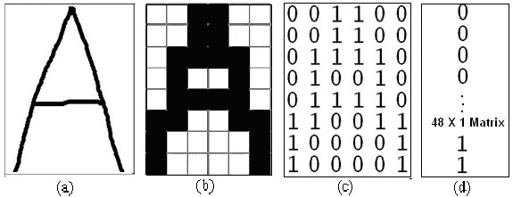
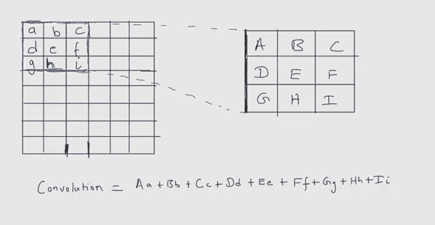
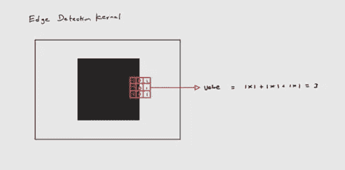

# 卷积神经网络——基本介绍

> 原文：<https://medium.com/geekculture/convolutional-neural-networks-a-basic-introduction-b03ec473be5f?source=collection_archive---------49----------------------->

Photo by [Munro Studio](https://unsplash.com/@universaleye?utm_source=medium&utm_medium=referral) on [Unsplash](https://unsplash.com?utm_source=medium&utm_medium=referral)

# 什么是卷积神经网络？

神经网络是深度学习的构建模块。当我们第一次接触深度学习时，有很多种神经网络会被谈论。一开始会有点受不了。有前馈网络、递归神经网络、卷积神经网络等。每种类型的神经网络对于不同类型的任务都是有用的。每天都有新的研究出现，将不同的架构或完全不同类型的网络应用于人工智能任务，因此很难跟踪不同类型的可用模型，但有一些标准类型的模型，在这些模型的基础上出现了新的模型。卷积神经网络就是其中之一。有许多不同类型的架构可供选择。这些架构背后的主要思想是相同的。

# 为什么我们需要一种特殊的网络？

卷积神经网络适用于许多不同类型的任务。卷积神经网络的大部分应用依赖于计算机视觉领域。图像分类是将图像分类到不同的给定类别的任务。CNN 在这项任务中表现出色。要理解为什么我们需要从更广阔的角度来看。

从广义上讲，机器学习是评估一个函数的任务。给定一个数据集，我们遍历该数据集，并尝试预测数据集的分布函数。因此，引入一些关于数据外观的归纳偏差将是减少训练时间的一种方式。这样做的原因是，当我们介绍数据看起来如何时，我们正在正则化模型，以降低其记忆数据集的能力。

与其他网络相比，卷积神经网络更适合于图像。卷积运算是在一个二维平面上完成的，完全理解它是一个图像。

# 卷积神经网络的重要特性是什么？

卷积神经网络的重要性质是两种运算，即卷积和池化。

## 卷积运算

卷积运算可以简单地看作是扫描。假设我们有一个高 9 像素、宽 9 像素的灰度图像。对于计算机来说，图像只是一个高度和宽度与图像(以像素为单位)相同的矩阵。矩阵内的值将具有特定像素在屏幕上显示时将具有多少光的值。因为我们有一个灰度图像，考虑图像的白色部分的值为 0，黑色部分的值为 1。

Credit — [Rahul Rishi](https://www.researchgate.net/profile/Rahul-Rishi?_sg%5B0%5D=jSdil_3eBXKVdwjF7GxZDtut9RpQrri51pRIJXKYC9dTnvdYwxk-MfQ4y12vSzse-FqPcJU.qaUGxY0RAxicDqrmg1dEQuIC633SHFyaM9o4v8Rn7yweDZRKRvIhu-vu_9jFnZQG45grG79DzLxRvPUo5074NA&_sg%5B1%5D=ED8Oo-iu5xVqJZBYMiQXdj6oZsHQAL_6VFMnCfKz6E9DeY6Wr4Yy0DJP-iiDFJqJ2SXQVZU.9GKmKmooEGBfvWKJRRLtvRmZ3F_WOCH6HpVX6ZRngXjLVnVgKTCwh2Rqofg2h2K49Mo5muvmtQdFlLw2boPlcA),[Choudhary Amit](https://www.researchgate.net/scientific-contributions/Choudhary-Amit-36002777?_sg%5B0%5D=jSdil_3eBXKVdwjF7GxZDtut9RpQrri51pRIJXKYC9dTnvdYwxk-MfQ4y12vSzse-FqPcJU.qaUGxY0RAxicDqrmg1dEQuIC633SHFyaM9o4v8Rn7yweDZRKRvIhu-vu_9jFnZQG45grG79DzLxRvPUo5074NA&_sg%5B1%5D=ED8Oo-iu5xVqJZBYMiQXdj6oZsHQAL_6VFMnCfKz6E9DeY6Wr4Yy0DJP-iiDFJqJ2SXQVZU.9GKmKmooEGBfvWKJRRLtvRmZ3F_WOCH6HpVX6ZRngXjLVnVgKTCwh2Rqofg2h2K49Mo5muvmtQdFlLw2boPlcA)

考虑另一个矩阵，它的大小小于图像的大小(比如 3×3)。这个矩阵被称为内核。在卷积操作期间，该核将滑过图像，计算图像矩阵的加权和，该图像矩阵由核矩阵的相应值加权。通过这样做，网络提取图像内部的视觉特征。

Convolution operation

让我们看一个提取图像边缘信息的核的例子。

Edge detection of gray scale image

考虑我们有一个内核，它有以下值。通过在一侧有暗边而另一侧有亮边的形状中进行卷积运算，我们可以检测到在中间像素处有边缘。在卷积之后，中间的像素将具有比其他像素高的值，以显示那里有边缘。像这样，一个核可以有许多可能的值，每个值检测图像的不同特征。通过训练，我们可以让模型学习制作内核所需的值。我们可以选择拥有多少个内核，这决定了网络的容量。

## 最大池操作

Credit — Wikipedia

卷积神经网络中的另一个重要操作是汇集操作。卷积运算通过扫描完成提取信息的工作，而汇集运算则着眼于全局。卷积运算检测特征的存在。无论要素出现在何处，汇集操作都有助于收集信息。池操作有助于模型变得平移等价。

卷积网络中使用的池有很多种。最常见的是最大池。背后的想法很简单。它考虑卷积后图像矩阵的一个小区域，并获得该区域中的最大值。这将减少进入下一层的图像矩阵的大小。对于大图像，将有多层卷积和汇集，这减小了从图像中提取重要特征的图像矩阵的大小。然后将这些特征输入前馈网络进行训练，将图像分类。

# 和人类的视觉有多相似？

大多数神经网络模型都是受生物学启发的。卷积神经网络与人类视觉有相似之处，也有不同之处。卷积网络的灵感来自大脑中负责视觉的部分，称为初级视觉皮层。大脑的这个区域处理以光线形式进入视网膜的视觉输入。这个区域在模式识别方面非常出色，并提供对视觉信号的空间理解。落在特定点上的光线会触发初级视觉皮层的特定区域。还有两种细胞存在。简单细胞和复杂细胞。简单的细胞在图像的一小块中提供检测。简单细胞是核卷积发展的基础。复杂单元的响应类似于简单单元，但是它们对于小位移具有不变量的特性。这部分启发了卷积神经网络的池层。

我们不能完全说卷积神经网络成功地模拟了人眼。这是一个受生物启发的网络，已经过简化以提高计算效率。有许多研究旨在解决卷积神经网络所面临的问题。

本文提供了一个关于卷积神经网络如何工作的简化视图。还讨论了卷积神经网络的用途及其在计算机视觉领域的重要性。我们还可以看到卷积神经网络背后的生物灵感。希望你能很好地理解这个概念。

谢谢你。