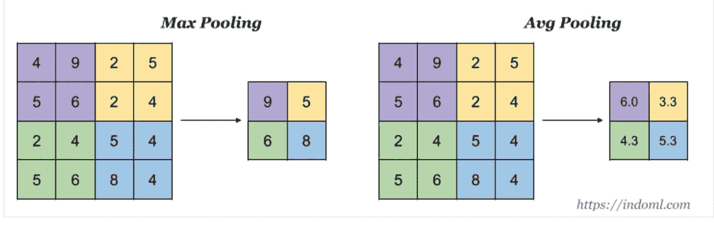
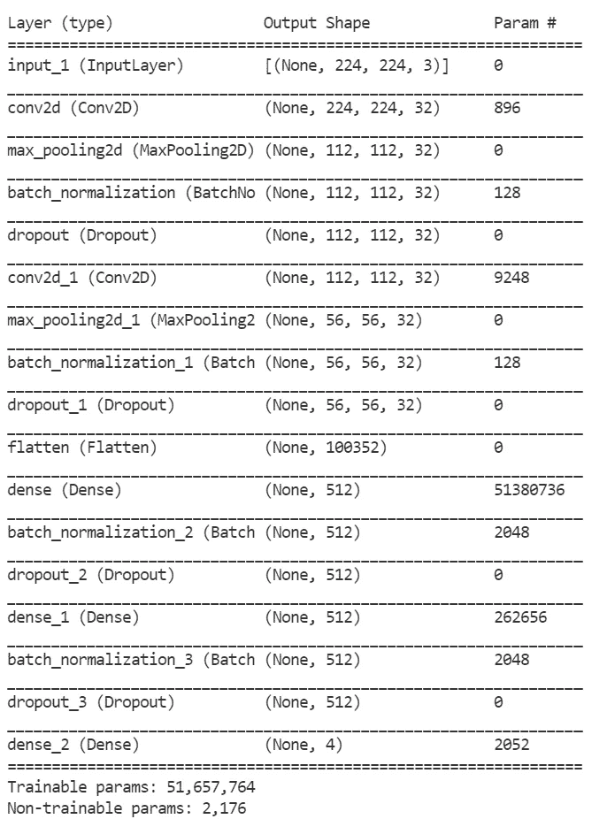

# 卷积神经网络

> 原文：<https://medium.com/geekculture/convolutional-neural-networks-ab4b24d1f916?source=collection_archive---------27----------------------->

# **内容**

*   **简介 **
*   ***通用架构***
*   ***卷积块***
*   ***卷积运算***
*   ***统筹操作***
*   ***填充操作***
*   ***大步走法***
*   ***从头实现 CNN***
*   ***计算每层的参数个数***
*   ***结论和进一步的来源***

## **简介**

卷积神经网络是一种主要用于图像、语音和音频输入的神经网络。CNN 对于处理图像和使用卷积运算从图像中提取特征非常有用。主要应用领域包括图像分类、对象检测和图像分割(语义分割和实例分割)。

## **CNN 的总体架构**

fig1 : CNN architecture

卷积神经网络有两个部分，即特征学习和分类部分。在特征学习部分，我们有许多卷积块，通常每个这样的 conv 块包括三个操作，即卷积、激活和汇集。CNN 模型可以有许多卷积块和完全连接的层，这取决于网络设计。对于每个卷积层，我们需要指定滤波器的数量。过滤器检测模式包括——边缘、形状、纹理、曲线、物体、颜色等。分类部分有前馈神经网络。CNN 在训练时学习内核参数。所以我们不需要为特定的特征提取手动设计内核。

## ***卷积运算和*** 内核运算

在图像处理领域，人们使用手动定义的核或滤波器进行图像去噪、变换等。但是在 CNN 的上下文中，内核在训练期间是可训练的。最初，我们为过滤器(内核)中的每个参数取随机权重，并使用反向传播获得每个参数的优化参数值。我们在卷积中做什么？它只是内核值和图像不同区域之间的一系列点积。为了捕捉输入图像的所有部分，我们在图像上滑动内核窗口。与卷积层相关联的滤波器滑过来自输入的每组 3*3 像素。重复该过程，直到滤波器覆盖所有 3×3 像素块。这种滑动被称为**卷积。**点积的结果存储在输出中，称为特征图。现在考虑下图，它显示了使用内核时卷积是如何发生的。

fig 2: convolution process

我们可以有许多不同的核用于特征提取(垂直边缘、曲线、边界等)。).在特征图中，高点积表示输入图像相对于核算子的良好匹配部分。那么怎么处理特征图呢？

## ***汇集操作***

卷积运算后得到的特征图对输入图像中特征的位置很敏感。为了解决这种敏感性，我们使用池对特征图进行下采样。因此所得到的下采样特征对于输入图像中特征位置的变化将更加鲁棒(局部平移不变性)。由于输入的维数很大，我们需要执行许多乘法运算。但幸运的是，通过池化，我们在训练时需要的计算量更少。有各种各样的池，最大池和平均池是常见的选择。在汇集中，我们在特征图中取一个小区域，如果它是最大汇集，则取最大值，如果我们应用平均汇集，则取所选区域中值的平均值。让我们考虑下图来理解我们如何在特征图上进行最大池化。

fig3 : max pooling and average pooling

## ***填充操作***

填充是向输入图像添加额外的零像素集的过程，以避免卷积运算期间的信息丢失。填充通过将信息保留在边界来帮助提高性能。如果我们不使用填充，那么卷的大小会很快减小，信息会很快被洗掉。

*   深度学习中有三种填充，即有效填充、相同填充和完全填充。有效填充意味着根本没有填充。相同的填充将在卷积后保持图像大小。完全填充确保所有像素对输出具有相同的影响。在这种情况下，输出大于输入。

fig 4: padding ( 2 layer)

## ***大步走法***

在步进卷积中，我们将窗口移动一个以上的像素范围。如果步幅是 2，那么内核将在图像上滑动 2 个像素(行或列)。

fig 5; convolution with stride = 1

fig 6: convolution with stride = 2

## 缩放、批量标准化和丢弃

通过将每个输入像素除以 255 来进行缩放或归一化。因此，规范化是指将所有值统一到 0 到 1 的范围内。相似的尺度特征将导致更快地获得梯度下降。

批量规范化有助于我们提高训练速度、性能、稳定性和稳定性。批量标准化应用于我们选择应用的图层。第一批 norm 做的是标准化激活函数的输出。在规范化之后，batch norm 将这个规范化的输出乘以某个任意参数，然后向其添加另一个任意参数。使用两个任意参数的计算为数据设置了新的标准偏差和平均值。这四个参数都是可训练的。该过程使得网络内的权重不会因为极高或极低的值而变得不平衡，因为归一化包括在梯度过程中。使用批量规范，我们还在网络内进行了规范化。批次标准化以批次为基础进行。

辍学有助于减少过度拟合。在小数据集上训练的神经网络可能导致过拟合。在训练期间，大量的层输出被随机忽略或丢弃。在神经网络中，每一层都实现了丢失。

## **全连接层**

在每个卷积层之后，我们的输入数据得到大量的维度。我们在所有卷积之后使参数变平，然后设计前馈网络。我们可以有许多完全连接的层。在最后的层中，如果我们处理多类分类问题，我们使用 SoftMax 激活函数，如果我们处理二元分类问题，则使用 sigmoid。在下一节中，让我们使用 keras 创建一个卷积神经网络。

# **使用 keras 实现卷积神经网络**

gist 1 : model class

现在让我们总结一下模型，并分析每一层的参数。下图显示了模型(网络)摘要。

fig 7 : model summary

我们可以看到输入图像形状为(224，224，3)，因此这里我们有一个三通道图像。在输入层，我们没有任何参数。第一个卷积层使用 32 个过滤器。我们应该记住，由于我们的输入图像有三个通道，每个过滤器也有三个通道。现在，在网络设计部分，我们已经定义了滤波器大小为(3，3)。因此，每个滤波器有三个通道，每个通道具有(3，3)形状。这意味着每个通道有 9 个参数。每个滤波器总共有 27 个参数+ 1 个偏差。因为我们在第一卷积中有 32 个滤波器，所以我们对于第一卷积层有 32* 28 = 896 个参数。

我们使用(2，2)池，所以维度减少到原来的一半。(从 224 到 112)。现在来看批量标准化部分，对应于每个滤波器批量标准化层有 4 个参数，其中一半是不可训练的。因为我们在前一层有 32 个过滤器，所以总参数是 32*4 = 128。脱落层没有任何参数，它对尺寸没有影响。

注意，在第二卷积层中，我们有 9248 个参数。让我们看看这个。前一层有 32 个维度。因此，滤波器也应该有 32 个通道或维度。每个通道有 9 个参数。因此，每个滤波器总共有(9*32)+1 个偏置(289)。因为我们有 32 个这样的滤波器，所以第二卷积中的参数总数是 289* 32 = 9247

## ***结论***

我们已经看到了卷积神经网络是如何工作的，并使用 keras 实现了一个基本的 CNN 网络。CNN 在许多不同的领域都有不同的用例。我们需要每个类别足够数量的图像来从头开始训练 CNN。CNN 高级主题包括迁移学习、各种卷积、剩余网络等。读者现在应该对卷积神经网络的基础有所了解。

## 参考资料和进一步阅读

*   [https://www . IBM . com/cloud/learn/卷积神经网络](https://www.ibm.com/cloud/learn/convolutional-neural-networks)
*   [https://cs231n.github.io/convolutional-networks/](https://cs231n.github.io/convolutional-networks/)
*   各种图像分类问题的实现:[https://github.com/thomasreji155](https://github.com/thomasreji155)