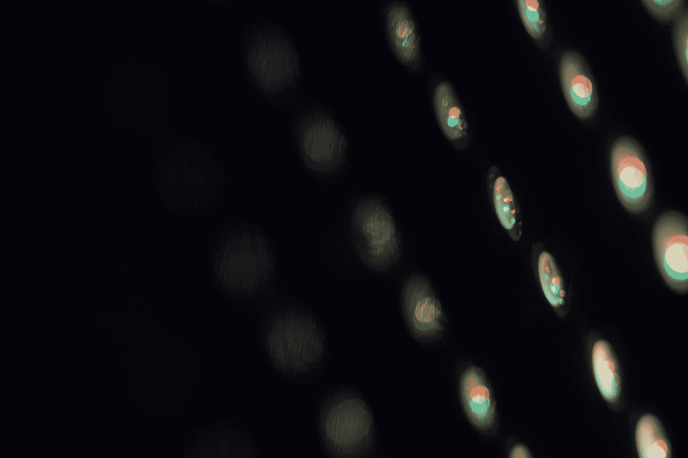
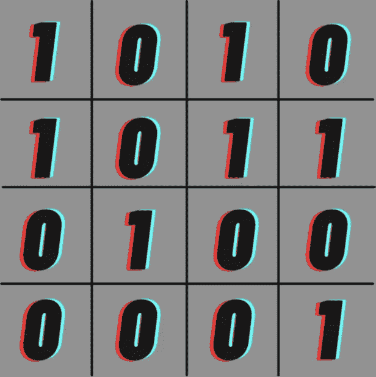
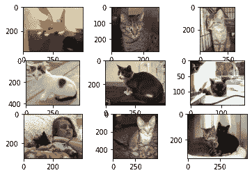
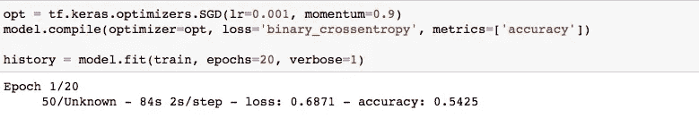

# 张量流卷积神经网络

> 原文：<https://medium.com/geekculture/convolutional-neural-networks-with-tensorflow-7655a8c440ae?source=collection_archive---------19----------------------->



Photo by [🇻🇪 Jose G. Ortega Castro 🇲🇽](https://unsplash.com/@j0rt?utm_source=medium&utm_medium=referral) on [Unsplash](https://unsplash.com?utm_source=medium&utm_medium=referral)

在这篇博客中，我将谈论卷积神经网络，简称 CNN。CNN 对于像图像处理这样的事情非常有用。我们将从了解 CNN 如何工作开始。

图像可以被认为是一个非常大的矩阵。如果我们考虑黑白(灰度)图像，那么所有的像素都有一些值。让我们考虑 1 是白色，0 是黑色。所以我们有这样一幅图像:



Image

CNN 的基本工作原理是识别图像中的直线、对角线和曲线等特征。他们使用过滤器来识别所有这些线。滤镜是一个小矩阵，有助于使图像上的特征更加明显。例如，下面是一个过滤器:


3X3 filter

该滤波器可用于识别图像中的直边。

然后将滤镜放在图像的第一个 3X3 部分。之后，滤镜上的数字和图像相乘。然后将生成的矩阵上的所有数字相加，形成新图像的一个像素。这将导致图像尺寸的减小。有时，这并不理想，因此我们向图像添加填充，即增加原始图像大小的黑色边框，以便在卷积后，图像大小不会减小。

让我们看看如何用它来训练一个神经网络。我要做一个猫和狗的模型。我已经从这场比赛中获取了数据。解压后，你会有一个 train 文件夹，里面有所有的猫和狗的图片，格式如下:“cat.index_number.jpg”。

让我们先看看所有这些图像:

```
import numpy as np
import cv2
import matplotlib.pyplot as plt
from matplotlib.image import imreadfolder = 'train/'for i in range(9):
    plt.subplot(330 + 1 + i)
    filename = folder + 'cat.' + str(i) + '.jpg'
    image = imread(filename)
    plt.imshow(image)plt.show()
```



正如我们可以看到的，所有的图像都有不同的大小。这是行不通的，所以我们将使用 keras 和 os 模块中的预处理来调整图像的大小，并将图像分离到不同的文件夹中。让我们从把所有的图片放到不同的文件夹开始。

```
import os
import shutilos.mkdir('data')
os.mkdir('data/cats')
os.mkdir('data/dogs')for file in os.listdir('train/'):
    if file.startswith('cat'):
        shutil.copyfile('train/{}'.format(file),
                        'data/cats/{}'.format(file))
    if file.startswith('dog'):
        shutil.copyfile('train/{}'.format(file),
                        'data/dogs/{}'.format(file))
```

在这之后，所有的猫的图像应该复制到猫的文件夹，狗的图像应该复制到狗的文件夹。这可能需要一点时间。

在这之后，我们可以使用 tensorflow 来调整大小和改变图像。然而，在我们这样做之前，我们需要制作我们的模型结构。

```
import tensorflow as tf
import tensorflow.keras as kerasmodel = keras.Sequential([
    tf.keras.layers.Conv2D(64, (3,3), activation='relu',
                           padding='same', input_shape=(200,200,3)),
    tf.keras.layers.MaxPooling2D((2,2)),
    tf.keras.layers.Flatten(),
    tf.keras.layers.Dense(units=128, activation='relu'),
    tf.keras.layers.Dense(units=1, activation='sigmoid'),
])
```

这里，在第一层中将添加 64 个过滤器。过滤器的尺寸为 3X3。我们将激活设置为 relu。我们也设置填充为“相同”,这将增加我们谈到的黑色边框。调整图像大小后，输入形状将是 200X200 的新形状。额外的 3 意味着图像的红色、蓝色和绿色成分将有矩阵(因为我们使用的是彩色图像)。展平只是将方形结果展开成一条长线，就像 DNN 的节点一样。这样做是为了使我们能够从 CNN 结构过渡到 DNN 结构。

在设置模型结构之后，我们需要为数据从文件夹移动到模型训练建立管道。我们使用*来做这件事。flow_from_directory* 函数。首先，我们使图像对模型可用，并使用 ImageDataGenerator，我们重新调整图像的像素值，使它们在 1 和 0 之间。这是因为，正如我在以前的博客中所说，神经网络在 0 到 1 之间的数字上工作得最好。

```
from keras.preprocessing.image import ImageDataGeneratordatagen = ImageDataGenerator(rescale=1/255.0)
train = datagen.flow_from_directory('data/', class_mode='binary', batch_size=64, target_size=(200,200))
```

输出应该显示:找到 25000 张属于 2 类的图片。

在这之后，我们可以通过编译我们的模型，然后使用 model.fit()来开始训练:

```
opt = tf.keras.optimizers.SGD(lr=0.001, momentum=0.9)
model.compile(optimizer=opt, loss='binary_crossentropy', metrics=['accuracy'])history = model.fit(train, epochs=20, verbose=1)
```

然后你可以等待训练开始。训练完成后，如果您对精确度不满意，那么您可以更改设置的值并开始训练。



The training of the model

理想情况下，您应该将数据集分成 80–20 或 70–30 的训练和测试数据。然后，您可以使用相同的代码创建一个验证数据生成器，然后将该生成器作为验证数据提供给 model.fit。这是常见的做法，但由于这个模型只是为了演示的目的，我没有在这里展示。

之后，你可以使用 imread('filename.jpg ')从你的文件夹中加载图片。您可以使用 OpenCV 中的 cv2.resize 函数之类的函数将其调整为 200X200 的图像，然后将其提供给 model.predict 函数以查看您的预测。由于我们还保存了来自培训的数据，因此我们可以使用以下代码来访问这些数据:

```
acc = history.history['accuracy']
plt.plot(acc)
plt.show()
```

这就是这篇博客的内容。我希望你喜欢它，并学习了卷积神经网络背后的理论以及如何使用 tensorflow 来使用它们。如果你喜欢这篇文章，那就在 Medium 上关注我，分享这篇文章吧！

感谢阅读！