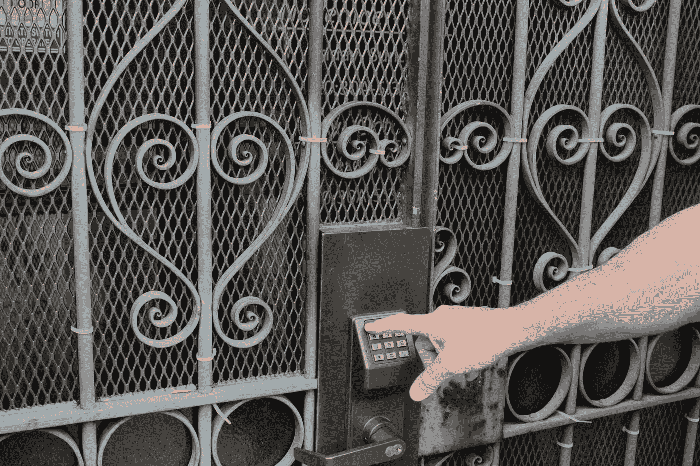

# Cookies、会话、令牌

> 原文：<https://medium.com/geekculture/cookies-session-token-d9f068cccdc6?source=collection_archive---------4----------------------->

Photo by [Danielle Rice](https://unsplash.com/@drice22?utm_source=medium&utm_medium=referral) on [Unsplash](https://unsplash.com?utm_source=medium&utm_medium=referral)

HTTP 是一种无状态协议。为了知道哪个设备发起请求，cookie、会话和令牌是解决这个问题的两种机制。

> 如果你觉得我为你贡献了价值，请支持我！

过去 5 个月，我越来越难达到我想要的收入，但如果我停下来，我会为我推荐的会员感到难过。