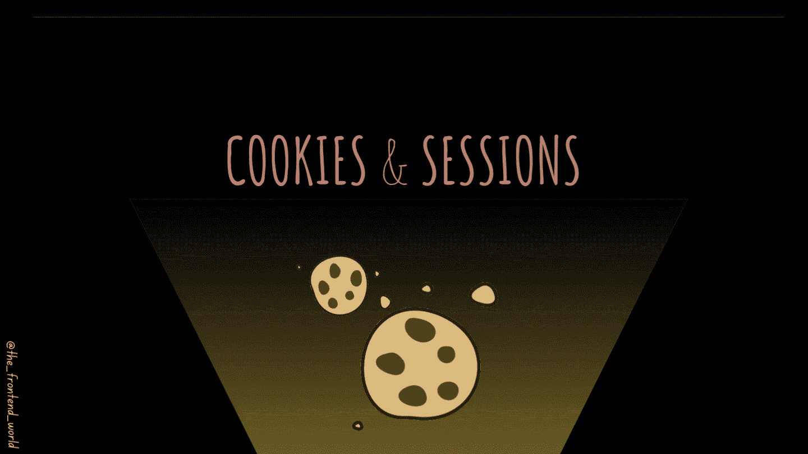

# Cookies 和会话🍪

> 原文：<https://medium.com/geekculture/cookies-sessions-1cb9e4ad6f7b?source=collection_archive---------2----------------------->

## 什么是 web cookie 和会话？

By FAM

现在我们已经有了关于我们如何在互联网上交流的基础，以及在[的最后一篇文章](https://levelup.gitconnected.com/web-methods-and-headers-80c9aaaa126a)中`**HTTP**`如何通过它的头和方法说话。在了解浏览器及其工作原理之前，我们需要了解一些事情来完善我们的愿景。我们将学习饼干和会话。我们在网络上使用的两个元素，下面是如何使用和为什么使用！