# 🍪🍪带有 Express.js、Nodemon、ESM、Cookie 解析器和 Cookie 会话的 Cookie

> 原文：<https://medium.com/geekculture/cookies-with-express-js-nodemon-esm-cookie-parser-and-cookie-session-1ad3c77ad3d5?source=collection_archive---------5----------------------->


嗨！这是一个关于 Express.js 的新帖子，对我来说，在 Express.js 中使用 Cookies 是一件新鲜事，但是是的！我们将使用 Cookies 并将其发送给客户端，并增加一点安全性。好了，让我们来烤这些饼干吧！！🍪🍪

# 启动 NPM 并安装 Express.js

首先，我们需要一个名为 bake_cookie 的目录(有趣的名字😁)然后我们需要用这个命令初始化 package.json

```
npm init -y
```

然后我们需要用这个命令安装 Express.js

```
npm i express
```

# 安装 nodemon 和 esm NPM 软件包

Nodemon 是一个实用程序，如果您更新了 tour server.js 文件，它会重新加载服务器 esm 是一个 ECMAScript 模块加载程序，它可以帮助我们使用从 ES6 导入的功能。

```
npm i nodemon esm
```

在我们的 json 包中，我们必须将这个命令添加到包的 JSON 脚本中

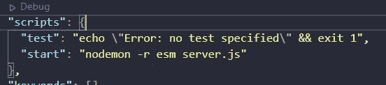

Example command to run nodemon and esm

```
"start": "nodemon -r esm server.js"
```

要运行此命令，您需要使用通用 npm 运行启动

# 创建我们的服务器 JavaScript 文件和我们的服务器！

然后我们需要创建我们的 server.js 文件，并添加这个小代码来运行我们的服务器

```
import express from "express"
const app   = express(),
port  = process.env.PORT || 1024
app.get("/", (*req*, *res*) => {
*res*.send("Monster Cookie!"
})app.get("/delete_monster", (*req*, *res*) => {
*res*.send("Monster Deleted")
})
app.listen(port, () => console.log(`http://127.0.0.1:${port}`))
```

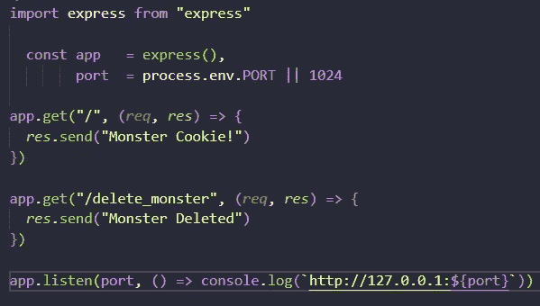

Example adding the basi code to run our server

目前，我们只有两条路线，主页和 delete_monster。

# 饼干时间！

总的来说，我们需要安装 cookie-parser 中间件，这样我们就可以在我们的服务器端使用了

```
npm i cookie-parser
```

然后我们需要创建我们的 secretCookie 代码来加密我们的 Cookie，然后发送到客户端，这就是为什么您需要创建一个名为 credentials.development.json 的 JSON 文件

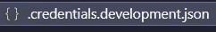

Example creating json file with our secret cookie

在内部，我们将使用 secretCookie 字符串创建一个简单的 JSON

```
{
"secretCookie": "This is your secret code"
}
```


Example secretCookie string object

之后，我们需要创建一个 conf.js 文件，使用这个文件可以导出 cookie 解析器中间件的凭证

```
const key         = process.env.NODE_ENV || "development",
credentials = require(`./.credentials.${key}`)
*module*.*exports* = { credentials }
```

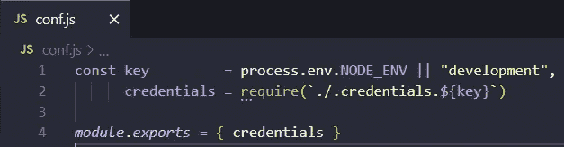

Example importing the secretCookie and exporting

然后我们需要在我们的服务器文件中调用它，并作为变量传递给我们的 cookieParser 中间件

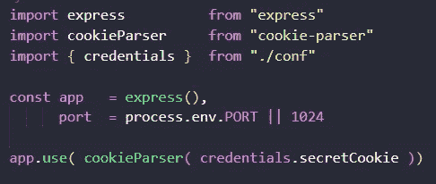

Example calling credentials secretCookie

然后我们会烤一些饼干，用 res.cookie()方法发送给客户端，用 clearCookie()方法清除所有的饼干

```
import express          from "express"
import cookieParser     from "cookie-parser"
import { credentials }  from "./conf"const app   = express(),
port  = process.env.PORT || 1024
app.use( cookieParser( credentials.secretCookie ))
app.get( "/", ( *req*, *res* ) => {
*res*.cookie( "monster_cookie", "Yummy Yummy" ).send( "Monster Cookie!" )})
app.get( "/monster_signed", ( *req*, *res* ) => {
*res* .cookie( "monster_cookie_signed", "Chop chop", {
signed: true,
})
.send( "Monster Cookie Signed!" )
})
app.get( "/delete_monster", ( *req*, *res* ) => {
*res* .clearCookie( 'monster_cookie_signed' )
.clearCookie( 'monster_cookie' )
.send( "Monster Deleted" )})
app.listen( port, () => console.log( `http://127.0.0.1:${ port }` ))
```

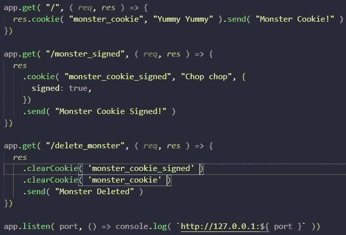

Example creating cookies and send them to the client

然后当我们运行我们的服务器，我们有这个

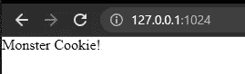

Example server running and browser view

但是我们的饼干怎么了？

你有两种方法，下载 chrome 的扩展或者打开 Chrome 开发工具

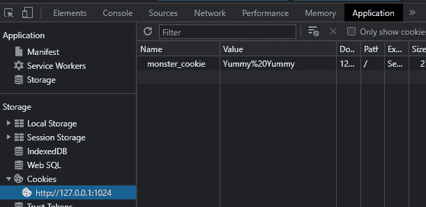

Example Chrome DevTools

谷歌浏览器的扩展 [editThisCookie](https://www.editthiscookie.com/)

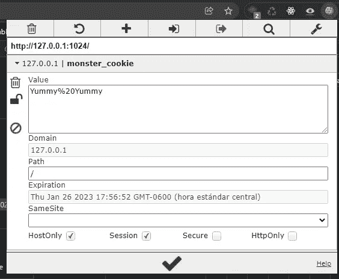

Example extension for Google Chrome

看起来我们已经有了我们的 cookie，让我们去 monster_signed URL 获取我们的两个 cookie

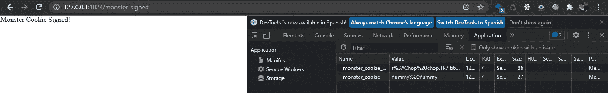

Example cookies on the browser

太好了，如果你看到签名的 cookie 有更多的信息或加密数据，这是因为我们的 cookieParser 中间件和秘密 cookie，而且这个签名的 cookie 优先

然后用 delete_monster URL 删除我们的 cookie 来清除我们的 cookie

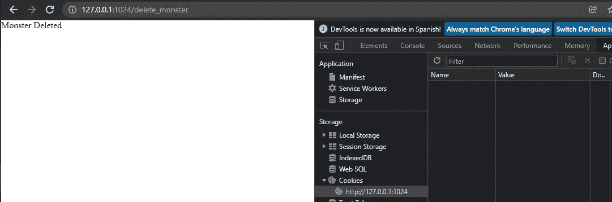

Example delete our cookies

如您所见，我用 clearCookie()删除了 URL 为的 Cookie

# 会议

安装 express-session 来添加带有 cookies 的会话，这是维护项目状态的最佳方式

```
npm i express-session
```

并将中间件添加到我们的 server.js 文件中

```
app.use( expressSession({
resave: true,
saveUninitialized: false,
secret: credentials.secretCookie
}))
```

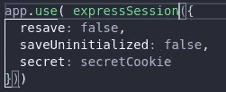

Example adding the expressSession middleware to our server file

使用此配置，重新保存是指保存回存储区，save initialized 设置为 true 表示将未初始化的会话保存到存储区，secret 是对会话 ID cookie 进行签名。

# 使用会话

要使用会话，您需要创建一个用户名并添加一个字符串，但是我们怎么做呢？

会话是在我们的请求对象中创建的，我们可以向会话对象添加属性，如用户名

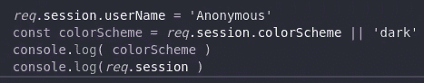

Example adding session to our server

如果你看到我们添加了一个会话用户名和配色方案，让我们看看实际情况，运行我们的服务器，我们会得到如下结果

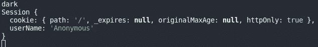

Example output on the console about session

会话模式没有定义，用户名匿名是会话属性的一个实例，我们有带有一些重要属性的 cookie 对象。

要删除，我们可以使用 delete 操作符并将 null 保存到 userName 属性中。

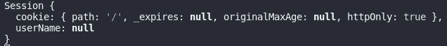

Clearing the userName and adding to null

# 结论

有了它，我们可以添加 cookies，删除它们，用 express-session 库创建会话。这很有趣，因为我们还可以使它变得秘密、有用和加密。

# 来源

[](https://expressjs.com/) [## Express - Node.js web 应用程序框架

### Express 是一个最小且灵活的 Node.js web 应用程序框架，它为 web 和…

expressjs.com](https://expressjs.com/) [](https://nodemon.io/) [## nodemon

### Nodemon 是一个被超过 150 万个项目所依赖的工具，它将监视你的源代码中的任何变化…

nodemon.io](https://nodemon.io/) [](https://www.amazon.com/Web-Development-Node-Express-Leveraging-dp-1492053511/dp/1492053511/ref=dp_ob_image_bk) [## 使用 Node 和 Express 进行 Web 开发:利用 JavaScript 堆栈

### 使用 Node 和 Express 进行 Web 开发:利用 Amazon.com 的 JavaScript 堆栈。*免费*送货到…

www.amazon.com](https://www.amazon.com/Web-Development-Node-Express-Leveraging-dp-1492053511/dp/1492053511/ref=dp_ob_image_bk) [](https://www.npmjs.com/package/esm) [## 放电合成法（Electric Synthetic Method 的缩写）

### 非常简单、无通天塔、无捆绑包的 ECMAScript 模块加载器。esm 是世界上最先进的 ECMAScript…

www.npmjs.com](https://www.npmjs.com/package/esm) [](https://www.editthiscookie.com/) [## 编辑 ThisCookie

### 除了基本的 Cookie 编辑工具之外，EditThisCookie 还可以阻止、保护和批量编辑 cookie。

www.editthiscookie.com](https://www.editthiscookie.com/)